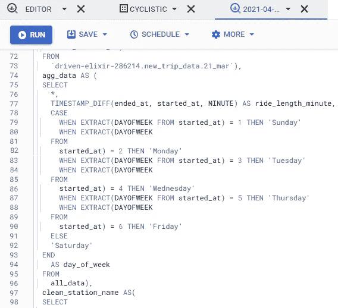
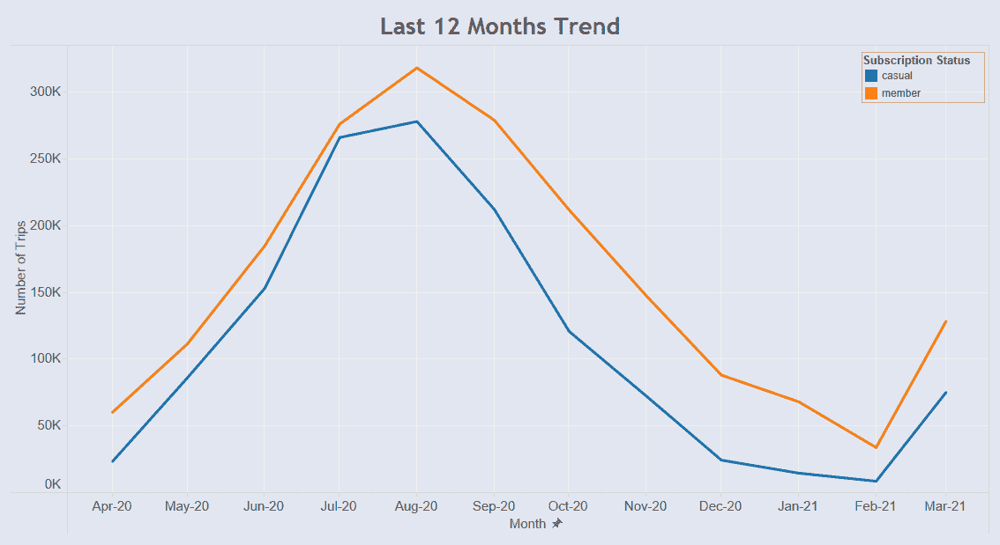
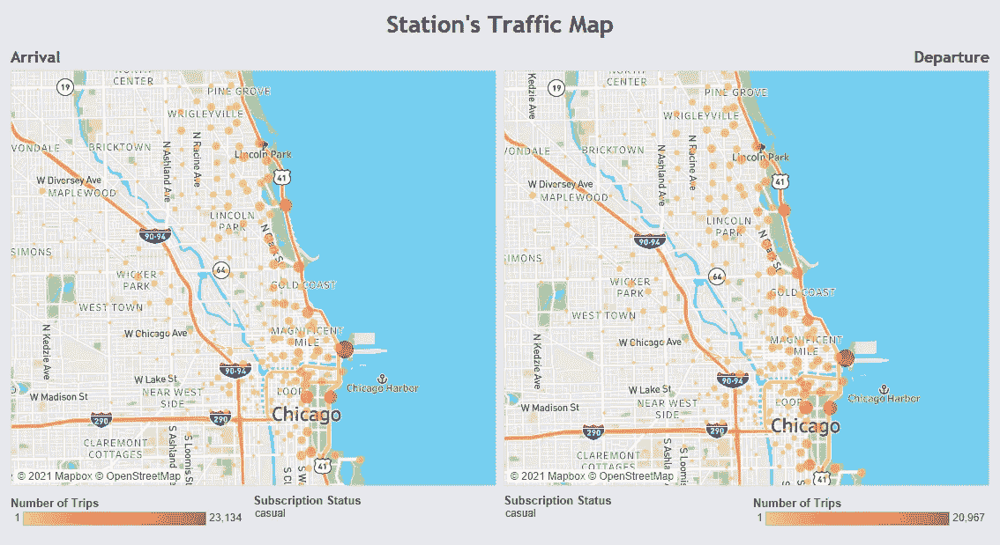
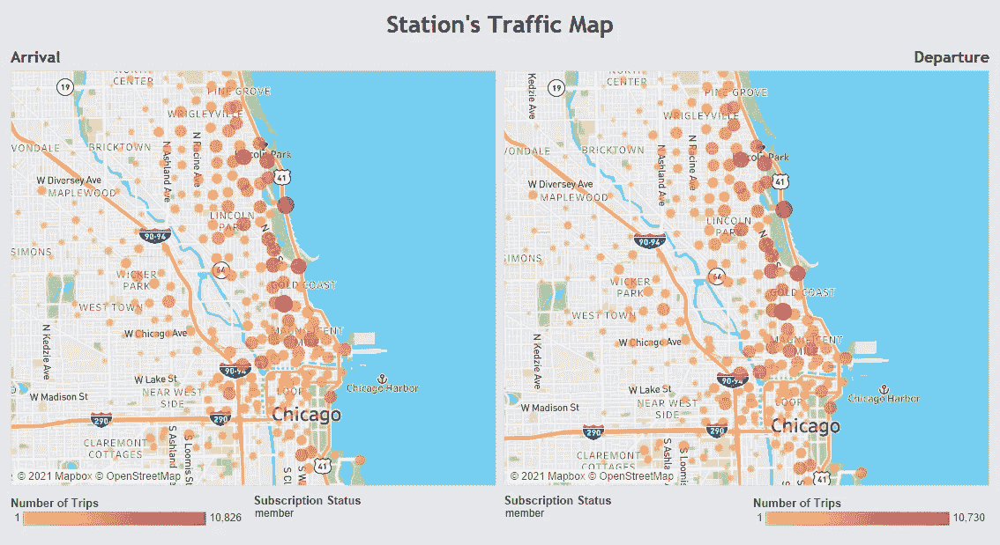
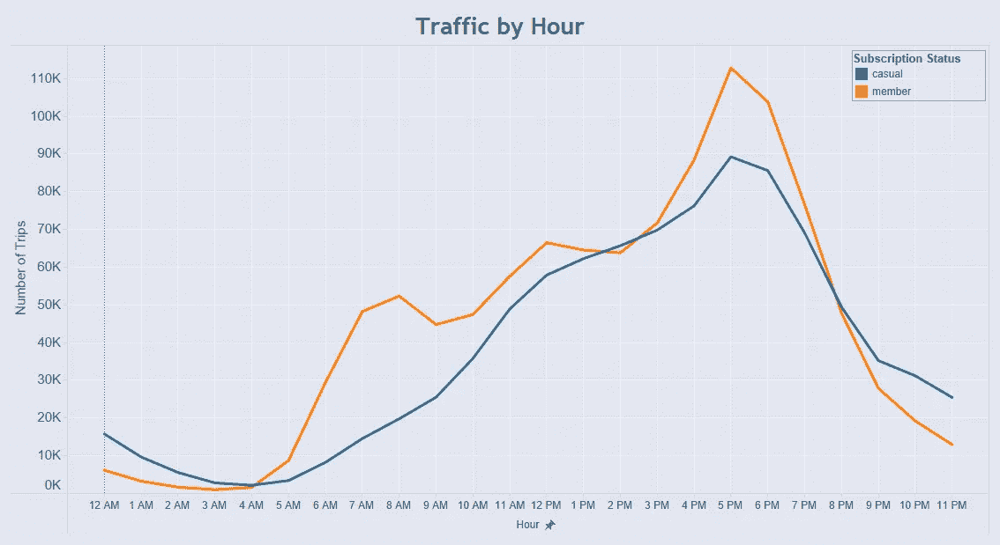
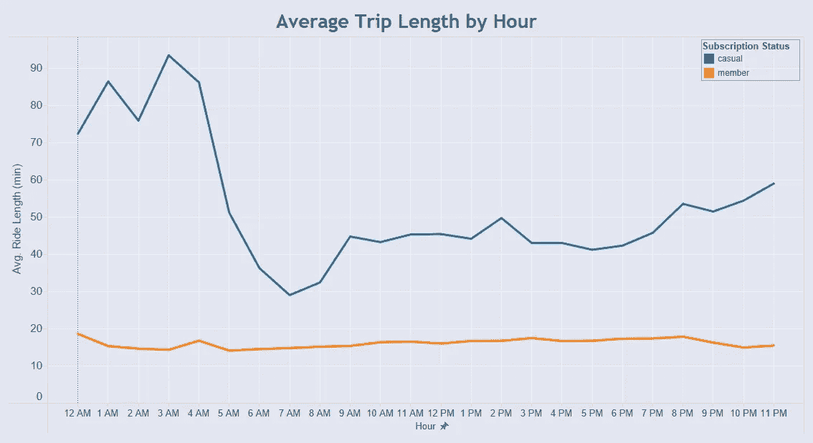
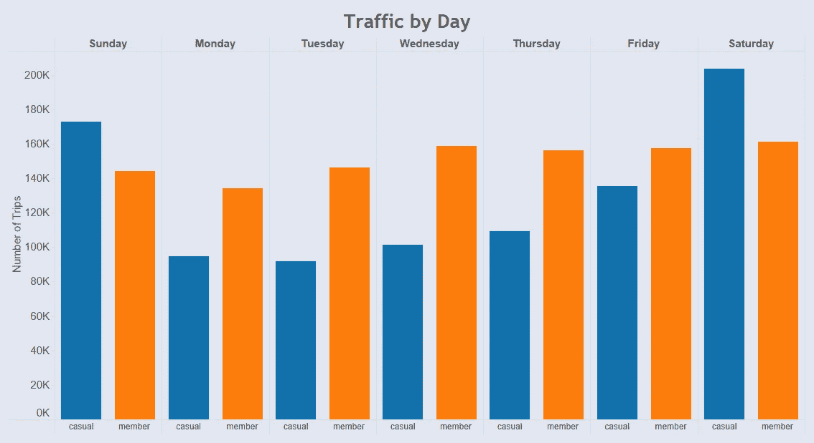
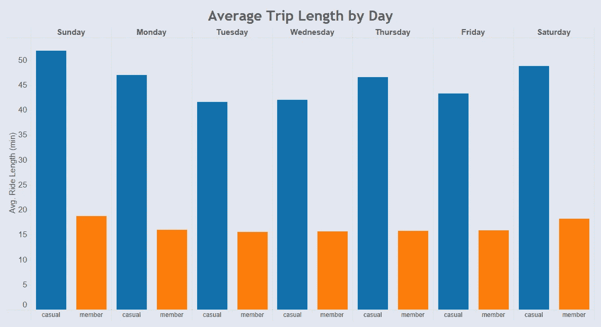

# 数据杂志:周期性案例研究

> 原文：<https://medium.com/mlearning-ai/data-journal-cyclistic-case-study-32ac6c14d2cd?source=collection_archive---------1----------------------->

## 自行车共享公司市场分析。

## **快速指南**

在过去的两个月里，我一直在努力完成 [**Coursera**](https://www.coursera.org/account/accomplishments/specialization/certificate/93LCMLALKZJF) 的**谷歌数据分析专业证书**课程。我在这门课可以报名的时候就开始了。在本课程结束时，他们建议学生创建一个作品集，展示他们的能力以及对本课程中学到的数据分析流程的理解。他们为学生提供案例研究，或者每个学生可以提供他们自己的案例来分析并包含在文件夹中。

我的选择是挑选**周期性**案例研究。在这种情况下，我在**cyclic istic**的营销团队中担任初级数据分析师，这是一家虚构的自行车共享公司，总部位于**芝加哥**。他们试图设计一个营销活动，目标是将临时骑手转变为年度会员。我的任务是**深入了解**和**确定休闲骑手和年度会员如何以不同方式使用**自行车**的趋势**。根据这些见解，我们的团队将**设计新的营销策略**，将**临时骑手**转化为**年度会员**。

## **清洗过程**

该公司提供**过去 12 个月**(2020 年 4 月-2021 年 3 月)的历史旅行数据，供我们分析和确定趋势(该数据已由**Motivate International Inc .**根据本 [**许可证**](https://www.divvybikes.com/data-license-agreement) 提供)。)它由十二个独立的部分组成。代表每个月的 csv 格式文件。数据集位于公司的云服务器上，必须下载才能准备、处理和分析数据。每个字段由 13 个字段组成，记录的数量取决于每个月的乘车次数。每个文件中有多个空值，将进一步检查这些空值以及如何最小化它们。还存在车站 ID 值格式不一致的关键问题。从 2020 年 12 月开始，车站 ID 值采用新格式。

我在谷歌云平台(GCP)上使用了 **BigQuery** 来合并和清理数据集。我也可以使用 **Python** 来完成这项任务，但是文件太大太长，我的笔记本电脑无法处理。简而言之，我写了大约 200 行全面的查询脚本，涵盖了所有的清理和操作过程(点击 [**此处**](https://console.cloud.google.com/bigquery?sq=971013348217:05b83152da8c4694b59a319eeee245d5) 查看查询)。首先，我将 12 个数据集合并成一个统一的数据集，然后为每个行程和行程长度列创建星期几。电台命名不一致导致同一个电台重复，所以我决定解决这个问题。我还修改了经纬度坐标，使每个站点的坐标相等。**cyclic istic**还对其自行车进行定期质量控制，并将其记录到该数据集中。我取消了这些旅行，以避免可能出现的潜在偏见。

A slice of comprehensive query for cleaning and aggregating dataset.

## **揭示真知灼见**

在重新检查了清理过程中的几个问题后，我们终于可以开始分析数据和混合匹配列，以查看临时骑手和年度会员行为之间的不同模式。我用 [**Tableau**](https://public.tableau.com/profile/vizzuddin) 软件来**可视化**数据。以下是数据告诉我们的信息。

Recorded trips over the last 12 months in Chicago.

自行车使用**高峰**进入**夏季**高峰**八月**。6 月 27 日至 9 月 29 日可能是发起活动的最佳时间。

Traffic map for casual riders.

从地图上，我们可以看出休闲骑手大多在芝加哥港和千禧公园附近开始和结束他们的骑行，而较少在办公楼所在的区域。

Traffic map for annual members.

与之相反，年度会员自行车的使用在港口和公园不太密集，但主要集中在办公楼和 41 号公路出口站附近。这可能意味着大多数年度会员是每天通勤到办公室的工人，而休闲骑手主要是游客。

如果我们放大到每小时的交通时间段，我们可以看到对于**成员**来说**早上 7 点**的自行车使用**显著增加**，但是对于休闲骑手来说没有。两者在**下午 5 点**有相同的峰值。

有趣的是，在每个可能的小时里，散客的平均旅行时长比会员的平均旅行时长高。从**凌晨 12 点**到**凌晨 4 点**，休闲骑手往往会骑**一个多小时**。年度会员平均骑行长度倾向于每小时**相同**与**不超过 20 分钟**。

缩小一点，工作日的自行车使用由年度会员主导，而在周末，休闲骑手往往更经常使用自行车。

与每小时的平均行程长度相同，散客的行程每天都比会员长。

## **推荐**

**营销活动**的目标是吸引**临时骑手**成为**年度会员**，我们的团队决定在数字媒体上开展活动。**这个活动**的设计一定是**数据驱动**，所以下面是我的推荐。

*   最佳活动期是在夏季的 6 月 26 日至 8 月 27 日之间，此时自行车的使用达到高峰。
*   为了让**临时骑手**获得最大的影响力，广告最好在中午**开始**到晚上**结束。**
*   周末在**芝加哥港**和**千禧公园**站附近，休闲骑手更加活跃，所以这可能是在那些日子将广告集中在该地区周围的好机会。
*   为了获得潜在会员的兴趣，Cyclistic 可以推出一个新的计划来激励他们的长途旅行行为。例如，他们将获得与骑行长度或距离成比例的积分，这些积分可以用来换取奖励。它也可以呼吁年度成员继续他们的成员资格。