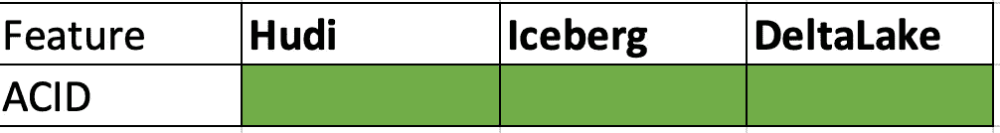
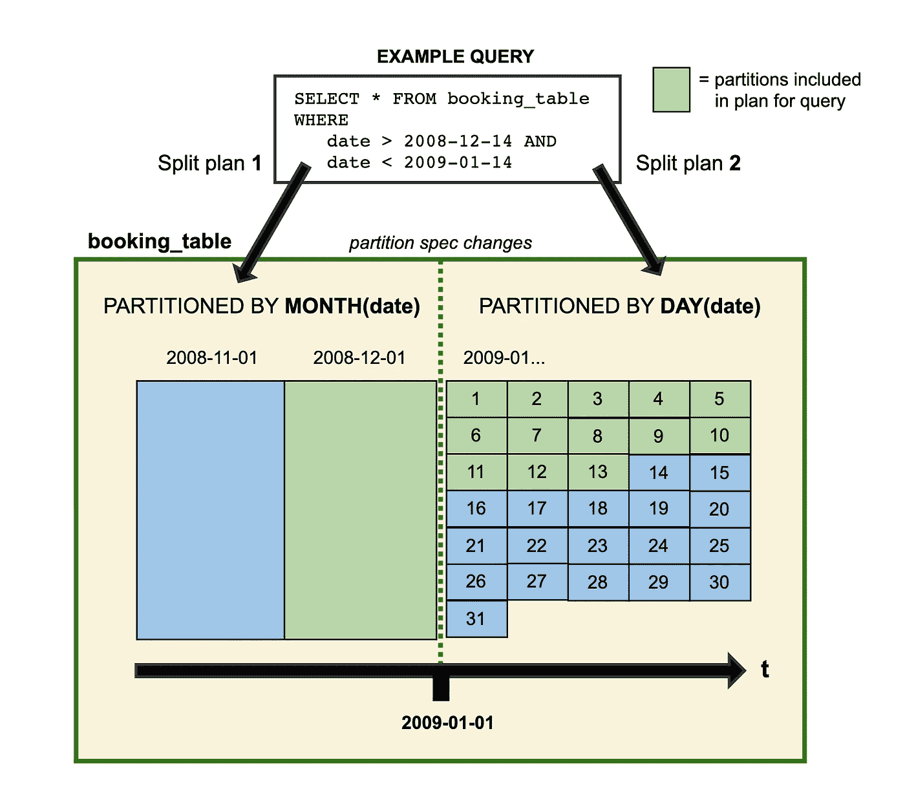
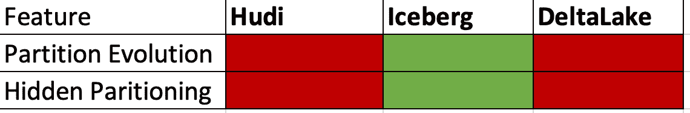
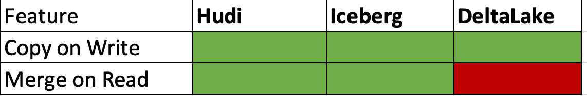

# 数据湖表格格式—胡迪 vs 冰山 vs 三角洲湖

> 原文：<https://medium.com/mlearning-ai/data-lake-table-formats-hudi-vs-iceberg-vs-delta-lake-2cbf3a695f4e?source=collection_archive---------0----------------------->


Photo by [Sri Gowda](https://unsplash.com/@sri_go?utm_source=medium&utm_medium=referral) on [Unsplash](https://unsplash.com?utm_source=medium&utm_medium=referral)

# 介绍

[数据湖](https://aws.amazon.com/big-data/datalakes-and-analytics/what-is-a-data-lake/)以原始格式存储数据，并提供在读取时分配模式的灵活性(读取模式)。表格式提供了一个抽象层，它通过定义模式、列和数据类型，像表一样帮助与数据湖中的文件进行交互。

Hive 表是第一代表格式，它提供了将各种格式(csv、tsv、parquet 等)的文件作为表读取的灵活性。Hive Metastore 存储了有关表的元数据，如列、文件位置和数据类型。

随着分析领域的发展，表格格式需要支持可扩展性、改进的性能和数据治理/隐私要求，如 GDPR 和 CCPA(数据删除、被遗忘的权利 [RTBF](https://en.wikipedia.org/wiki/Right_to_be_forgotten)

在本文中，我将重点介绍三种最流行的开源表格格式以及这些格式中的基本概念。

1.  **阿帕奇胡迪**
2.  **阿帕奇冰山**
3.  **三角洲湖泊**

在比较每种格式的优缺点之前，让我们先看看数据湖表格式背后的一些概念。

# 数据湖的特征

## 1.酸性交易

ACID 是数据库设计中最基本的原则。所有关系数据库都将支持 ACID 属性。

**酸代表:**

**原子** —事务的所有部分成功，或者全部失败并回滚。

**一致** —所有提交的数据必须与所有数据规则一致，包括约束、触发器、级联、原子性、隔离、持久性。

**隔离** —任何事务都不能干扰其他并发事务

**持久** —一旦事务被提交，数据将在系统故障后继续存在，并且可以在不必要的删除后恢复。

启用 ACID 事务解决了数据湖中的一个主要挑战。该特性使数据湖能够支持数据治理计划所需的记录级事务(插入、更新、删除),如要求 user_id 级操作(例如作为帐户关闭的一部分删除用户数据)



ACID in Data Lake

*   这三种格式都支持数据湖中的 ACID 事务。

## 2.图式进化

模式进化仅仅意味着随着时间的推移对表结构进行更改的能力。变化可以是

*   添加—向表或嵌套结构中添加新列
*   删除-从表或嵌套结构中删除现有列
*   重命名—重命名嵌套结构中的现有列或字段
*   更新-扩大列、结构字段、映射键、映射值或列表元素的类型
*   重新排序—更改嵌套结构中列或字段的顺序

每种表格式都有特定的限制，但是通常 Apache spark 的三种表格式都支持模式演化。


Schema Evolution

*   胡迪在 spark 上只支持模式进化。

https://hudi.apache.org/docs/schema_evolution/

三角洲湖:[https://docs . delta . io/latest/delta-batch . html # update-table-schema](https://docs.delta.io/latest/delta-batch.html#update-table-schema)

冰山:[https://iceberg . Apache . org/docs/latest/evolution/# schema-evolution](https://iceberg.apache.org/docs/latest/evolution/#schema-evolution)

## 3.分区进化

分区进化特性提供了在不重写整个表的情况下改变表的分区键的能力。(是的！可以在同一个表中保存两个不同分区粒度。可以在月和日级别对表进行分区)



Image Ref: Iceberg documentation

旧数据写入旧分区粒度，新数据写入新布局。这是通过**隐藏分区**实现的。

**隐藏分区** — SQL 查询不必在过滤器中使用分区键来进行分区修剪。

此时的分区进化特性非常针对**冰山。**



## 4.写操作

将数据写入/重写到数据湖表中的选项。一般来说，有三种类型写操作。

**追加** —向现有表格添加新数据

**覆盖** —用新数据替换现有数据。对于带有分区键的表，只有分区会被替换。分区表有两种覆盖模式。静态(默认)和动态。

1.  **静态**—**过滤条件**中使用的分区子句将用于覆盖。忽略分区筛选器将替换整个表。
2.  **动态**—SQL 查询中产生的分区将用于覆盖。即在同一个 sql 查询中可以有一个或多个分区。

Apache 胡迪有两种不同表类型来处理写操作。

**写时复制(CoW):** 简单来说，CoW 的意思是文件的每次更新，都会创建文件的新版本。数据仅以拼花格式存储。牛表**写重读高效**。CoW 更适合于对更改频率较低的数据执行读取密集型工作负载。

**读取时合并(MoR):** 更新被记录到基于行的增量文件中。压缩过程用于根据配置合并快照和增量文件。MoR 更适合读取次数较少的写入或更改繁重的工作负载。

胡迪还提供了三种访问数据的逻辑视图:

*   **读取优化视图** —提供来自 CoW 表的最新提交数据集和来自 MoR 表的最新压缩数据集。
*   **增量视图** —提供来自 CoW 数据集的两个操作之间的变更流，以支持下游作业和提取、转换、加载(ETL)工作流。
*   **实时视图** —通过内联合并列式和基于行的文件，从 MoR 表中提供最新提交的数据。



## 5.时间旅行

时间旅行功能提供了查询表的旧快照的能力。这个特性对于重新创建分析、修复数据问题、历史比较非常有帮助。

所有三种表格式都支持时间旅行查询。以下是 sql 示例。它看起来非常类似于筛选子句。

```
SELECT * FROM table_name TIMESTAMP AS OF timestamp_expression
SELECT * FROM table_name VERSION AS OF version
```

其他几个重要的功能。

1.  **增量查询** —处理变更数据捕获
2.  **Bootstrap** —将现有表格迁移到新格式，无需完全覆盖表格
3.  **并发** —在表中并发地写入和读取。乐观并发控制( [OCC](https://en.wikipedia.org/wiki/Optimistic_concurrency_control) ) vs 多版本并发控制( [MVCC](https://en.wikipedia.org/wiki/Multiversion_concurrency_control) )。这三种格式都支持 OCC。
4.  **主键** —表中有主键。(胡迪支持主键)
5.  **模式实施** —在 ETL 工作负载中实施模式。

# 结论

这三种数据湖表格式各有利弊。选择正确的格式对于数据湖的性能和维护至关重要。Apache 胡迪和 Delta lake 都在 EMR 中提供了本地支持，这使得 AWS 用户可以轻松使用 EMR。Databricks 还提供了三角洲湖的商业版本。因此，选择表格格式将基于所需的计算提供商和功能。

这篇文章的目的是提供一个数据湖中表格格式背后的概念的高级概述。

感谢阅读！！

# 参考

[https://hudi.apache.org/docs/table_types/](https://hudi.apache.org/docs/table_types/)

[https://docs.delta.io/latest/delta-intro.html](https://docs.delta.io/latest/delta-intro.html)

[https://www . data bricks . com/session _ na20/a-三角洲-湖泊-冰山-胡迪的彻底比较](https://www.databricks.com/session_na20/a-thorough-comparison-of-delta-lake-iceberg-and-hudi)

[https://iceberg.apache.org/docs/latest/spark-writes/](https://iceberg.apache.org/docs/latest/spark-writes/)

 [## 胡迪是如何运作的

### 将胡迪与 Amazon EMR 结合使用时，您可以使用 Spark 数据源 API 或胡迪将数据写入数据集

docs.aws.amazon.com](https://docs.aws.amazon.com/emr/latest/ReleaseGuide/emr-hudi-how-it-works.html) [](/mlearning-ai/mlearning-ai-submission-suggestions-b51e2b130bfb) [## Mlearning.ai 提交建议

### 如何成为 Mlearning.ai 上的作家

medium.com](/mlearning-ai/mlearning-ai-submission-suggestions-b51e2b130bfb)