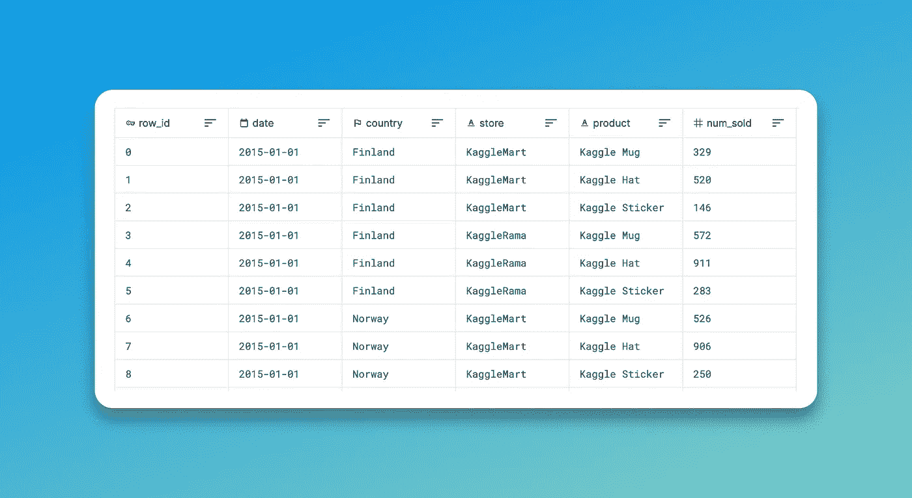

# 数据泄漏—从您的模型中了解到的信息

> 原文：<https://medium.com/mlearning-ai/data-leakage-be-aware-from-what-your-model-learns-f33080fa2f5e?source=collection_archive---------5----------------------->

这篇文章的目的是展示数据泄露如何成为机器学习中的一个真正的眼中钉。

Photo by [Ivan Bandura](https://unsplash.com/@unstable_affliction?utm_source=medium&utm_medium=referral) on [Unsplash](https://unsplash.com?utm_source=medium&utm_medium=referral)

模型性能的提高令人欢欣鼓舞，但正如我在另一篇文章中所表达的，模型泛化的目标比拥有一个 99%准确率的模型更重要。

# 什么是数据泄露

**数据泄露**是一个可以被称为**数据窥探**的概念(如果你感兴趣，请查看我写的[文章](/geekculture/data-snooping-in-data-science-a-not-enough-known-issue-b6936e3552b7))因为窥探在某些时候可能会成为泄露并导致相同的问题，但它会走得更远，让我们看看这个。

当一个模型用来训练和学习的数据是 ***泄漏*** 时，它就面临**数据泄漏**，这意味着一些信息来自外部，帮助它改进预测。
来自之外的**的信息可以简化为当模型将在新的观察上工作时不可用的数据。**

> 数据收集、汇总和准备过程中无意引入的关于目标的预测信息
> 
> (Rosset 等人——医疗数据挖掘:从赢得两次比赛中吸取的教训)

泄漏导致一个众所周知的问题:**过度配合**。事实上，虽然模型在训练时会显示出很好的性能，但当它投入生产时就会丢失，让我们来谈谈一些例子…

我们可以区分**不同类型的**数据泄露:

*   **训练观测值**内部的泄漏:在任何分割之前(或交叉验证(CV)之前)对整个数据集进行数据预处理**的情况。例如，从一列中其余部分的平均值中输入该列中缺失的值，并执行交叉验证。CV 中训练的每个模型的评估都是错误的，因为每个模型都是用整个数据集上转换的数据训练的。**
*   **通过添加新特征的泄漏**:使用一个或几个与目标有很大关系但只有在收集数据后才可用的特征来训练模型的情况。例如，为雨天预测指定降雨量的列。此栏仅在一天结束后可用，不会用于新的预测。

了解泄漏的一个好方法是检查培训期间使用的功能是否:

*   不是由目标本身产生的(不像以前的降雨特征)。
*   不基于验证数据进行转换。

> 为了防止这种类型的数据泄漏，应该排除在实现目标值之后更新(或创建)的任何变量。【Kaggle 的数据泄露)

现在你明白了什么是数据泄露，我就给你讲一个我遇到的例子…

# 数据泄漏示例:表格操场系列—2022 年 1 月

在 **Kaggle** 上，每个月都会发布一个新的挑战，叫做**表格游乐场系列**。这些挑战就像竞赛一样，但要在各种问题上练习技巧。比如 2022 年 6 月的 [TPS 就是关于数据插补和缺失值的。](https://www.kaggle.com/competitions/tabular-playground-series-jun-2022)

2022 年 1 月，我决定参加每月一次的[表格游乐场系列](https://www.kaggle.com/competitions/tabular-playground-series-jan-2022/data?select=test.csv)。这一个是关于预测位于**3**17】真实国家的 2 **虚拟商店**的**3**11】虚拟商品的销售。这个想法是为了找到可以识别销售高峰的季节性时段。

TPS January 2022 Training Dataset (made with [Xnapper](https://xnapper.com/))

举个例子:*年底*、*复活节*、*节假日*都是销售较多的时段。一些伟大的 Kagglers 已经成功地控制了数据中的这种噪声，并允许模型通过知道这些时期是不同的(就销售而言)来学习。

## 但是……哪里漏了？

挑战的主要特征之一是销售的国家:瑞典、挪威或芬兰。

通过一些特征工程和研究，挑战者发现国内生产总值(GDP)可能与销售额有关。当你思考这种关系时，如果一个国家看到它的全球收入增加，这个国家的人民也会看到他们的收入增加(通过简化和忽略人均收入)。
凯格勒特级大师[安布罗姆](https://www.kaggle.com/ambrosm)在他的[作品](https://www.kaggle.com/code/ambrosm/tpsjan22-06-lightgbm-quickstart/notebook)中找到的最终比例值是:1.212。意思是每年的销售额会按照 1.212 ** GDP(年)变化。如果国内生产总值下降，与上一年相比，销售额将按比例下降。

**你看出数据泄露在哪里了吗？**

这个非常有用的新功能是年度的 **GDP** ，它是在学习过程中帮助模型的一个很好的方式，但在根据新数据进行预测时却成为一个真正的问题。

假设你想在 2022 年 2 月使用模型(假设我们在 2022 年，一年还没完)。**将不会有任何真实的数据来替代当年**的 GDP **，你的功能也将变得毫无用处。然而，模型需要它，并且不会像在训练期间那样准确，更糟糕的是，它会估计无意义的销售。**

显然，这个例子来自一个用虚拟数据进行的 Kaggle 竞赛，并被用于实践。然而，这种类型的错误可能发生在实际的问题解决中。

# 结论

数据泄漏是模型训练被破坏的情况，或者是由于**一个** **新特征**或者是由于**在没有分割数据的情况下对现有特征**进行的转换。由于**过度拟合**，它可以简单地使模型在新数据上不可用。
为了处理泄漏，你应该知道你的模型中的数据和用于使模型学习的数据！

感谢你阅读文章，我希望你喜欢它，并了解什么是数据泄漏！

## 资源:

 [## 数据挖掘中的泄漏|第 17 届 ACM SIGKDD 国际知识会议论文集…

### 被认为是“十大数据挖掘错误之一”的泄漏本质上是关于数据信息的引入…

dl.acm.org](https://dl.acm.org/doi/10.1145/2020408.2020496)  [## 数据泄露

### 使用 Kaggle 笔记本探索和运行机器学习代码|使用来自《计量经济学…》一书的信用卡数据

www.kaggle.com](https://www.kaggle.com/code/alexisbcook/data-leakage/tutorial)  [## 机器学习中的数据泄漏-机器学习掌握

### 在开发预测模型时，数据泄漏是机器学习中的一个大问题。数据泄漏是指当信息…

machinelearningmastery.com](https://machinelearningmastery.com/data-leakage-machine-learning/)  [## Mlearning.ai 提交建议

### 如何成为 Mlearning.ai 上的作家

medium.com](/mlearning-ai/mlearning-ai-submission-suggestions-b51e2b130bfb)