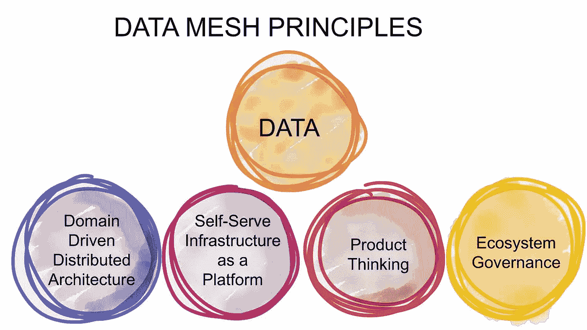

# 数据网格:去中心化还有多远

> 原文：<https://medium.com/mlearning-ai/data-mesh-how-far-to-move-in-decentralization-18abb84d1e?source=collection_archive---------4----------------------->

Data mesh 仍然有点像这个街区的新成员，尽管第一个内容[已经由 Zhamak Deghani 在 2019 年编写。越来越多的用户故事变得可用，并被集中在一个](https://martinfowler.com/articles/data-monolith-to-mesh.html)[社区网站](https://datameshlearning.com/user-stories/)上，但通常专注于技术实现。这篇文章是三篇系列文章中的第一篇，这三篇文章将更侧重于组织方面，即:

1.  在责任下放方面还有多远
2.  如何激励团队和管理层实现这种分权
3.  如何治理分散的责任

## 数据网格—快速回顾

这个概述还远未完成，如果你有兴趣，你应该读一读扎马克·德格哈尼的书“[数据网](https://www.oreilly.com/library/view/data-mesh/9781492092384/)”。

当我在 Strata Superstream 演讲时，我将数据网格总结为:

> “这是一个问题集，这是一套原则，这是一个解决方案”

它解决了以下问题:你不能指望中央数据团队了解你的整个业务，你不能指望他们拥有他们没有产生的数据，以及你会发现这个中央数据团队很快成为实现你所有数据抱负的瓶颈。

为了解决这些问题，Zhamak 引入了 DATSIS 原则。数据应该是可发现的、可寻址的、可信任的、自描述的、可互操作的和安全的。

也许数据网格可以更好地概括为

> “数据应被视为一种产品，而不是应用程序的副产品”

为了达到这个目标，你需要有人来拥有你的数据产品，而这个人比生产数据的人更合适。这就是去中心化介入的地方:不是构建一个应该理解你的业务的中央数据团队，而是在理解你的部分业务的团队中增加数据能力。

## 所有权

如摘要中所述；你不能指望你的中央数据团队了解你的整个业务。你也不能指望他们知道你使用或开发的每一个软件的来龙去脉。试想在您的组织中:您使用多少工具，您有多少 IT 人员，他们服务于多少不同的领域？你有多少精通数据的人？

这就是为什么数据产品的所有权应该由了解数据来源或用途的人拥有，而不是由介于两者之间的中央团队拥有。

让我们以(面向生产者的)数据产品“客户”为例:这通常是建立在你的 CRM 之上的(如果你很幸运，只有一个 CRM 系统)。您将有一个部门，它是该系统的主要用户，可能会输入一部分数据。当他们输入数据时，他们会影响你的数据质量。接下来，您将有一个 IT 团队(与产品负责人一起)负责该工具，他们应该知道数据模型。不使用这些知识可能会导致对数据的误解，从而降低数据质量。

由业务负责人、IT 负责人和数据专家组成的跨职能团队将为客户提供最优质的数据产品。这同样适用于客户等其他实体，甚至适用于面向消费者的数据产品。

为了最大限度地减少精通数据的人的上下文切换，并且因为在所有领域中总是存在数据需求，数据网格原则导致建议分散您的数据能力，以允许分散您的所有权。

## 组织层级

当你来自一个中央数据团队并分散你的数据能力时，你会发现自己处于一个矩阵组织中。当你不取消数据领导者的角色时(我相信你不应该，但这是后续文章的内容)，你需要决定谁来领导你的数据专家。请注意，您的部门领导会优先考虑日常工作，但很可能不重视您的数据工程师的技术技能。数据领导者会错过团队的日常表现。

在我看来，每天参与的人应该是你的经理。其次，由一名数据主管对整个公司的数据工程师的技术技能和表现进行客观比较，比比较不同经理对团队态度的主观意见要容易得多。

因此，我建议将您的数据工程师的整个管理放在部门内，因此是分散的。他们要求工作，区分任务的优先级，每天查看性能，并负责建立您的数据工程师所在的团队。这意味着数据主管没有下属。

## 站台

我曾经一度认为一个组织不需要平台团队，但最终我会遵循 Zhamak 的愿景:你需要一个自助服务平台，因此需要一个团队来构建和维护它。

我仍然相信您可以将您的数据平台视为一个内部开源项目:所有的数据工程师都应该能够做出贡献，但您需要一个小团队来集中管理您的平台:保持平台的健壮性，未来的证明，提供成本见解(有时会采取行动)，…这些少数人仍然会向您的数据主管报告。

顺便提一下，我确实说过“提供成本见解，有时会根据这些见解采取行动”。数据平台团队不是使用平台的一方，因此不应该对平台的成本负责:用户应该负责。至少在可能的情况下。

## 平台—第二部分

尽管您可以将您的平台视为一个开源项目，但这并不意味着您的平台团队应该成为一个运行团队。平台团队应该是选择技术的唯一负责人。开源愿景关注的是小的适应，而不是结构上的改变。

这并不妨碍数据工程师只使用平台团队提供的工具。如果你想使用不同的技术，你可以这样做，但你需要自己运行和维护它。并遵守管理数据网格所需的其他规则:数据应该以平台支持的格式可用，应该在数据目录中注册，……但无论您想使用 DBT、Spark 还是其他什么:平台团队不应该关心，如果他们关心，这是一种激励，使他们的平台尽可能可用。

## 预算

Photo by [Towfiqu barbhuiya](https://unsplash.com/@towfiqu999999?utm_source=medium&utm_medium=referral) on [Unsplash](https://unsplash.com?utm_source=medium&utm_medium=referral)

优秀的读者已经知道我要说什么:我认为即使是预算也应该分权。FTE、工具、云/计算成本，都应分配给拥有数据产品的领域或部门。这是一个大胆的说法:即使将你组织中的人从一个团队转移到另一个团队将是一个巨大的变化，并影响工作方式，但将预算从你组织中的一个团队转移到另一个团队是最让管理层害怕的。

这让你的部门领导感到害怕，因为他突然为一条他不了解的数据管道和技术买单。它引入了摩擦:作为一个部门，我为什么要付费开放我的数据，以便其他人可以从中受益。这让您的数据主管和数据工程师感到害怕，因为现在没有任何数据亲和力的人可以削减数据成本(和数据工程师职位)来达到他们的预算目标。

然而，我仍然相信这是应该走的路。如果领导者管理人，他们应该为他们付费，如果团队使用工具，他们应该为他们付费，如果人们处理数据，他们应该为它付费。为了确保这一点持续有效，并且您的公司持续投资于数据，您需要提高数据成熟度并引入治理。

我并不反对一个过渡时期，在这个时期，你务实地试图分散人员和工具，但保持预算的中心地位。然而，恐惧不应该定义你的最终状态，在所有逻辑中，这将分散你的数据预算。

最后，但非常重要的一点是，这不应该增加您公司的整体数据预算。并且不应对各部门的预算造成压力。不，这是关于分散你目前花费的预算的所有权。

## 下一步是什么

在下一篇博文中，我将讲述如何激励你的数据团队在其他部门拆分和解散，如何激励这些部门欢迎数据工程师，以及如何说服高层领导采取这一步骤。

编辑:它变成了两个帖子，你可以在:

1.  [如何向团队推销概念](https://experiencestack.co/data-mesh-how-to-sell-decentralization-part-a-bf45b1e56374)
2.  [如何向管理层推销这个概念](https://experiencestack.co/getting-ready-for-data-mesh-part-b-the-ones-that-pay-8f4da077322)

在之后的最后一篇文章中，我会写关于[如何管理这个设置](https://experiencestack.co/data-mesh-how-to-govern-a-decentralized-data-budget-a1c22d9fad14)。如何确保您持续投资数据并持续创新数据，数据领导者仍需扮演何种角色，以及如何应对部门领导者因付费开放数据供其他部门使用而可能产生的摩擦。

 [## Mlearning.ai 提交建议

### 如何成为 Mlearning.ai 上的作家

medium.com](/mlearning-ai/mlearning-ai-submission-suggestions-b51e2b130bfb)