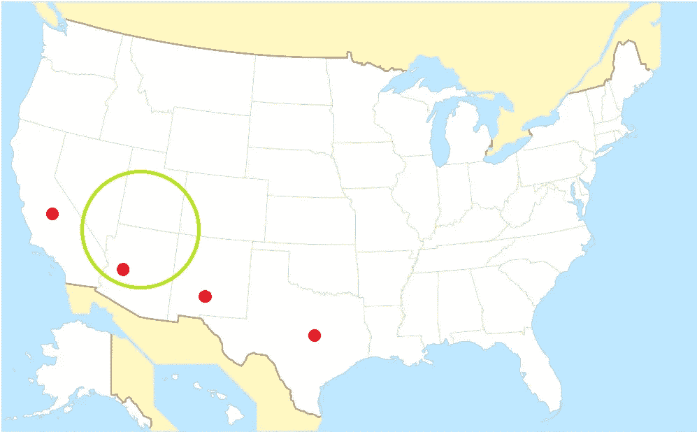
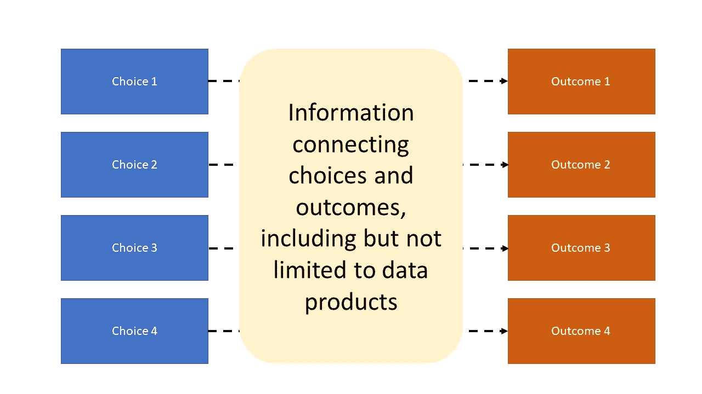
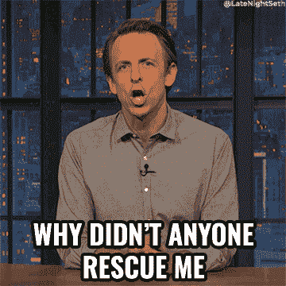

# 决策数据、决策数据、决策数据

> 原文：<https://medium.com/mlearning-ai/data-of-decisions-by-decisions-for-decisions-385d4f83e0c2?source=collection_archive---------4----------------------->

## 不会从这个地球上消失

*快速注意:这最初发表在我的 Substack 简讯上，名为* [*野外数据*](https://datainthewild.substack.com/) *，它将探索数据战略的增长领域，重点关注个人和组织如何以及应该如何使用数据等基本问题。它将包含对技术和非技术受众有用且可访问的帖子。* [*点击这里报名*](https://datainthewild.substack.com/) *！*

你睁开眼睛，适应不熟悉的明亮多沙的景色。你不记得睡着了…或者被打昏。不过，你要记住，你是一家快速发展的初创公司的首席执行官，当天晚些时候你还要和董事会通电话。当你确定方位时，你试图抬起一只手遮挡阳光，但遇到了阻力。你被绳子捆住了！当你坐立不安的时候，你会注意到一根金属栏杆嵌进了你的脖子，另一根嵌进了你的脚踝。远处一片模糊，还能听到嗡嗡声。你不能理解它，但比喻是显而易见的；它必须是一列火车。

Photo by [Alan J. Hendry](https://unsplash.com/@imedianamibia?utm_source=unsplash&utm_medium=referral&utm_content=creditCopyText) on [Unsplash](https://unsplash.com/s/photos/desert-train?utm_source=unsplash&utm_medium=referral&utm_content=creditCopyText)

你听到在你的头的左边有一个重复的渐强的钟声。逮捕你的匿名人好心地拿走了你的手机，把它放在你身边。还是为了嘲讽你？您看不到屏幕，但您知道显示屏上显示的内容，“董事会会议准备呼叫数据团队。”你现在非常平静。这些人很聪明，而且有很好的资历。他们会解决你的问题；他们总是这样。

你把耳朵贴在电话上，设法加入了会议，并迅速描述了你的困境。就像在办公室里的任何一天一样，你很快委托进行一系列复杂的分析，他们很乐意帮忙。他们中的一个(她，她)熟练地从你的电话中传输现场视频，训练一个计算机视觉模型，动态地将你从图像中移除，只留下广阔的沙漠。她将其与谷歌地图上的数百万个数据点进行比较，并列出你最有可能去的地方。另一个(他，他)刮你的电话，Slack，和电子邮件记录，确认你最后一次有意识的时间。然后，他将这些信息与他从第一位数据科学家那里获得的区域列表进行对比，并以你最近的位置为半径绘制图表。几分钟之内，他们成功地将你的位置锁定在亚利桑那州两平方英里的范围内。

Source: Author

这显然是一个与火车相关的问题，您指派您的最后一个数据科学家(他们，他们)访问该路线上先前火车旅行的日志。汇总统计显示，客运列车是最常见的，但你雇用他们不只是为了做简单的分析。他们训练了一个预测模型，该模型考虑了一天中的时间、一年和市场趋势，并得出结论，你有 87%的机会被一辆共用相同轨道的货运列车撞上。

“伟大的工作，所有！你真的是最棒的，”当火车隆隆驶过一个弯道时，你开始辨认出一列装有集装箱的货车时说。他们互相击掌，知道自己仍处于各自领域的顶端，并将在接下来的绩效评估中一扫而空。

啪啪。

这个例子虽然滑稽，但包含了关于数据策略的宝贵经验。没有整合到决策过程中的数据分析和模型不仅不太可能有用；他们可能会成为您组织的死亡 sentence⁴。让我们看看下面的决策图。

Source: Author

从选择到结果的虚线是通过在决策过程中收集的信息发现的，这可以但不必须包括典型的数据练习，如总结、可视化和建模。很有可能你可以通过扭动身体或寻求帮助来摆脱完全没有数据工作的困境。

Source: [Late Night with Seth Myers on GIPHY](https://giphy.com/gifs/latenightseth-seth-meyers-late-night-lnsm-H1cmnXAeEiYIUPPG1b)

**请求与你的问题相关的数据分析或模型，却不打算如何使用这些信息，这是一种灾难**。像博客文章中许多加粗的段落一样，你可能已经读过前面的句子，并认为，“这是显而易见的。”这并不意味着这种行为不是非常普遍，我的直觉是，它影响初学者和有经验的决策者。寻求实际上不会影响你决策的信息被称为[信息偏差](https://en.wikipedia.org/wiki/Information_bias_(psychology))。我怀疑这种情况在数据领域很常见，因为与问题相关的数据汇总、分析或模型*很容易出现。请求者隐含地，而且经常是错误地，假设他或她会神奇地知道当收到结果时该如何处理。我坚信这种行为是 85%的数据项目失败的主要原因。*

被绑在火车轨道上是一个极端的例子，在这种情况下，人们可以预见到负面事件。在商业世界中，我们经常遇到这种不太极端的例子，例如，我们知道我们的产品有大量订户，当他们的促销期结束时，他们可能很快就会流失。我们可以像上面例子中被绑架的 CEO 一样，委托对我们迫在眉睫的用户进行无休止的报告和分析。然而，如果它们没有与有助于防止流失的决策联系在一起，它们将一事无成。我们不需要知道和理解火车的每一个细节，不管是真实的还是隐喻的，那会打击我们；我们只需要能救我们的信息。

回想一下你让数据科学家做的练习:你让两个人一起预测你的位置，第三个人计算出你最有可能被哪种类型的火车撞上。我选择这些是因为我想告诉大家，只要稍加适应，你的生命本可以得救。如果最后一个数据科学家不仅发现了火车的类型，而且更具体地发现了哪家公司最有可能运营它，他们可能会联系他们并请求停止火车。

为了在未来避免这种灾难，我建议对葛底斯堡演讲中的一段话进行数据改编:“决策数据，由决策产生，为决策服务。”

*   的**:认识到我们可用的数据是之前数据战略决策的结果。这在我的例子中没有出现，但我在工作场所经常看到。在需要做出决策之前，无法获得能够最好地解决问题的数据。因此，关于收集哪些数据的数据策略*决策*，通常是过去做得很好的决策，将影响我们在决策时可用的数据。我计划让这个话题成为以后文章的主题。**
*   **到**:我们首先*决定*应该创建哪些数据产品(摘要、可视化、模型)以便为决策提供信息，而不是无目标地进行总结、可视化和建模。如果你进入了商业和自助领域，这感觉就像是改编自高效人士的 7 个习惯中的第二个习惯。
*   的**:产生的数据产品(原始数据、分析或模型)实际上影响了感兴趣的*决策*。如果不管数据产品结果如何，都会做出相同的决定，那么就没有必要创建它们。我还计划在以后的文章中探索这个想法。**

我的希望是，通过理解这个框架，组织和个人将使用他们的数据做出更好的决策，并防止失败的数据项目。

# 我创办这份时事通讯的部分原因是为了鼓励围绕数据策略的更多讨论和知识共享。我很乐意得到您的反馈、问题和评论！

1.  他的一个朋友因为生意上的原因让他进去了？
2.  我应该在这里结束这篇文章。
3.  或者这里。
4.  好了，我做完了。

【https://datainthewild.substack.com】最初发表于**。**