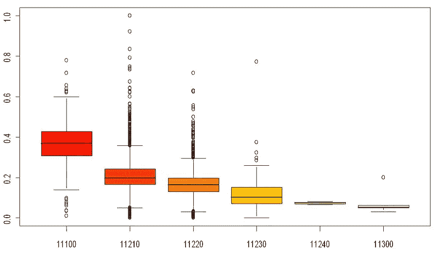

# 数据异常值处理及其相关风险

> 原文：<https://medium.com/mlearning-ai/data-outliers-treatment-and-its-related-risks-6621f6556994?source=collection_archive---------3----------------------->

Bar plot shows outliers

在数据处理工作中，我们通常会遇到许多异常情况，这些情况告诉我们要首先处理它，因为我们在旅途中了解到了这一点，但是等一下，在处理异常情况之前，我们必须问自己几个问题。

这些异常值是数据噪音还是在我们的数据中很常见？

让我举个例子来说明我的观点，

利用某银行的财务数据，

经常会发现 1%或 5%的账户被突出显示为异常值，并非所有客户都在中等账户余额范围内，我们会发现一个拥有巨额余额的客户在我们的数据中明显被归类为异常值。

那么，在这种情况下，我们应该处理异常值吗？

我们应该用什么方法来治疗呢？(滴？，移位？还是留着吧)

首先，我们是否应该处理异常值？

视情况而定，如果我们正在处理回归模型或任何值预测模型，最好是处理它以获得最准确的值，并且不影响结果，

那么在这种情况下，哪种治疗方法会更好呢？

**—丢弃离群值**

对于我来说，在这种情况下，我更喜欢从我的数据中删除离群的行，让我告诉你为什么？

操纵某些特征中的数据值，如账户余额或银行产品数量，并将其减少到数据触须，通常会在另一个特征/列中产生噪声

想象一下，精英账户上有一个巨大的金额和另一个特定的特征，如职业，如果我们将余额转移到数据胡须，我们告诉我们的模型，这个职业属于常规类别(是的，它将在较高的限制上，但仍然是常规的)，所以最好放弃它，

**—操纵异常值**

还有另一种方法来处理它，把它作为一个丢失的值，所以我们可以删除值是离群值，并保持其他列不变，然后我们可以使用 KNN 填充值的基础上，它的邻居在其他功能，这将给出一个更现实的结果。

**—我们什么时候应该保持离群值不变？**

但是，如果我们正在使用分类/聚类模型，我强烈支持保持离群值不变，一些数据科学家会说这可能会影响聚类质心，我同意他们的观点，但我们的职责是检查具有轮廓得分的同类聚类，并检查其他聚类模型

**总结**

总而言之，通过操纵数据来处理异常值并不是一个默认的过程或路线图的一部分，相反，您必须分析数据，并在做出决定之前准确地知道您试图解决的问题的形式

操纵数据是一种危险的行为，会使结果偏离目标，所以要小心