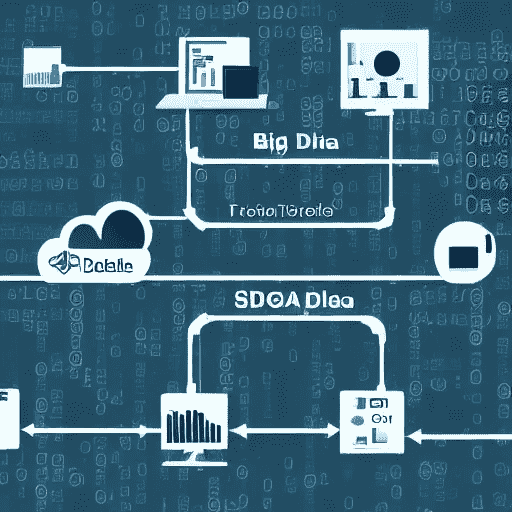

# 数据管道:是什么意思？充分展示

> 原文：<https://medium.com/mlearning-ai/data-pipeline-what-does-it-mean-full-exposition-2ff7cb27bb60?source=collection_archive---------8----------------------->

对于正在努力解决各种数据存储问题的企业来说，数据管道为他们面临的几个重要问题提供了一个潜在的解决方案。

image source: created by the author via write sonic

数据是我们所做一切的驱动力。大数据正在以无数种方式重塑我们的环境。为了说明这一点，系统需要保证各种系统之间足够的、准确的、最重要的是一致的数据流。管道就像它听起来的那样。它是用于将数据从一个系统传输到另一个系统的操作和工具的集合，同时在两个系统中保持相同的数据处理和存储技术。管道是 IBM 发明的。在它被移动到目标系统之后，可以使用与它被移动到的系统不同的方式来容易地维护和存储它。
通过数据管道以自动化方式从各种来源收集信息，以便进一步整合和转换为高性能数据存储。数据存储带来了几个问题，其中许多可以通过使用数据管道来缓解。

因为科学家通常将 80%的时间用于流水线，所以开发合适的数据流水线是一个需要考虑的关键因素。这违背了允许在所有级别实现自动化的基本目标，即解放专家的智力，使他们可以专注于更重要的分析活动。
在本文稍后选择最佳工具之前，有几件事您应该首先了解。

## **来历**

终端是处理链中的数据输入点。物联网(IoT)、交易处理应用、应用编程接口(API)和社交媒体都是起源的例子。

## 目的地

目的地是数据传输的最终目标。数据管道的端点由其预期用途决定。它还可以用于支持数据可视化和分析工具。
如果有必要，它可以转移到一个更永久的存储库，比如数据仓库或湖泊。

## **数据流**

信息沿管道的传输。这包括对路线和任何中间数据中心的任何更改。
“处理”是指对数据执行的一系列操作，从从各种来源收集数据，到在将数据发送到最终目的地之前对其进行存储和修改。由于这种模式与数据流直接相关，因此通常在数据处理过程中实现。您可以通过首先从源系统提取数据，然后使用数据复制来复制数据，甚至只是简化数据来导入数据。

## **存储**

术语“存储”用于描述信息在管道中继续传输之前被临时保存的任何系统。数据的数量和预期用途，以及发送到存储系统的查询的预期数量和频率，只是需要考虑的两个因素。

## **工作流程**

管道的工作流描述了作业必须完成的顺序以及它们之间的相互依赖关系。信息处理作业是被分配来执行单一的、明确定义的任务的任何离散的工作块。上游指的是数据从哪里来，将在哪里结束，而下游描述的是数据已经流向哪里。就像水倒入下水道一样，数据沿着管道传输。请注意，上游流程必须在下游工作开始之前结束。

## **监控**

这验证了数据管道的每一步都正常运行。即使在数据量增加的情况下，保持事情平稳运行也很重要，并且数据在经过各种过程时不会变得混乱或损坏。

# **为您的数据管道寻找最佳解决方案。**

image source: unsplash

考虑到越来越多的可用选项，选择最佳的数据管道解决方案本身就是一个问题。最佳解决方案应该为所有目标系统提供来自各种来源的最新和真实的数据集。

除此之外，它应该能够执行端到端的集成，以及转换、丰富、屏蔽和交付新的数据集。结果应该是数据不仅干净，而且可操作，最终用户可以利用。

当我们这样做的时候，我们应该提到在 2022 年，一些精选的工具处于领先地位。**例如**，Keboola 是一个软件即服务(SaaS)解决方案，处理数据管道的整个生命周期，从提取、转换、加载到编排。模块化架构还提供了即插即用功能和更高级别的定制。

接下来是 Stitch，这是一个数据管道解决方案，它打磨 ETL 操作的粗糙边缘，以改进您已经建立的计算机基础设施。

Stitch 以拥有众多供应商中最智能的集成之一而闻名，能够覆盖各种各样的源系统和目标系统。因为它基于 Singer 框架，所以数据团队能够轻松地调整管道。

K2View 脱离了开发 ETL 和 ELT 解决方案的常规方法。它从复杂的系统中分离出来，执行密集的计算，将干净的数据传送到数据湖和数据仓库中。

他们的管道数据系统是同类中第一个成功的解决方案，因为它是第一个通过微型数据库的概念传输与商业实体有关的数据的系统。

在同时拥有数百万个数据库的同时，它将与每个合作伙伴业务实体相关的信息保存在其私有的微型数据库中。它大规模传输数据，从而确保数据的完整性，同时也允许更快的交付。

## **管道数据:应用**

由于大数据的激增，适当的数据管理已经成为一个至关重要的紧迫问题。许多行业出于各种原因使用数据管道，但以下是一些最常见的原因:
数据可视化是数据的可视化表示，包括图表、图形、图示和信息图。复杂的信息在可视化表达中要简单得多。
可以使用探索性数据分析对数据集进行分析和探索，方法是将数据可视化以获得其特征的概述。它为数据科学家提供了最有效的处理数据源的方法，以便检测异常、提出和测试假设、发现模式和验证假设。
第三，机器学习是人工智能的一个子领域，研究计算机如何从数据和方法中学习，以模仿人类的认知过程。基于统计的预测是算法的基础，通过揭示各种重要的见解来帮助数据挖掘。

## **规划数据管道架构**

在连接多个数据源和目标时，数据管道架构规划至关重要。它使团队能够创建、转换甚至交付数据，为更加无缝和准确的流程添加了高级自动化功能。对于企业来说，规划理想的数据管道架构而不考虑他们的主要挑战和考虑是有害的。

## **采取措施应对挑战**

请记住，数据管道的架构应该提供所有需要的数据，并处理由数据引起的任何其他问题。在大多数情况下，企业需要收集各种格式和各种来源的数据。
企业在尝试大规模开展这些业务时，通常会面临相当具有挑战性的障碍。除此之外，当考虑到系统漏洞和法规遵从性时，困难会变得更加复杂。
您使用的是哪种仪器？分享你的经历。

喜欢我的内容就在 medium 上关注我:https[://medium . com/@ mauhhikthakkar](/@mauhhikthakkar)

在领英上:[https://www.linkedin.com/in/mauhhikthakkar/](https://www.linkedin.com/in/mauhhikthakkar/)

 [## Mlearning.ai 提交建议

### 如何成为 Mlearning.ai 上的作家

medium.com](/mlearning-ai/mlearning-ai-submission-suggestions-b51e2b130bfb)