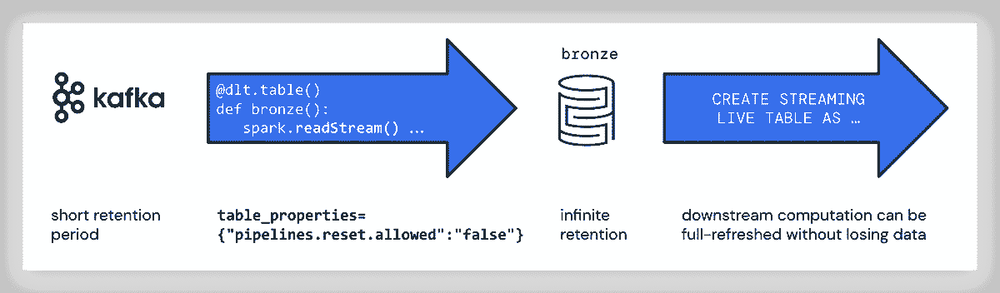

# 使用 Apache Kafka 和 Delta Live 表的流数据管道

> 原文：<https://medium.com/mlearning-ai/data-pipelines-with-apache-kafka-and-delta-live-tables-d2c902b4507b?source=collection_archive---------5----------------------->

如何使用自动缩放、声明性和低延迟数据管道提取特征和准备 ML 数据

[Data Pipelines with Kafka](https://www.databricks.com/blog/2022/08/09/low-latency-streaming-data-pipelines-with-delta-live-tables-and-apache-kafka.html)

[Delta Live Tables (DLT)](https://www.databricks.com/product/delta-live-tables) 是第一个 ETL 框架，它使用简单的声明性方法来创建可靠的数据管道，并全面管理批量和流式数据的底层基础设施。许多用例需要从接近实时的数据中获得可操作的见解。Delta Live Tables 通过直接从事件总线(如 [Apache Kafka](https://kafka.apache.org/) 、 [AWS Kinesis](https://aws.amazon.com/kinesis/) 、[汇合云](https://www.confluent.io/confluent-cloud)、[亚马逊 MSK](https://www.youtube.com/watch?v=HtU9pb18g5Q) 或 [Azure 事件中心](https://docs.microsoft.com/en-us/azure/event-hubs/))获取数据，使**低延迟流数据管道**能够支持这种具有低延迟的用例。

[**本文将介绍如何使用 DLT 和 Apache Kafka，同时提供获取流所需的 Python 代码。将解释推荐的系统架构，并探讨值得考虑的相关 DLT 设置。**](https://www.databricks.com/blog/2022/08/09/low-latency-streaming-data-pipelines-with-delta-live-tables-and-apache-kafka.html)

你喜欢读这篇文章吗？给它 13 次掌声(它们是免费的！给我带来欢乐)并跟随我来到这里。如果你喜欢更多基于云的数据科学、数据工程和 AI/ML，请随时关注我的[***Twitter***](https://twitter.com/frankmunz)***(或***[***LinkedIn***](https://www.linkedin.com/in/frankmunz/)***)。***

 [## Mlearning.ai 提交建议

### 如何成为 Mlearning.ai 上的作家

medium.com](/mlearning-ai/mlearning-ai-submission-suggestions-b51e2b130bfb)