# Knime —数据预处理，不依赖数据进行建模。

> 原文：<https://medium.com/mlearning-ai/data-preprocessing-in-knime-19053ff9ad87?source=collection_archive---------7----------------------->

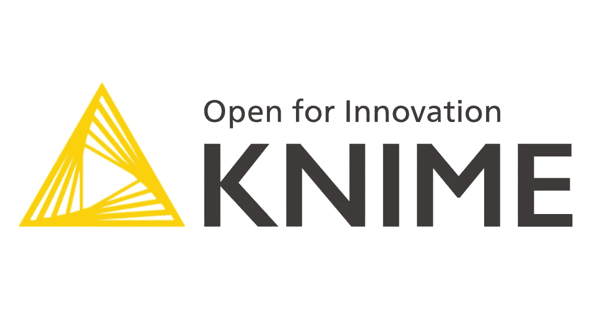

无论你有多擅长建造摩天大楼，如果地基不牢，总有一天它会倒塌。数据科学中的建模也是如此。无论您使用哪种建模技术，如果您对数据的理解不正确，并且您没有努力清理数据，您就永远无法从原始数据中创建一个好的模型。这就是为什么将近 60–70%的时间花在预处理上

在 Knime 系列的第二集中，我们试图在进行数据预处理时涵盖基本节点。

来自 Kaggle 的传奇泰坦尼克号 ML 数据集在这里被用来让我们的观众了解 KNIME 中的预处理步骤。点击[此处](https://www.kaggle.com/competitions/titanic)获取问题详情链接。

> 让我们深入研究一下。

## **阅读文件**

首先，我们需要读取数据。可以从支持 xlsx、csv、xls 等多种格式的 Knime 的 *IO 节点*读取。，但出于理解的目的。csv 已经在这里介绍过了。

双击 IO > Read > CSV Reader 中的 *CSV Reader 节点*读取 CSV 文件。

如截图所示，在搜索选项中输入“阅读”即可直接搜索到该节点。

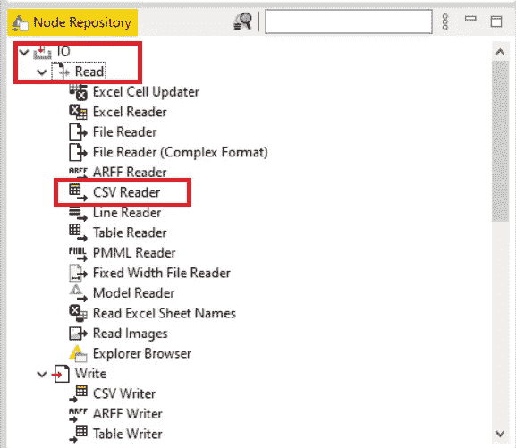

The path of the file could be browsed by clicking on configure

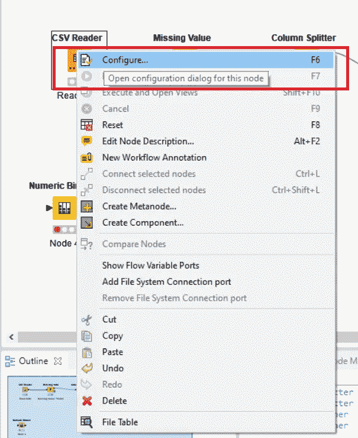

Browse the file path as per the requirement.

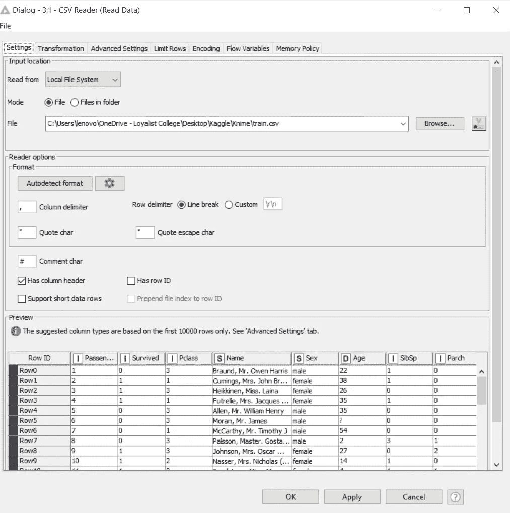

## **改变格式**

通过单击配置中的转换部分，可以在原始文件本身中更改数据类型。

此外，在*转换部分，可以从数据集本身中检查不相关的列。*

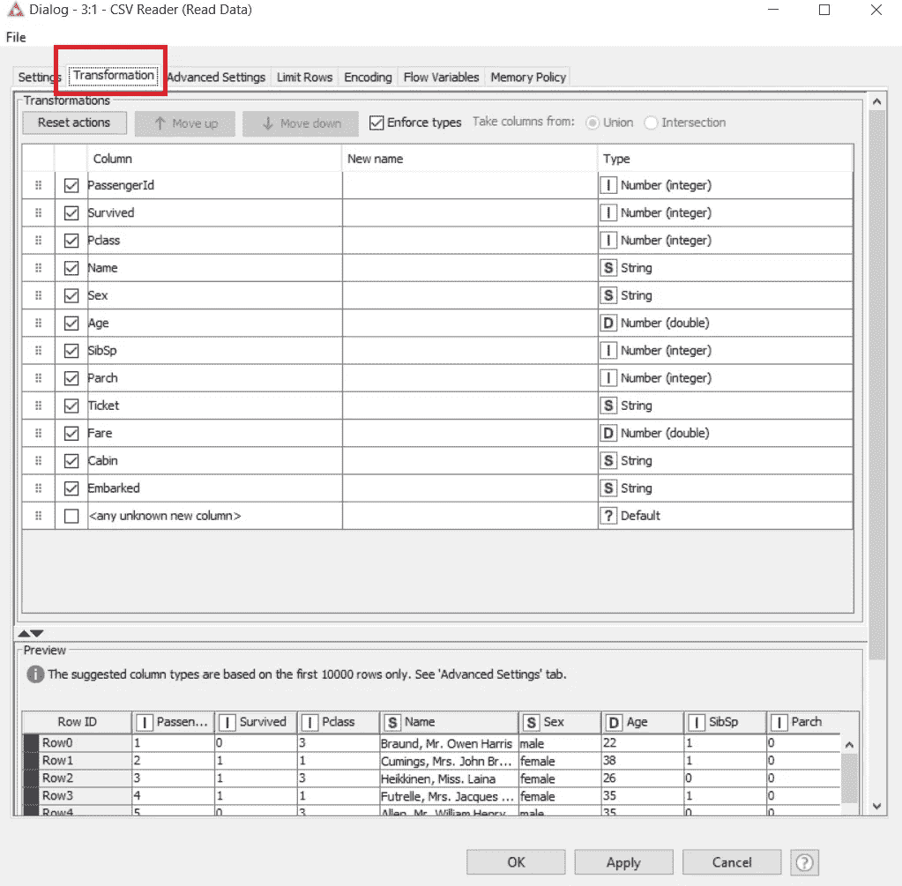

## **缺失值处理**

有一些通用选项可用于估算缺失值。

根据需求，缺失的值可以被替换。从截图中可以看出，字符串中缺失的值已被替换为“Unknown ”, double 被替换为 median。

除此之外，如果需要，可以对一个列进行特殊处理。

这里，年龄中缺少的值已被替换为“999”。

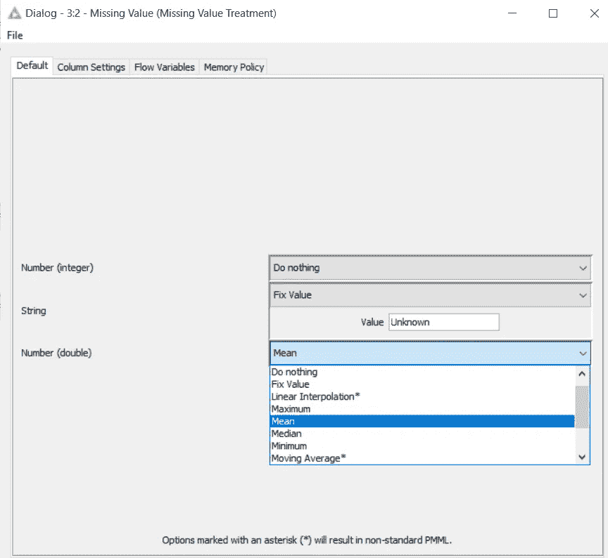

## **删除无关列**

现在，一旦丢失的值被替换，下一步就是删除不需要的列。

要删除这些列，可以使用列拆分器节点，该节点根据列选择将数据集拆分为两部分。

在这个数据集中， *Name，Ticket and Cabin* 已经被拆分到第二个数据集中，因此有一种方法将它们从现有数据集中删除。

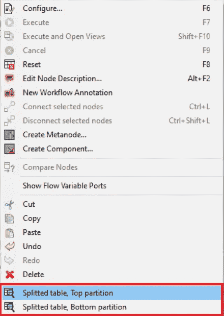

现在，由于不需要的列已被删除，因此需要将数据集拆分为因变量和自变量，这也可以使用列拆分器来完成。

这里第一个数据集是自变量，第二个数据集包含因变量*【幸存】*

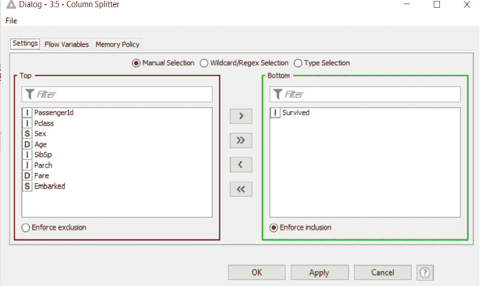

## **宁滨**

有些列需要特殊处理，比如创建 bin。

这可以使用宁滨节点来完成。在这里，*年龄*已经被装箱。因为数据类型是 double，所以使用了*CAIM·宾纳*节点。创建仓位后，仓位列的数据类型被替换为字符串。

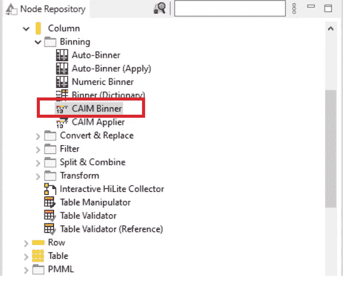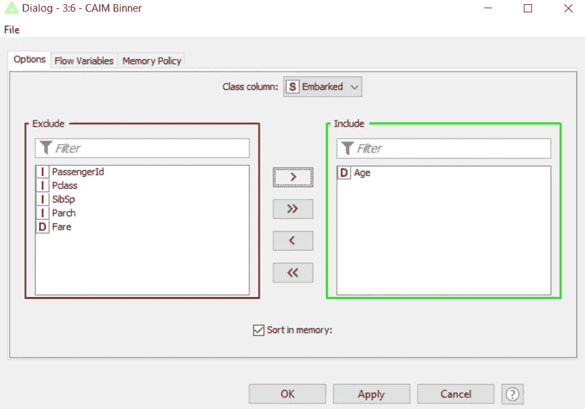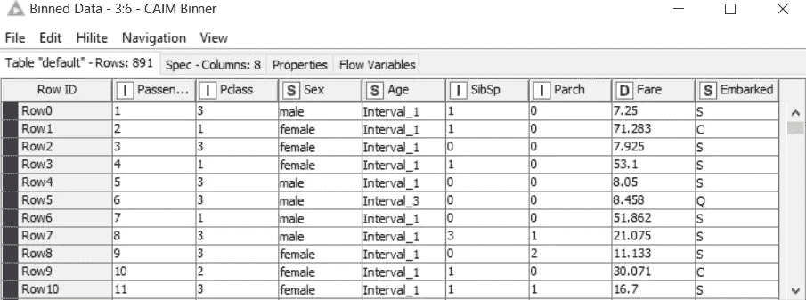

## **一热编码**

分类数据上的一个热编码可以使用操作下可用的一对多节点来完成。

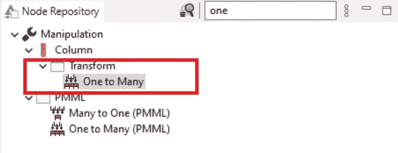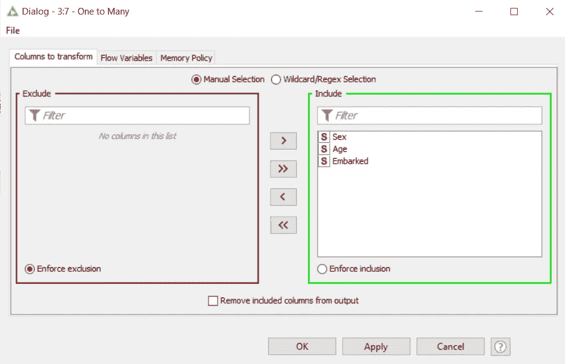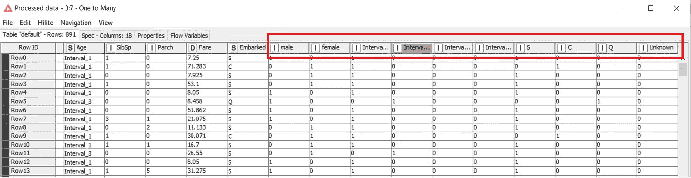

本文已经介绍了基本的预处理。Knime 不仅仅局限于这些节点。对于每一个类别，KNIME 中都有大量的节点，这超出了本文的范围。但是 KNIME 团队在为每项功能利用大量节点方面做得非常出色。

联系 KNIME 社区获取更多信息。

在下一篇文章中，我们将介绍可以使用 KNIME 探索的可视化方面。

StackErrors 由 [Ankita91](https://medium.com/u/79bf804fb2df?source=post_page-----6bd721732204--------------------------------) 和 [Sreedev](https://medium.com/u/49e4c41be3dd?source=post_page-----6bd721732204--------------------------------) 管理。跟随 Kaggle 中的[堆栈错误，探索我们的数据科学项目。
大家一起学习吧。💙](https://www.kaggle.com/stackerrors)

 [## Mlearning.ai 提交建议

### 如何成为 Mlearning.ai 上的作家

medium.com](/mlearning-ai/mlearning-ai-submission-suggestions-b51e2b130bfb)