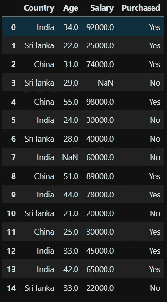
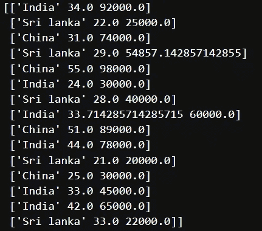

# Python 中的数据预处理:准备数据集的 4 个基本步骤

> 原文：<https://medium.com/mlearning-ai/data-preprocessing-in-python-4-essential-steps-to-make-your-dataset-ready-ae4ce570b56f?source=collection_archive---------6----------------------->


Photo by [Isaac Smith](https://unsplash.com/@isaacmsmith?utm_source=medium&utm_medium=referral) on [Unsplash](https://unsplash.com?utm_source=medium&utm_medium=referral)

# 为什么要进行数据预处理？

曾经想知道您的现实模型开发过程将如何增长吗？任何机器学习模型的准确性都取决于数据的清洁度和一致性。大多数时候，这与您的数据预处理技能高度相关。除了简单的回归问题，你将不得不处理分类和数字数据，使它们为模型开发做好准备。

如果你是机器学习的新手，你可能听说过数据科学和机器学习中广泛使用的术语: [*数据预处理*。](https://en.wikipedia.org/wiki/Data_pre-processing)良好的数据预处理是模型开发的下一步，可防止预期预测的准确性问题。在本指南中，我将解释应用更好的数据预处理的 4 个关键步骤。

我们首先进口熊猫和熊猫，然后阅读。csv 文件来可视化数据集的表格形式。

```
import numpy as np
import pandas as pd
dataset = pd.read_csv('Data.csv')
dataset
```



Tabular representation

该数据集包含数值变量和分类变量。我们必须将数据集分成特征和标签，以便使用强大的机器学习库 [*scikit-learn 进行进一步的预处理。*](https://scikit-learn.org/stable/)

```
X = dataset.iloc[:, :-1].values
y = dataset.iloc[:, -1].values
```

既然我们已经提取了要素和标签部分，我们可以继续进一步的预处理。

# 步骤 1 —处理缺失值

在现实世界中，数据集将包含缺失值。由于您的数据源不同，此问题可能会出现，也可能不会出现。有许多方法可以处理数据集的缺失值。有效的方法之一就是使用 scikit-learn 的 SimpleImputer。

```
from sklearn.impute import SimpleImputer
imputer = SimpleImputer(missing_values=np.nan, strategy='mean')
imputer.fit(X[:, 1:3])
X[:, 1:3] = imputer.transform(X[:, 1:3])
print(X)
```

当你创建一个简单估算对象时，它需要两个基本的关键字参数: [*missing_values*](https://scikit-learn.org/stable/modules/generated/sklearn.impute.SimpleImputer.html) 和 [*策略*](https://scikit-learn.org/stable/modules/generated/sklearn.impute.SimpleImputer.html) 。请注意，我们使用 *mean* 是因为数据集中缺失的值是数字。你需要根据场合使用其他人。使用*。拟合*属性，我们可以通过索引必要的列来拟合 X 上的估算值。同理，*。变换*属性估算 x 中所有缺失的值

这些是结果:



# 步骤 2——编码独立变量

数据集的第一列包含分类数据。分类数据是**一种**类型的数据即用于分组具有**相似特征**的信息，而数值数据是一种以数字形式表达信息的数据类型。

大多数机器学习模型只接受数值变量。因此，预处理分类变量成为一个必要的步骤。我们需要将这些分类变量转换成数字，以便**模型能够理解并提取有价值的信息**。

```
from sklearn.compose import ColumnTransformer
from sklearn.preprocessing import OneHotEncoder
ct = ColumnTransformer(transformers=[('encoder', OneHotEncoder(), [0])], remainder='passthrough')
X = np.array(ct.fit_transform(X))
```

在这个例子中，我们使用一个热编码*(或者序数编码)。* One Hot 编码是机器学习模型分类特征预处理的常用方式。这种类型的编码为每个可能的类别创建一个新的二进制特征，并将值 1 分配给对应于其原始类别的每个样本的特征。

# 第三步——因变量编码

我们将应用相同的过程，因为数据集的最后一列*(标签)*也包含分类数据。这一次我们使用的是 [*LabelEncoder*](https://scikit-learn.org/stable/modules/preprocessing_targets.html#preprocessing-targets) ，它是一个实用程序类，帮助标准化标签，使它们只包含 0 和 n_classes-1 之间的值。

```
from sklearn.preprocessing import LabelEncoder
le = LabelEncoder()
y = le.fit_transform(y)
```

# 步骤 4-训练-测试分割

现在是时候将我们的数据集分成*训练*部分和*测试*部分了。 [*训练测试分割*](https://www.geeksforgeeks.org/how-to-split-a-dataset-into-train-and-test-sets-using-python/) 用于近似适用于基于预测的应用的机器学习算法的性能。这种方法是一种快速且容易执行的程序，使得我们可以将我们自己的机器学习模型结果与机器结果进行比较。

```
from sklearn.model_selection import train_test_split
X_train, X_test, y_train, y_test = train_test_split(X, y, test_size = 0.2, random_state=1)
```

# 结论

总之，我们已经执行了必要的数据预处理步骤，以使我们的数据集为模型开发做好准备。在将数据集从原始数据转换为模型就绪数据时，执行这些步骤始终非常重要。

[](/mlearning-ai/mlearning-ai-submission-suggestions-b51e2b130bfb) [## Mlearning.ai 提交建议

### 如何成为 Mlearning.ai 上的作家

medium.com](/mlearning-ai/mlearning-ai-submission-suggestions-b51e2b130bfb)