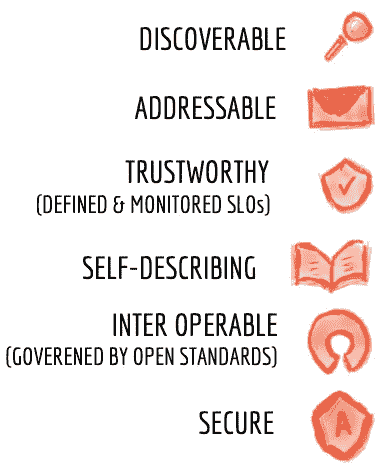
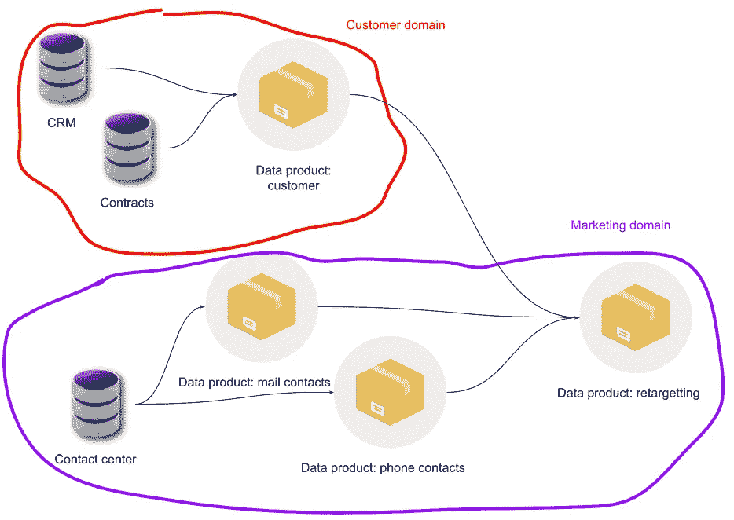
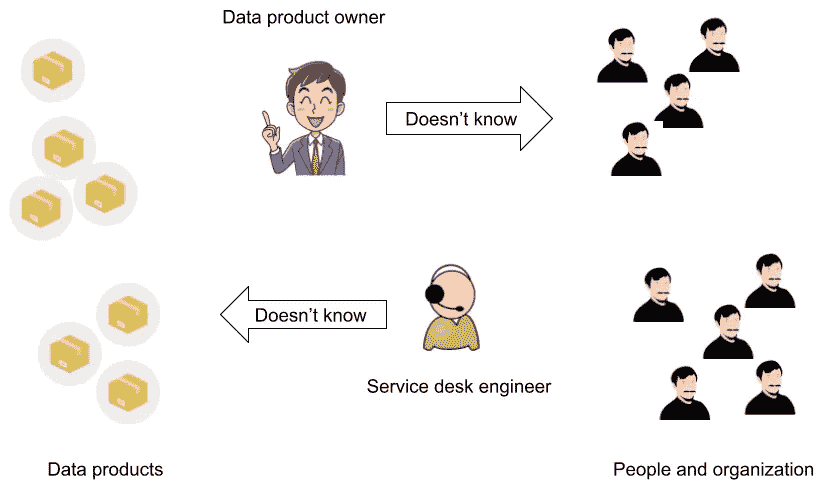
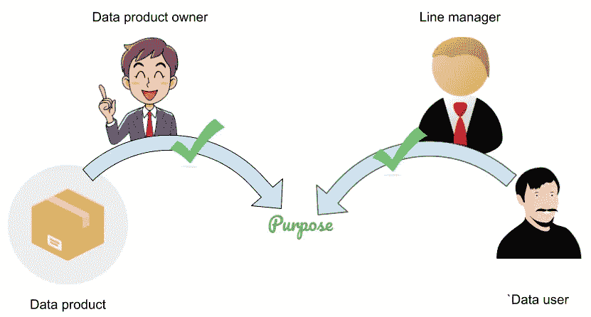

# 现代数据堆栈中的数据隐私

> 原文：<https://medium.com/mlearning-ai/data-privacy-in-the-modern-data-stack-15ebf7c4ec6d?source=collection_archive---------3----------------------->

## 如何处理数据网格中的数据隐私？

扎马克·德格哈尼在 2019 年发表了第一篇关于[数据网格](https://martinfowler.com/articles/data-monolith-to-mesh.html)的文章。数据网格的一个核心概念是分散的数据所有权:将所有权放在知道数据的人手中。过于严格的数据隐私规则会很快将这种分散的方法变成数据孤岛，而过于宽松的规则会将它变成一堆数据。许多公司，不仅仅是那些追求数据网格的公司，都在努力解决数据所有权问题，在现代数据堆栈中，这个问题变得越来越复杂。

> 过于严格的数据隐私规则会把你的数据网变成数据孤岛，过于宽松的规则会把数据弄得一团糟

# 数据网格—快速回顾

最近，在一次会议上，我介绍了数据网格的概念

> “这是一个问题集，这是一套原则，这是一个解决方案”

你不能指望一个中央数据团队了解你的整个业务或知道你的所有操作应用程序，更不用说拥有他们没有产生的数据。为了解决这些问题，Zhamak Deghani 引入了数据网格的概念及其 DATSIS 原则。

Image by Zhamak Dehghani on [https://martinfowler.com/articles/data-monolith-to-mesh.html](https://martinfowler.com/articles/data-monolith-to-mesh.html)

为了实现这些原则，她预见到您需要一个自助式数据平台、分散的面向领域的数据所有权和联合治理。这个解决方案集需要数据产品思维:数据不应该再被认为是应用程序的副产品，它本身就是一个产品，确实应该由生产(或使用)数据的团队所拥有。您将数据知识带给具有业务专长的团队，而不是构建一个应该了解您的整个业务和应用程序环境的中央数据团队。

如果你想了解更多关于数据网格的知识，我强烈推荐阅读 Zhamak 的书“[数据网格](https://www.oreilly.com/library/view/data-mesh/9781492092384/)”或者阅读一些列在数据网格社区网站上的[用户故事](https://datameshlearning.com/user-stories/)。

# 数据产品

当你把产品思维带到数据中，会有更多的含义。一般来说，当你不能解释你为什么要开发一个产品时，你就不应该在一开始就开发它。这同样适用于数据:每个数据产品都需要一个目的。你的产品的原因。看看你的周围:对于你看到的每一件物品，你都可以说出你买它的原因。对某些人来说，你甚至可能有多种原因。

> 每个数据产品都需要有一个目的

Photo by [Danica Tanjutco](https://unsplash.com/@danidums?utm_source=medium&utm_medium=referral) on [Unsplash](https://unsplash.com?utm_source=medium&utm_medium=referral)

这种多用途使用也将发生在数据产品上。一个团队构建一个数据产品的原因可能与其他人使用它的原因不同。来自运营应用程序的数据之上的第一个数据产品的存在只是为了如实描述事实。用户有不同的目的:描述客户的数据产品的用户可能希望将客户数据用于个性化目的、营销活动等

Diagram — Chained data products with distinct purposes — By author

其中一些目的可能合法，而另一些可能不合法。它甚至可能变得更加复杂:你的一些客户可能已经同意接收营销邮件，而其他人没有。这意味着你的数据产品将成为子集多用途。如果这是一个词的话…但它显示了小心处理数据隐私和避免罚款的复杂性。

# 完全兼容的数据网格筒仓

Photo by [Jim Witkowski](https://unsplash.com/@jcw?utm_source=medium&utm_medium=referral) on [Unsplash](https://unsplash.com?utm_source=medium&utm_medium=referral)

在您的数据网格中创建数据产品的最终目标是让公司更受数据驱动。允许员工使用高质量的数据。通过将所有权和转换责任分配给真正了解数据业务的团队，您最终将获得高质量的数据。

数据湖的目标是让所有人都能获得所有数据，但现在情况不同了。你如何处理数据隐私将决定客户对你公司的看法。然而，完全限制数据访问和使用的相反行为，这是分散所有权的一个可能的陷阱，并没有使您的公司数据驱动，它只是创建了数据孤岛。

你的目标应该是在中间着陆:

> 我希望每个员工都可以访问他被允许访问的所有数据，并要求在工作中表现出色

# 一种隐私兼容的数据驱动网格

从数据网格的角度来看，这意味着每个员工都应该能够访问他在工作中取得成功所需的数据产品，并且数据产品只包含实现目的的数据。或者至少，当一个员工访问一个数据产品时，他应该只为他访问它的目的获取数据。

要获得或首先请求访问权限，他应该知道存在哪些数据产品。还记得扎马克介绍的 DATSIS 原则吗？D 代表可发现性，这意味着员工应该能够发现哪些数据存在。典型地，这样的概述将在数据目录中可用。越来越多的玩家正在入侵这个市场。

Photo by [Claudio Schwarz](https://unsplash.com/@purzlbaum?utm_source=medium&utm_medium=referral) on [Unsplash](https://unsplash.com?utm_source=medium&utm_medium=referral)

数据产品与元数据一起列在数据目录中。这些元数据包括质量或值得信赖的度量，如数据的延迟，但也包括产品的所有者和用途。当确信某个数据产品可以为员工服务时，他的数据访问请求最终应该由数据所有者提出。同样，他知道他的数据产品和允许的目的，而中央数据治理团队或服务台团队不可能知道所有的数据产品及其目的。

> 数据访问请求应该由数据所有者提出

Diagram — The blanks of knowledge of a single person — By author

当数据产品所有者可以轻松授予合规性访问权限时，您就达到了合规性数据驱动网格。而且，由于您的批准和访问配置过程将变得更快，您将获得令人难以置信的工作效率提升。然而，正如中央团队不了解所有数据产品一样，数据产品所有者也不了解整个组织。那么，如何才能加快这一过程，并保证为数据产品提供合规的数据访问呢？

# 基于目的的访问控制

这就是基于目的的访问控制介入的地方，它可以被认为是基于属性的访问控制或 ABAC 的子空间。简而言之:当您被允许为数据产品指定的目的访问数据时，您就获得了对该数据产品的访问权。这允许您划分访问批准的责任:数据产品所有者决定他的数据产品可以用于哪些目的，而直线经理可以批准他的团队成员访问特定目的。这意味着不再有人需要知道所有的数据产品，也不需要知道整个组织结构。

> 基于目的的访问控制允许您划分访问批准责任:有人拥有数据产品的目的，其他人批准执行目的的权利。

Diagram — Purpose based access control — By author

在多用途数据产品中，额外的复杂性当然会增加。为特定目的访问数据产品的人应该只看到属于这个目的的数据，这可能是一个子集。这也是与数据湖方法的区别，在数据湖方法中，过滤特定用途数据的责任由最终用户承担，因此应该在公司内重复多次。

为了解决这个问题，公司有时会提供数据的子集副本(在文件系统或数据库中)，这对流式数据来说成本太高，因此没有这样的流式数据解决方案。

> 数据的兼容子集拷贝对于流数据来说成本太高，对于流数据来说没有简单的解决方法。

基于目的的访问控制为表带来了更多的好处。以前，您可能会要求访问特定的数据产品，而现在，您也将获得对实现相同目的的所有上游和下游数据产品的正确访问。更有甚者，当一个目的只允许你访问一个数据产品的子集(行级和列级)或该数据产品的伪匿名版本时，通常对上游和下游数据产品应用相同的隐私级别。

# 建造还是购买

由于数据隐私对于您的外部世界形象非常重要，并且成为数据驱动型企业正在从竞争优势向与竞争对手不相上下的方向发展，因此拥有一个能够保证您的数据隐私的解决方案至关重要。对于大多数公司来说，建立数据平台和保证数据隐私都不是核心能力，也不是竞争优势。由于这是一个复杂的问题，我总是建议在市场上寻找，即使你可能能够自己建造它。

> 成为数据驱动型企业是指从竞争优势发展到与竞争对手并驾齐驱

正如数据目录一样，围绕隐私合规或基于目的的访问控制或基于目的的加密的解决方案不断涌现，可能会减轻您对这一复杂问题的负担..它们使您能够让您的团队使用符合隐私的数据，跨工具和数据产品保持一致，并允许您专注于真正重要的事情:

> 为您、您的公司和您的客户带来基于数据的价值

 [## Mlearning.ai 提交建议

### 如何成为 Mlearning.ai 上的作家

medium.com](/mlearning-ai/mlearning-ai-submission-suggestions-b51e2b130bfb)