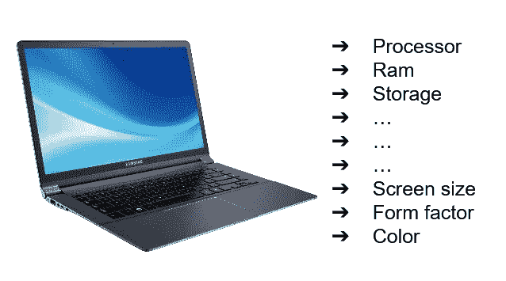
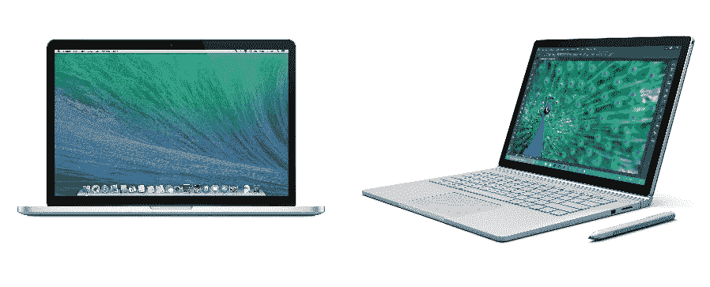
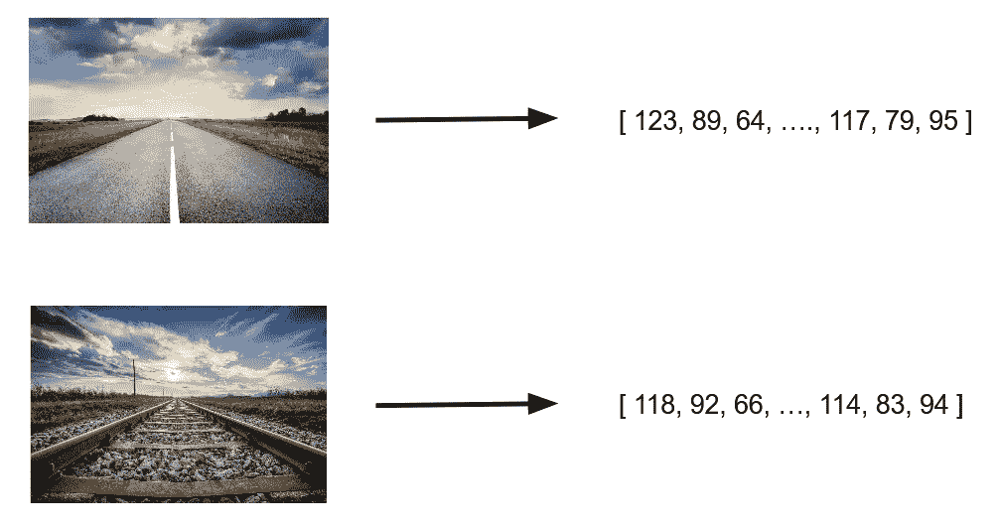
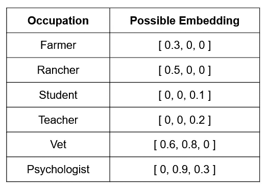
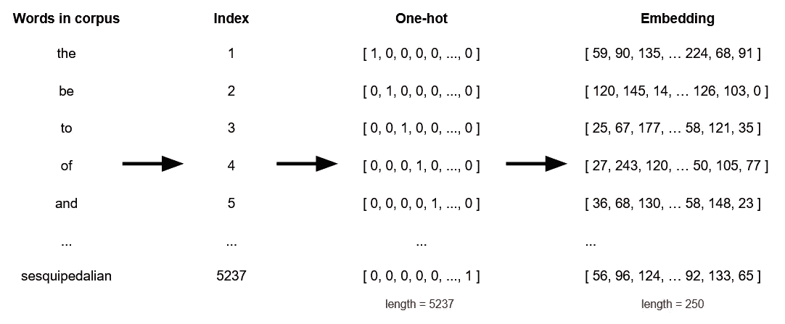
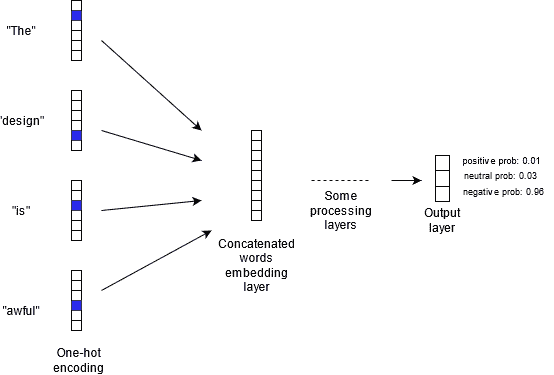

# 增强您的 ML 模型的数据表示技术—第二部分

> 原文：<https://medium.com/mlearning-ai/data-representation-techniques-to-supercharge-your-ml-model-part-ii-f06f84457603?source=collection_archive---------5----------------------->

## 如何将知识编码为数字序列

Photo by [Mick Haupt](https://unsplash.com/@rocinante_11?utm_source=medium&utm_medium=referral) on [Unsplash](https://unsplash.com?utm_source=medium&utm_medium=referral)

在本系列的第一部分中，我们讨论了如何使用特征交叉来组合多个特征，以提取数据中的非线性模式。现在，我们将继续我们的旅程，探索用嵌入表示特征的概念，以及它如何在许多领域中使用，如 NLP 和计算机视觉。

# 嵌入的直觉

想象一下，你的小弟弟刚刚高中毕业，即将进入大学。就像一个好哥哥一样，你想给他一台全新的笔记本电脑作为礼物，这样你的哥哥就可以用它来做作业或做其他事情。但是，你如何决定你应该买哪台笔记本电脑呢？

**众多属性**定义了笔记本电脑，如品牌、所用处理器的种类、内存容量、屏幕尺寸、重量、外形、颜色等。考虑到这么多的房产，直觉上你会**只关注一小部分**，也就是**与你兄弟的需求最相关的**。如果你的兄弟打算注册一个计算机科学学位，那么硬件规格可能会是你优先考虑的。在另一种情况下，如果他选择的是艺术学位，那么屏幕尺寸和屏幕质量将更值得考虑。

Many characteristics can describe a laptop.

现在，让我们假设你的兄弟注册了一门计算机科学课程。有了这些信息，你去了[*cs majors*](https://www.reddit.com/r/csMajors/)subreddit，向那里的人寻求一些推荐。你发现他们中的大多数人都在使用一种特定型号的笔记本电脑，根据他们的经验，这种型号很适合他们作为计算机系学生的需要。然而，在检查了几乎所有的线上和线下零售商后，你发现由于它的流行，笔记本电脑到处都卖完了。那你该怎么办？

Different needs will define different subsets of properties that are relevant to the user.

你可能做的最合理的事情就是找到一台**类似**的笔记本电脑。你不想在不确定中等待，你的兄弟可能会在没有笔记本电脑的情况下开始他的第一个学期。这里相似性的概念可能有点模糊。但是，您已经知道硬件规格是需要考虑的最重要的因素。然后，你可以集中精力寻找一台与**相似的处理器、ram 和存储大小**的笔记本电脑，这将是给你弟弟的完美礼物。

Similarity can be measured once some properties have selected to represent the laptop.

用其属性的子集表示笔记本电脑的概念类似于嵌入的工作原理。通过嵌入，我们根据我们执行的下游任务将高维数据表示为低维数据。任务可以是任何监督任务，例如情感分析或图像分类。然而，在嵌入中，**我们不手动指定代表数据的度量**。**我们只指定维度的大小**，让模型在训练期间计算出合适的向量表示，使其在任务中表现良好。由于这个自动过程，嵌入的结果很难解释，即**不清楚每个维度指的是什么**。

Illustration of embedding, here one can’t interpret what each element of embedding refers to. Nevertheless, it stills a useful representation since a pair of similar items would have close vector values.

关于嵌入的另一个重要想法是它如何使我们能够定义项目之间的关系。与我们之前的笔记本电脑示例类似，我们可以通过检查它所代表的每个维度的值来度量相似性。这种相似性的概念通常由余弦相似性正式定义。然而，我们必须意识到，这种相似性是在它接受训练的任务中定义的。**不能保证测量同样适用于不同的任务。**例如，单词 football 和 chess 可能紧密嵌入新闻标题分类任务中。然而，如果任务是对游戏类型进行基于描述的分类，这些单词将会落入一个非常不同的表示中。

# 嵌入的应用

在 ML 模型中表示分类特征的常用方法是实现一键编码。在这种方法中，一个要素由一个二进制向量表示，其长度等于该要素具有的不同值的数量。例如，假设我们的数据中有一个职业列。为了简单起见，只有六种可能的职业，分别是农民、牧场主、学生、教师、兽医和心理学家。对于一个热编码，我们用六长度二进制向量来表示每个职业，其中每个维度指的是不同的职业。

One-hot encoding representation of the occupations

这种方法有两个主要缺点。首先，随着职业列表的增长，它可以产生高度稀疏的维度向量。这将是一个问题，因为维度的增加会以指数方式增加模型所需的数据量。第二，截然不同的职业的向量被表示为独立的，这是不真实的。自然地，一些职业会更接近另一个职业，就像兽医比农民更接近心理学家。

With embedding, the occupations are represented in smaller vector space and related occupations would have similar vector values.

如果我们使用嵌入而不是一次性编码作为特征表示，上述两个问题就解决了。然而，使用嵌入并不意味着完全摆脱独热编码。我们仍然需要使用 one-hot 编码将分类值转换为数字形式，然后在其上放置一个嵌入层。在这里，您可以将一键编码视为分类特征和嵌入层之间的桥梁。

## 单词嵌入

也许，利用嵌入概念的最广为人知的领域是 NLP，由于文本数据的性质，这并不奇怪。包含一组单词的句子在没有嵌入的情况下将是高度多维的。而且，两个不同单词的相似意思，如果仅仅依靠一热编码表征是无法捕捉到的。

Steps in generating word embedding (illustration).

要创建单词嵌入，首先，我们需要将语料库中的文本标记为词汇，并为每个单词分配一个唯一的索引。接下来，我们用独热编码向量的对应索引上的值 1 来表示文本中的每个单词。最后，我们可以将这个二进制数序列映射到一个稠密层，该稠密层具有我们希望嵌入的维度大小。然后，该层的相应权重被随机初始化，并在模型训练期间逐渐调整。由此产生的层就是所谓的单词嵌入。

Illustration of parallel embedding in sentiment analysis task.

先前创建嵌入的技术被称为并行嵌入，其中嵌入与下游任务并行训练。另一种技术是将嵌入作为一项独立的任务来生成，其重点是捕获单词的语言元素。这种类型的嵌入的一些例子是 word2vec、glove 和 fastText。

## 图像嵌入

嵌入自然实现的另一个领域是计算机视觉。在该领域中，嵌入用于将密集和高维的图像像素“压缩”成更紧凑和相关的表示。在这里，神经网络层将通过聚合、转换或向与任务相关的像素分配更多权重来处理每个像素中包含的信息。

All layers between input layer and output layer can be considered as embedding. (source: neurohive.io)

从输入层之后的一层到倒数第二层的神经网络层的堆叠被认为是嵌入。图层离输入越远，表示就越密集和抽象。这些经过训练的层不仅可以用在对其进行训练的模型中，还可以被提取并用作其他模型的一部分。这是预训练模型概念的本质，其中一个模型获得的“提取的知识”用于加速另一个模型的学习过程。

# 包扎

在本文中，我们讨论了嵌入的直观性及其相对于一键编码的优越性。我们还回顾了一些使用嵌入作为特征表示的情况。在本系列的下一部分，我们将探索**散列特性**的概念，它如何解决不完整词汇问题，以及实现它的一些实际案例。