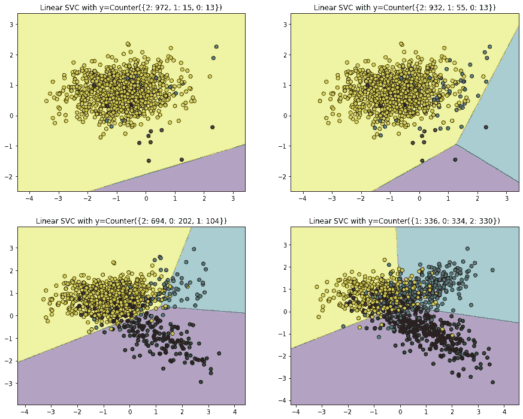

# 不平衡数据的数据采样方法

> 原文：<https://medium.com/mlearning-ai/data-sampling-methods-in-machine-learning-17c77bbf0579?source=collection_archive---------6----------------------->

当我们面临分类问题时，大多数机器学习算法都被设计为对每一类的相同比例的观察值进行工作。因此，当某个类的观测值比多数类少很多时(不平衡数据集)，算法会忽略该类，从而降低其性能和应用程序容量。为了改进它，一个解决方案是使用数据采样算法。数据采样方法提供了几种技术来平衡两类的体积，既增加少数类(过采样)又减少多数类(欠采样)。

在图 1 中可以看到一个模型中不平衡数据的影响。在这种情况下，我们有三个类:类 2 是多数类，类 1 和 0 是少数类。由于我们对从这些数据中学习感兴趣，并且这是一个多分类问题，如果我们考虑一个线性 SVC 模型来分类我们的数据集，我们可以看到在关于模型分类的少数类上添加更多数据的效果。在第一个训练数据集，不平衡数据是突然的，分类器只能预测两个类别。即使有一个人，像你一样，看到这个数据，并认为如果我们可以做一个更好的模型，我们会说不，因为没有足够的数据，我们必须区分三个类别。在相反的情况下，在最后一个例子中(右下角的图像)，所有零件都有相同的体积，大约 330 个例子。在这种情况下，该模型工作得相当好，并且像线性 SVC 这样的线性模型足以保证良好的性能来划定这三个类之间的边界。

Fig. 1: Effect of imbalanced data on machine learning algorithms

如果少数类有足够的数据进行统计处理并生成合成数据，或者对多数类采样不足，不平衡数据就不会成为问题。在大多数严重不平衡的数据集中，最大的挑战在于，您应该小心地应用数据采样技术，以不改变数据的原始分布或原始信息。

数据采样提供了一组转换训练数据集以实现更好平衡的技术。没有最好的数据采样方法:正如生活中一样，有许多数据采样方法，每种方法都更好，这取决于项目中使用的应用程序或模型。因此，开展抽样方法对机器学习模型影响的敏感性研究是非常重要的。我们可以区分两类数据采样方法:**过采样**和**欠采样**技术。

# 过采样

过采样技术从少数类的例子中合成新的例子。最常用的过采样方法有:

**随机过采样:**这种技术包括从少数数据集中随机复制样本。这对于具有偏态分布的数据集可能是有效的，在这种情况下，重复的示例可以提高模型性能。然而，读者应该注意过度拟合模型，因为这种技术复制了示例。因此，对训练和测试数据集进行敏感性研究并进行度量评估以防止过度拟合是很重要的。使用 *imblearn* 库中的 *RandomOverSampler* 类实现随机过采样。

**合成少数过采样技术(SMOTE):** 该技术随机选择一个少数类实例，并找到其 k 个最近的少数类邻居。然后，通过随机选择 k 个最近邻居 b 中的一个并连接 a 和 b 以在特征空间中形成线段，来创建合成实例。合成实例生成为两个选定实例 a 和 b 的凸组合。读者应注意应用 smote 后的数据分布，因为原始数据对此策略有重要影响。此外，k-neighbors 是一个待测试的超参数，用于改进模型学习。SMOTE 是使用 *imblearn* 库中的 *SMOTE* 类实现的。

**边界线-SMOTE:** 在这种情况下，它由 SMOTE 技术的修改组成，通过使用 KNN，聚焦于两个类的边界。分类问题主要在于确定不同类别之间的界线。正如我们在前面的图片中看到的，可能是边界线没有很好地定义，它是为了区分该线中的类，包括分类模型。因此，该算法包括在类之间的边界周围应用 SMOTE 技术，以改进它们的限制并提高模型性能。使用 *imblearn* 库中的 BorderlineSMOTE 类实现 Borderline-SMOTE。

**边界线-SMOTE SVM:** 该技术包括非常类似于先前技术的方法论，边界线-SMOTE，不同之处在于边界线不是由数据集本身施加的，而是由 SVM 算法、先验学习施加的。因此，SVM 用于定位边界线，SMOTE 算法基于该边界线工作。SVM SMOTE 是通过使用 *imblearn* 库中的 SVM SMOTE 类实现的。

**自适应合成采样(ADASYN):** 该技术涉及生成与少数类中的样本密度成反比的合成样本。该技术在少数样本密度低的区域空间中生成合成样本，而在样本密度高的区域空间中生成较少的合成样本。ADASYN 是通过使用 *imblearn* 库中的 ADASYN 类实现的。

**甘:**生成对抗网络可以作为一种过采样工具。这是一个新话题，文献中有许多文章解释了使用 GAN 技术进行过采样的好处。

**数据扩充:**它包括生成额外的数据来提高模型的性能。它主要用于图像和语言处理。关于数据扩充的一些技术如下:添加噪声、裁剪、翻转、缩放、小波变换等等。

# 欠采样

欠采样技术从多数类中删除样本子集。最常用的技术是:

**随机欠采样:**该技术包括从多数类中随机选择样本，以从训练数据集中删除样本。通常，随机减少多数类数据集，以使两个类的体积更加均匀。在这种情况下，读者应该注意不要删除重要的例子。如果多数类足够大并且均匀分布，随机移除样本不会改变统计的基本原理，应用这种技术会很有趣。使用 *imblearn* 库中的 *RandomUnderSampler* 类实现随机欠采样。

**新的缺失欠采样:**在这种情况下，文献中有三种不同类型的这些技术:NearMiss-1 从多数类中选择与来自少数类的三个最近的样本具有最小平均距离的样本，NearMiss-2 从多数类中选择与来自少数类的三个最远的样本具有最小平均距离的样本，NearMiss-3 涉及为最接近的少数类中的每个样本选择给定数量的多数类样本。读者应该关心这种方法的应用，因为它可以大大减少多数阶级的例子的数量，并集中在少数阶级附近。这种方法的效果可能是从多数类中急剧减少大量信息。NewarMiss 是使用 *imblearn* 库中的 *NearMiss* 类实现的。

**浓缩最近邻法则(CNN):** 这个技巧和之前的有很大不同。它包括使用 KNN 算法对不同的类进行分类，并且不能被正确分类的多数集合被递增地添加到存储中。因此，它从少数类的一个存储开始，通过添加不能正确分类的多数类的例子来工作。这是一种欠采样技术，它寻找样本集合的子集，不会导致 KNN 算法的模型性能损失。读者应该注意以下几点:这种技术集中在类之间的边界线上，没有保存来自其他部分的数据集。condensednearestneighbor 是使用 *imblearn* 库中的*condensednearestneighbor*类实现的。

**Tomek 链接欠采样:**该技术基于 CNN，但经过修改。CNN 技术的一个问题是样本是随机选取的。这种技术的修改是选择成对的例子，每个类一个，具有彼此最小的欧几里德距离。一旦对的体积在算法中保持不变，它们就被从多数类中移除。TomekLinks 是使用 *imblearn* 库中的 *TomekLinks* 类实现的。

**编辑过的最近邻规则(ENN):** 该规则涉及使用 k=3 个最近邻来定位数据集中那些被错误分类的样本，然后在应用 k=1 分类规则之前移除这些样本。**它也适用于少数类中的每个例子，其中那些被错误分类的例子从多数类中删除了它们最近的邻居。读者应该知道，这种技术对于去除数据集中的模糊和有噪声的例子是有用的。editednearestneighbors 是使用*imb learn*库中的 editednearestneighbors 类实现的。**

**单边选择(OSS):** 这种技术结合了 Tomek Links 和 CNN。Tomek 链接是边界上的模糊点，在多数类中被识别和移除。然后使用 CNN 方法从多数类中移除远离决策边界的冗余样本。OneSidedSelection 是使用 *imblearn* 库中的 *OneSidedSelection* 类实现的。

**邻域清理规则(NCR):** 它结合了 CNN 规则来移除多余的示例，以及 ENN 规则来移除有噪声或模糊的示例。CNN 以一步的方式被应用，然后根据 KNN 分类器被错误分类的例子被移除，如 ENN 规则。与 OSS 不同，较少的冗余实例被删除，更多的注意力放在清理那些保留的实例上。这样做的原因是为了关注保留在多数类中的例子的质量(明确性)。neighborhood cleaning rule 是使用 *imblearn* 库中的*neighborhood cleaning rule*类实现的。

**图像压缩技术:**有许多压缩技术，如奇异值分解(PCA)、傅立叶变换、小波基变换、卷积技术，以及许多可用于压缩数据集的压缩信息技术，始终牢记这种压缩对模型的影响。

# 组合数据采样方法

过采样和欠采样方法的组合已经被证明是有效的技术，并且一起可以被认为是采样技术。

## **随机过采样和欠采样**

它们结合起来会很有效。随机过采样包括随机复制少数类中的样本，而随机欠采样包括从多数类中随机删除样本。这是两种技术的中间点。

## **平滑和随机欠采样**

SMOTE 的工作方式是选择特征空间中接近的例子，在这些例子之间画一条线，并沿着这条线创建一个新的样本作为一个点。建议对少数类使用 SMOTE，然后对多数类使用欠采样技术。

## **SMOTE 和 Tomek 链接欠采样**

SMOTE 是一种过采样方法，它综合了少数类中新的似是而非的例子。Tomek 链接是指一种用于识别数据集中具有不同类的最近邻对的方法。移除这些对中的一个或两个示例(例如多数类中的示例)具有使训练数据集中的决策边界不那么嘈杂或模糊的效果。使用 Tomek 链接的目的是在分类问题中更好地定义类之间的边界。

## **斯莫特和 ENN**

SMOTE 可能是最流行的过采样技术，可以与许多不同的欠采样技术结合使用。另一种非常流行的欠采样方法是编辑最近邻法，或 ENN。该规则涉及使用 k = 3 个最近邻来定位数据集中被错误分类并随后被移除的那些例子。它可以应用于所有的课程，也可以只应用于大多数课程中的例子。数据采样方法的其他组合如下:

> 浓缩最近邻+ Tomek 链接
> 
> SMOTE + Tomek 链接
> 
> SMOTE +编辑最近邻

# 结论和建议

读者可以看到，在机器学习项目中，有不同的技术来处理数据采样。先验地，不知道哪种技术最适合于应用，甚至不知道哪种技术最适合于所使用的模型。因此，有必要使用不同的技术，将欠采样技术与过采样技术相结合，并测量它们对模型训练的影响。重要的是，这些技术应该在培训步骤中使用。还需要在不使用数据采样技术的情况下，测量测试和验证步骤的不同模型性能指标，以查看模型如何正常工作以及模型如何学习。此外，应该强调的是，没有一种方法比另一种更好，因为取决于数据集以及模型和应用，一种技术会比另一种更有趣。总是需要测试不同的技术，将欠采样与过采样结合起来，并执行灵敏度分析，以了解它们如何改进模型。读者可以深入查阅一些书籍，如《用 Python 实现不平衡分类》和 Kaggle 中的一些项目。最后，读者永远不要忘记享受和快乐地工作。知道人生最重要的是开心。所以，我希望你喜欢这篇文章，并从中得到乐趣！

 [## Mlearning.ai 提交建议

### 如何成为 Mlearning.ai 上的作家

medium.com](/mlearning-ai/mlearning-ai-submission-suggestions-b51e2b130bfb)