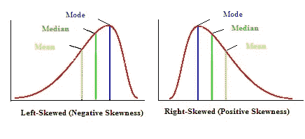

# 数据科学 101 —分发和测试

> 原文：<https://medium.com/mlearning-ai/data-science-101-distribution-and-tests-68e0bcfb0331?source=collection_archive---------5----------------------->

大家好，我已经开始了这个博客系列，以修正许多有志者经常错过面试的数据科学的基本概念。他们以问答的形式让你感受到面试，以及他们对你的期望。

**问题 1.a .序数和名词性变量的区别是什么？**

答 1.a .名义变量或有时称为分类变量是一个变量，其变量值有两个或多个类别，但这些类别之间没有内在的顺序。例如，假设头发颜色是数据集的一个属性，可能值为“黑色”、“棕色”、“金发”等。所有这些类别都互不相关。
而在序数变量的情况下，它有两个或两个以上的与另一个相关的范畴值。例如，学生的分数按照表现从 A 到 E 的降序分为 5 个等级。这里的性能是 marks 列的分类值之间的关系。

**问题 1.b .什么是区间变量？**

答案 1.b .区间变量是指变量有数值，数值有固定的差值。例如，如果我们用一个区间变量记下一个雇员的工资，那么在这种情况下，工资应该是彼此之间的₹10,000 区间。那么这些值看起来会像₹5,000；₹15,000;₹25,000 等等。

**问题二。什么是统计测试？为什么是表演？**

答案 2。统计测试是用来评估我们的假设有多合理的测试。我们进行假设检验来发现我们假设的有效性。假设检验有两种类型，参数检验和非参数检验。

**问题 3.a .正态分布中均值、中值和众数的关系是什么？**

回答 3.a。在正态分布或也称为钟形曲线的情况下，三者都相等。

**问题 3.b .如何用正态分布求标准方差？**

答案 3.b .标准差是均值和各值之差的和的平方根。在正态分布的情况下，标准差的值为 1，而平均值为 0。

Reference: [Scribbr](https://www.scribbr.com/statistics/normal-distribution/) [1]

**问题 4。什么是左右偏态分布？还要对每个中的平均值、中值和众数进行评论。**

*注:statisticshowto.com 上有一篇关于这个概念的精彩文章，我推荐读者去看看。[2]*

答案 4。分布有两种类型，左偏和右偏。现在，一个常见的误解围绕着什么是左和右？左偏态分布意味着它有一个向左的长尾，这意味着分布的大部分位于右侧。术语“左”也与分布的平均值位于峰值左侧的概念相关。它也被称为负偏态分布。反之亦然，对于右偏分布，即它具有向右的长尾，意味着大部分分布位于左侧。如前所述，在右偏分布中，平均值位于峰值的右侧。它也被称为正偏态分布。
关于这两个分布中的均值、中值和众数的值，两者的峰值都等于众数的值。在这两种情况下，中值位于平均值和众数之间。谈论左偏态分布，因为平均值位于峰值的左侧，即众数的值。因此，众数大于平均值，如上所述，中位数介于两者之间。因此意味着<中值<模式。而在右偏分布的情况下，平均值位于峰值的右侧，即众数的值。因此模式<中值<是指。

***TL；DR —左偏斜是指尾部向左拉长，平均值在峰的左侧，也就是模式所在的位置。右偏是尾部向右拉长，平均值是峰的右侧，也就是模式所在的位置。***

Beautiful Depiction By StatisticHowTo Team. [2]

**问题 5。参数测试和非参数测试的区别是什么？**

答案 5。参数检验是一种关于总体分布的检验，它假设总体是正态分布。我们有可用的平均值或假定的平均值。非参数检验完全不知道数据及其分布。非参数检验适用于中位数。我将写下一篇关于参数和非参数测试以及方法的博客。敬请期待！

参考

1.  [https://www.scribbr.com/statistics/normal-distribution/](https://www.scribbr.com/statistics/normal-distribution/)
2.  [https://www . statistics show to . com/probability-and-statistics/skewed-distribution/](https://www.statisticshowto.com/probability-and-statistics/skewed-distribution/)

 [## Mlearning.ai 提交建议

### 如何成为 Mlearning.ai 上的作家

medium.com](/mlearning-ai/mlearning-ai-submission-suggestions-b51e2b130bfb)