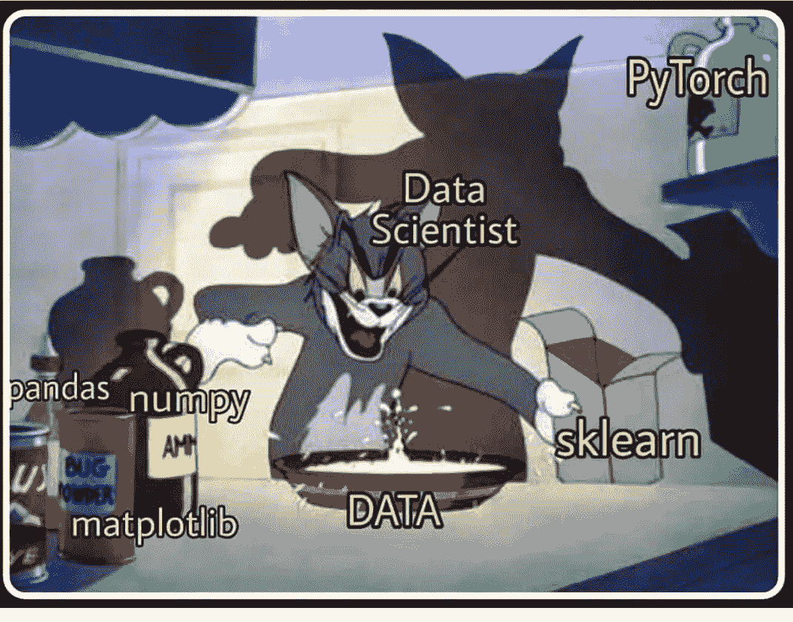
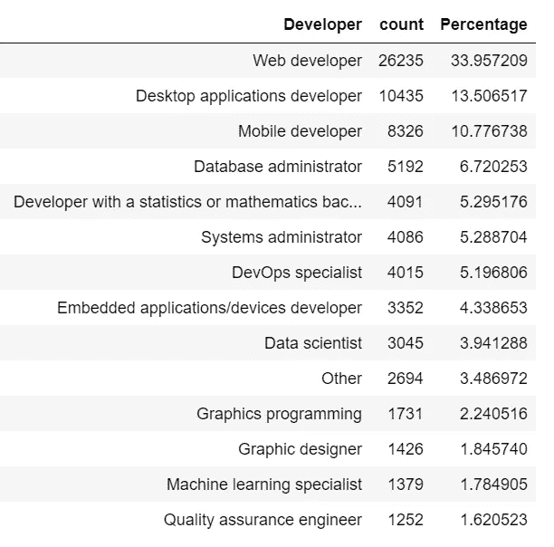
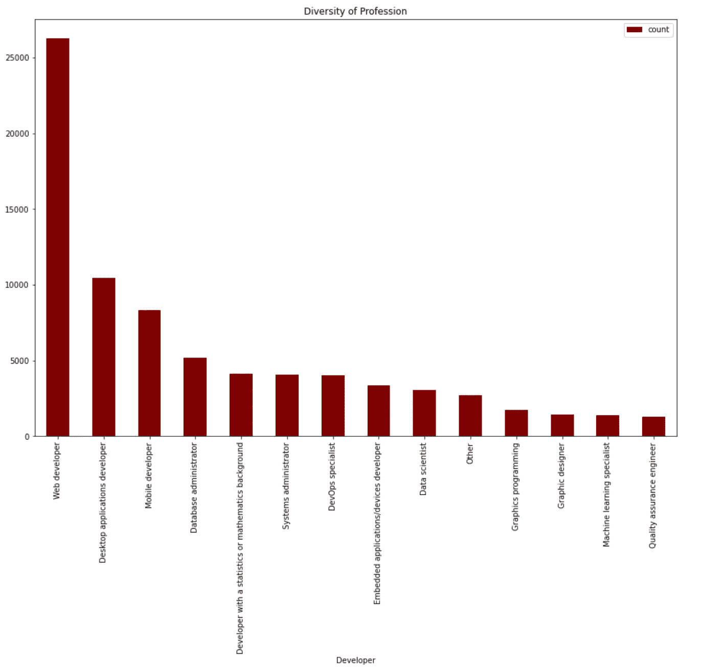
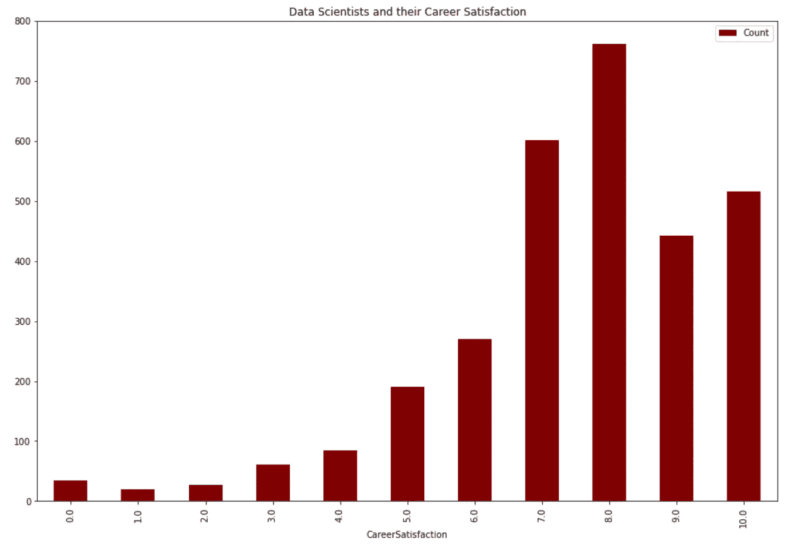
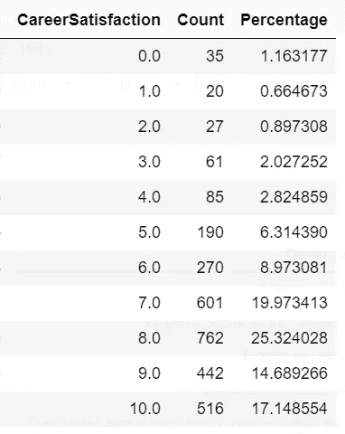
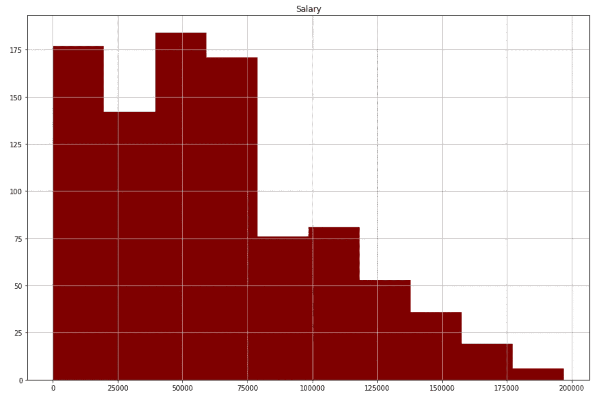
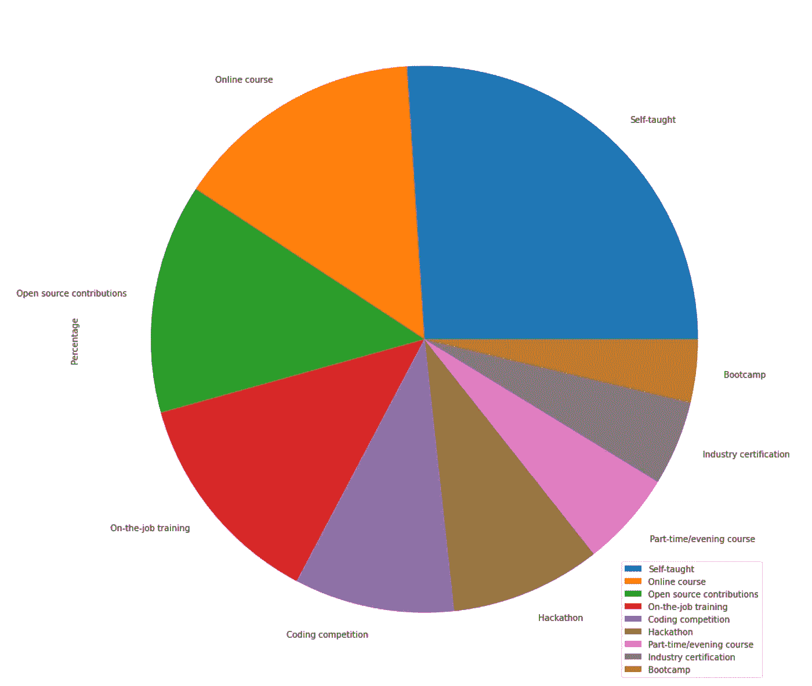

# 数据科学作为一项职业:对您有什么好处？

> 原文：<https://medium.com/mlearning-ai/data-science-as-a-career-whats-in-it-for-you-30c82c9b69?source=collection_archive---------3----------------------->

从我上大学的第一年起，我就一直听到关于数据科学的各种炒作，以及数据科学家有多酷。我从来没有真正理解炒作背后的真正原因，直到我大学的最后一年，当我开始学习它，并做了一些课程。我在大学选修了数据科学，还获得了一个以数据科学为导向的实习机会。没过多久，我就完全迷上了它。

由于这一概念的大肆宣传和流行，我的许多朋友和同事称自己为“数据科学发烧友”，但他们都不确定这是否是一条正确的职业道路。

这种炒作只是炒作吗？让我们今天就知道。

毫不奇怪，我们将为此使用数据科学。我们开始吧。

Source: Google Images

我使用了 Stack Overflow 2017 调查数据集进行分析。各行各业的开发商都参与了这项调查。它包含关于工作满意度、职业满意度、工资以及人们工作的框架、语言和数据库等方面的信息。我能够将所有提及的特征与同时也是数据科学家的调查受访者联系起来。

这篇文章将会回答以下几个问题

*   **数据科学家的工作/职业满意度是什么？**
*   **数据科学家的薪水是多少？**
*   **数据科学家通常使用哪些关键技术？**
*   **您能成为数据科学家吗？**

下表显示了参与堆栈溢出调查的不同开发人员的人数。

如上所示，数据科学家仅占参与调查的总人数的 3.94%。因此，尽管有各种各样的炒作，但数据科学家并不多。显然，这个行业有很大的发展空间。

在下面的条形图中，我们可以看到大多数数据科学家的职业满意度较高。

数据科学家的平均职业满意度为 7.5，相当不错。

77.13%的数据科学家的职业满意度为 7.0 或以上，这也相当不错。但是通过观察条形图和表格，很少有数据科学家的职业满意度较低。我们之前也观察到，只有 4%的调查受访者是数据科学家，这意味着低职业满意度肯定不是由于行业过饱和造成的。那么，原因可能是什么呢？

数据科学是一个很难进入的职业。成为其中一员所需的技能并不容易获得。它包含了如此广泛的工作角色，以至于一个人适合所有的角色似乎是不可能的。从研究、建模和管理到商业、分析和规划，数据是一切的支柱。因此，数据科学家有望在所有这些方面做出贡献。没有意识到这份工作在现实生活中有多困难的人，后来会屈服于它。下面的文章揭示了一个古老的问题，“数据科学难吗？”

> [https://towards data science . com/is-data-science-hard-20a 159 f1 E5 e 9](https://towardsdatascience.com/is-data-science-hard-20a159f1e5e9)

## **数据科学家一年挣多少钱？**

*(解决房间里的大象)*

从上面的直方图可以清楚地看出，大多数数据科学家的年薪都低于 75000 美元，数据科学家的平均年薪为 61137 美元。

通过进一步观察，20%的数据科学家年薪超过 10 万美元，有些人甚至年薪高达 20 万美元。

> 尽管金钱是任何工作标准的重要组成部分，不管是什么职业，如果这是你喜欢做的事情，那么薪水就无关紧要了。

## **如何成为数据科学家**

下面的饼图显示了人们如何成为数据科学家。

大多数数据科学家要么是自学(20%)，要么是通过在线课程学习(14%)。只有 5%的数据科学家通过一些行业认证了解到，3.7%通过 Bootcamp 了解到。

该数据极具启发性，因为它表明，要成为一名数据科学家，关键是自我激励。真正热爱任何研究领域的人能够比其他人取得更大的成就。如今网上有如此多令人惊叹的课程和学位，这对任何渴望不断学习新事物的人来说都足够了。这里有几门数据科学课程可以帮助你开始学习:-

 [## 在线学习成为数据科学家

### Nanodegree 计划通过行业专家设计的项目获得真实世界的数据科学经验。建立您的…

www.udacity.com](https://www.udacity.com/course/data-scientist-nanodegree--nd025) 

> [https://learn . data camp . com/career-tracks/data-scientist-with-python](https://learn.datacamp.com/career-tracks/data-scientist-with-python)
> 
> [https://learn . data camp . com/career-tracks/data-analyst-with-python](https://learn.datacamp.com/career-tracks/data-analyst-with-python)

# **你有这个能力吗？**

我做过一个基于栈溢出数据集的 Logistic 回归模型，预测你能不能成为数据科学家。

这里是 jupyter 笔记本的 github 链接

> [https://github . com/UtkarshRedd/uda city-Data-Scientist-nano degree/blob/main/Data % 20 Scientist % 20 prediction . ipynb](https://github.com/UtkarshRedd/Udacity-Data-Scientist-Nanodegree/blob/main/Data%20Scientist%20prediction.ipynb)

您可以随意下载和修改代码。

在将标签输入到 *data_df* 字典并运行下面的单元格时，模型将给出 0 或 1 的输出。1 代表数据科学家，0 代表非数据科学家。根据调查的统计数据，这只是一个实验，看看成为一名数据科学家真正需要什么。

## **结论**

*   数据科学是最抢手的工作之一，但也是最难进入的工作之一
*   在堆栈溢出调查中，只有 4%的受访者是数据科学家，这意味着该行业存在巨大的空间，市场远未饱和。
*   成为一名成功的数据科学家不同于仅仅是一名数据科学家。刚开始并不容易。但在成功获得所需的所有技能和经验后，数据科学可能是世界上最有回报的工作之一。

“数据科学是 21 世纪最性感的工作”，这是一些网上文章的老生常谈的标题。但是，尽管它被过度宣传，自从我开始了解它以来，我就被这个研究领域迷住了，我可以肯定地说，这不仅仅是炒作。这是最有趣的研究领域。

**Github 回购:** [此处](https://github.com/UtkarshRedd/Udacity-Data-Scientist-Nanodegree.git)

 [## Mlearning.ai 提交建议

### 如何成为 Mlearning.ai 上的作家

medium.com](/mlearning-ai/mlearning-ai-submission-suggestions-b51e2b130bfb)