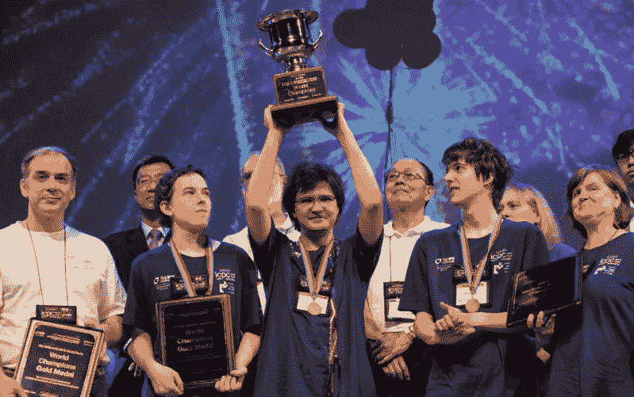
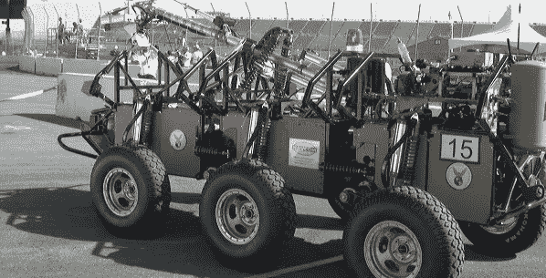
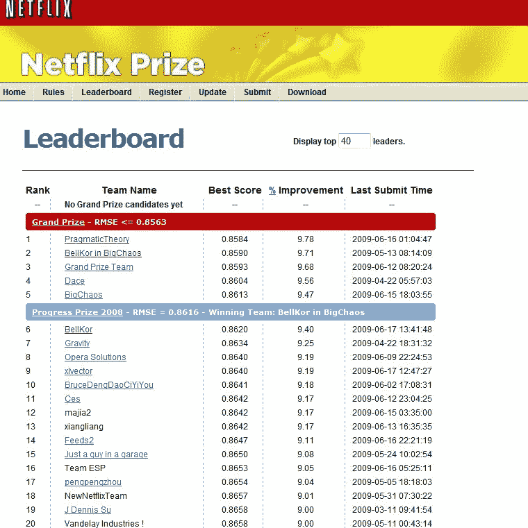
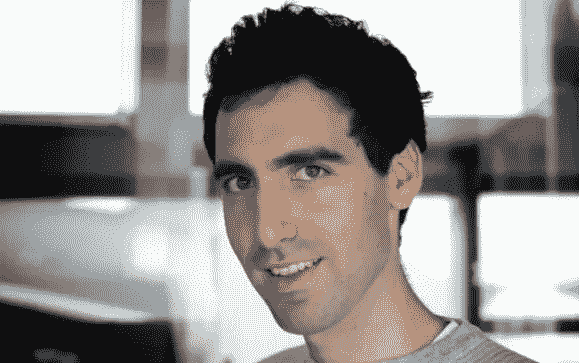
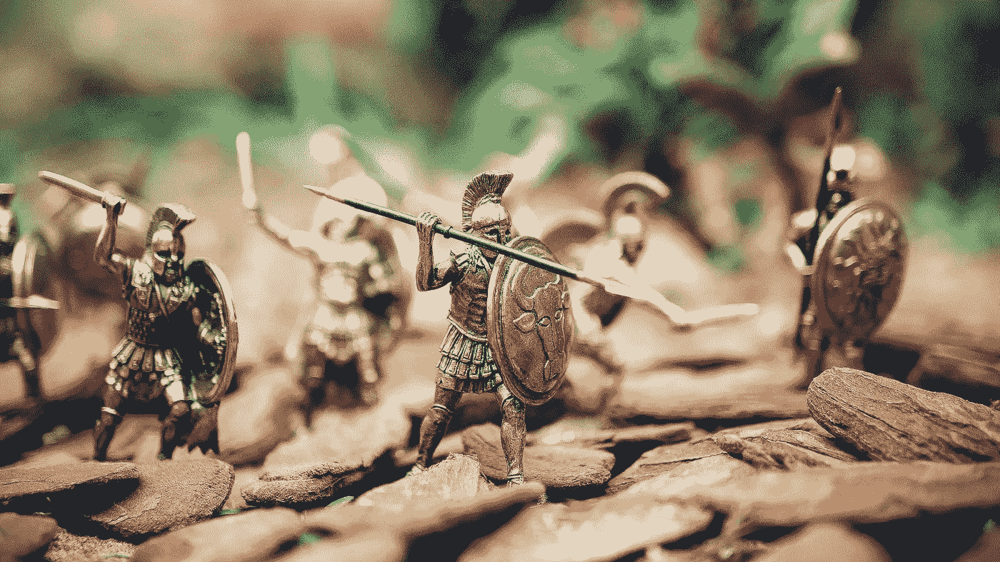
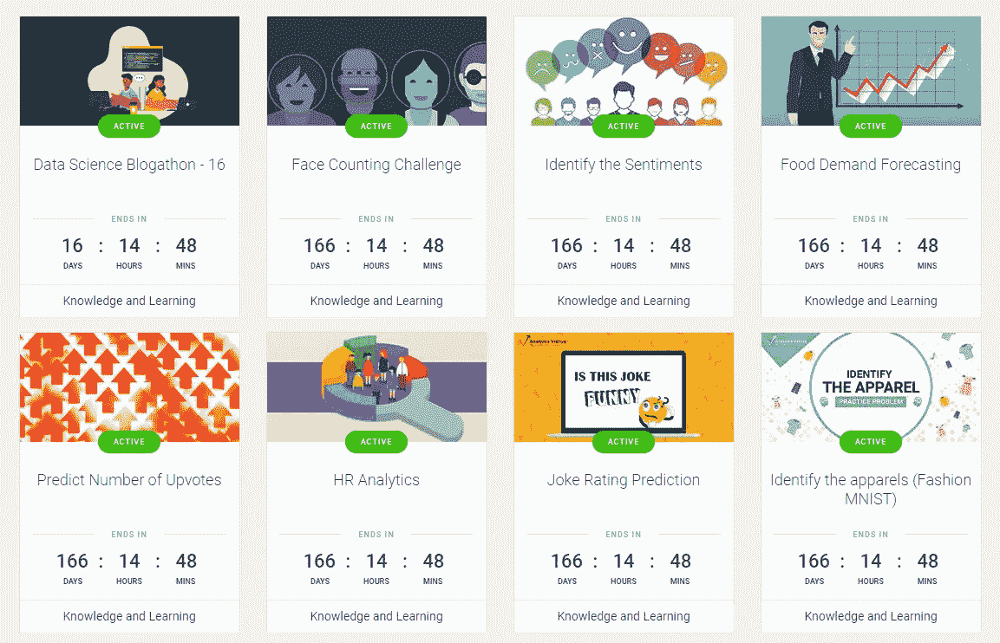
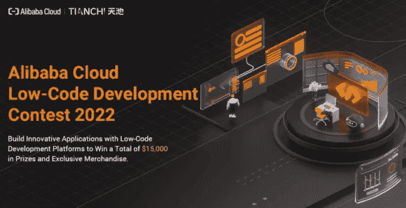

# 数据科学竞赛平台

> 原文：<https://medium.com/mlearning-ai/data-science-competitions-platforms-a9205e90daba?source=collection_archive---------7----------------------->

## Kaggle 之外的选择和机会

Photo by [NASA](https://unsplash.com/@nasa?utm_source=unsplash&utm_medium=referral&utm_content=creditCopyText) on [Unsplash](https://unsplash.com/s/photos/outer-space?utm_source=unsplash&utm_medium=referral&utm_content=creditCopyText)

Kaggle 是最著名的比赛平台，迄今为止已经举办了数百场比赛。

Kaggle 为他的许多参与者提供了创建自己公司的机会，推出机器学习软件和软件包，在[杂志](https://www.wired.com/story/solve-these-tough-data-problems-and-watch- job-offers-roll-in)上接受采访，在 Coursera 上安排[课程](https://www.coursera.org/learn/competitive-data-science)，编写机器学习书籍，最重要的是，了解更多关于数据科学的技能和技术细节。

然而，许多数据竞赛是在私人平台或其他竞赛平台上举行的。

在本文中，我们将简要介绍 Kaggle 和许多其他竞争平台。

## 数据科学竞赛简介

ICPC 2018 World Champions ( Image from [https://icpc.global/](https://icpc.global/))

竞争性编程始于 20 世纪 70 年代第一届 [ICPC](https://icpc.global/) “国际大学生编程竞赛”。

ICPC 是一项面向大学生的算法编程竞赛，三人一组，代表他们的大学，努力解决最现实的问题。

ICPC 之后，编程竞赛蓬勃发展，尤其是在 2000 年之后，远程参与变得更加可行，国际竞赛变得更加容易，成本也更低。

大多数竞赛的形式都是相似的，简单的说就是相同的:有一系列的问题，你必须编码一个解决方案来解决它们。获胜者可以获得奖品，也可以让招聘公司注意到自己，或者只是在同龄人中变得有名和受欢迎。

最近，与人工智能相关的问题也成功地出现了，特别是在推出了由计算机械协会(ACM)知识发现和数据挖掘特别兴趣小组(SIG)在其年会期间举办的知识发现和数据挖掘竞赛 [KDD 杯](https://www.kdd.org/kdd-cup)之后。

在政府方面，我们可以引用 [DARPA](https://www.darpa.mil/) Grand Challenge 及其在自动驾驶汽车、机器人操作、机器翻译、说话人识别、指纹识别、信息检索、OCR、自动目标识别等许多方面的许多竞赛。

DARPA autonomous vehicle technologies ( Image form [https://www.darpa.mil/about-us/timeline/-grand-challenge-for-autonomous-vehicles](https://www.darpa.mil/about-us/timeline/-grand-challenge-for-autonomous-vehicles) )

在商业方面，我们可以引用一家公司，如[网飞](https://www.netflix.com/)，它委托了一项比赛，以改善其预测用户电影选择的算法。

100 万美元的大奖只有在解决方案能够将现有的网飞算法 Cinematch 提高到某个阈值以上时才能分配。

$1,000,000 Netflix Prize ( Image from [https://www.wired.com/2012/04/netflix-prize-costs/](https://www.wired.com/2012/04/netflix-prize-costs/))

## 卡格尔

除了网飞，其他公司确实从数据科学竞赛中受益。其中很多比赛都是在 Kaggle 比赛平台上进行的。

Kaggle 在 2010 年 2 月迈出了第一步，这要归功于 Anthony Goldbloom 的想法，即建立一个竞争平台，可以众包解决有趣的机器学习问题的最佳分析专家。

Kaggle founder Anthony Goldbloom ( Image from [https://www.smh.com.au/technology/from-bondi-to-the-big-bucks-the-28yearold-whos-making-data-science-a-sport-20111104-1myq1.html](https://www.smh.com.au/technology/from-bondi-to-the-big-bucks-the-28yearold-whos-making-data-science-a-sport-20111104-1myq1.html) )

Kaggle 竞赛吸引了越来越多
观众的关注，甚至深度学习的教父 Geoffrey Hinton 也参加了(并赢得了)2012 年由默克公司主办的 [Kaggle 竞赛](https://www.kaggle.com/c/MerckActivity/overview/winners)。

Kaggle 也是 Francois Chollet 在 [Otto Group 产品分类挑战赛](https://www.kaggle.com/c/otto-group-product-classification- challenge/discussion/13632)期间推出其深度学习包 Keras 的平台，而陈天琦在 [Higgs Boson 机器学习挑战赛](https://www.kaggle.com/c/higgs- boson/discussion/10335)中推出了 XGBoost，一种更快、更准确的梯度增强机器版本。

一场接一场的竞争围绕 Kaggle 的社区在 2017 年增长到 100 万，同年，谷歌首席科学家费-李非在 Google Next 的主题演讲中宣布，谷歌 Alphabet
将收购 Kaggle。从那以后，Kaggle 成为了谷歌的一部分。

## 其他比赛平台

Photo by [Jaime Spaniol](https://unsplash.com/@jaimespaniol?utm_source=unsplash&utm_medium=referral&utm_content=creditCopyText) on [Unsplash](https://unsplash.com/s/photos/battle?utm_source=unsplash&utm_medium=referral&utm_content=creditCopyText)

许多其他数据竞赛在私人平台或其他竞赛平台上举行，它们基本上都在类似的原则下运行，参与者的利益或多或少与 Kaggle 的相同。

我们将简要介绍其中的一些:

*   **驱动数据**

[DrivenData](https://www.drivendata.co/blog/intro-to-machine-learning-social-impact/) 是致力于社会挑战的众包竞赛平台。

该公司本身是一家社会企业，其目标是将数据科学解决方案带给应对世界最大挑战的组织，这要归功于为社会公益构建算法的数据科学家。

例如，你可以在这篇[文章](https://www.engadget.com/facebook-ai-hate-speech- covid-19–160037191.html)中读到脸书是如何选择 DrivenData 作为其对抗仇恨言论和错误信息的建模竞赛。

*   **数字**

[numerali](https://numer.ai/)是一家总部位于旧金山的人工智能众包对冲基金，它每周举办一次锦标赛，在比赛中，你可以提交对对冲基金模糊数据的预测，并以公司的加密货币 Numeraire 赢得奖励。

*   **分析 Vidhya**

Competitions and events ( Image from [https://datahack.analyticsvidhya.com/](https://datahack.analyticsvidhya.com/))

[Analytics Vidhya](https://datahack.analyticsvidhya.com/) 是印度最大的数据科学社区，为数据科学黑客提供平台。

*   **CrowdAnalytix**

正如你从这篇[中型博客文章](https://towardsdatascience.com/how-i-won-top-five-in-a-deep-learning-competition-753c788cade1)中所读到的，CrowdAnalytix 是一个平台，不久前用于举办一些具有挑战性的比赛:

同样[社区博客](https://www.crowdanalytix.com/jq/communityBlog/listBlog.html)也很有趣，因为它让你知道在这个平台上你能找到什么样的挑战。

*   **签名**

[Signate](https://signate.jp/competitions) 是日本数据科学竞赛平台。它的竞赛项目非常丰富，并且提供了一个类似于 Kaggle 的排名系统。

*   **津迪**

[Zindi](https://zindi.africa/competitions) 是一个来自非洲的数据科学竞赛平台。它举办比赛，专注于解决非洲最紧迫的社会、经济和环境问题。

*   **阿里云**

Alibaba Cloud Low-Code Development Contest ( Image from [https://www.alibabacloud.com/developer/ai-forward](https://www.alibabacloud.com/developer/ai-forward) )

[阿里云](https://www.alibabacloud.com/campaign/tianchi- competitions)是一家中国云计算机和人工智能提供商，它发起了天池学术竞赛，与 SIGKDD、IJCAI-PRICAI 和 CVPR 等学术会议合作，并提出了基于图像的 3D 形状检索、3D 对象重建或实例分割等挑战。

*   **CodaLab**

相反，CodaLab 是一个总部位于法国的数据科学竞赛平台，由微软和斯坦福大学于 2013 年合资创建。他们有一个类似于 Kaggle 的[内核特性](https://worksheets.codalab.org/)，用于知识共享和可再生建模。

其他次要平台有:

*   瑞士洛桑联邦理工学院[**CrowdAI**](https://www.crowdai.org/)；
*   **；**
*   **[**生物医学成像大挑战**](https://grand-challenge.org/)；**
*   **[OpenML。](https://www.openml.org/)**

**你总能在俄罗斯社区[开放数据科学](https://ods.ai/competitions)上找到许多正在进行的重大比赛的列表，从而不时发现新的比赛平台。**

****

**Photo by [GR Stocks](https://unsplash.com/@grstocks?utm_source=unsplash&utm_medium=referral&utm_content=creditCopyText) on [Unsplash](https://unsplash.com/s/photos/battle?utm_source=unsplash&utm_medium=referral&utm_content=creditCopyText)**

## **结论**

**除了 Kaggle 之外的替代品和机会还挺多的。**

**如此丰富的机会有趣的一面是，你可以更容易地找到一个你更感兴趣的竞争，因为它的专业性和数据。**

**此外，预计这些挑战的竞争压力会更小，因为它们不太为人所知和宣传。预计参与者之间的分享会更少，因为到目前为止，没有其他竞争平台像 Kaggle 一样达到如此丰富的分享和网络工具。**

**本文到此为止，感谢阅读！您可以使用以下链接在 LinkedIn 上与我联系:**

*   **[https://www.linkedin.com/in/fernando-oliveira-2a42b51a4/](https://www.linkedin.com/in/fernando-oliveira-2a42b51a4/)**

****参考文献****

*   **k .巴纳切维奇；马萨龙湖；数据分析和机器学习与 Kaggle，Packt 出版，2021 年。**

** [## Mlearning.ai 提交建议

### 如何成为 Mlearning.ai 上的作家

medium.com](/mlearning-ai/mlearning-ai-submission-suggestions-b51e2b130bfb)**