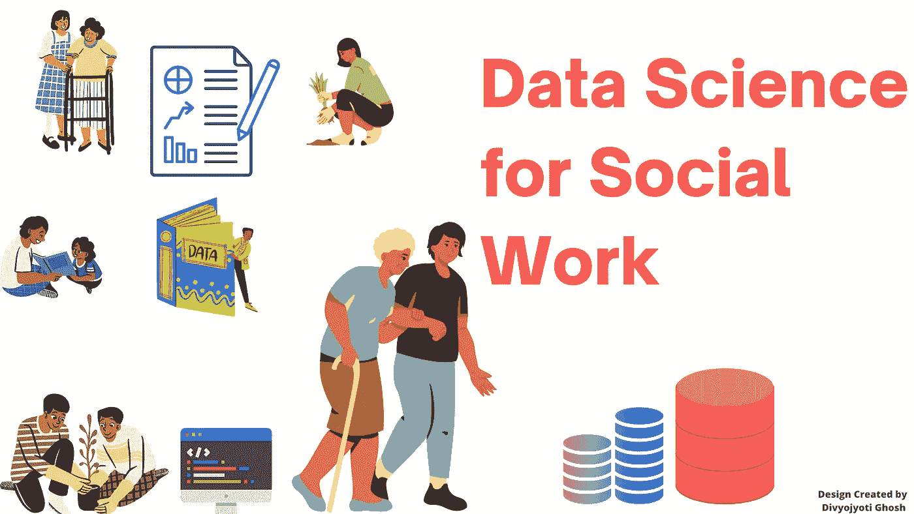

# 社会工作实践数据科学

> 原文：<https://medium.com/mlearning-ai/data-science-for-social-work-practice-628d747137ba?source=collection_archive---------4----------------------->

Image is created by Divyojyoti Ghosh(me) on [www.canva.com](http://www.canva.com/) using different elements available for making designs.

数据科学是一种通过探索和定量分析可用数据，从结构化和非结构化数据中发现或获取知识的工具。这些知识可以进一步用于做出基于证据的决策。作为数字世界中人类活动的副产品，每天都会产生大量的心理、社会和组织数据。这些数据通常被称为“大数据”，可以用来理解和解决社会中最困难的问题。数据科学和技术领域的进步使得管理和分析这些数据以获得更大利益成为可能。

## 社会部门的数据科学

许多部门，特别是商业部门，通过与数字革命同步前进并利用数据了解趋势和消费者行为及需求而受益，而社会部门仍然落后，没有充分融入大数据和数据科学的有效性。

在社会工作实践中，数据科学不仅可用于制定重要决策，还可用于创新沟通，例如，图表和其他可视化工具可用于讨论若干问题以及相关的因果关系。这些创新的交流技能可以进一步用于提高认识和筹集资金，以改善不同的社会状况。

## 数据科学方法

使用数据模型，尤其是机器学习模型进行预测，可以极大地支持分析的周期。机器学习算法使用数据来寻找其中的模式，并针对不同的问题规范提出规则和解决方案。它有助于理解假设的正确性。此外，机器学习模型通过经验自学提高性能，如果我们已经有了解决问题的好模型，这可以有效地为新数据做出更快更好的决策。

大量数据的可用性可用于了解世界不同地区人们的需求和必需品。政府政策可以使用机器学习模型提供的数据驱动的解决方案来制定，这使得政策有效，因为它们是使用强有力的数学和逻辑证据来制定的。世界的数字化每天都在产生大量的数据，进行情感分析可以减少调查的成本和工作量，从而做出任何重要的决策和政策。

## 相关著作

例如，[databank.worldbank.org](https://databank.worldbank.org/)包含各种社会话题的各种时间序列数据，分析这些数据有助于了解世界不同地区的不同问题。我记得，我做过一个有趣的项目，是关于分析预期寿命和理解一个国家的预期寿命对不同因素的依赖性。

芝加哥警察局创建了一份有卷入枪支暴力风险的年轻人的“热门名单”，这是利用数据科学进步解决社会问题的一个很大的例子。根据[的出版物](https://www.weirfoulds.com/the-perils-of-prediction-lessons-for-regulators-in-the-age-of-big-data)，“热门名单利用一种算法，根据一个人的犯罪历史来分配他的风险等级。”“你卷入枪支暴力的风险随着你的分数而增加。高分用户会收到一个“自定义通知”。“这需要警察、社会工作者和当地知名人士(如传教士或体育教练)进行家访。然后，他们向社会服务机构提供参考，以防客户希望在改善其生活方面得到帮助。

## 障碍

在处理数据时，需要注意数据安全性和数据所有权等问题。此外，大数据的监管非常繁琐，因为大数据是高度非结构化的，需要大量的时间和精力来创建有效的数据集。除此之外，对数字数据的依赖可能会忽略大问题，因为世界上有很多人面临着重大问题，但不会留下明显的数字足迹，特别是老年人和低收入和教育水平的人。

## 结论

大数据和数据科学有能力通过改变政府机构和非营利组织的决策方式来转变社会部门。此外，一个成功的社会部门可以加快发现新的社会进程和问题的速度，从而带来创造性和新颖的解决方案。因此，该行业将变得更加负责、透明和高效。

## 参考

1.  Cariceo，o .，Nair，m .和 Lytton，j .，2018。社会工作实践数据科学。*方法论的创新*， *11* (3)，p.2059799118814392
2.  Coulton，C.J .，Goerge，r .，Putnam-Hornstein，e .和 de Haan，b .，2015 年。利用大数据造福社会:社会工作面临的巨大挑战。*克利夫兰:美国社会工作和社会福利学会*，第 1-20 页
3.  [https://online masters . Ohio . edu/blog/how-is-big-data-helping-social-workers/](https://onlinemasters.ohio.edu/blog/how-is-big-data-helping-social-workers/)
4.  [https://www . weirfoulds . com/the-risks-of-prediction-lessons-for-regulators-in-the-age-of-big-data](https://www.weirfoulds.com/the-perils-of-prediction-lessons-for-regulators-in-the-age-of-big-data)

 [## Mlearning.ai 提交建议

### 如何成为 Mlearning.ai 上的作家

medium.com](/mlearning-ai/mlearning-ai-submission-suggestions-b51e2b130bfb)