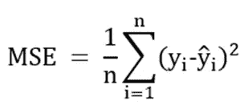
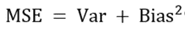

# 数据科学基础:解释偏差-方差权衡

> 原文：<https://medium.com/mlearning-ai/data-science-fundamentals-explaining-the-bias-variance-trade-off-5639fd21f485?source=collection_archive---------2----------------------->

作为一名数据科学家，在构建合适的模型时，您的目标是基于大量指标(特征)优化目标变量的预测。那么，我们如何判断这个优化呢？在机器学习中，目标是估计一个函数，使估计函数和真实函数之间的均方误差距离最小。这可以用下面的等式来表示:

其中:

*n 是预测的次数。*

*y_i 是实际目标值。*

*y_hat_i 是预测的目标值。*

*产生的错误*

对于任何机器学习模型，有两种影响 MSE 的误差需要考虑。

1.偏差误差——模型做出的假设，使目标值更容易学习。

2.方差误差-如果使用不同的训练数据，目标的估计值将改变的量。

实际上，我们可以使用 MSE 公式来证明这一点，该公式为:

然而，为了简单起见，本文并没有讨论这个证明。

*偏置误差*

线性和逻辑回归等较简单的算法有大量的简化假设。它们的吸引力在于方法的速度，但对于预测高维范围问题的性能，它们通常是较弱的预测器，因为它们在处理这些问题时具有较低的灵活性。

相比之下，支持向量机等更复杂的机器学习方法在解决更复杂的问题时具有更大的灵活性，通常能够更好地拟合数据。因此，它们具有较低的偏置误差。

*方差误差*

方差误差来源于如果使用不同的训练数据，目标的估计将改变的量。更复杂(通常是非线性的)的机器学习算法具有更高的方差，因为它们在精确求解特定数据集方面的灵活性意味着使用新数据集的更大影响。相比之下，不太复杂的解决方案在同样程度上没有这个问题。

*偏差-方差权衡*

因此，我们能从这里得出什么结论呢？很简单，作为一名数据科学家，你需要时刻记住这个问题，方差越小，偏差越大，反之亦然。由于我们不知道测试数据的答案，真正的偏差和误差永远不会清楚，尽管作为一名数据科学家，始终牢记权衡是至关重要的。