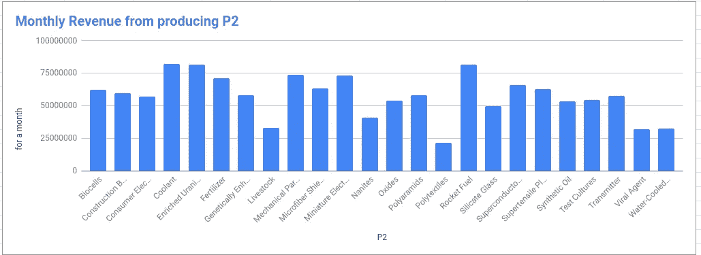
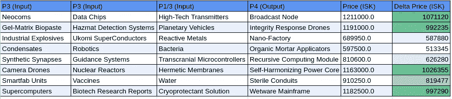

# Eve Online 中的数据科学

> 原文：<https://medium.com/mlearning-ai/data-science-in-eve-online-d6ae2d148ee1?source=collection_archive---------3----------------------->

**第一部分:浏览我的 google drive**

我在翻我的旧谷歌硬盘。当我看到一张谷歌表单时，我正在分析我应该生产哪些行星资源才能在 Eve Online 上获得最大利润。我用一点 JavaScript 创建了这些电子表格，以获取这些资源的实时价格。

因此，让我退后一步，解释一些背景，因为不是每个人都熟悉什么是在线前夕。Eve Online 是一艘 MMO 宇宙飞船，但老实说，它更像是太空经济学的模拟。

你可以在游戏中买卖各种资源，在不同的市场中你可以买卖。不同市场的价格不同，价格也不稳定。所以作为一个数据驱动型的人，我决定做一个谷歌表单来获取你可以收集的不同星球资源的价格。还要看看直接从市场上购买行星资源并进行加工是否值得(至少对 P2 来说不值得)。

**第二部分:谷歌表单的定制 JavaScript 函数**

只要你懂一些 JavaScript，获取相关价格的过程并不太难。下图是来自[https://developers . Google . com/apps-script/guides/sheets/functions](https://developers.google.com/apps-script/guides/sheets/functions)的一部分，它告诉你如何着手创建一个脚本。

这是您可以粘贴进去以获得特定商品 id 价格的代码，这就是每次加载时 google sheet 更新的方式。如果你需要对 JSON 进行更精细的控制，你也可以研究一下 https://blog.fastfedora.com/projects/import-json。

**第三部分:结论**

几年前，我甚至不知道什么是数据科学，但看着它，我可以看到它背后如此多的思维过程是由数据科学驱动的，但当时我没有正式学习它。因为很容易认为并非所有的数据科学都是关于制造机器学习模型的。它可以像一些谷歌表格或 excel 文件一样简单。

如果你想看的话，我会提供谷歌表单。启发你对如何玩游戏采取更具分析性的方法。

链接到 Google sheet:[https://docs . Google . com/spreadsheets/d/1 x7m i7j-_ yV5lq-yd 2 brae-t4QE _ a 4 ikv 2 zuc bsld 6 qu/edit？usp =共享](https://docs.google.com/spreadsheets/d/1X7mi7j-_yV5lq-Yd2BraE-t4QE_a4IKv2ZuCBSLD6QU/edit?usp=sharing)

 [## Mlearning.ai 提交建议

### 如何成为 Mlearning.ai 上的作家

medium.com](/mlearning-ai/mlearning-ai-submission-suggestions-b51e2b130bfb)