# 数据科学:机器学习模型度量

> 原文：<https://medium.com/mlearning-ai/data-science-machine-learning-models-metrics-77f9f77c2ff4?source=collection_archive---------6----------------------->

本文由[阿尔帕斯兰·梅斯里](https://medium.com/u/fe99f0a4a612?source=post_page-----26e90cc96349-----------------------------------)和[杰姆·özçeli̇k](https://medium.com/u/e7aec74cd6ed?source=post_page-----26e90cc96349-----------------------------------)撰写。

有一些指标用于衡量机器学习模型中建立的模型的性能，这些模型是数据科学世界的一部分。这些在分类和回归模型中的使用是不同的。在本文中，我们一起对用于衡量机器学习模型性能的指标进行了研究。

# 什么是混淆矩阵？

混淆矩阵是分类算法中使用的性能指标。这里将实际情况和建立的模型的结果进行比较，并放入表格中。混淆矩阵左侧的列表示实际状态，行表示建立的模型的预测结果(预测)。

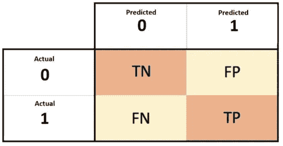

Confusion Matrix

让我们用一个例子来解释这种情况，让我们假设我们正在估计 RMS 泰坦尼克号上死亡和幸存的乘客的健康状况。表格第一行中的实际 0 行显示了在实际事故中任何乘客是活着还是死了。同样，对应于实际 1 的行代表实际幸存的乘客。具有表达式预测 0 的表的列表示建立的模型预测机上的乘客已经死亡。同样，预测的 1 列表示旅行者的存活率。在我们建立的模型中，我们预测幸存的乘客可能已经死亡，或者我们预测幸存的乘客可能已经死亡。

我们已经解释了表格的行和列所代表的情况。现在，我们来解释一下同样在图像中看到的同义词 TN、FP、FN、TP 是什么。

TN(真负值):真负值是我们在建立的模型中正确预测到在事故中失去生命的乘客也失去生命的值。

FP(假阳性):假阳性值是在模型中预测在事故中丧生的乘客将在事故中幸存的值。

FN(假阴性):假阴性值表示坠机事件中幸存的乘客人数和模型中预测死亡的乘客人数。

TP(真正):这个混淆矩阵的同义词是在模型中正确预测事故中幸存的乘客也将在坠机中幸存的乘客人数。

分类问题可以表现为二元或多元分类问题。如果我们正在处理的问题是二进制形式的(死亡——生存),就像泰坦尼克号问题一样，那么上面的混淆矩阵就足够了。在多类问题中，比如在一个足球联赛中确定冠军球队的时候，会有很多类。在这种情况下，有必要增加混淆矩阵。

我们学习了混淆矩阵的基础知识。现在让我们给出一些指标的信息。这些指标包括精确度、召回率和准确度。

# 准确(性)

这是一个广泛使用的衡量模型成功程度的标准。它表示正确分类的样本数(TP+TN)与样本总数的比率。

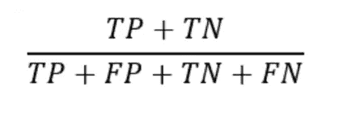

Accuracy Score Formula

让我们继续我们的泰坦尼克号的例子。在我们使用的数据集中，我们看到 RMS 泰坦尼克号上有 1470 名乘客。让我们假设 1470 名乘客的情况如下:

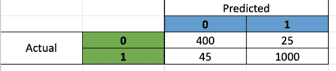

Confusion Matrix

我们根据上面的混淆矩阵图建立的二元分类模型的精度值:

准确度:(400+1000) / (400+1000+45+25) = 95%

可以看出，根据命中得分指标，我们可以以 95%的准确率预测谁在我们的泰坦尼克号模型坠毁中幸存，谁失去了生命。

我们将从一个不同的例子出发来解释另一个性能指标，precision metric，它显示了我们模型的精度。

# 精确

例如，假设你在银行工作。假设我们收到各种客户向我们银行提交的贷款申请。在这种情况下，我们假设我们正在努力防止不良贷款，以防止我们银行的准备金可能发生的财务损失。我们这里说的不良贷款是给任何客户的贷款没有偿还给我行的情况。

我们建立一个模型来预测谁不还贷款，谁还。在这种情况下:

TP:客户没有还款，我们预测客户不会还款。

FP:客户付了钱，但是我们预测客户不会付。

我们之所以在这个场景中使用精准而不是准确，是考虑到我们的银行对不良贷款可能产生的损失很敏感，给正确的客户授信而不是给很多人授信，会在很大程度上防止我们可能的损失。在这种情况下，我们使用精度指标来确保我们向正确的客户提供信贷。

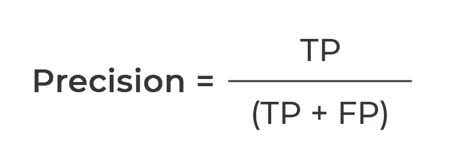

Precision Formula

何时使用此指标:在 FP 的高成本中表现良好。在我们的例子中，如果不良贷款成本对银行来说非常重要，并且我们从贷款中获得的利润非常低，那么应该使用精确度作为衡量标准。

让我们假设，我们的模型预测我们的 30 个贷款申请客户将不会偿还他们的贷款。为了测试这个模型，我们给这 30 个客户加载，其中只有 10 个没有支付贷款。在这种情况下，我们模型的精度数计算如下:

10 / 10 + 20 = 33%

# 回忆

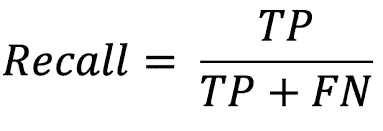

Recall Formula

何时使用此指标:在高成本的 FN 中表现良好。例如，假设你建立了一个模型来预测谁患了癌症，谁没患。在这种情况下:

TP:这个人得了癌症，我们预测他会得。

FN:这个人患有癌症，但我们预测他没有。

在这种情况下，我们的 FP 成本相对来说不是很高。对一个没有患癌症的病人说“你得了癌症”并没有那么糟糕。但是，对一个病人说“你没有患癌症”，而实际上，他已经患了，这是一个更昂贵的预测。

# F1 分数

正如我们基于给出的示例所解释的，我们在评估模型性能时使用的两个重要的性能指标，召回率和精确度，为我们提供了不同主题的性能优势，但是它们彼此以相反的方式运行。为了避免这种复杂性，我们可以使用 F1 分数作为另一个性能指标。

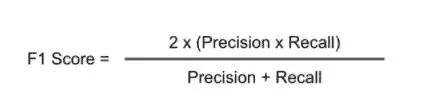

F1 Score Formula

在所建立的惩罚 FP 和 FN 情形的模型中，取实正值比率(召回)和精确-精确调和平均值(精确),这两种情形被表征为 F1-score 工作逻辑的极端情形。这个标准是对我们所建立的分类模型的执行情况的度量，并且经常用于比较分类模型。

# ROC 曲线(受试者工作特性曲线)

ROC 曲线是评估分类问题中建立的模型的性能时广泛使用的方法。虽然它在理论上很复杂，但总结一下，它实际上是基于两个简单的指标计算的度量。

**TPR(真阳性率):****真阳性率**是召回的同义词，我们前面讨论过。它可以由这个公式给出:

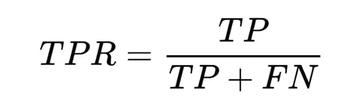

True Positive Rate Formula

**FPR(假阳性率):**假阳性率计算如下:

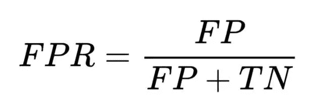

False Positive Rate Formula

计算完这两个指标后，我们得到一个图形图像，以 TPR x 轴和 FPR y 轴表示，并计算线下的面积。这也称为 AUC 曲线(曲线下面积)。

ROC Curve

当在已建立的分类模型中进行随机分类时，线下的面积变为 0.5，如上图中的红线所示。当在已建立的分类模型中进行随机分类时，线下的面积变为 0.5，如上图中的红线所示。在 ROC 曲线上建立的代表模型的 TPR / FPR 比率的线下面积越大，模型的成功率越高。总之，模型中的 F1 分数值越大，代表该模型的线下区域就越大。从上图可以看出，我们可以说蓝色曲线下的面积大于橙色线，所以是一款性能更好的车型。

在回归模型中，独立变量 Y 是用许多因变量 X 来估计的。这里使用的模型得到的结果可能不完全符合现实，否则我们会得到错误的结果。所以这方面要问的第一个问题就是得出的错误结果有多错误。换句话说，得到的结果和现实有多大的距离？在前面的章节中，我们已经描述了描述为分类问题建立的机器学习模型的性能的指标。在本节中，我们将解释显示回归模型的性能标准的指标，因为它通常在文献中使用，或称为“回归”模型。

# R 平方和调整后的 R 平方:

回归模型中使用的 R 平方准则显示了我们用来获得模型中因变量的自变量 X 的因变量上的变化或变异有多少可以用建立的回归模型来解释。

R 平方测度是相关系数的平方，R 平方在不考虑“过拟合”问题的情况下完成工作，我们称之为过学习。建立的回归模型中自变量过多，可能导致模型数据与训练数据高度一致。然而，已建立的高度兼容的模型在测试阶段可能不会取得同样的成功。在这种情况下，我们可以应用 R 平方方法。另一方面，调整后的 R 平方通过向建立的模型添加额外的独立变量来惩罚变量，并防止过度拟合。
我们可以计算 R 平方和调整后的 R 平方方法，如下所示:

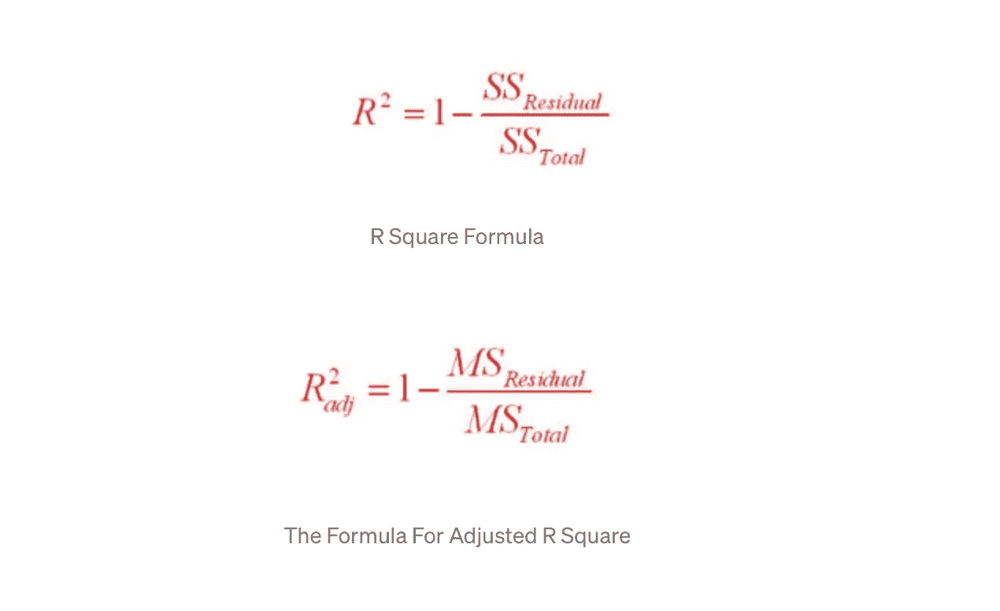

# 均方差(MSE):

在计算了 R 平方准则之后，让我们考虑我们的回归模型的另一个性能准则，即“均方误差”。

均方误差是显示从建立的回归模型获得的结果与真实值有多大差异的标准。我们不太可能仅从一个结果中推断出太多，因此比较不同模型的平均 R 平方值有助于我们获得最佳回归模型。

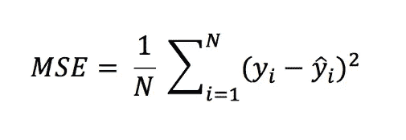

The Formula For Mean Squared Error

# 均方根误差(RMSE)

均方根误差是我们在上一节中解释的均方误差值的平方根。与 MSE 相比，研究中发现了更多的 RMSE，因为有时 MSE 值可以产生无法与其他模型进行比较的值。在这种情况下，使用 RMSE。然而，MSE 对遇到异常值的情况很敏感，也称为异常值。

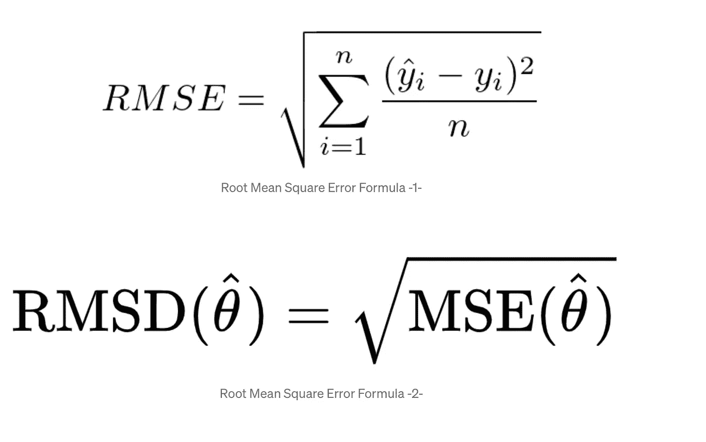

感谢您的阅读。我们下一篇文章再见。

参考文献→

 [## veri Bilimi sn fland RMA Model ktlarn deerlendiren metri kler(混淆矩阵，精确度…

### 韦里·比利米·格泽蒂姆利(监督)

yigitsener.medium.com](https://yigitsener.medium.com/veri-bilimi-s%C4%B1n%C4%B1fland%C4%B1rma-model-%C3%A7%C4%B1kt%C4%B1lar%C4%B1n%C4%B1-de%C4%9Ferlendiren-metrikler-confusion-matrix-accuracy-437f5633c82b) 

[https://medium . com/forward-data-science/top-data-science-business-metrics-c7ae 905 c 076 a](/towards-data-science/top-data-science-business-metrics-c7ae905c076a)

 [## 了解 Scikit 中的数据科学分类指标-了解 Python

### 在本教程中，我们将浏览 Python 的 scikit 中的一些分类指标——学习并编写我们自己的…

towardsdatascience.com](https://towardsdatascience.com/understanding-data-science-classification-metrics-in-scikit-learn-in-python-3bc336865019)  [## 面向所有人的数据科学性能指标

### 准确性、召回率、精确度、灵敏度、特异性……—数据科学家使用如此多的性能指标！你怎么…

towardsdatascience.com](https://towardsdatascience.com/data-science-performance-metrics-for-everyone-4d68f4859eef) 

[Python ile Veri bili mi | il ker ars LAN 博士，Pusula Yayı nevi，4 岁。巴斯克 2021](https://books.google.com.tr/books/about/Python_ile_Veri_Bilimi.html?id=OKDbDwAAQBAJ&printsec=frontcover&source=kp_read_button&hl=tr&redir_esc=y#v=onepage&q&f=false)

 [## Mlearning.ai 提交建议

### 如何成为 Mlearning.ai 上的作家

medium.com](/mlearning-ai/mlearning-ai-submission-suggestions-b51e2b130bfb)