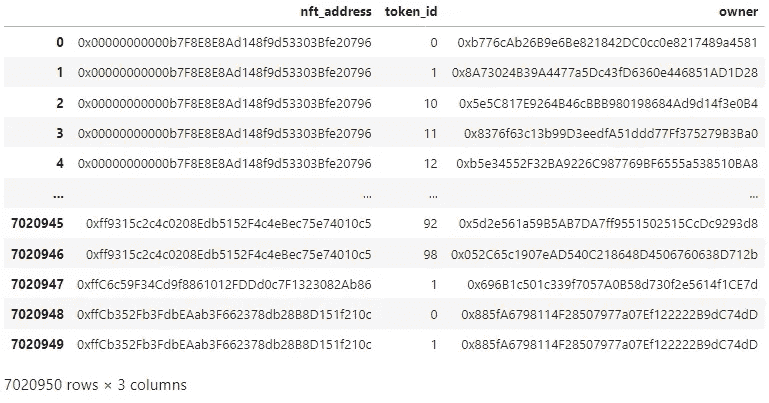
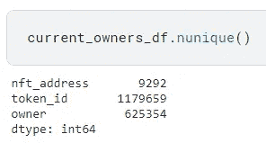
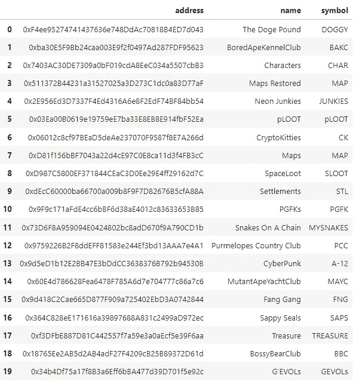
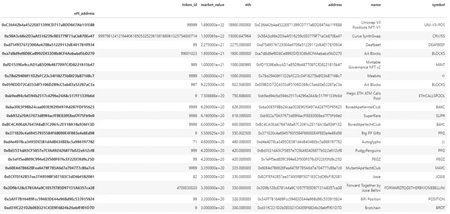
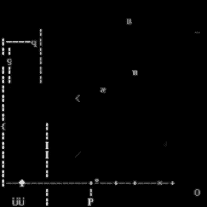
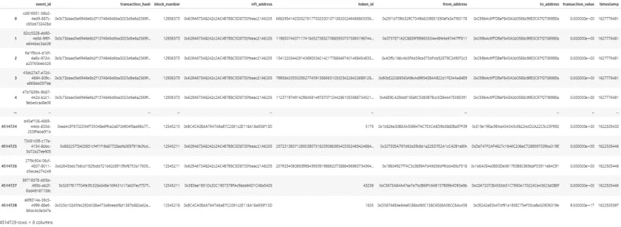
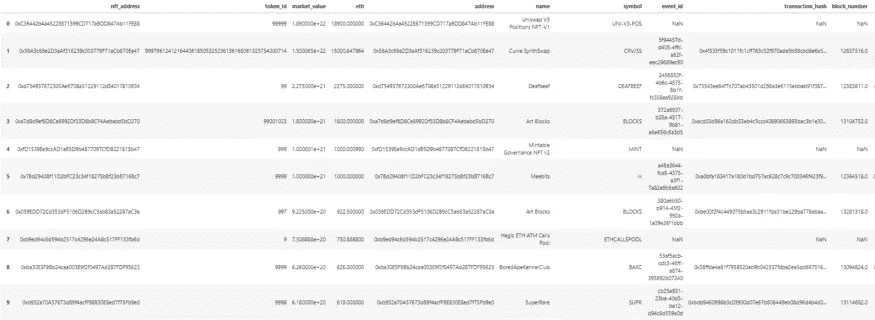

# 数据科学项目:以太坊 NFT 分析第一部分

> 原文：<https://medium.com/mlearning-ai/data-science-project-ethereum-nft-analysis-part-i-bb06c13d637a?source=collection_archive---------5----------------------->

Photo by [Dylan Calluy](https://unsplash.com/@dylancalluy?utm_source=unsplash&utm_medium=referral&utm_content=creditCopyText) on [Unsplash](https://unsplash.com/s/photos/nft?utm_source=unsplash&utm_medium=referral&utm_content=creditCopyText)

这篇文章是由 [Ugur Ziya Cifci](https://medium.com/u/affd2737694a?source=post_page-----bb06c13d637a--------------------------------) 和 [Alparslan Mesri](https://medium.com/u/fe99f0a4a612?source=post_page-----bb06c13d637a--------------------------------) 撰写的。

在本研究中，对以太坊 NFT 数据进行了 EDA。这项研究也为其他研究人员进行快速实用的研究提供了示范文件。

数据集开始日期:2021 年 4 月 1 日

数据集结束日期:2021 年 9 月 25 日

从[链接](https://www.kaggle.com/code/ugurzcifci/nft-v3)可以到达相关笔记本。你可以通过[这个链接](https://www.kaggle.com/datasets/simiotic/ethereum-nfts)访问数据库。

该数据集是使用 Moonstream 收集的。感谢 Moonstream 开源研究。SQLite 用于存储数据。该数据集主要基于链上 NFT 交易。此外，还创建了几个派生表，以便于分析数据。

这项研究是在 Kaggle 笔记本上完成的。与我们在其他文章中使用的 jupyter 环境不同，本文中使用 Kaggle 环境是因为数据集非常大。Kaggle 工作环境中加载的数据可以快速转移到笔记本上。这个数据集大约是 20GB。

首先，我们加载 Moonstream 创建的 nfts 库。然后我们导入必要的库。为了让这个笔记本在 Kaggle 虚拟设备上运行，我们定义了 Kaggle 目录的地址。

然后，我们首先定义了数据库的地址——多亏了 nfts 库——我们将数据库转移到了 ds 变量。

在这个代码块中，我们访问了当前所有者表。如您所见，eth 链中大约有 700 万个 NFT。

该表中有 9292 个 NFT 项目。这些项目属于 625354 个不同的地址，有 1179659 个 NFT。应该记住，一个人可以有不止一个钱包。

通过这段代码，我们访问了 NFT 名称，这是另一个表，我们在表的前 20 行显示了 NFT。

NFTs 的值用 wei 表示。我们建立了一个新的乙醚柱，发现了魏的乙醚当量。

下一步，我们需要将表与 NFT 地址和 NFT 地址名称合并。因此，我们可以看到非专利技术的市场价值。

然后使用 groupby 函数在 NFT 项目的基础上对合并后的表进行分组。我们打印了表格的前 20 行，其中包含每个项目中最昂贵的 NFT 交易。例如，Deafbeef 在最昂贵的 NFT 列表中排名第三。其值约为 2275 eth。

DEAFBEEF Series 1: Angular / 2275 Ether

稍后，我们将执行一些操作来查看 NFTs 的内容。首先，我们从数据库中加载“transfers”数据集。

然后我们合并了 df_search20 和 df_transfers 表。我们删除了重复的行并刷新了索引。

因此，我们能够获得关于非功能性测试的更详细的信息，并从那里获得视觉效果。在 NFT 列表中，每个产品都没有视觉上的对应关系，首先是 uni-v3-pos 产品。但是这个列表中的一些图像如下:

Ringers — Art Blocks / 1800 Ether

Meebits / 1000 Ether

在本文中，我们简要回答了如何访问 Moonstream 数据库，如何在不将整个数据库从 Kaggle 下载到您的计算机的情况下进行处理，以及如何从数据库的不同表中访问数据等问题。同时，我们希望我们的研究已经为读者提供了初步的信息，告诉他们可以用这个数据库中的信息进行什么样的分析。下一篇文章再见。

您可以通过以下方式联系我们:
Ugur Ziya Cifci:[https://www.linkedin.com/in/ugur-ziya-cifci/](https://www.linkedin.com/in/ugur-ziya-cifci/)

阿尔帕斯兰·梅斯里:[https://www.linkedin.com/in/alparslan-mesri-063473106/](https://www.linkedin.com/in/alparslan-mesri-063473106/)

 [## Mlearning.ai 提交建议

### 如何成为 Mlearning.ai 上的作家

medium.com](/mlearning-ai/mlearning-ai-submission-suggestions-b51e2b130bfb)