# 数据科学项目:预测手术量

> 原文：<https://medium.com/mlearning-ai/data-science-project-predicting-the-amount-of-surgery-8186fddd459b?source=collection_archive---------4----------------------->

本文由[阿尔帕斯兰·梅斯里](https://medium.com/u/fe99f0a4a612?source=post_page-----8186fddd459b--------------------------------) & [杰姆·özçeli̇k](https://medium.com/u/e7aec74cd6ed?source=post_page-----8186fddd459b--------------------------------)撰写。

Photograph via: Pexel, Vidal Balielo Jr.

对于一个卫生机构来说，非常重要的一点是，到这个机构就诊的病人离开这个卫生机构时感到满意。另一方面，到保健机构就诊的病人离开时感到满意，他们接受的服务、保健机构雇员的积极态度、保健机构的设备为来访者提供的设施等。它由各种参数提供，例如，同时，除了向来访者提供这些机会之外，卫生机构还可以在各个领域采取措施，以便为一个以上的患者或来访者服务，并为处于顾客地位的患者提供最佳服务。例如，正确规划给患者的预约、处理患者的时间、需要手术的患者的术后护理服务的预防措施和准备将增加患者的满意度。

在我们的研究中，我们关注了一个问题，以防止术后过程中的规划所引起的中断，从而确保需要在医院进行手术的患者的满意度。在这种情况下，“应该在手术前几天告知病人手术日期？”我们去问。因此，有了这个问题的答案，当病人在规划自己的生活时，医疗机构的管理人员将能够作出自己的规划，以便病人在术后期间能够得到最好的服务。

在这篇文章中，我们对医疗机构进行的手术进行了样本数据集研究，提前多少天给出手术日期是合适的，以便医疗机构可以为这些患者提供最好的服务？人们试图找到这个问题的答案。

我们在研究中使用的数据集将在研究结束时共享。事不宜迟，让我们开始工作吧。让我们首先从导入我们的库开始。

接下来，我们导入数据集。

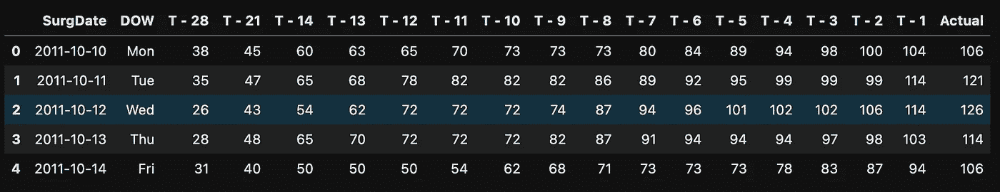

Overview of the dataset

看一下数据集的描述性统计。

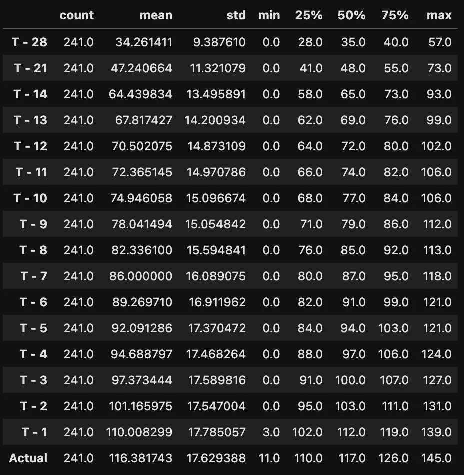

Descriptive Statistics

可以看出，我们的数据集包括 Actual(在操作日期执行的操作数)和在名为 Actual 的时间点之前 28 天的操作数。数据集中的值是累积增加的。

这里，我们的下一步将是查看日期之间的自相关值。由于我们所考虑的问题可以认为是一个时间序列问题，我们将使用自相关值来寻找一个时间单位内发生的事件与前一个时间单位内发生的事件之间的联系。为了给出关于自相关值的简要信息，今天之前的一天和今天之间的自相关总是被认为是~1.00，并且从今天起相关性将逐渐降低。

现在，通过对一周中的各天进行汇总，一周中的各天与医疗机构进行的手术之间是否有联系？来回答一下你的问题。在这里，我们根据时区 T-1 进行了聚合，该时区与实际值的自相关最高。

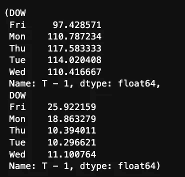

Mean & Std. Dev by DOW

此图中的前 5 行显示平均值，接下来的 5 行显示标准差。

现在我们已经看到了数据集的统计值，让我们通过数据可视化来获得关于数据集和我们正在处理的问题的更多描述性信息。

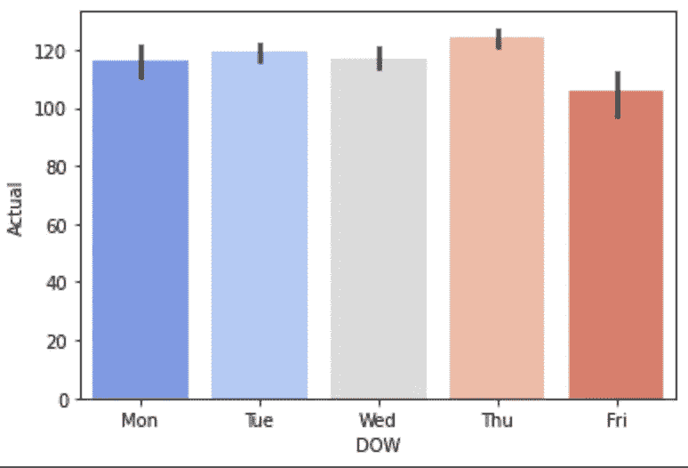

Distribution by DOW

可以看出，大多数手术是在一周的周四进行的。最少的手术发生在星期五。让我们来看看使用箱线图进行的手术数量的平均差异。

上面这段代码的输出如下图所示。

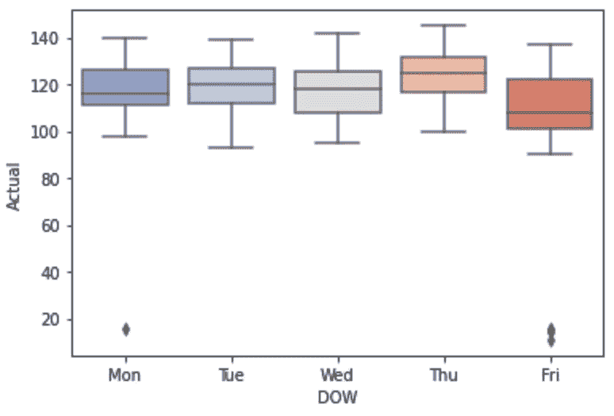

我们看到，通过查看一周中每天进行的手术数量，我们可以得出结论，平均值之间存在差异。由于星期五和星期一是一周的结束日和开始日，我们可以认为这两天的噪音水平更高。

在可视化数据集的变量之后，让我们对数据集中的数值变量执行异常测试。为此，我们将使用单向 ANOVA 检验。

作为这段代码的输出，我们得到了下面的图像。

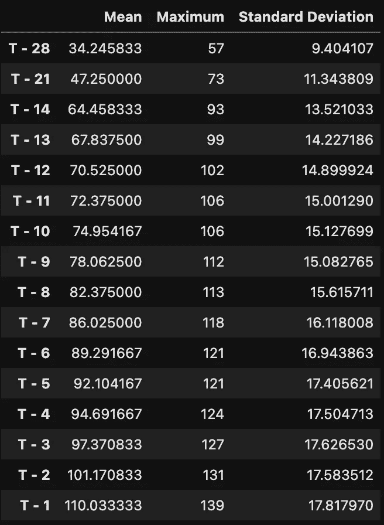

Statistical Informations By Timestamp

由于我们检查了表中数据集中名为 **T-x*** 的变量的平均值和标准差，我们可以执行我们的 **ANOVA** 测试。在进行我们的**方差分析**测试之前，让我们建立我们的替代假设，我们称之为 **H0** 和 **H1** :

**H0** :手术总数不会因星期几而有所不同。
**H1(替代假设):**手术总数根据一周中的某一天而变化。

我们执行的 **ANOVA** 测试的结果表如下。在表格下方，您可以看到 **ANOVA** 测试的结果。

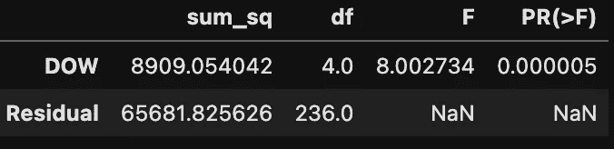

Results of One-Way ANOVA Test

*   通过查看方差分析测试的结果，**我们在 99%的置信度下拒绝了 H0 假设** <我们看到测试结果的 P 值为< 0.05 >
*   查看测试结果，我们可以清楚地说:T **这里是一周中各天之间的明显差异。**

在这个阶段之后，我们使用 **TUKEY** 测试来测试在一周中的某一天执行的操作数量与结合它的另一个工作日执行的操作数量之间是否存在显著差异。

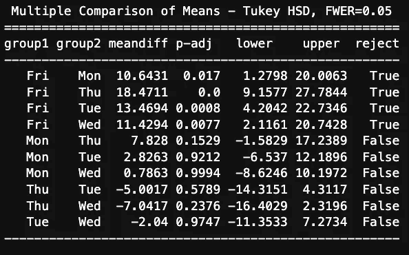

Result Of TUKEY Test

TUKEY 测试结果向我们显示，在任何工作日执行的操作数量与在另一周执行的操作数量之间存在差异。

现在，“**在手术前几天，我们可以给来医院做手术的病人最合适的手术预约？**“我们将建立一个线性回归模型来寻找问题的答案。

首先，我们澄清将在数据集上构建的模型的参数:

*   线性回归模型中使用的因变量是“**实际**变量。我们的参数都是列 **T-1** 到 **T-28** 。

我们已经知道我们正在处理的业务问题。而我们通过获得与实际变量相关性最高的时间单位，达到我们想要达到的结果。我们可以继续构建我们的模型。

我们在建立模型时注意的一点是，我们需要从数据集中清除数据集的离群部分。(我们在方框图中看到了异常值)

然后让我们开始建立我们的模型。

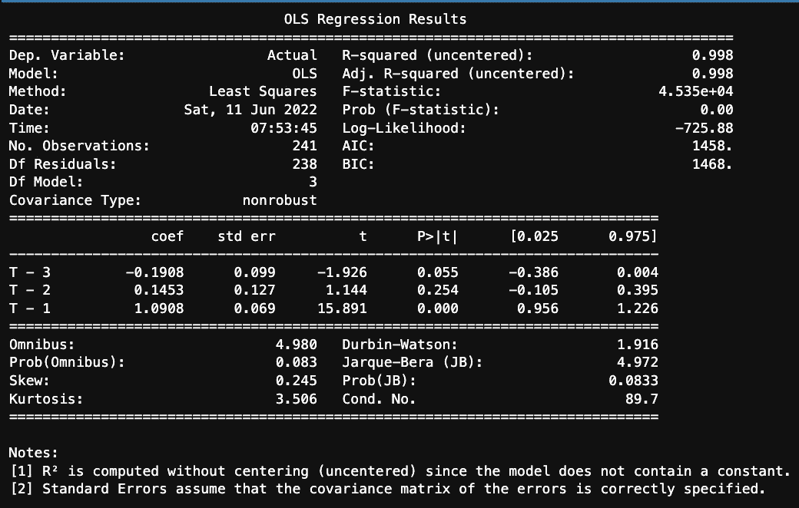

The Table Of OLS

通过查看 OLS 表，我们可以推导出回归模型的方程:

**实际=(T-1)* 1.0908+(T-2)* 0.1453+(T-3)*(-0.1908)+0 ***

* **注**:由于模型不含常数，std。我们得到了零误差量。

我们适合模型:

拟合模型的输出图像如下。

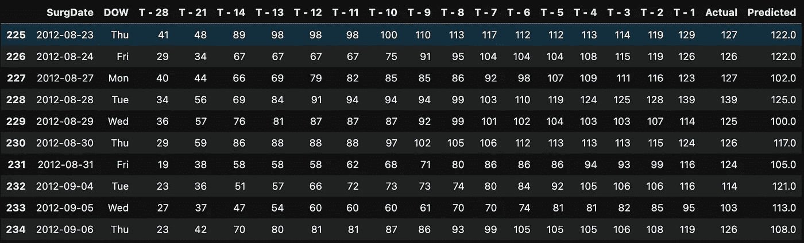

Result of Fitted Regression Model

我们计算其他性能指标、RMS、RMSE 和其他适合我们的模型的回归模型指标。

我们建立了 T-1、T-2、T-3 时间点的模型，并获得了性能指标。现在，我们再次建立一个模型，以便找到手术日期前 3 天进行的手术与现实之间的兼容性。

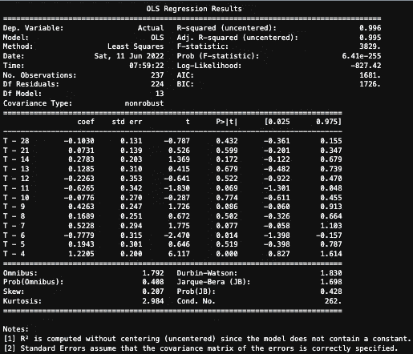

OLS Table for Predicting Model for 3 days before the Surgery Date

我们建立了预测手术日期前 3 天进行的手术数量的模型，并获得了性能指标。为了找到手术日期前 7 天执行的手术与现实之间的兼容性，在此步骤之后，我们通过重新建立模型来找出哪个预约日期是医疗机构最合适的时间段。

我们在运行日期前 7 天建立了模型，并获得了与模型性能相关的输出。现在，我们比较已建立的模型，以便明确决定最合适的手术预约日期。

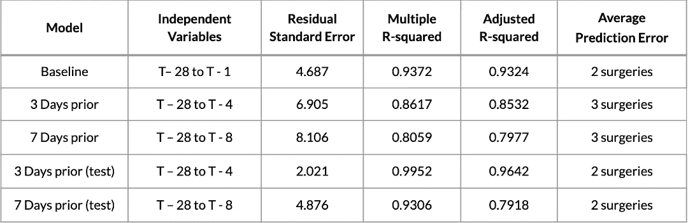

Comparison of the models

考虑到这个表，我们可以说:

*   数据集中检查的卫生机构可以准确地确定手术日之前 3 天的手术预期，估计误差最小。
*   从技术上讲，我们获得的结果是最近 3 天中与手术日期相关性最高的一天。手术预约可以在手术前 3 天看情况给。

我们得到了我们的结果，最后，我们看看我们建立的模型如何遵循时间序列图中的模式。

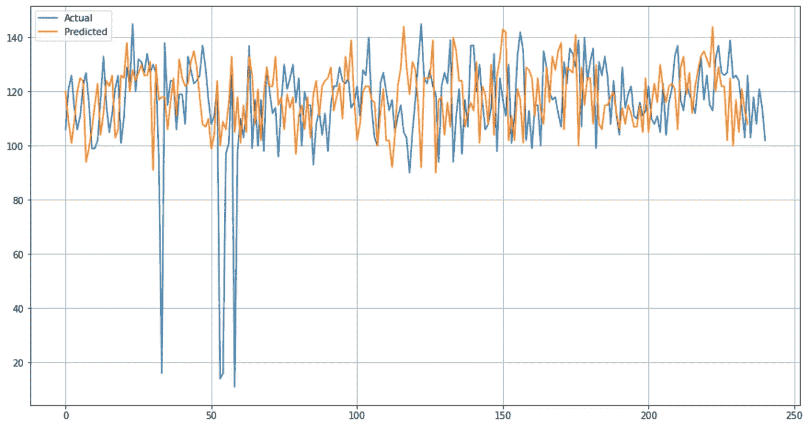

The overlook’s of prediction model

我们已经完成了我们的工作。我希望这对你来说是一次愉快的阅读课。我们下一篇文章再见。

数据集源:

 [## GitHub-rashidesai 24/Vanderbilt-大学-医学中心-选修-外科-时间表

### 此时您不能执行该操作。您已使用另一个标签页或窗口登录。您已在另一个选项卡中注销，或者…

github.com](https://github.com/rashidesai24/Vanderbilt-University-Medical-Center-Elective-Surgery-Schedule)  [## Mlearning.ai 提交建议

### 如何成为 Mlearning.ai 上的作家

medium.com](/mlearning-ai/mlearning-ai-submission-suggestions-b51e2b130bfb)