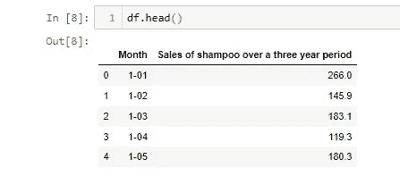
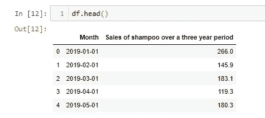
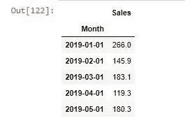
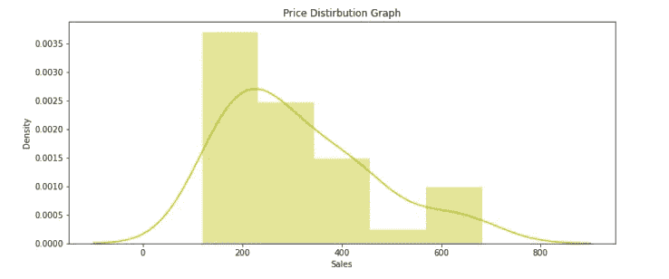
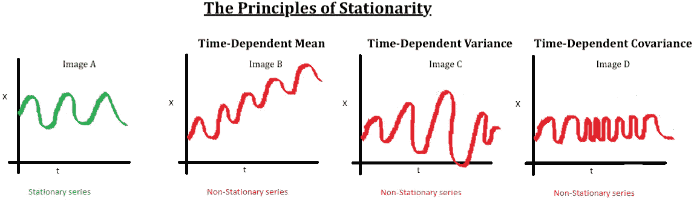
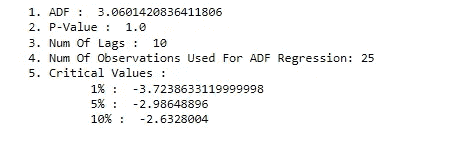
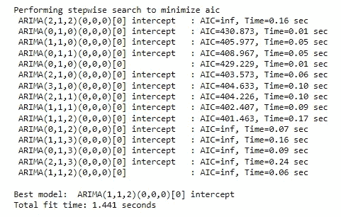
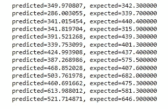
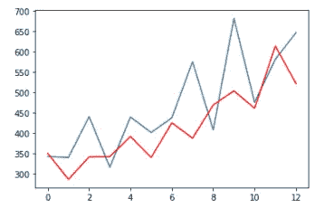

# 数据科学项目:使用 Arima 进行销售预测

> 原文：<https://medium.com/mlearning-ai/data-science-project-sales-forecasting-with-arima-e377af0ffdaa?source=collection_archive---------0----------------------->

本文由[阿尔帕斯兰·梅斯里](https://medium.com/u/fe99f0a4a612?source=post_page-----e377af0ffdaa--------------------------------)和[杰姆·özçeli̇k](https://medium.com/u/e7aec74cd6ed?source=post_page-----e377af0ffdaa--------------------------------)撰写。

在这项研究中，我们将使用 python 创建一个 ARIMA 模型来预测市场的未来销售额。

必需的库；

在这个阶段，我们已经加载了数据。

当我们看一下 df 时，我们会看到“月”列中的日期数据不是很有规律。我们需要用数据操作来编辑这些数据。

在 for 循环和接下来的过程中，我们编辑了“Month”列中的数据。

现在我们的日期数据已经变成如下:

我们简化了显示销售额的列的名称，并将 Month 列分配给索引。

我们画了一张图表来看销售额的分布:

## 统计检验

我们可以使用下面的代码执行统计测试，以确保数据是稳定的。时间序列的平稳性意味着方差和均值在一段时间内保持不变。

现在只看 p 值就够了。
如果 P<0.05；数据是固定的。
如果 p>0.05；数据不是静止的。

**输出:**

我们看到我们的数据不是静止的。为了使这个数据稳定，我们需要给出 ARIMA 模型 1 的“d”值。

## **ARIMA 模式**

在建立 ARIMA 模型时，分别给出了 3 个参数；p，d，q。

p:在时间 x(t)处的多少步前的值将被考虑在估计过程中，q:在 x(t)处的估计误差将经历多少步前的值的移动平均，d:为使数据稳定而取的差的程度。

它基本上使用一种叫做 AIC 分数的东西来决定一个特定的预测模型与 auto_arima 函数有多好。它只是试图最小化 AIC 分数。

**输出:**

该函数给出了 ARIMA 参数(1，1，2)以给出最佳得分。

ARIMA (1，1，2)意味着您通过组合一阶自回归模型和二阶移动平均模型来定义一些响应变量(Y)。

将数据集分离为测试和训练。

拟合 ARIMA 模型:

**输出:**

# 均方根误差

我们将实际值与手头的估计值进行了比较。RMSE 误差量为 90，986。现在让我们看看图表上的预测值和实际值。实际值用蓝线显示，估计值用红线显示。

**输出:**

这可以在红线图和蓝线图中看到，红线图可以描述为我们的模型在未来期间的输出，蓝线图在输出图像中实际发生了。我们在这里可以注意的情况可以被看作是我们的预测模型没有与真实值完全重叠，以便在不太轻浮的情况下做出尽可能一致的预测。然而，这里重要的一点是，尽管这些线并不完全重叠，但预测值和实际值随时间变化的上升趋势和下降趋势显示出一致的模式。就防止过度配合而言，这可以被认为是一个好的结果。

 [## Mlearning.ai 提交建议

### 如何成为 Mlearning.ai 上的作家

medium.com](/mlearning-ai/mlearning-ai-submission-suggestions-b51e2b130bfb)