# 数据科学项目:可视化游戏销售数据

> 原文：<https://medium.com/mlearning-ai/data-science-project-visualizing-game-sales-data-4142f2c8e742?source=collection_archive---------2----------------------->

本文由[阿尔帕斯兰·梅斯里](https://medium.com/u/fe99f0a4a612?source=post_page-----4142f2c8e742--------------------------------)和[哈坎·埃尔巴斯](https://medium.com/u/ebbe06a6f0e8?source=post_page-----4142f2c8e742--------------------------------)撰写。

[https://www.pexels.com/photo/a-woman-playing-league-of-legends-7915357/](https://www.pexels.com/photo/a-woman-playing-league-of-legends-7915357/)

在这项研究中，我们使用 JupyterLab 将游戏销售数据与我们从 Kaggle.com[收到的数据可视化。你可以通过 Github 访问](https://www.kaggle.com/datasets/gregorut/videogamesales)[代码](https://github.com/simplextable/Game_Sales_Data_Visualization)。

我们研究的主要目的是展示游戏世界的销售数字是如何根据地区、类型、年份和平台而变化的。

## 数据集的准备

首先，我们导入了必要的库。

然后我们导入数据集。

数据集被分配给 df 变量，train.csv 文件被引入程序。

为了查看 df 变量，我们用 print 检查了前 5 行。

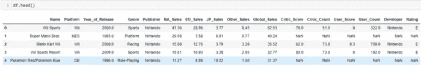

我们使用 df.shape 的 print 函数打印了两个数字，第一个数字显示了行数，第二个显示了列数。

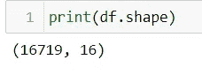

我们用 df.isnull()显示了丢失的数据计数。

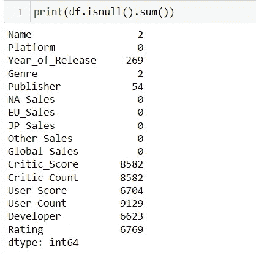

使用 df.info 代码，我们已经公开了列的数据类型。

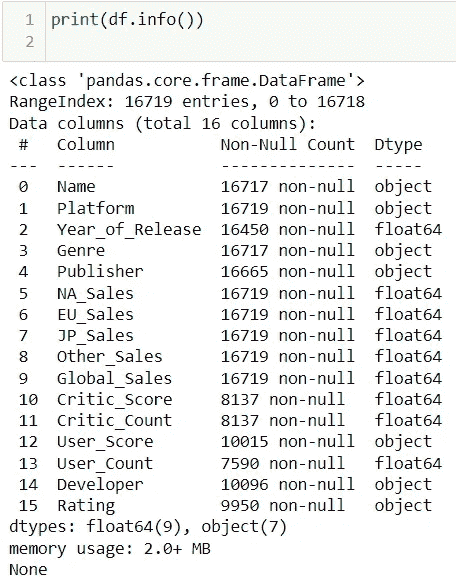

我们用百分位数显示缺失的数据。

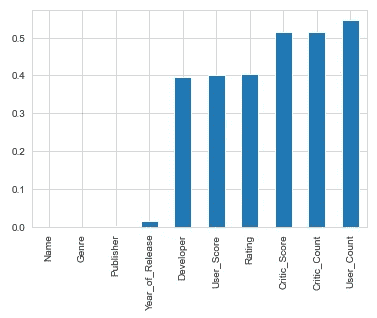

如图所示，User_Count、Critic_Count 和 Critic_Score 等列有高达 50%的缺失数据。

我们在热图中显示了变量之间的相关系数。

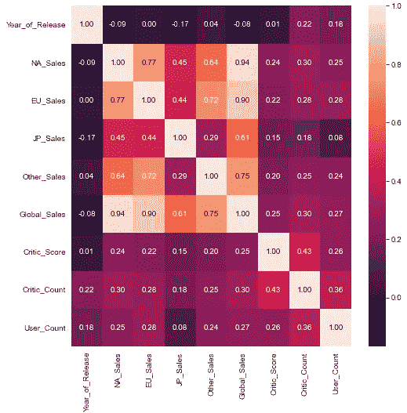

在这张图表中，我们看到欧洲(EU)和北美(NA)的游戏销售额以 0.77 的比率相互关联。但日本与这两个地区的相关率低于彼此的相关率。
因此，我们看到北美和欧洲玩家群体的口味和偏好彼此更相似，但与日本观众不同。

我们之前已经看到 df 变量中缺少一些列信息。在下一步中，我们通过删除这些线条创建了一些图形。在这种情况下，缺少数据的行主要是 1990 年以前的比赛记录。由于这个原因，相对较新的主机会有更多的线路。

在下一个图表中，我们直观地显示了每种平台(游戏机)类型的记录中有多少游戏。

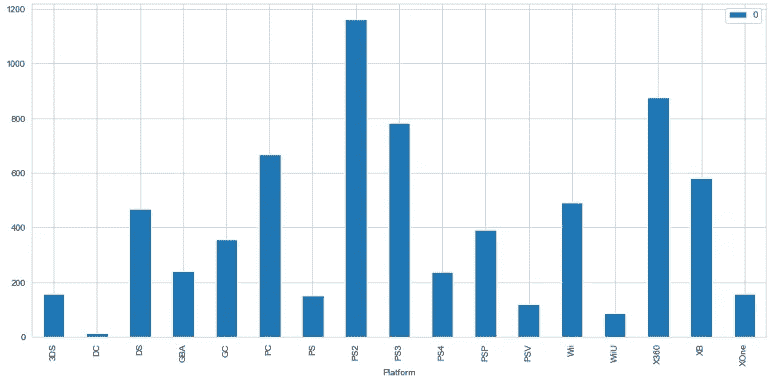

在第二张图表中，我们显示了平台发布的游戏数量的百分比。只有创建这个图的数据源是 df 变量。也就是说，如果没有删除缺少信息的行，就会出现这样的图形。

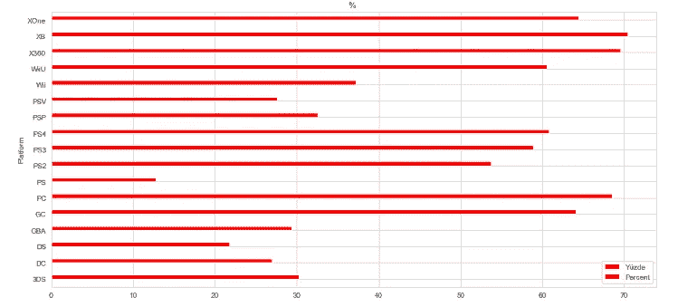

我们已经在饼状图中展示了市场上发行的游戏类型的百分比。

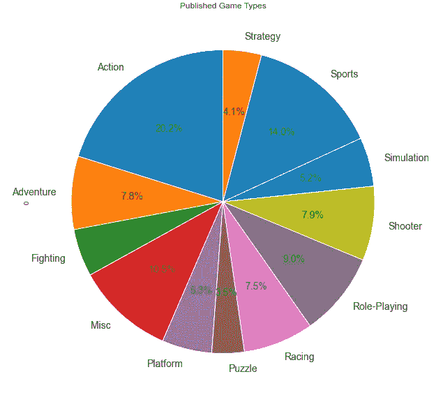

20%发布的游戏，换句话说，每 5 款游戏中就有 1 款是动作游戏。

在第二个饼图中，我们可以根据销售数字检查游戏类型的分布。

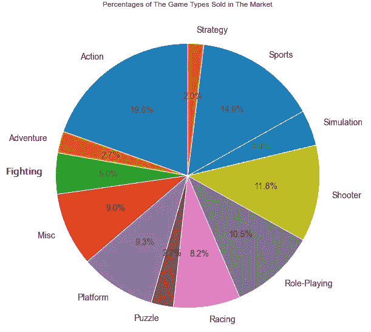

我们已经看到，在前面的图表中，有 20%的游戏是动作游戏。在这张图表中，我们看到市场上销售的近 20%的游戏是动作类的。换句话说，每 5 个购买的游戏中就有 1 个是动作类的。这张图的兴趣点可能和平台游戏有关。虽然该行业生产的游戏中有近 5%是平台游戏，但市场上销售的游戏中有近 9.5%是平台游戏。如果从这个角度来看，如果我们是一家新公司进入市场，那么我们将制作的第一款游戏是一款平台游戏，而不是一款增加我们成功机会的动作，这将是一个更符合逻辑的选择。

在第三个饼图中，对于每种游戏类型，我们将第二个图表中的销售数字除以第一个图表中的游戏数量，得出每种游戏类型的平均市场份额。

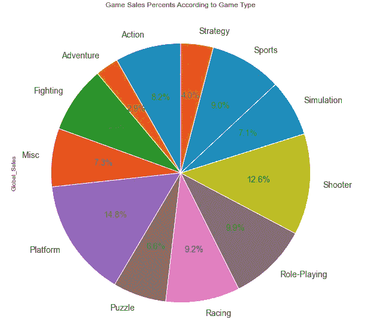

上面的图表显示了游戏类型的平均销售额。换句话说，尽管我们在第二张图表中看到动作游戏在市场中占据主导地位，但我们看到平台类型游戏的平均销售数字要高得多。在这张图表中，一款平台游戏的平均销售数字处于最高水平，接近 15%，这一事实表明，我们在之前的图表中得出的结论也是正确的。

在下面的图表中，我们展示了平台游戏的销售百分比。

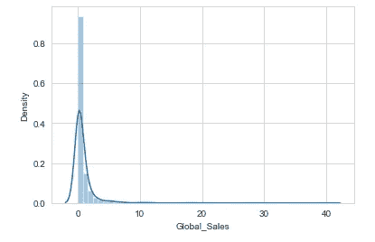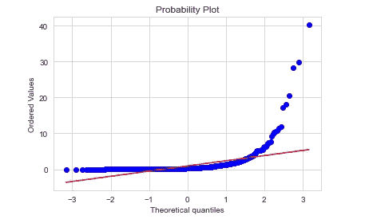

我们提到，为一家新的游戏公司制作平台型游戏是有意义的。但在我们这么快得出结论之前，我们需要做更多的分析。例如，在上面的图表中，我们查看了平台游戏的销售分布。平台流派几乎 90%的游戏似乎都实现了 0 到 200 万的销量。在分布图中，只有少数游戏的销售额超过了 1000 万。

但是如果我们要对一家新公司下结论，我们需要放大上图。

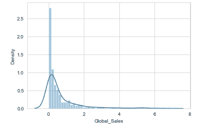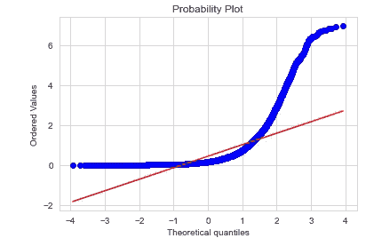

在上面的图表中，我们通过使用过滤器查看更详细的数据，检查了最大销售额达到 700 万的平台类型游戏。然而，图表仍然不是很清楚。我们需要再添加一个阶梯滤波器。

在下面的图表中，我们检查了平台类型且销售额不能超过 100 万的游戏。

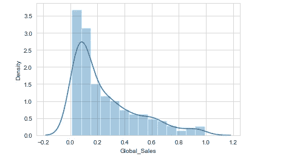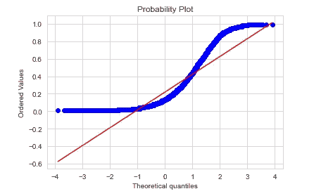

图形还是不太清楚。如果我们生产的平台型游戏赶上市场平均销售数字，我们将获得多少销售额？为此，我们再放大一个级别。

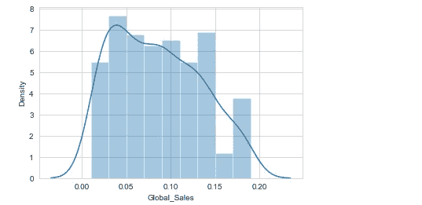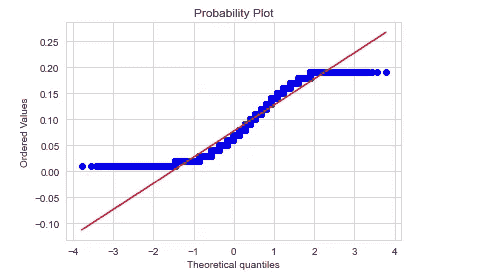

上图是销量已经高达 20 万的平台型游戏的曲线图。根据这个图表，如果我们制作的游戏在市场上取得了成功，它将售出大约 50，000 台。换句话说，在这个细节上做一个分析，我们看到平台游戏的成功，达到几千万的销售数字，是非常大的例外。作为一家新公司，如果我们没有根据这份详细的分析进行计算，我们可能已经破产了。

我们已经根据销售数字将这里出售的游戏分组。不仅仅是平台游戏，而是所有类型的游戏。

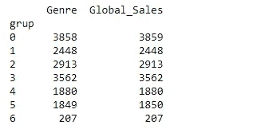

上面显示了每个组类型有多少个游戏。例如，虽然销量超过 500 万份的游戏数量仅为 207 款，但销量低于 500 万份的游戏数量在 16000 款左右。

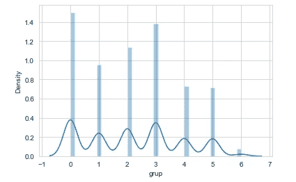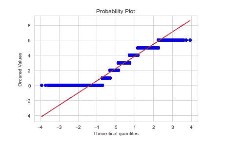

我们将组变量的类型从 object 转换为 string。

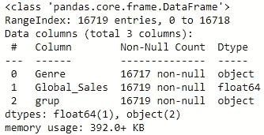

我们展示了当年售出的游戏数量。

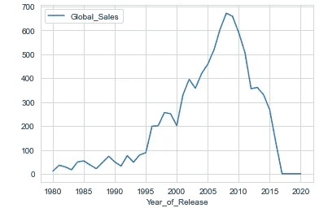

根据这张图表，游戏行业在 2008 年前后经历了 7 亿的黄金时代，或许由于 2008 年危机的影响，游戏内销售额出现了快速下滑。我们正在处理的数据显示的是截至 2016 年的时间段。

现在我们来看看按年份发布的游戏数量:

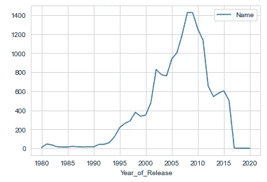

这些年出版的游戏数量与上图相似。数字 1400，大部分游戏都是在 2008 年左右发布的。

接下来，我们按地区查看了控制台首选项:

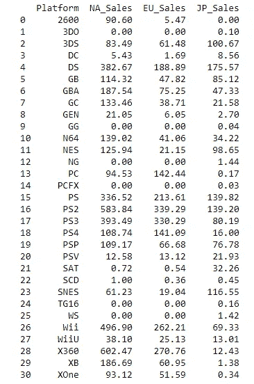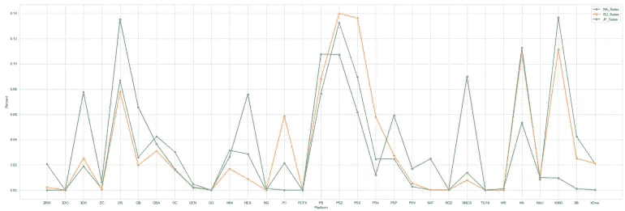

由于篇幅所限，本文中的最终图表可能并不完整。在这种情况下，唯一的解决方案是在 GitHub 上运行代码。但是，当我们查看图表时，虽然北美、欧洲和日本地区在某些控制台上显示类似的行为，但它们在某些控制台上显示不同的行为。例如，PC 在欧洲最受欢迎，而 DS 和 NES 在日本很受欢迎。另一方面，X360 在日本不太受欢迎。

现在我们来看看按地区划分的游戏类型偏好程度:

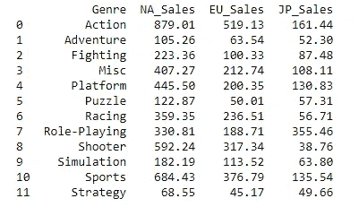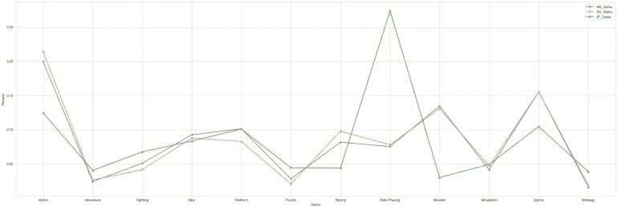

当我们分地区考察游戏流派的销量时，日本市场在 RPG 流派上的需求更高，而欧美市场在射击类和体育类上领先。

 [## Mlearning.ai 提交建议

### 如何成为 Mlearning.ai 上的作家

medium.com](/mlearning-ai/mlearning-ai-submission-suggestions-b51e2b130bfb)