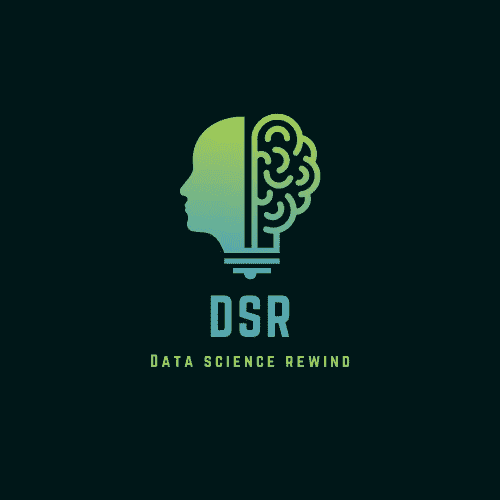

# 数据科学回放#3

> 原文：<https://medium.com/mlearning-ai/data-science-rewind-3-8c1d6c3f5e93?source=collection_archive---------6----------------------->

## 过去几周最好的面试准备、教程和趋势

Image by Author

本周，脱颖而出的文章围绕着在数据科学中脱颖而出的软技能。

作为一名数据科学家，无论是从研究生项目还是从 SDE/其他技术岗位转行，都需要改变对如何完成工作的看法。实现你的工作目标需要更多的沟通、计划和目标设定。如果没有，在最初的六个月里，你可能会陷入一些陷阱。看看雷蒙德·威利的这篇文章中的三个主要观点

 [## 初级数据科学家最常犯的 3 个错误

### 和一些高级数据科学家

towardsdatascience.com](https://towardsdatascience.com/the-3-most-common-mistakes-made-by-junior-data-scientists-7700d2f5e053) 

在您数据科学职业生涯的早期？查看您需要发展的三种非技术性技能，以加快您的数据科学职业生涯。

 [## 成功的数据科学职业生涯必须做的三件事

### 加快数据科学职业发展的关键事项

medium.com](/@selfStarter/three-must-dos-for-a-successful-data-science-career-915dc3396d5c) 

# 面试准备

在本期《数据科学回顾》中，我们推荐两篇文章

步入 ML 面试？一组可能的问题将围绕基本的深度学习架构(MLP、CNN、RNN)、它们的优点/缺点以及何时使用什么。查看由[妮莎·阿里亚·阿迈德](https://medium.com/u/728dbc35b7d?source=post_page-----8c1d6c3f5e93--------------------------------)在 Heartbeat 上发表的这篇文章，以获得这些架构的概述。

 [## 2022 年你应该知道的深度学习技术

### 这些年来，深度学习真的起飞了。这是因为我们可以访问更多的数据和更多的…

heartbeat.comet.ml](https://heartbeat.comet.ml/deep-learning-techniques-you-should-know-in-2022-94f33e62d922) 

面试需要一些热身问题吗？看看这篇由[杰克·罗斯](https://medium.com/u/4f39010debee?source=post_page-----8c1d6c3f5e93--------------------------------)撰写的文章

 [## 回答了 20 个重要的 ML 问题

### 必须知道数据科学和 ML 面试的问题

medium.com](/swlh/20-essential-ml-questions-answered-6bf61f8b1aa6) 

# 教程/实践指南

适应性学习是指个性化的教育系统，以最大限度地提高学生的学习成绩。在下面的帖子中，看看机器学习领域的基础知识。

 [## 适应性学习简介

### 使用机器学习和数据科学来个性化教育

towardsdatascience.com](https://towardsdatascience.com/introduction-to-adaptive-learning-9a0ee48fb8a7) 

在过去十年中，随着在自动驾驶汽车、游戏、推荐系统等方面的成功应用，强化学习已经与其他类型的机器学习平起平坐。对于那些有兴趣让 RL 成为他们的专长的人来说，可以看看 Pau Labarta Bajo 的“实践强化学习”课程

 [## 强化学习课程:实践，循序渐进，免费-

### 强化学习(RL)是最接近人类和动物学习方式的一种机器学习。它为我们提供了一个…

datamachines.xyz](https://datamachines.xyz/the-hands-on-reinforcement-learning-course-page/) 

那都是科学家！如果你想看到更多类似的内容，请留下掌声。

如果你喜欢这个版本的《DSR 》,请点击这里查看之前的版本

 [## 数据科学回放#2

### 过去几周数据科学领域的最佳面试准备、教程和趋势

medium.com](/@selfStarter/data-science-rewind-2-e6e103ebd68b)  [## 数据科学回放#1

### 过去几周最好的面试准备、教程和趋势

medium.com](/codex/data-science-rewind-1-5dcca68ba0df)  [## Mlearning.ai 提交建议

### 如何成为 Mlearning.ai 上的作家

medium.com](/mlearning-ai/mlearning-ai-submission-suggestions-b51e2b130bfb)