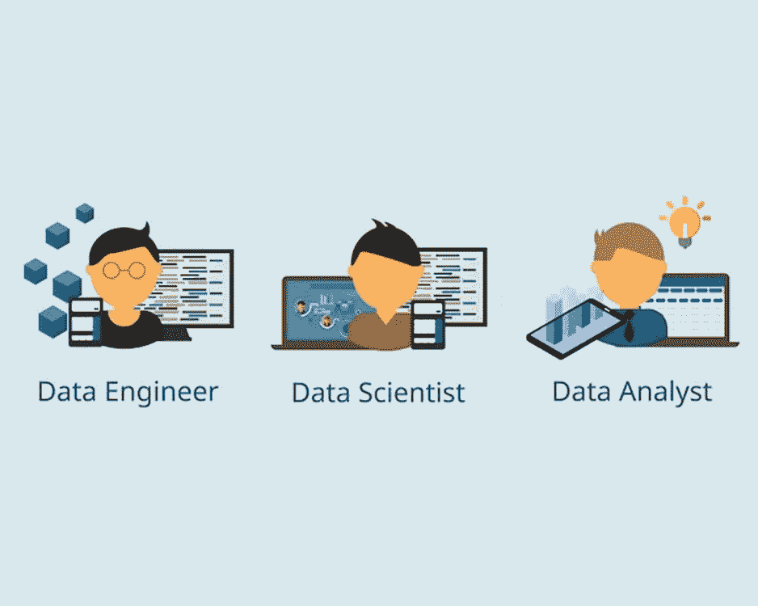

# 数据科学 vs 数据工程:有什么区别？

> 原文：<https://medium.com/mlearning-ai/data-science-vs-data-engineering-whats-the-difference-2df02d67013f?source=collection_archive---------3----------------------->

Image Source: Freelmages

数据科学和数据工程的区别是什么？最有可能的是，如果你正在读这篇文章，你要么是一个正在寻找新方法来运用你的分析技能的软件工程师，要么是一个想知道你可以选择什么职业的数据分析师。虽然这两个学科看似密切相关，但实际上它们在两个完全不同的层面上发挥作用。这听起来像是语义学，但事实并非如此。本文将研究数据科学和数据工程之间的区别，并提供指导，说明哪个学科更适合您的特殊才能。

## **什么是数据科学？**

称为“数据科学”的数据工程子领域使用建模和统计方法来产生数据驱动的见解。数据科学家主要从事纺织、金融、医疗保健和社交媒体等行业的数据工程项目，处理大量的非结构化数据。他们负责从数据中提取信息，创建算法将数据转化为有用的见解，并清晰而深刻地展示他们的结果，以便决策者能够理解它们。

业务和 IT 团队与数据科学家密切合作，以了解他们当前的需求，发现需要改进的领域，并创建新的未来场景。数据工程、统计建模、数据可视化、数据集成和数据伦理是数据科学家的必备能力。此外，尽管这是一项复杂的任务，但数据科学家必须能够与利益相关者沟通，以便他们能够理解其选择的影响。

## **数据工程**

与数据科学家相反，数据工程师专注于在不同格式之间转换数据，并构建可互操作的环境，以便各种数据存储库可以通信。这些工程师负责汇总原始数据并将其格式化为易于使用的格式，检查数据的准确性，并删除无关信息。

此外，他们还负责确保数据可以使用各种技术进行存储，包括传统的数据库、NoSQL 存储和机器学习模型。构建和维护数据基础设施，可能包括 API 网关、聚合工具、数据连接和数据流程序，通常是数据工程师的职责。

## **数据工程和数据科学有什么区别？**

“数据科学”和“数据工程”这两个词经常互换使用，在比较这两个词时，这是需要理解的最重要的事情之一。事实上，“数据科学”在招聘广告中常用来指代数据科学和数据工程。然而，这些部门之间有一些重要的区别，我们将在下面讨论。

工程与数据科学:不同的专业——数据工程师是使用编程来改变数据的专家。另一方面，数据科学家是使用统计和建模方法从数据中提取有用见解的专家。

工程与数据科学:时间表-数据工程师专注于建立支持这种见解的工具，但数据科学家专注于开发见解和模型。与数据工程不同:数据工程师创建修改数据的软件。另一方面，数据科学家更像是数据一般如何运作的权威。

## **数据科学和数据工程的主要区别**

**焦点** —工程师生产用于数据转换的工具，而科学家开发洞察力。这是数据工程和数据科学的主要区别。因此，工程师更关注“如何”，而科学家更关注“什么”

**团队规模** —虽然数据科学项目的规模通常取决于要产生的见解的数量，但数据工程项目团队的规模取决于转型的复杂性。

**持续时间:**数据科学项目可能需要几周到几个月的时间才能完成，而数据工程项目通常需要两到五年的时间。

> [***“恳请大家如果喜欢这个网站及其内容(只是为了表示对我的欣赏)，请点击“关注”按钮”***](/@mauhhikthakkar)

## **如何成为一名数据科学家？**

了解数据在行业中的作用是对数据科学感兴趣的第一步。一旦你理解了数据如何被用来发现新的见解，就开始申请数据科学的工作。您可以学习如何成功地使用来自各种资源的数据。无论是付费的数据科学训练营还是免费的在线课程，都有适合每个人的东西。请记住，在众多行业中，数据科学专业知识变得越来越必要。最有效的学习方法是通过做。

选择您的公司面临的一个数据挑战，并投入研究和解决问题。跟踪您的发现，分析数据，并与利益相关者一起测试您的结果。值得注意的是，数据科学通常是一项协作工作。没有同事的支持，你将无法发表正确的见解。

## **如何成为一名数据工程师？**

如果您有兴趣成为一名数据工程师，了解数据架构和数据工程领域是第一步。如果您对处理大数据感兴趣，那么认识到数据工程领域是动态的是至关重要的。由于区块链和机器学习等新兴技术，工程专业人员面临新的障碍。

为了保持领先，跟上最新的趋势和创新至关重要。了解如何创建和维护可扩展的数据架构也很重要。不要忘记，数据工程师负责构建数据基础架构、转换数据、验证数据和确保数据质量。因此，获得创建数据架构的实践经验是发展成为伟大的数据工程师的最不可思议的方法。

> 在[领英上跟我来:](https://www.linkedin.com/in/mauhhikthakkar/)

## **结论**

数据科学和数据工程是两个有着特殊困难和不同工作选择的重要专业。哪一个对你最好？可能两个都有！数据科学就是利用信息来产生实用知识。数据科学家负责开发能够转换和存储数据的工具，而数据工程师则负责创建这些工具。重要的是要记住，数据工程和数据科学在两个非常不同的层面上运作。当数据工程师专注于建立转换数据所需的工具时，数据科学家则专注于发展洞察力。

 [## Mlearning.ai 提交建议

### 如何成为移动人工智能的作者

medium.com](/mlearning-ai/mlearning-ai-submission-suggestions-b51e2b130bfb)