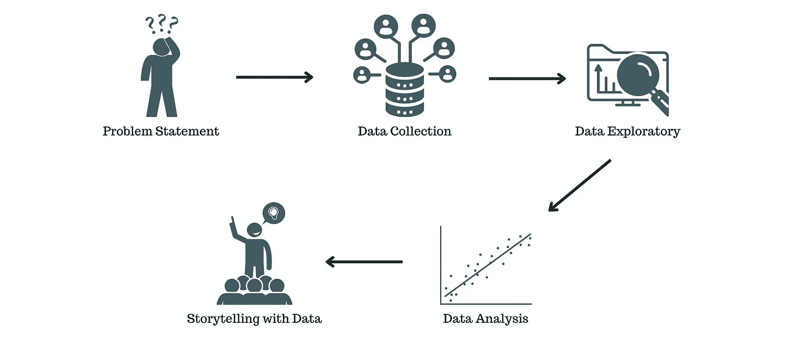

# 数据科学家:从数据中发现黄金的人

> 原文：<https://medium.com/mlearning-ai/data-scientist-someone-who-finds-gold-from-data-5c654ae350dd?source=collection_archive---------2----------------------->

## 数据科学简介，数据科学家的工作，以及数据科学应该使用哪种编程语言

Photo by Mikael Blomkvist from [Pexels](https://www.pexels.com/photo/a-group-of-people-discussing-beside-a-desktop-with-graph-on-screen-6476259/)

# 介绍

我们将无法将数据从日常生活中分离出来。在二十一世纪，我们产生了大量的数据，因为数据可以从各种来源产生。有大量的数据源，如网站、在线商店、智能手表、智能手机、物联网等。但是，大多数人会认为这些数据不重要，没有意义。与数据科学家不同，他们认为数据至关重要。

一位数据科学家认为，数据就像石油一样，是世界上至关重要的商品。此外，当他们设法在数据中找到一种模式和关键信息时，它就变成了黄金。数据科学家的主要目标是发现数据中包含的洞察力。

实际上，我们已经使用了很多数据科学家的产品。这些产品包括推荐系统、搜索引擎、自动驾驶汽车、情感分析、人脸检测、语音识别等。这些不同的产品可以使我们的工作更容易。例如，如果我们只有很少的时间来购买商品，推荐系统会帮助我们选择适合我们需要的商品，这可以节省我们的时间。

# 什么是数据科学？

Image from [Freepik](https://www.freepik.com/free-vector/data-inform-illustration-concept_6195525.htm#query=data%20scientist&position=0&from_view=search)

数据科学实际上并不是一门新学科，但在大数据可用性的支持下，数据科学学科在今天变得非常热门。它既涉及数据，也涉及科学(处理数据需要什么)。数据科学实际上是寻找与数据相关的问题的答案的活动。

当我们拥有数据并对数据的内容感到好奇时，为了回答这种好奇心，我们必须了解数据、探索数据、分析数据、操作数据，我们甚至可以使用技术来找到数据的内容。这就是数据科学的真正含义。

数据科学可以被认为是从数据中提取洞察力的过程，无论数据是小、中还是大。现在，黄金在这里的含义是从数据中成功提取的洞察力。这些见解将在以后被用作决策的基础，或者可能是问题的解决方案。

# 数据科学家的实际工作是什么？

当我们想要开采黄金的时候，会涉及到一个非常复杂的过程。类似地，数据科学也涉及到一个复杂的过程，也许只是为了深入了解数据而重复这个过程。当然，实现数据科学的目标需要工具和特定的阶段。数据科学家通常会执行五个步骤。

Step-by-step data scientists do (Image by the author)

## **问题陈述**

当然，在寻找答案时，我们需要一个问题或一个关于关注点的陈述。关注陈述是数据科学家必须经历的初始阶段。从有关的陈述中，将寻求解决这些问题的答案，当然是通过使用数据。比如改善推荐系统，让顾客从我们店里买更多的商品。

这一阶段必须产生强烈的好奇心，因为强烈的好奇心可能是数据科学家执行最终能够从数据中找到洞察力的阶段的动力。

## **数据收集**

数据科学家需要选择正确的数据来获得洞察力，并最终能够回答问题陈述。这些数据可能已经可以在数据提供商网站上获得，比如 [Kaggle](https://www.kaggle.com/) ，或者我们可能必须先收集这些数据。例如，当我们想要回答 Twitter 上情感分析的问题时，我们需要寻找 Twitter 用户生成的推文形式的数据。

在这个阶段，数据科学家可能需要数据工程师的帮助。数据工程师将帮助数据科学家在公司的数据仓库中组织数据或检索数据。当数据可用时，下一个过程将由数据科学家本人执行。

## **数据探索性**

收集数据后，下一步是学习所有的数据。数据可以是结构化数据，也可以是非结构化数据，如果结构化数据由行和列组成，那么必须理解每一列和每一行的含义。这也是一项复杂的任务，可能需要使用统计方法可视化数据和汇总数据。

有时，我们还必须清理我们的数据，例如清除空值、删除异常值、对分类数据进行编码(如果需要)、将数据转换成正确的格式等。嗯，也许在这个阶段，我们还将对近似数据进行特征工程，以提高数据的质量。

## **数据分析**

下一个阶段是数据分析。在我们准备好数据后，这也将使我们更容易进行数据分析。在这个阶段，我们必须了解机器学习和深度学习算法的各种数据分析技术和建模方法。一个数据科学家必须一步步理解各种算法是如何工作的，如果能理解算法背后的数学公式就更好了。这也将使我们更容易选择哪种算法适合我们的数据。

模型完成后，下一步是测试和评估模型。我们要评估我们的模型，从模型的可行性(是否符合标准)和模型预测的准确性开始。数据科学家还必须了解各种模型评估指标。如果我们的模型仍然不好，那么我们必须制作另一个模型或对模型进行一些调整，当它可行时，我们可以进入下一阶段。

## **用数据讲故事**

最后一个阶段是用数据讲故事。数据科学家必须能够以系统、清晰和易于理解的方式向非技术人员传达这些见解。这些见解可以直接或间接分享(书面报告)。因此，数据科学家还必须掌握公开演讲和技术写作。这很重要，因为它必须让观众对从数据中获得的洞察力感到惊讶和自信。

做了评书之后，希望你能利用这种洞察力。这些见解用于制定与数据科学家工作的组织或公司相关的决策。这还没有结束。数据科学家还必须跟踪这些见解是如何被使用的。如果它们不再实用，他们必须重复这个过程，以便从新数据中发现新的见解。

# 数据科学应该选择哪些编程语言？

我们推荐三种流行的数据科学编程语言。你不需要掌握全部，只需要掌握其中一种编程语言即可。

Programming language for data science (Image compiled by the author).

## 计算机编程语言

Python 是一种面向对象、开源、高级和通用的编程语言。然而，Python 主要用于数据科学。这是因为 Python 得到了许多数据科学的[库的支持。因为它是由大型 python 数据科学社区支持的，所以如果你想使用 python 学习数据科学，你会在 YouTube 上找到很多学习资源，比如教程，免费的在线课程，以及许多讨论这方面的文章。](/mlearning-ai/python-libraries-for-data-science-that-you-must-know-in-2022-f2a5063ef58b)

与 R 和 Julia 相比，执行速度慢是 Python 的缺点之一。然而，Python 具有可读的语法，因此它仍然是数据科学最流行的编程语言。

## 稀有

接下来推荐数据科学的 R 编程语言。r 是一种开源编程语言，基于 S 语言设计，具有统计生态系统，广泛用于数据分析。与 Python 几乎一样，R 也受到许多数据科学库和大型社区的支持。相比 Python，R 的执行速度更快。这也是 R 相对于 Python 的优势之一。

r 曾经在数据科学编程语言中排名第一，击败了 Python。然而，Python 最终取代了 R 的流行。

## 朱莉娅

在最后一个位置，我们把 Julia 作为数据科学的编程语言。几乎和 Python 一样，唯一突出的区别是执行速度。Julia 的执行速度几乎和 C 或 C++一样，这意味着与 Python 和 r 相比，Julia 非常快。这就是 Julia 适合科学计算(包括数据科学)的原因。

Julia 的劣势之一是有限的数据科学图书馆和一个小的(但正在增长的)社区。可以说 Julia 是一门仍然年轻的编程语言，因为它是在 2012 年(10 年前)首次发布的。据估计，在未来，Julia 将击败 Python 和 R 作为数据科学编程语言的普及。

# 结论

看完这篇文章你会对数据科学家有更深入的了解。您还将了解什么是数据科学，数据科学家为达到目标所采取的步骤以及他们使用的编程语言。

数据科学家是指处理数据以获得有助于做出特定决策的洞察力的人。数据科学家要经历几个阶段，包括问题陈述、数据收集、探索性数据、数据分析和用数据讲故事。Python、R 和 Julia 是用于数据科学的编程语言。

 [## Mlearning.ai 提交建议

### 如何成为 Mlearning.ai 上的作家

medium.com](/mlearning-ai/mlearning-ai-submission-suggestions-b51e2b130bfb)