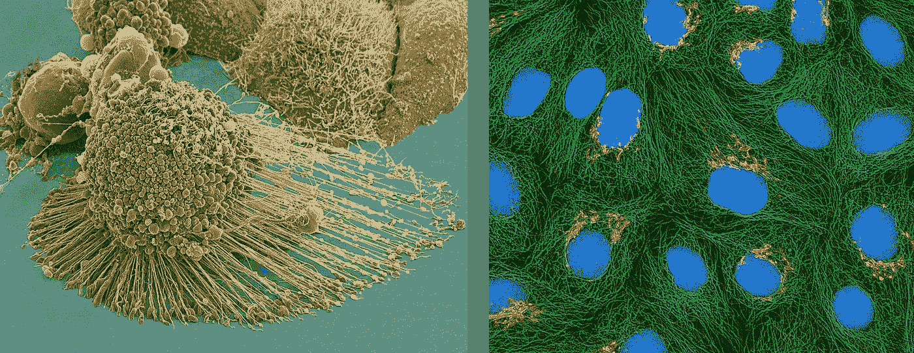
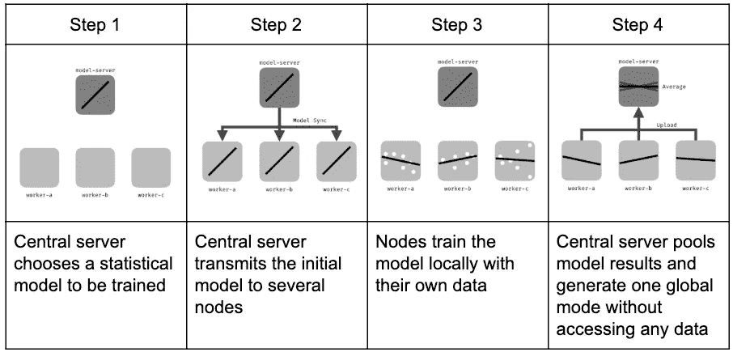

# 数据主权:分享不是关心

> 原文：<https://medium.com/mlearning-ai/data-sovereignty-sharing-is-not-caring-f816f77c04fc?source=collection_archive---------4----------------------->

研究人员正在敦促提高数据透明度，总是授予数据访问权是正确的吗？

image by [Elaine Casap](https://unsplash.com/@ecasap) at unsplash.com

人工智能有望在医学领域带来一场革命(无论是在制药和医学研究领域，还是在研究本身)。人工智能需要数据来训练。

患者数据非常敏感。过去，并非所有数据都是在征得适当同意的情况下获得的，而且往往忽略了社区和少数群体。社区和少数民族在数据库中的代表性不足，但过去的医学充满了系统性的种族主义，导致社区不信任研究。

# 基因组打破了承诺

image by [marcos mayer](https://unsplash.com/@mmayyer) at unsplash.com

科研不喜欢分享数据。研究人员将他们的数据集视为一种资源，这样他们就可以发表论文，而共享被视为竞争优势的丧失。

如今，教师职位越来越少，研究经费也越来越少。成功地在大学获得一个职位是一个达尔文式的挑战，以至于非正式的格言“发表和灭亡”蜿蜒曲折。

T2 人类基因组计划(HGP)T3 部分改变了这一观点。这些数据立即提供给了机构群体，并激发了所谓的[百慕达原则](https://web.ornl.gov/sci/techresources/Human_Genome/research/bermuda.shtml)(联盟获得的基因组序列将尽快公布)。这使得今天有数百万个序列成为可能。

> “对于生物医学研究中的数据共享，还没有进行过认真的讨论。标准是一个成功的调查者尽可能长时间地保留自己的数据。”——大卫·豪斯勒，他在 HGP 项目中工作

**现实中的结果远非田园牧歌。**每个人在组织和共享数据时都使用不同的实践和原则，这使得元研究更加困难(说到一种“巴别塔”，想要使用其他群体数据的研究人员在探索和预处理数据集方面浪费了太多时间)。

此外，这些数据是如何获得的并不总是透明的。指南因国家而异，元数据通常不可用。并非所有数据都可用；仍然经常有研究人员不愿意提交和发布数据集。**这就是机构群体继续呼吁开放数据共享政策**的原因，以推动期刊和机构更加严格地要求出版物和资金的强制性数据共享。

有关该主题的更多信息:

 [## 癌症研究需要更好的数据

### 我们有许多开放性的问题，我们需要数据来回答它们

pub.towardsai.net](https://pub.towardsai.net/cancer-research-needs-better-data-eee2bb3488a5)  [## 科学和人工智能中的代码再现性危机

### 萨维艾和科学研究要求我们分享更多

pub.towardsai.net](https://pub.towardsai.net/code-reproducibility-crisis-in-science-and-ai-fa2f2ec955b4) 

# 序列告诉和隐藏的一切

研究人员正在推动数据和文章越来越透明的政策，但不是每个人都同意。

数据库使得成功进行无数的研究成为可能。GWAS 研究使我们有可能揭示无数疾病的原因(遗传的和其他的),今天在法医学中，数据库对发现无数悬案的罪魁祸首至关重要。

这些数据并不总是获得明确和真正的同意。一个著名的例子是[亨利埃特缺乏细胞案](https://en.wikipedia.org/wiki/HeLa)。1951 年，在未经同意的情况下提取了宫颈癌样本，并被永垂不朽。HeLa 细胞被认为是生物学的基本模型之一，几乎被用于世界上的每个实验室。**她的基因组已被测序，并在未经家人同意的情况下公开。**

image representing HeLa cells ([Wikipedia](https://en.wikipedia.org/wiki/HeLa))

基因组序列可用于[重新识别受试者](https://www.genome.gov/about-genomics/policy-issues/Privacy)(如 [2013 年的一项研究](http://www.sciencemag.org/content/339/6117/321)所示)，并可用于识别不同疾病的潜在易感性。例如，雇主可能会发现其员工患有癌症或其他疾病，并可能会歧视他或她。

> “当你向 DNA 检测公司提供你的基因信息时，你也提供了与你相关的人的信息——包括远房表亲。当你的亲戚，包括你可能不认识的远房亲戚，提供他们的 DNA 时，他们也提供了你的基因信息。”—达诺夫斯基(资料来源)

此外，如图所示，这些序列并不总是被安全地保存。尤其是公司的数据库可能被黑客攻击(来自 MyHeritage 服务的 9200 万个序列在一个私人服务器上)。此外，公司不清楚他们如何使用这些数据，并经常将其出售给未指定的第三方。更不用说目前的法律相当模糊，也不清楚谁拥有这些权利。

公司与政府当局有非常透明的共享政策，几位活动家指出:

> “在执法方面，人们非常关注普遍的公民自由，以及对有色人种社区的过度影响，因为他们与警察的接触已经不成比例了。”—达诺夫斯基([来源](https://www.cnbc.com/2018/06/16/5-biggest-risks-of-sharing-dna-with-consumer-genetic-testing-companies.html))

# **算法和偏差**

image by [Tingey Injury Law Firm](https://unsplash.com/@tingeyinjurylawfirm) at unsplash.com

> “在所有形式的不平等中，健康方面的不公正是最令人震惊和不人道的。”——马丁·路德·金

如图所示，算法可能[有种族偏见](https://en.wikipedia.org/wiki/Algorithmic_bias)(比如面部识别算法导致黑人被捕的错误案例)。但在医学领域也有例子:[一个将有限资源分配给新妈妈的模型](https://www.doi.org/10.1001/jamanetworkopen.2021.3909)不受欢迎的黑人妈妈和受欢迎的白人妈妈，[一个关于肾脏的临床算法](https://link.springer.com/article/10.1007/s11606-020-06280-5)认为黑人患者比实际情况更健康(减少了获得护理的机会)，黑色素瘤的[算法](https://www.jaad.org/article/S0190-9622(21)01215-9/fulltext)在深色皮肤上表现更差，几个血氧计的[模型在深色皮肤上不太准确](https://www.nejm.org/doi/full/10.1056/nejmc2029240)(并且患者不太可能接受补充氧气)。

另一方面，这些模型的使用影响了人们的生活，需要更多的主体参与。事实上，几项研究表明[公民应该参与](https://arxiv.org/abs/2103.00508)关于这些算法规则的讨论，尤其是如果它们可能有害的话。像 BLOOM 这样的计划确实把更大的包容性作为一个关键问题(更多信息:[这里](https://pub.towardsai.net/a-new-bloom-in-ai-why-the-bloom-model-can-be-a-gamechanger-380a15b1fba7))。

# 序列背后的声音

image by [Matt Botsford](https://unsplash.com/@mattbotsford) at unsplash.com

这场辩论始于几年前。虽然研究人员在《自然》杂志上发表了一封信，呼吁提高数据的透明度，但其他人回应道:“作为本土遗传学家，我们提醒研究人员，我们违背了承诺，将医疗福利扩展到基因组数据公开的社区。”

作者指出，人们寻找土著人民的基因组是因为其独特的变异。这使得研究疾病和基因改变之间的联系成为可能。事实上，被隔离了几千年的土著人口有一个独特的基因型。这些变化也是与不同环境相互作用的结果，[代表重要信息](https://www.nejm.org/doi/10.1056/NEJMp1915987)。例如，在非洲血统和阿米什社区中发现的基因位点使得分别用于降低胆固醇水平的[囊性纤维化](https://www.nejm.org/doi/full/10.1056/NEJMoa054013)和[的药物得以开发。](https://www.biorxiv.org/content/10.1101/721704v1)

另一方面，社区并没有从开发的药物中受益，部分原因是它们的序列。土著社区在获得治疗和药物方面存在严重差异。

[美国国家卫生研究院(NIH)启动了“我们所有人”](https://allofus.nih.gov/)研究计划，NIH 承诺 50%的参与者来自代表性不足的社区(包括美国土著社区:美洲原住民、阿拉斯加原住民和夏威夷原住民)。目标是促进包容性，以及社区在未来也可能从精准医疗中受益的事实

image by [Sangharsh Lohakare](https://unsplash.com/@sangharsh_l) at unsplash.com

DNA 测序公司通常在他们的数据库中主要有欧洲血统的人的序列(超过 80%的序列)。因此，最强的基因-疾病关联已经被确定，数据已经被出售给制药公司。另一方面，透明数据政策下的“我们所有人”等项目也允许 Ancestry 等公司访问社区数据，并与自己的数据进行比较，甚至出售这些数据。

> 数据不是礼物。最好的情况是，它们是“借出的”，因此，如果被滥用，它们将被撤销。数据是一种责任，而不是权利。—自然信([来源](https://www.nature.com/articles/d41586-021-00758-w))

要求更透明的政策(也是由研究人员作为科学民主化的一种手段所推动的)与土著数据主权(IDS)发生了冲突。此外,《联合国土著人民权利宣言》( UNDRIP)承认并尊重土著人民自决和自治的权利，以纳入基因组研究。此外，机构处理殖民主义和种族主义的土著社区也持怀疑态度。

A map of [uncontacted peoples](https://en.wikipedia.org/wiki/Uncontacted_peoples), around the start of the 21st century. ([source](https://en.wikipedia.org/wiki/Indigenous_peoples))

# 保护数据主权的联合学习

2018 年，毛利社区注意到[有 300 小时的 Te Reo 毛利语](https://dl.acm.org/doi/pdf/10.1145/3551624.3555290)。这个数据集将足以训练拼写检查器、语法助手和其他自然语言处理应用程序的模型。然而，毛利社区不希望商业实体获得这些数据，并制定了[数据主权协议](https://www.tec.govt.nz/teo/working-with-teos/analysing-student-data/key-components/community-perspectives/maori-data-sovereignty/)。**在协议中，他们规定如果要建造一个应用程序，必须由毛利社区来完成。**

[在一封信中，Boscarino 讨论了](https://www.nature.com/articles/s42256-022-00551-y)一种允许土著社区参与科学项目同时保持对数据本身的主权的方法:联合学习。

[**联合学习**](https://en.wikipedia.org/wiki/Federated_learning) **是一种训练机器学习模型的技术，其中数据集分布在多个设备或不同的数据中心。**与传统培训技术的主要区别在于缺乏中央数据中心。系统中的不同节点独立训练模型，而原始数据不被公开和存储。

federated learning: each node has access to just a part of the data and it is not shared with the others. The central node receives only the trained model([wiki](https://en.wikipedia.org/wiki/Federated_learning))

其优势在于更大的隐私性，数据不会由训练模型的人存储，并且数据泄漏的风险更小。它也符合本土数据处理指南: [OCAP](https://fnigc.ca/ocap-training/) (所有权、控制权、访问权和占有权)和 [CARE](https://en.wikipedia.org/wiki/CARE_Principles_for_Indigenous_Data_Governance) (集体利益、控制权、责任、伦理)。

# 离别的思念

人工智能将对医学产生变革性影响，推动精准医学应用、新疗法的发展，并发现尚未了解的疾病机制。但是，人工智能需要数据。

医疗领域的数据是敏感材料。序列中的信息也可用于其他应用和潜在的鉴别。为了收集数据，共识是必不可少的，但今天讨论也扩大到其他问题。

土著人民要求控制他们的数据。联合学习可能是允许社区控制并能够训练人工智能模型的解决方案之一。

# 如果你觉得有趣:

你可以寻找我的其他文章，你也可以 [**订阅**](https://salvatore-raieli.medium.com/subscribe) 在我发表文章时得到通知，你也可以在**[**LinkedIn**](https://www.linkedin.com/in/salvatore-raieli/)**上连接或联系我。**感谢您的支持！**

**这是我的 GitHub 知识库的链接，我计划在这里收集代码和许多与机器学习、人工智能等相关的资源。**

** [## GitHub - SalvatoreRa/tutorial:关于机器学习、人工智能、数据科学的教程…

### 关于机器学习、人工智能、数据科学的教程，包括数学解释和可重复使用的代码(python…

github.com](https://github.com/SalvatoreRa/tutorial) 

或者随意查看我在 Medium 上的其他文章:

 [## 机器遗忘:遗忘的职责

### 从人工智能模型中删除数据点信息的重要性

towardsdatascience.com](https://towardsdatascience.com/machine-unlearning-the-duty-of-forgetting-3666e5b9f6e5)  [## 人工智能如何拯救亚马逊雨林

### 亚马逊正处于危险之中，人工智能可以帮助保护它

towardsdatascience.com](https://towardsdatascience.com/how-artificial-intelligence-could-save-the-amazon-rainforest-688fa505c455)  [## 艾重新想象世界上最美丽的 20 个词

### 无法翻译的单词怎么翻译？

medium.com](/mlearning-ai/ai-reimagines-the-worlds-20-most-beautiful-words-cd07090ea59b)  [## 说生命的语言:AlphaFold2 和公司如何改变生物学

### 人工智能正在重塑生物学研究，并开辟治疗的新领域

towardsdatascience.com](https://towardsdatascience.com/speaking-the-language-of-life-how-alphafold2-and-co-are-changing-biology-97cff7496221)  [## Mlearning.ai 提交建议

### 如何成为 Mlearning.ai 上的作家

medium.com](/mlearning-ai/mlearning-ai-submission-suggestions-b51e2b130bfb)**