# 数据故事:数据可视化艺术

> 原文：<https://medium.com/mlearning-ai/data-tales-art-in-data-visualization-a07d3e5562e7?source=collection_archive---------7----------------------->

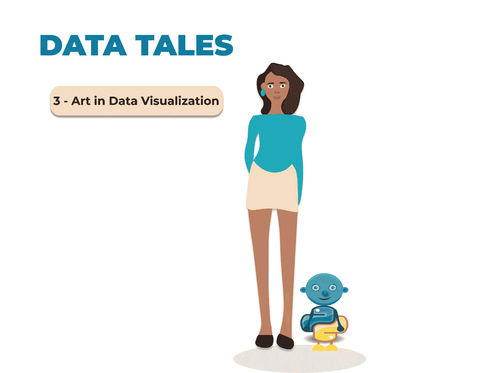

当谈到数据可视化时，最常见的问题是，它是一门艺术还是科学？

对我来说，这是两者的结合。高效的可视化有助于用户对数据和证据进行分析和推理。它使复杂的数据更容易访问、理解和使用，但它也可以简化。我们可以非常依赖默认的自定义图形，但在大多数情况下，我们可能必须应用一些特定的关键字来清理我们的图形和图表，并使它们在审美上更符合人类的视觉。使用正确的视觉效果来表现数据有助于传递强有力的信息。

**以下是创建数据视觉效果时需要注意的一些事项:**

1.  永远追求简单，但不要太简单。

2.关注信息，并围绕信息创建图表。

3.让文本和标题可见，并且不言自明。

4.合理利用空间，避免使用聚集信息的图表。

使用 Python，我将使用不同的数据集创建一些视觉效果，并自定义这些视觉效果。

**数据集 1**

```
#first datasetdf = pd.read_csv('mtcars.csv')
df.head()
```

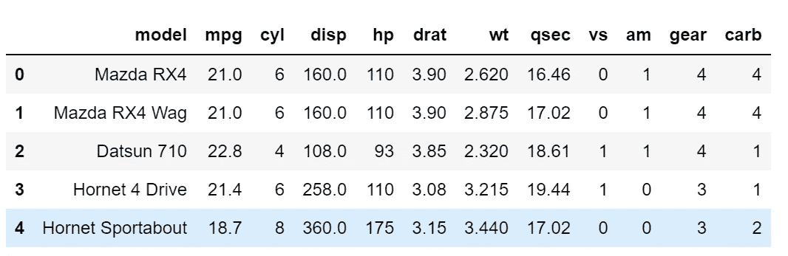

第一个数据集是不同汽车模型及其特征的数据集。我们将创建的第一个视觉效果是模型相对于位移的条形图(“disp”)。

```
sns.barplot(x='model', y='disp', data=df)
```

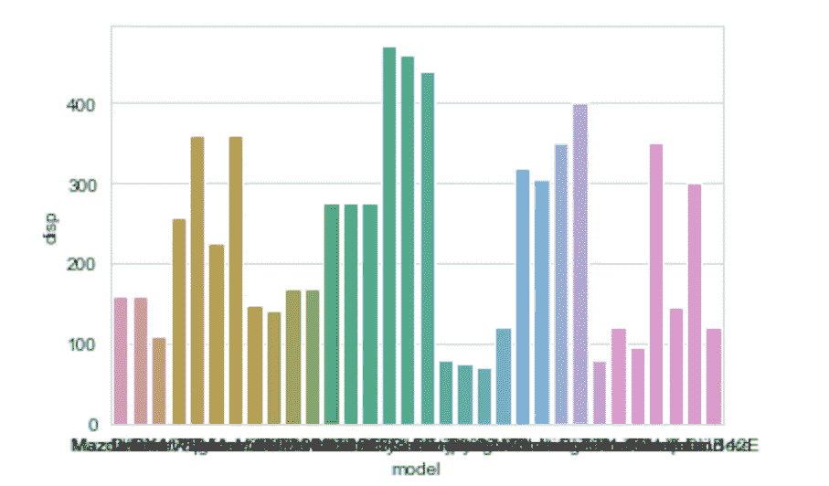

当我们使用默认代码时，我们看到颜色是为条形自动设置的，x 轴上的值是不可见的，并且条形没有被排列。

```
#customize
sns.set_style("whitegrid")
bar,ax = plt.subplots(figsize=(14,10))
ax = sns.barplot(x='disp', y='model', data=df, order=df.sort_values('disp', ascending = False).model, ci=None, color='grey',orient='h')
ax.set_title("Car Model by Displacement", fontsize=20)
ax.set_xlabel ("disp", fontsize=15)
ax.set_ylabel (" ", fontsize=15)
ax.tick_params(axis='x', labelsize=15)
ax.tick_params(axis='y', labelsize=15)
```

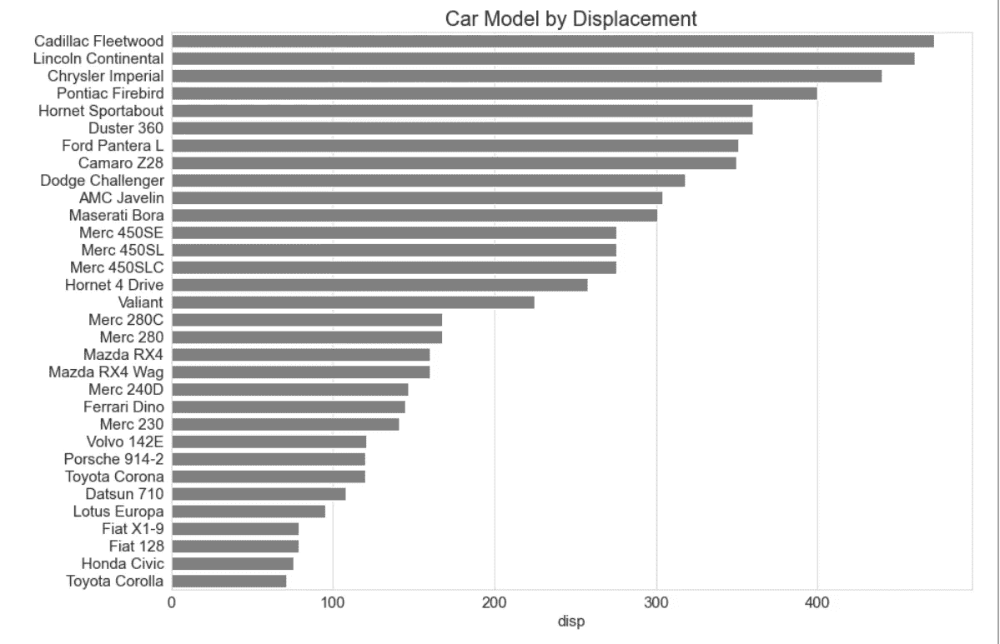

通过将模型放在 y 轴上，对所有的条形使用一种颜色，并按降序排列来定制这个图，使它更容易理解。我们可以看到排量最高的车是凯迪拉克弗利特伍德，最低的是丰田卡罗拉。

我们还可以检查另一个特性并定制图表。

```
#customize
sns.set_style("whitegrid")
bar,ax = plt.subplots(figsize=(14,10))
ax = sns.barplot(x='mpg', y='model', data=df, order=df.sort_values('mpg', ascending = False).model, ci=None, color='navy',orient='h')
ax.set_title("Car Model by Miles per Gallon", fontsize=20)
ax.set_xlabel ("mpg", fontsize=15)
ax.set_ylabel (" ", fontsize=15)
ax.tick_params(axis='x', labelsize=15)
ax.tick_params(axis='y', labelsize=15)
```

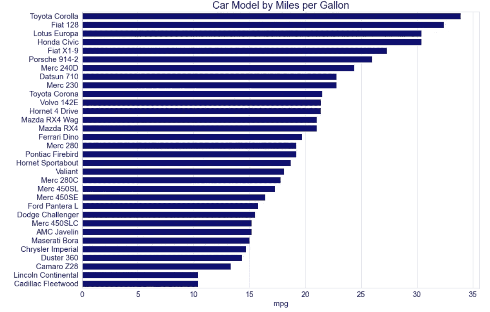

这里我们看到每加仑行驶里程最高的车是丰田卡罗拉，凯迪拉克弗利特伍德最低。

考虑到每加仑英里数和排量这两个变量，因为它们是连续变量，所以我们可以用散点图来比较它们。

```
sns.scatterplot(data=df, x="mpg", y="disp")
```


我们看到排量越高，每加仑行驶里程越低。让我们通过添加另一个连续变量、设置点的大小并命名我们的图来自定义这个图。

```
#customize
sns.set_style("whitegrid")
bar,ax = plt.subplots(figsize=(8,8))
sns.scatterplot(data=df, x="mpg", y="disp", hue='gear', palette='muted', size="gear",
    sizes=(50, 150))
ax.set_title("Displacement vs Miles per Gallon", fontsize=20)
ax.set_xlabel ("mpg", fontsize=15)
ax.set_ylabel ("disp", fontsize=15)
ax.tick_params(axis='x', labelsize=15)
ax.tick_params(axis='y', labelsize=15)
ax.grid(False)
```

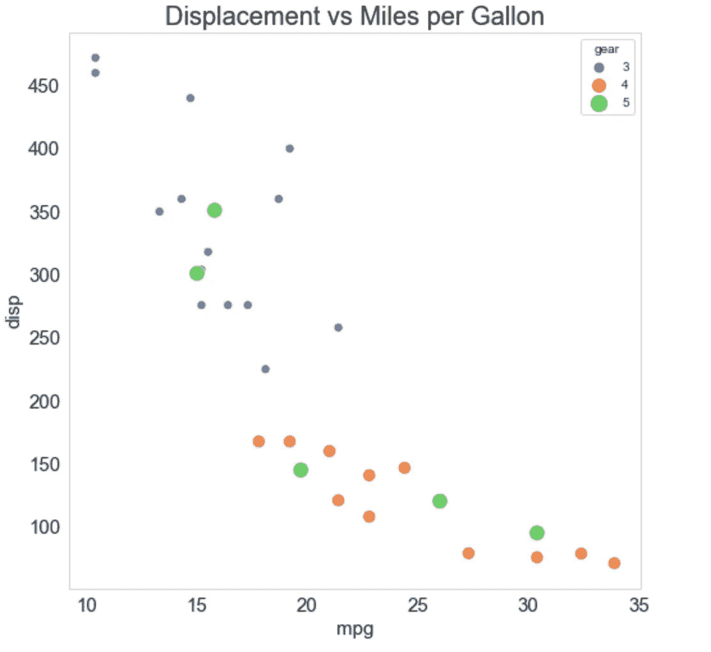

图形现在看起来更清晰了，轴刻度和标题也更明显了。此图也比默认图更具可读性。

**数据集 2**

第一个数据集有一个分类变量，即汽车型号，我们来看一个有多个分类变量的数据集。

```
#second dataset
df1 = sns.load_dataset("tips")
df1.head()
```

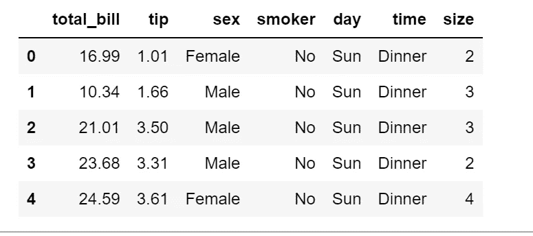

让我们创建一个包含两个分类变量的柱状图。

```
ax = sns.barplot(x='day', y='tip', data=df1, hue='sex')
```

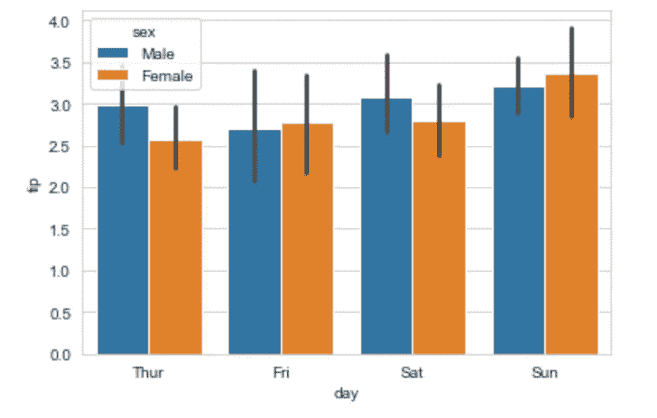

默认的条形图显示了按性别分类的一天的提示比较。我们可以通过命名图、将图例放在图外、删除条形上的线条以及删除网格来定制它。

```
#customize
sns.set_style("whitegrid")
bar,ax = plt.subplots(figsize=(10,8))
ax = sns.barplot(x='day', y='tip', data=df1, hue='sex', palette='Set1', ci=None,orient='v')
ax.set_title("Tips by day categorized by sex", fontsize=20)
ax.set_xlabel (" ", fontsize=15)
ax.set_ylabel ("tip", fontsize=15)
ax.tick_params(axis='x', labelsize=15)
ax.tick_params(axis='y', labelsize=15)
ax.grid(False)
plt.legend(bbox_to_anchor=(1.05, 1), loc=2, borderaxespad=0., fontsize=15) #legend
```

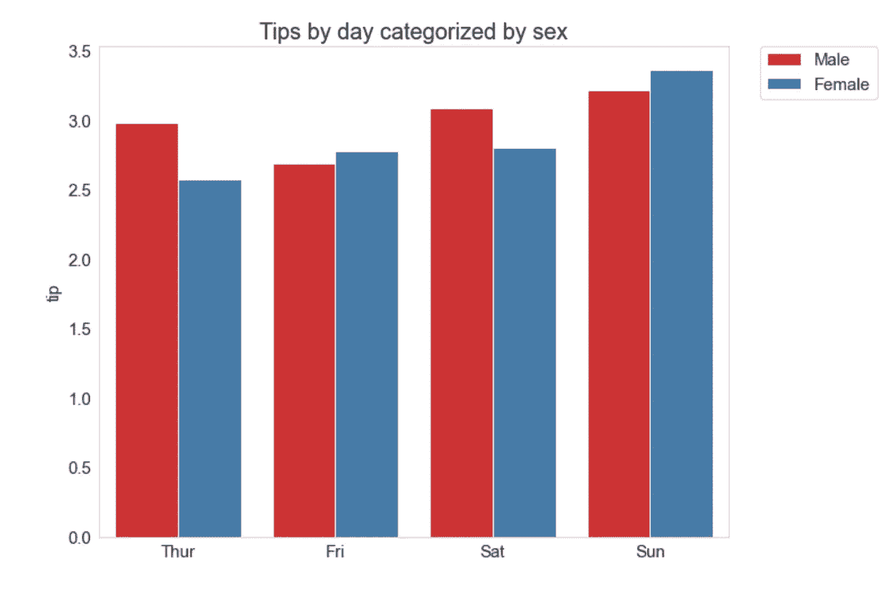

创建的新情节比默认情节可读性更强，视觉上更悦目。

**数据集 3**

该数据集包含一家航空公司的航班信息，是创建时间序列图的好方法。

```
#third dataset
df2 = sns.load_dataset("flights")
df2.head()
```

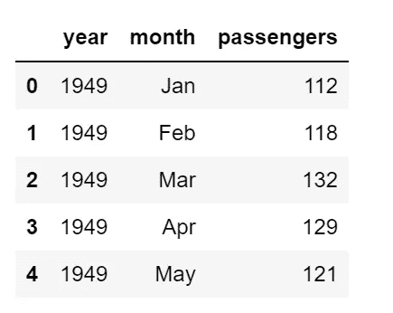

```
sns.lineplot(data=df2, x="year", y="passengers")
```

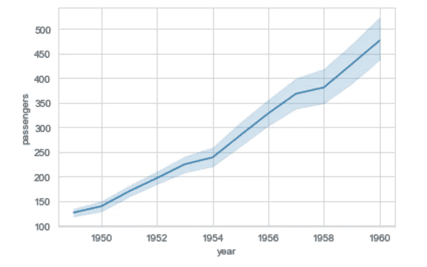

将这一年与乘客人数相比，我们看到乘客人数每年都在增加。让我们添加一个分类变量作为色调。

```
sns.lineplot(data=df2, x="year", y="passengers", hue='month')
```

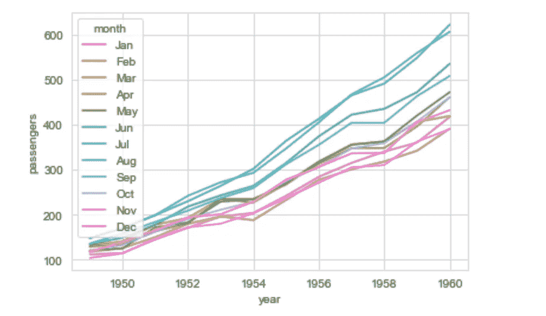

默认的图是不可读的，由于默认的调色板和图例被挤压在图中，我们无法分辨每个月的信息。让我们自定义它，使它更具可读性。

```
#customize
bar,ax = plt.subplots(figsize=(10,6))
ax=sns.lineplot(data=df2, x="year", y="passengers", hue='month', palette='Dark2')
ax.set_ylabel ('', fontsize=20)
ax.set_xlabel ('Passengers', fontsize=20)
ax.tick_params(axis='x', labelsize=20) #x axis text
ax.tick_params(axis='y', labelsize=20) #y axis text
ax.grid(False) #remove grid
plt.legend(bbox_to_anchor=(1.05, 1), loc=2, borderaxespad=0., fontsize=15) #legend
```

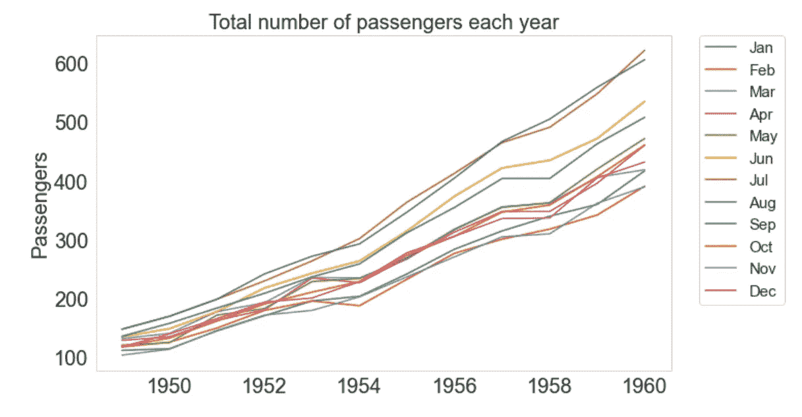

现在我们可以清楚地看到剧情中的信息。

当我们不依赖默认的图表进行分析，但我们也编写额外的代码，使我们的图表更加美观时，就需要在数据可视化中融入艺术。对于将艺术添加到数据可视化的更复杂和更高级的形式，绘图被导出为 SVG 文件，并使用矢量插图软件进行编辑。

[](/mlearning-ai/mlearning-ai-submission-suggestions-b51e2b130bfb) [## Mlearning.ai 提交建议

### 如何成为 Mlearning.ai 上的作家

medium.com](/mlearning-ai/mlearning-ai-submission-suggestions-b51e2b130bfb)