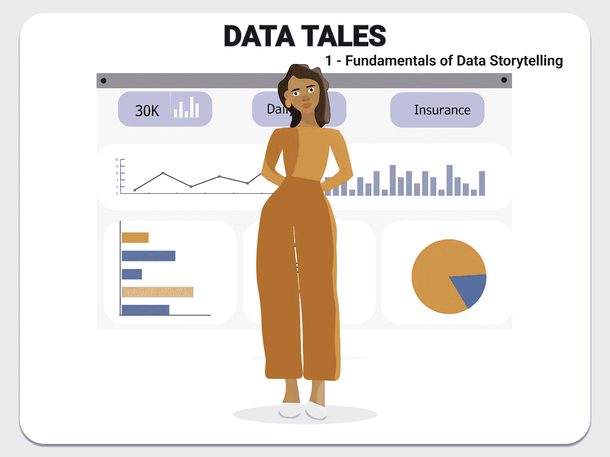

# 数据故事:数据故事的基础

> 原文：<https://medium.com/mlearning-ai/data-tales-fundamentals-of-data-storytelling-15aafe5f66d6?source=collection_archive---------2----------------------->

从制图学时代到洞穴中的符号，再到创建仪表盘，数据故事在传达每条数据背后的信息方面一直扮演着关键角色。

数据故事讲述者通过引人注目的叙述向特定受众传达信息。可以说这是数据分析中最重要的部分。

数据故事的美妙之处有不同的形式，每个数据故事讲述者都有自己的风格。从制作信息图到 PowerPoint 演示，再到技术文档，数据故事化的工作就是用信息文本解释图表和图形。

**数据讲述的步骤**

**1。项目主题**

在你为工作、自由职业项目或学习开始任何数据分析之前，你需要首先确定项目主题。它可以包括医疗保健、技术、生活方式、食品、交通、金融等。尽早确定项目主题有助于创建一个能够解决该问题的数据故事报告。

**2。观众**

你的数据叙述报告应该向听众传达项目主题的信息。观众可以是该领域的学习者或专家，或者两者兼而有之。永远把自己想象成观众，记住，因为你觉得好看，其他人可能就不一样了。

**3。数据源**

无论您是从公共数据中获取数据集，还是从 web 上搜集，您都需要一个针对所选主题的数据集。快速的网络搜索可以帮助你缩小数据集来源的范围。

**4。数据采集**

在你选择了获取这些数据的方式后，你可以下载或者使用网络清理工具从网站上抓取这些数据。此外，请记住，数据可能填充了缺失值，或者可能是非结构化数据集，因此必须对其进行处理、转换和清理，以便进行分析。

**5。工具**

你需要选择你需要的分析软件。它会是像 R 或 Python 这样的编程语言，还是像 Tableau 或 Power BI 这样的 BI 软件，或者使用 SQL。选择可以用来进行分析的最佳工具也是最终获得良好数据的关键。

**6。图形表示**

选择有助于传递信息的正确情节很重要。避免可能太复杂而无法向观众解释的模糊情节。例如，饼图适合表示小于或等于 5 的变量。

**7。最终报告**

在这里，您可以决定展示报告的最佳方式。是信息图、PowerPoint 演示文稿、PDF 文件还是博客文章？美观的图表和正确的排版吸引眼球，尤其是当它们彼此同步的时候。避免使用太多的颜色，除非你能让它们发挥作用。

为了简单快速地开发数据故事报告，您可以创建一个步骤流程图，突出上面提到的要点，并指出您在下面选择的答案。你可以用在线思维导图工具来做这个，甚至做一个粗略的草图。你也可以为你的主题创建一个情绪板，其中将包括数据源的截图和一些已经解决或谈论过这个问题的在线作品。

在我的下一篇文章中，我将使用在 Iris 数据集上完成的 [EDA](/mlearning-ai/an-alliance-python-and-r-eda-9336e66fc65c) 创建一个数据故事报告，以获得更具技术性的数据故事方法。

 [## Mlearning.ai 提交建议

### 如何成为 Mlearning.ai 上的作家

medium.com](/mlearning-ai/mlearning-ai-submission-suggestions-b51e2b130bfb)