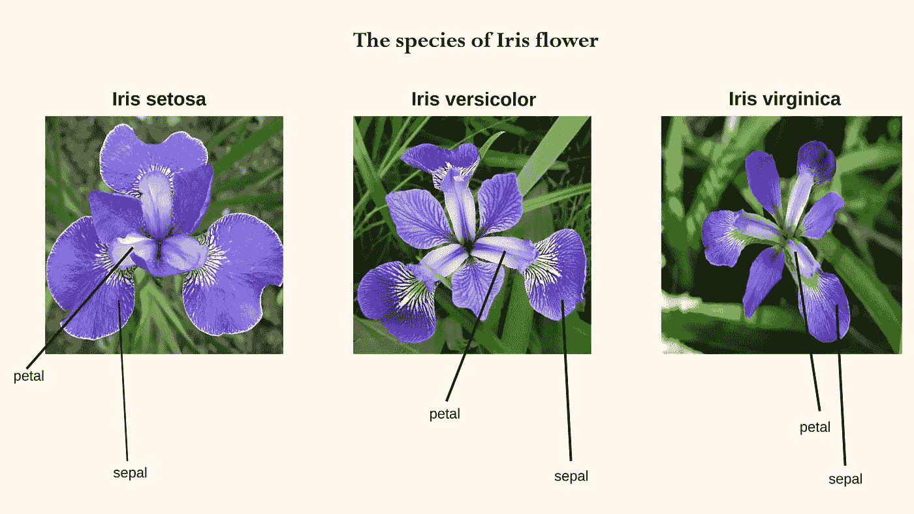
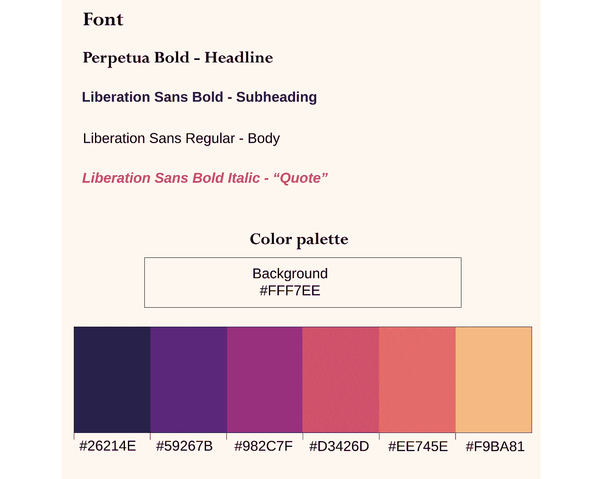
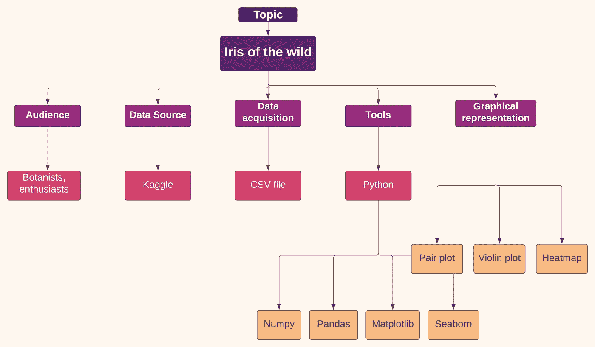
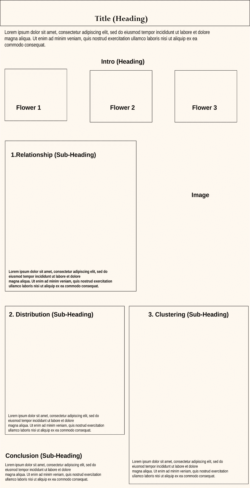
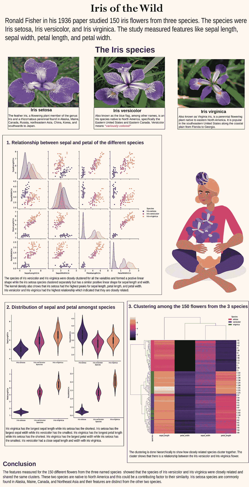

# 数据故事:野生鸢尾

> 原文：<https://medium.com/mlearning-ai/data-tales-iris-of-the-wild-ceb02a6a7c83?source=collection_archive---------4----------------------->

在我的上一篇[文章](/mlearning-ai/data-tales-fundamentals-of-data-storytelling-15aafe5f66d6)中，我提到了数据叙事的基础，以及如何使用它们来构建数据叙事报告。在本教程中，我们将使用信息图中 iris 数据集的 [EDA](/mlearning-ai/an-alliance-python-and-r-eda-9336e66fc65c) 构建一个项目。这将作为使用信息图创建数据故事报告的初学者指南。本研究的信息图将采用定制的 1050 x 2050pt 磅尺寸。

**让我们开始吧！！！**

**简介**

罗纳德·费雪在他 1936 年的论文中使用的三种鸢尾花是刚毛鸢尾、杂色鸢尾和海滨鸢尾。

羽鸢尾(Iris setosa**)是鸢尾属的开花植物成员，是一种根茎多年生植物，分布于阿拉斯加、缅因州、加拿大(包括不列颠哥伦比亚、纽芬兰、魁北克和育空地区)、俄罗斯(包括西伯利亚)、东北亚、中国、朝鲜以及向南至日本。高大的分枝茎，中绿色的叶子，紫色，紫蓝色，紫蓝色，蓝色，淡紫色的花是这种植物的特征。**

**杂色鸢尾**又名蓝旗、丑角蓝旗、大蓝旗、北蓝旗、毒旗等，在英国和爱尔兰称为紫色鸢尾。它是原产于北美的鸢尾属植物，特别是美国东部和加拿大东部。它生长在莎草草甸，沼泽，沿着河岸和海岸线。杂色是一种特殊的称谓，意思是“各种颜色”

**北美鸢尾**又名弗吉尼亚鸢尾，是一种原产于北美东部的多年生开花植物。它流行于美国东南部从佛罗里达到佐治亚的沿海平原。

研究的特征是每朵花的萼片长度、萼片宽度、花瓣长度和花瓣宽度。

**配色方案和排版**

我选择 Perpetua bold 作为我的标题，解放 Sans 作为正文的其余部分。你可以选择使用一种字体的报告，使用两种字体的信息图是我的偏好，这两种字体不是太明显。

使用颜色生成器可以帮助您为报表生成调色板。我通常使用 c[toolors](https://coolors.co/)来为我的作品选择调色板，但这次，我使用了 seaborn magma 调色板，它是用来创建图表的。这个调色板也是一个温暖的调色板，融合了鸢尾花的紫色。

**项目地图**

我用 [Lucid](http://lucid.app) 制作了一个流程图，其中包含了我用来为讲故事报告构建数据的细节。流程图有助于规划从数据集生成数据的步骤，并帮助任何浏览报表的人了解创建报表的过程。

**线框**

在放入文本、图像和图表之前，最好做一个线框来显示信息适合的不同部分。你可以通过在纸上画出来或者用插图说明来做到这一点。我用 Adobe illustrator 创建了一个带有虚拟文本和形状的线框。在制作实际的信息图之前先使用线框的重要性可以帮助你看到最终的信息图将会是什么样子。在没有线框的情况下工作会让你在最后阶段有点困惑和缓慢。

**最终信息图**

在使用线框展示和可视化信息后，我使用真实的文本、图像和图表来创建信息图。使用线框作为指导，我把文本、图像和图表放入我绘制的部分中。

通过这些步骤，我刚刚制作了一个解释虹膜数据集的信息图。

**提示**

数据是您工作的一个重要方面，最好将它们导出为 SVG 文件，这样您就可以通过编辑背景来定制它们，以与您的定制背景相融合，如果您想更改调色板，也可以这样做。我用来制作信息图表或定制图表的软件是 Adobe Illustrator。你可以使用你选择的任何图形软件，这完全取决于一个无缝和快速掌握。

 [## Mlearning.ai 提交建议

### 如何成为 Mlearning.ai 上的作家

medium.com](/mlearning-ai/mlearning-ai-submission-suggestions-b51e2b130bfb)