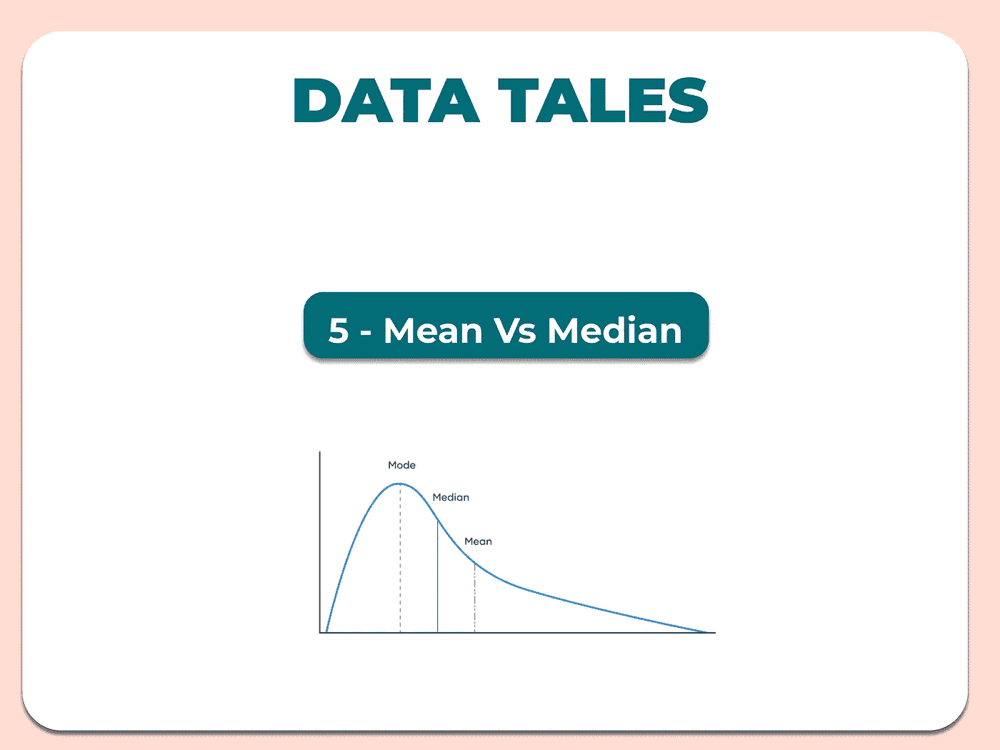
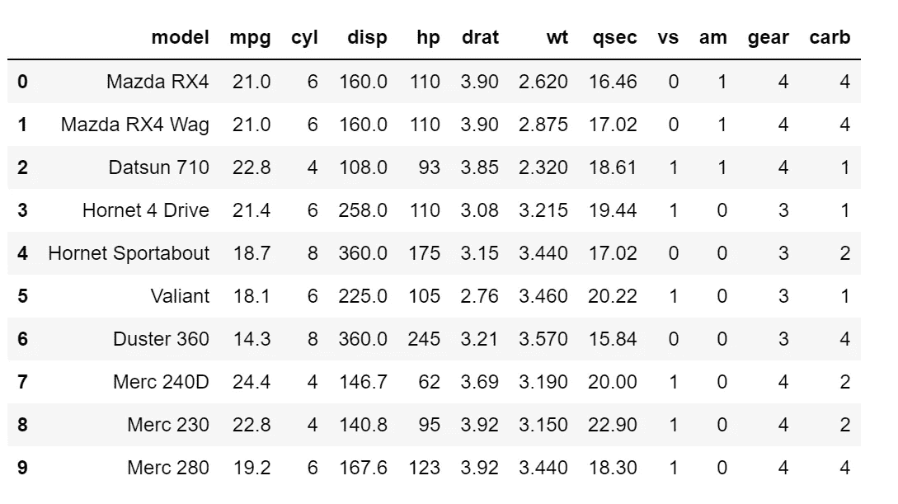
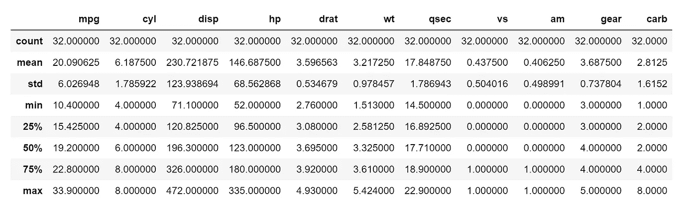
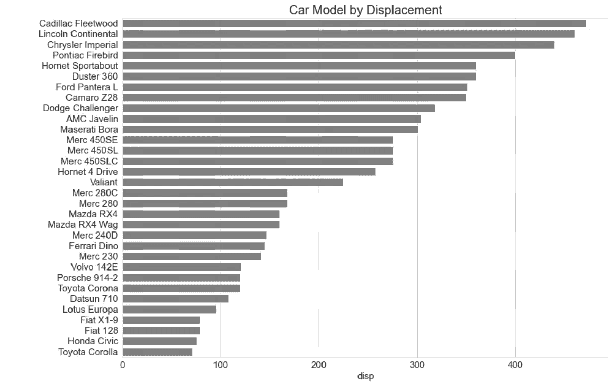
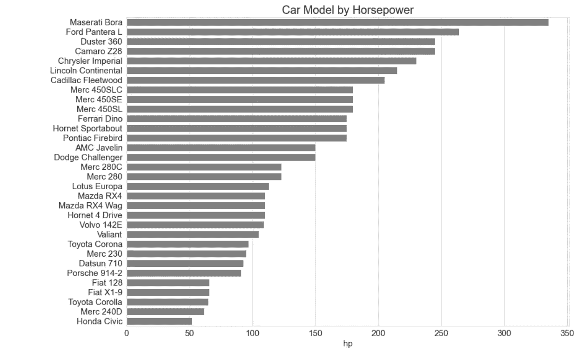
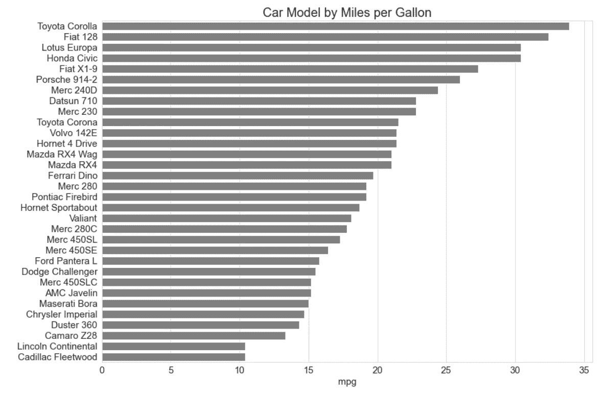
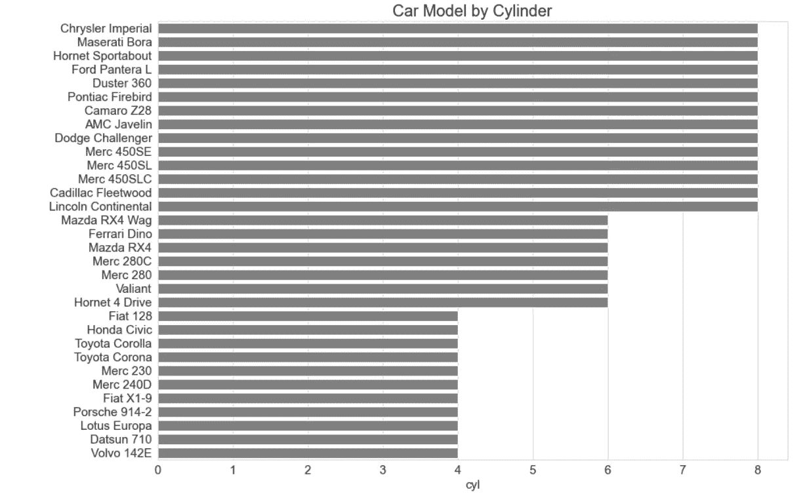

# 数据故事:平均值与中位数

> 原文：<https://medium.com/mlearning-ai/data-tales-mean-vs-median-3cd02062fd81?source=collection_archive---------5----------------------->



随着信息的不断涌入，当我们筛选大量可用数据时，需要正确的数据解释。大多数时候，并不是所有的数据都需要清理，因为值的范围很广，或者被称为离群值。这些异常值的存在是因为数据的不平等。

例如，如果我们有数据显示尼日利亚年龄在 20-39 岁之间的人的年收入，这些数据将是不一致的，并将是扭曲的。但像这样的数据集背后的美妙之处在于会有一组值，有时这些组会被忽略。

我们通常解释这样一个数据集的一般方法是求平均值，然后我们最终报告如下:

*‘20-39 岁的尼日利亚人的平均年薪为 X 奈拉’*

这个值并没有错，但是它没有解决基于偏斜度的数据所要解决的问题。该年龄段的一些人收入较高，一些人收入尚可，一些人收入略高于或低于最低工资，而一些人收入低于最低工资。该数据中不存在等式，因此平均值是使用和解释数据结果的危险工具。

这就是中间值出现的地方。无论是按升序还是降序排序，中位数都是数据集中的中间数。中值以这些聚类为目标，并为您提供希望用数据集解决的问题的准确答案。

让我们使用 mtcars 数据集，通过使用 python 分析数据集来进一步解决这个问题。

```
df = pd.read_csv('mtcars.csv')
df.head(10)
```



```
df.describe()
```



当我们比较最小值和最大值时，排量(disp)和马力(hp)等变量有很大的取值范围。我们可以通过柱状图快速直观地观察分布情况。

**位移**

```
#customize
sns.set_style("whitegrid")
bar,ax = plt.subplots(figsize=(14,10))
ax = sns.barplot(x='disp', y='model', data=df, order=df.sort_values('disp', ascending = False).model, ci=None, color='grey',orient='h')
ax.set_title("Car Model by Displacement", fontsize=20)
ax.set_xlabel ("disp", fontsize=15)
ax.set_ylabel (" ", fontsize=15)
ax.tick_params(axis='x', labelsize=15)
ax.tick_params(axis='y', labelsize=15)
```



让我们检查一下平均值和中间值:

```
#mean
round(df['disp'].mean())
231#median
df['disp'].median()
196.3
```

当从平均值中减去中间值时，存在 34.7 的差异，并且该值太高而不能使用平均值来表示位移。

**马力**

```
#customize
sns.set_style("whitegrid")
bar,ax = plt.subplots(figsize=(14,10))
ax = sns.barplot(x='mpg', y='model', data=df, order=df.sort_values('mpg', ascending = False).model, ci=None, color='grey',orient='h')
ax.set_title("Car Model by Miles per Gallon", fontsize=20)
ax.set_xlabel ("mpg", fontsize=15)
ax.set_ylabel (" ", fontsize=15)
ax.tick_params(axis='x', labelsize=15)
ax.tick_params(axis='y', labelsize=15)
```



```
#mean
round(df['hp'].mean())
147#median
df['hp'].median()
123
```

当从平均值中减去中间值时，差值为 24，这个值太高，不能用平均值来表示马力。

这并不是说平均值没有达到它的目的，它确实有助于一个范围内的值。在该数据集中，可以使用平均值计算诸如每加仑英里数(mpg)、气缸数(cyl)、重量(wt)、1/4 英里时间(qsec)、V/S (vs)、变速器类型(am)、前进档数(gear)和化油器数(carb)等变量。

**每加仑英里数**

```
#customize
sns.set_style("whitegrid")
bar,ax = plt.subplots(figsize=(14,10))
ax = sns.barplot(x='mpg', y='model', data=df, order=df.sort_values('mpg', ascending = False).model, ci=None, color='grey',orient='h')
ax.set_title("Car Model by Miles per Gallon", fontsize=20)
ax.set_xlabel ("mpg", fontsize=15)
ax.set_ylabel (" ", fontsize=15)
ax.tick_params(axis='x', labelsize=15)
ax.tick_params(axis='y', labelsize=15)
```



```
#mean
round(df['mpg'].mean())
20#median
df['mpg'].median()
19.2
```

我们看到，在这个变量中，平均值和中值之间没有太大的差异，因此平均值可以用来表示每加仑的英里数。

让我们看另一个例子:

**气缸**

```
#customize
sns.set_style("whitegrid")
bar,ax = plt.subplots(figsize=(14,10))
ax = sns.barplot(x='cyl', y='model', data=df, order=df.sort_values('cyl', ascending = False).model, ci=None, color='grey',orient='h')
ax.set_title("Car Model by Cylinder", fontsize=20)
ax.set_xlabel ("cyl", fontsize=15)
ax.set_ylabel (" ", fontsize=15)
ax.tick_params(axis='x', labelsize=15)
ax.tick_params(axis='y', labelsize=15)
```



```
#mean
round(df['cyl'].mean())
6#median
df['cyl'].median()
6
```

圆柱体的平均值和中值都是 6，因此可以用平均值来表示。

均值和中位数都有其独特的用途，关键是要知道什么时候应用它们。

[](/mlearning-ai/mlearning-ai-submission-suggestions-b51e2b130bfb) [## Mlearning.ai 提交建议

### 如何成为 Mlearning.ai 上的作家

medium.com](/mlearning-ai/mlearning-ai-submission-suggestions-b51e2b130bfb)