# 数据故事:不太可能的情节

> 原文：<https://medium.com/mlearning-ai/data-tales-unlikely-plots-1882c2a903da?source=collection_archive---------0----------------------->

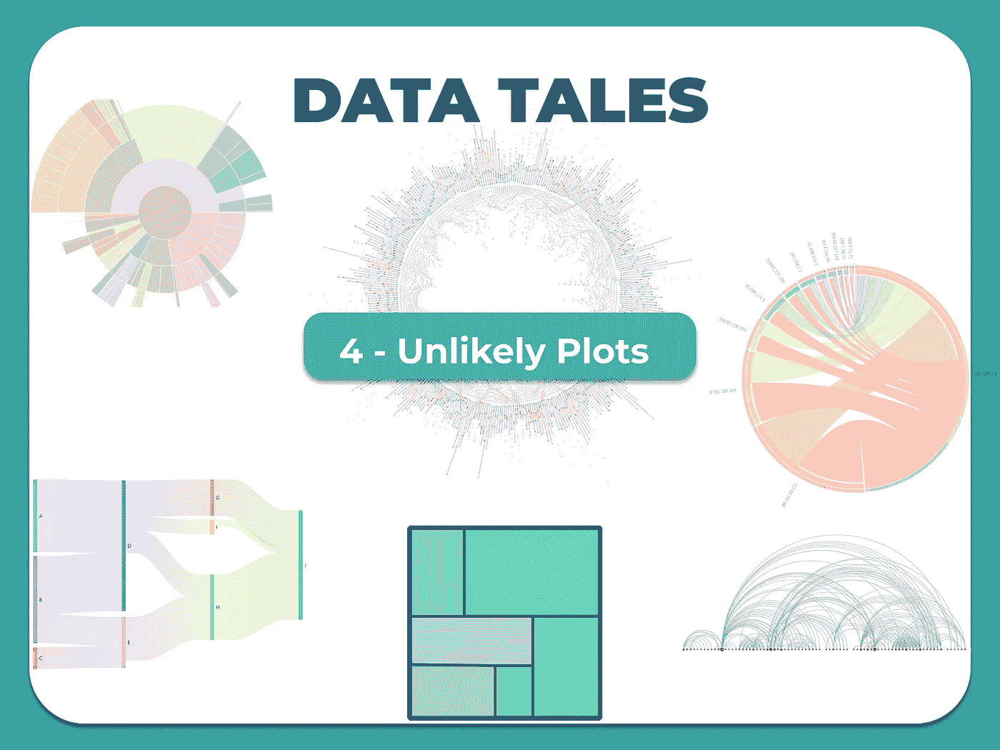

你可能听说过它们，也可能没有，但这些图用于数据可视化，它们以自己独特的方式解释数据。我们最常用的数据可视化图是饼图、条形图、小提琴图、散点图、直方图、核密度图、热图等，但数据可视化可以通过一系列方式完成，这些图显示了数据可视化的方式。

1.旭日图

它们也被称为环形图和径向树图，用于可视化数据集中的层次结构。它将层级表示为一系列相连的环，每个环代表一个层级。

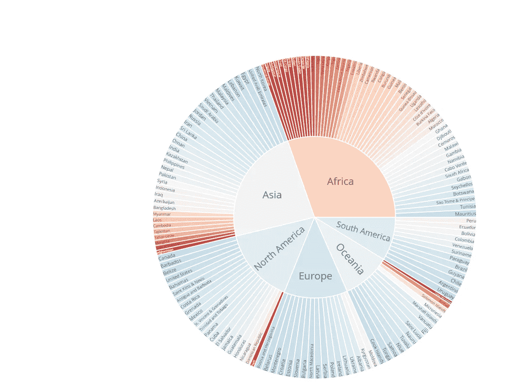

Example of Sunburst chart

2.树形图

树形图将分层(树形结构)数据表示为分层矩形的集合。每个树分支被分配一个矩形，然后用显示子分支的更小的矩形分层。节点经常被着色以表示数据集的不同大小。

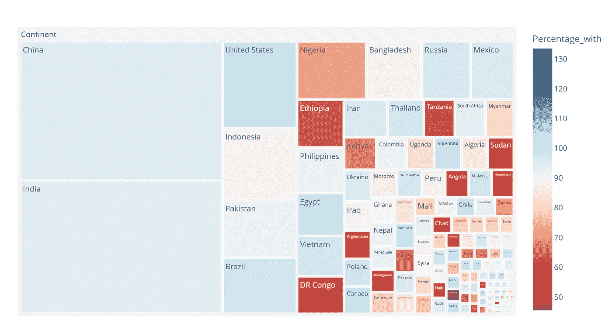

Example of Treemap chart

3.桑基图

这是一种显示流程的数据可视化方法。矩形或文本用于表示各种节点，它们的连接由箭头或弧线表示，其宽度大约等于流的重要性。

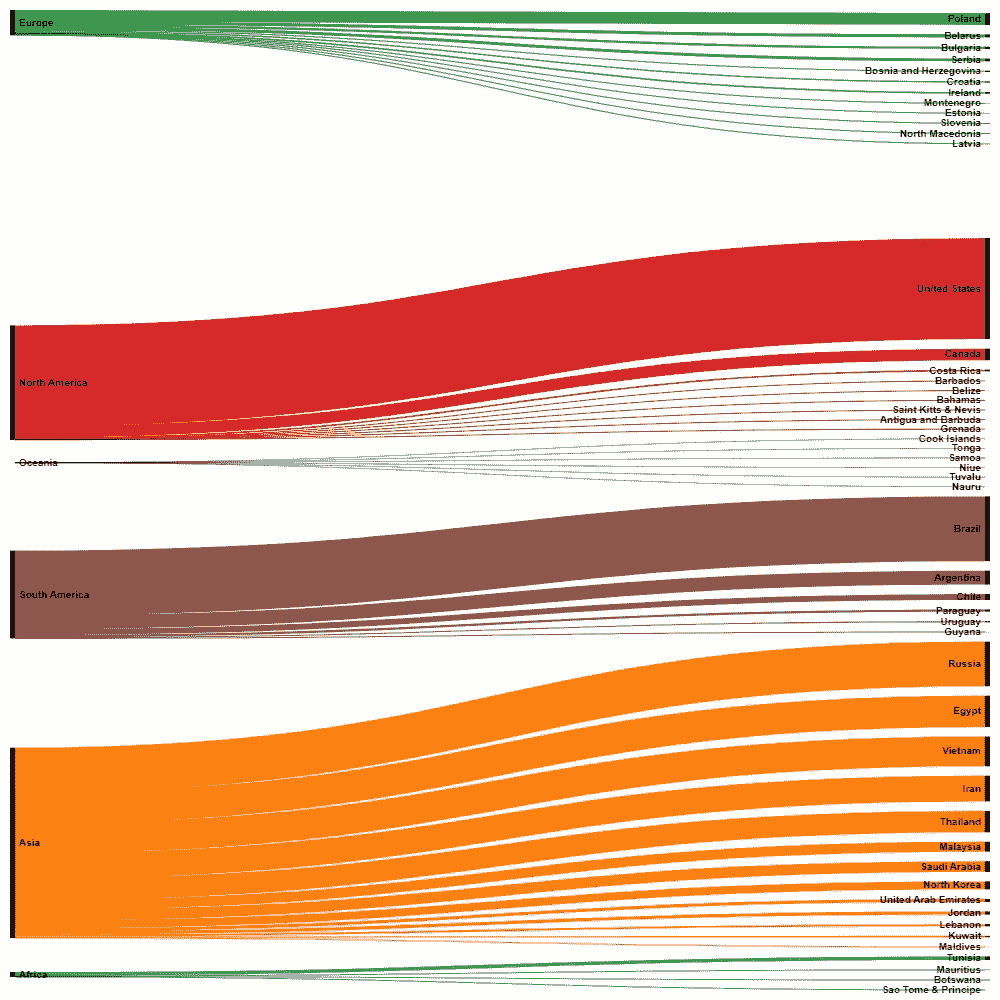

Example of Sankey diagram

4.弧形图

这是一种网络图，由代表实体的节点和展示对象之间关系的连接组成。在弧图中，端点沿单个比例突出显示，链接由弧表示。

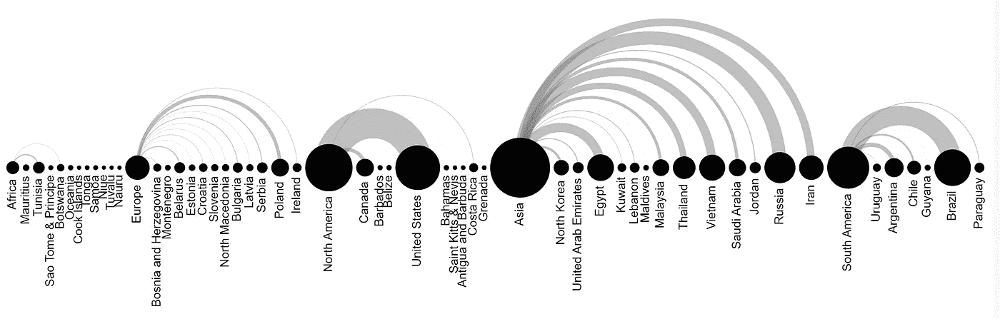

Example of arc diagram

5.弦图

该图描述了不同节点之间的流程或交互。每个通常由螺旋布局边缘上的一段来表示。然后在每个实体之间画出弧线。弧的大小大约等于流的重要性。

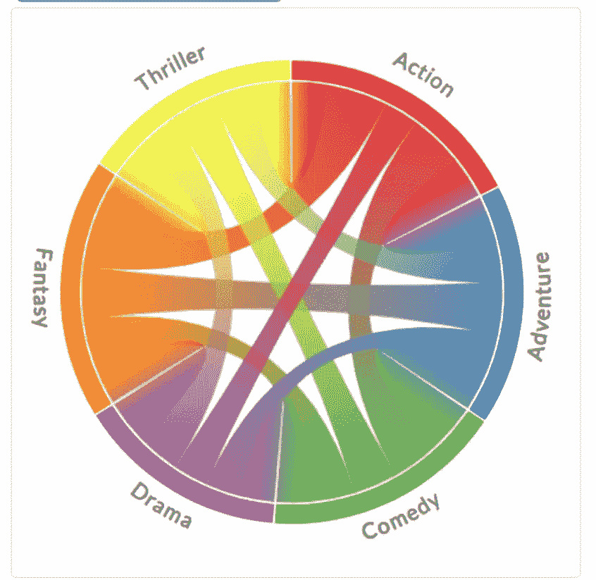

Example of chord diagram from [https://python-graph-gallery.com/chord-diagram/](https://python-graph-gallery.com/chord-diagram/)

6.流图

这是一个围绕中心点移动的堆积面积图，形成一个流动的有机形状。与层堆叠在轴顶部的传统堆叠面积图不同，流图中的层被定位为最小化一种摆动效应。

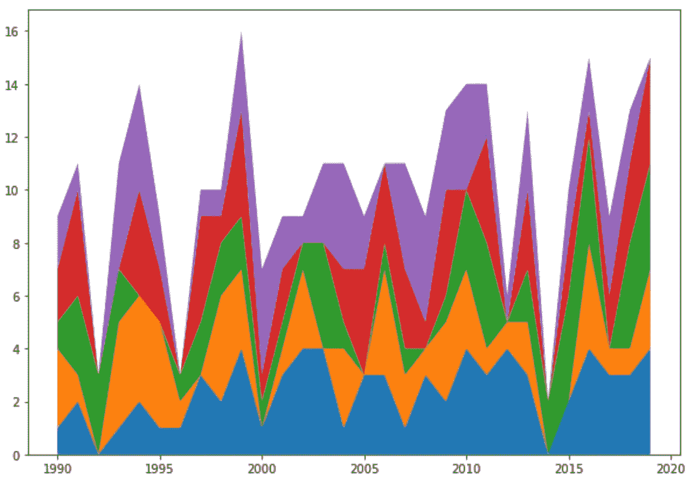

Example of streamgraph from [https://python-graph-gallery.com/streamchart-basic-matplotlib](https://python-graph-gallery.com/streamchart-basic-matplotlib)

7.甘特图表

这是一种条形图，用于显示项目进度，例如项目的开始和结束日期。

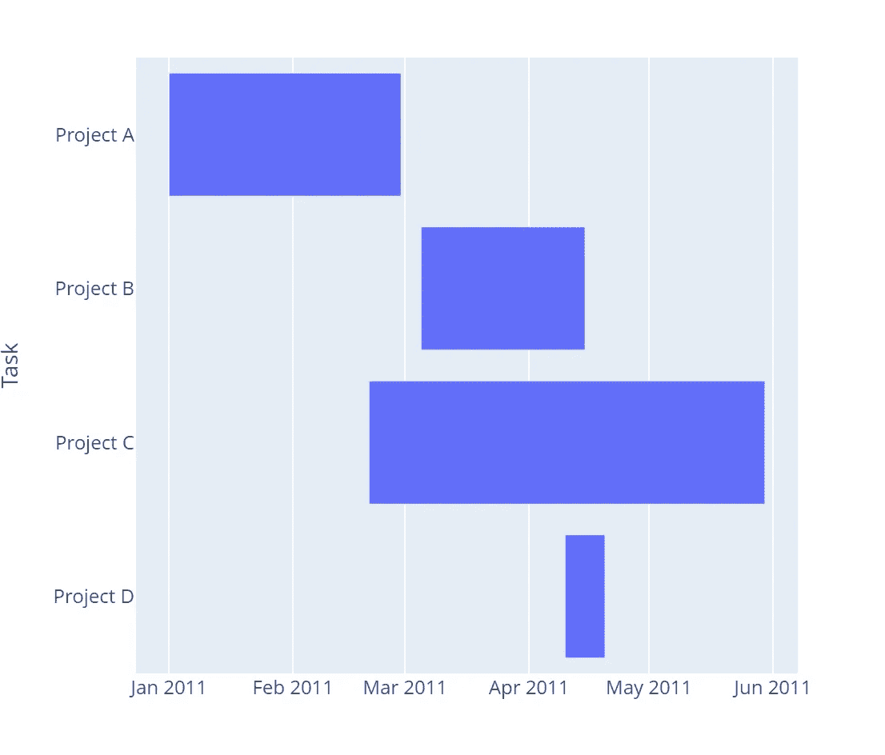

Example of Gantt chart

8.线性和圆形树状图

它们是一种网络结构，由一个父节点组成，父节点产生许多由 rim 或分支链接的节点。层次结构底部的节点称为叶子。

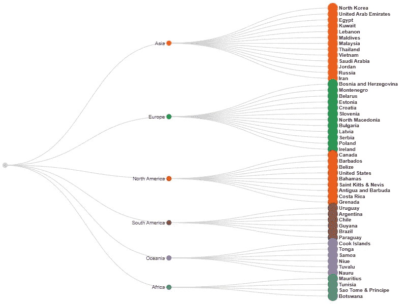

Example of a linear dendrogram

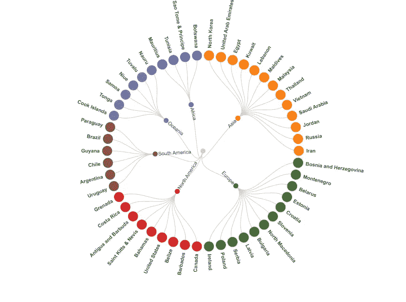

Example of a circular dendrogram

9.圆形包装

它类似于树状图或系统树图，树的每个节点都表示为一个圆，其中的子节点表示为圆。可以使用循环打包或循环树形图来可视化层次结构。每个圆的大小可以与特定值成比例，这增加了绘图的深度。

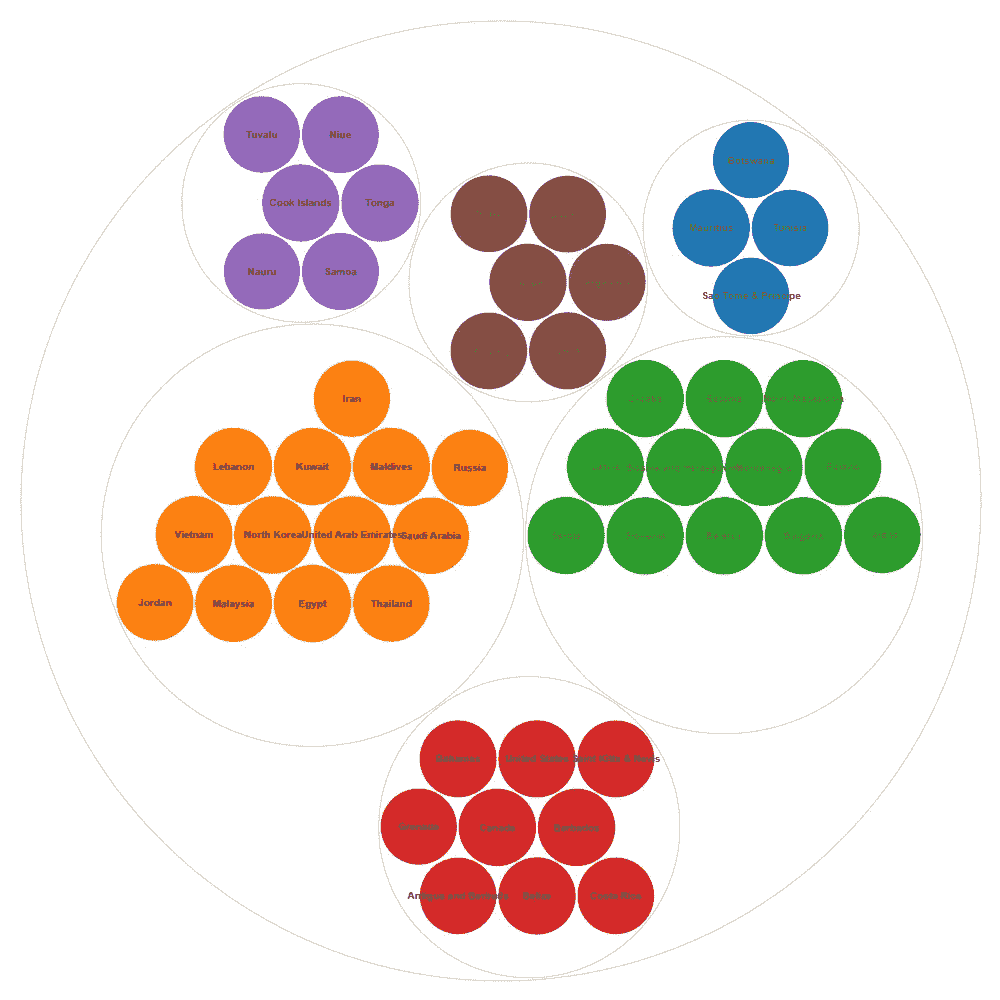

Example of circular packing

10.Wordcloud

单词云(或标签云)显示单词列表，每个单词的意义由字体大小或颜色表示。这种格式有助于快速识别最重要的术语。

Example of a Wordcloud

如上所述，这些图各有其用途，仅在必要时使用。考虑到它们本质上是复杂的，它们不应该使你的数据视觉效果复杂化，而是有助于数据集的视觉解释。

 [## Mlearning.ai 提交建议

### 如何成为 Mlearning.ai 上的作家

medium.com](/mlearning-ai/mlearning-ai-submission-suggestions-b51e2b130bfb)