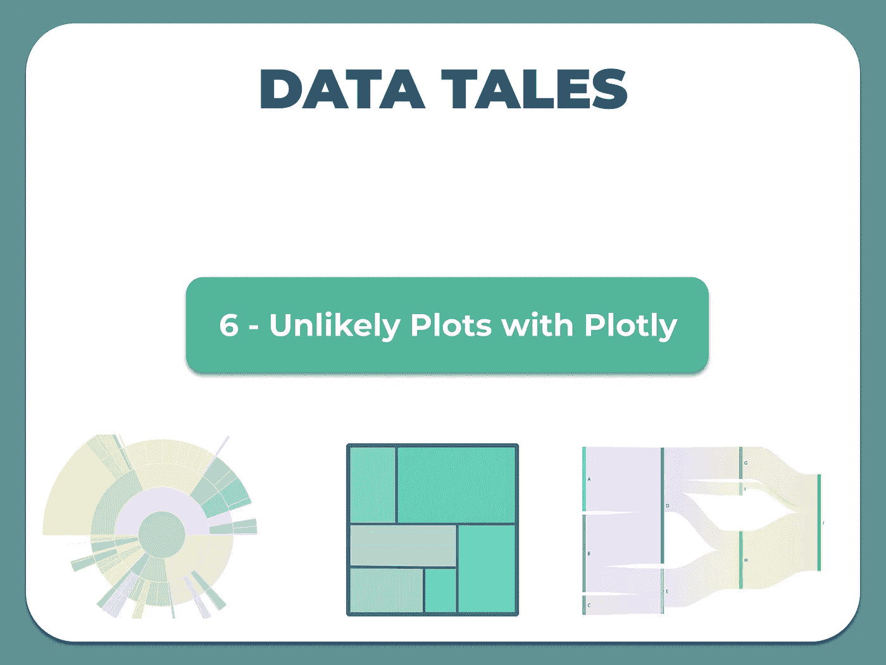
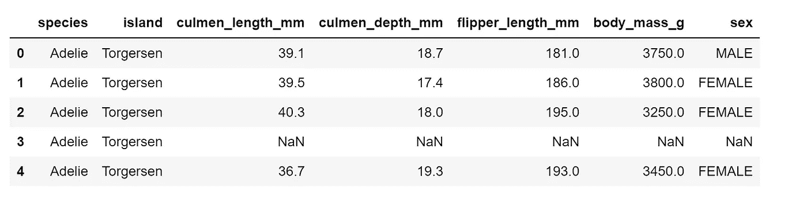
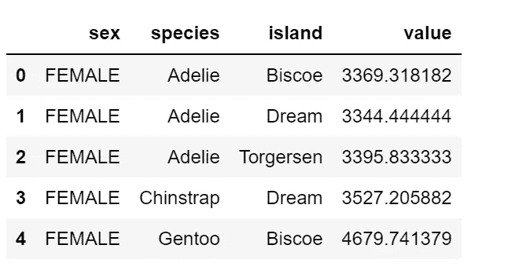

# 数据故事:与 Plotly 不太可能的阴谋

> 原文：<https://medium.com/mlearning-ai/data-tales-unlikely-plots-with-plotly-f3e914f4f0a8?source=collection_archive---------2----------------------->



在我关于用于数据分析的[不可能的](/mlearning-ai/data-tales-unlikely-plots-1882c2a903da)图的文章中，我提到了一些我们可以用于数据分析的图。python 和 R 中提供的 Plotly 库允许用户创建漂亮的基于 web 的交互式可视化，可以在 Jupyter 笔记本中显示，保存到独立的 HTML 文件中，或者作为使用 Dash 的纯 Python 构建的 web 应用程序的一部分。

该库还可用于创建交互式条形图、饼图、散点图等，但数据分析不限于这些图表，还可以其他方式可视化，尤其是当您想要捕获数据集中包含的大量信息时。为了解释这一点，我们将使用企鹅数据集，其中包含不同种类企鹅的信息，它们所在的岛屿，它们的长度和深度，鳍状肢长度，体重和性别。

让我们来看看这个数据集:



分类变量是物种、岛屿和性别，而数值变量是长度和深度、鳍状肢长度、体重和性别。这些信息可以同时用旭日图、桑基图、树状图等图表来表示。为了可视化这个数据集，我删除了空值并清理了数据集。我将继续使用这些图来可视化数据集。

*用 Python 导入 Plotly*

```
import plotly
import plotly.graph_objs as go
import plotly.express as px
import plotly.graph_objects as go
from plotly.offline import iplot
import plotly.io as pio
```

**旭日图**

假设我们想要可视化性别、物种和岛屿，还想知道属于这一类别的企鹅的体重和鳍状肢长度。旭日图可以通过在语法中添加变量来显示我们需要的信息。

```
fig = px.sunburst(df, path=['sex', 'species', 'island'], values='flipper_length_mm',
                  color='body_mass_g',
                  color_continuous_scale='RdBu',
                  color_continuous_midpoint=np.average(df['body_mass_g'], weights=df['flipper_length_mm']))
iplot(fig, image='png', filename='penguin', image_width=1280, image_height=1280)
```

环的尺寸值是脚蹼的长度，环的颜色是身体质量。

从图中可以看出，在比斯科岛上发现的雄性巴布亚企鹅有最长的鳍状肢长度和最高的体重，而在比斯科岛上发现的雌性巴布亚企鹅也有很长的鳍状肢长度，但体重低于雄性。一般来说，雄性的体重和脚蹼长度都比雌性高。我们还可以看到，阿德利物种可以在梦岛、托格森岛和比斯库岛找到，而巴布亚只能在比斯库岛和梦岛上的下巴颏带上找到。

**树形图**

我们可以用分类变量来形象化地表示它们的长度和深度。矩形的大小将是竿的深度，颜色将是竿的长度。

```
fig = px.treemap(df, path=["sex", 'species', 'island'], values='culmen_depth_mm',
                  color='culmen_length_mm',
                  color_continuous_scale='RdBu',
                  color_continuous_midpoint=np.average(df['culmen_length_mm'], weights=df['culmen_length_mm']))
fig.update_layout(margin = dict(t=50, l=25, r=25, b=25))
fig.show()
```

就像旭日图一样，树形图显示了我们需要的矩形信息。

**桑基**

我们可以用体重作为桑基图的数字变量来比较企鹅性别和物种之间的流量。为此，我们必须从数据集创建一个新的 dataframe 来获取绘图变量。

```
df1 = df.groupby(['sex', 'species', 'island'])['body_mass_g'].mean()
df1 = df1.to_frame(name='value').reset_index()
df1.head()
```



```
#create the plot
all_nodes = df1.sex.values.tolist() + df1.species.values.tolist()
source_indices = [all_nodes.index(sex) for sex in df1.sex]
target_indices = [all_nodes.index(species) for species in df1.species]fig = go.Figure(data=[go.Sankey(
    node = dict(
      pad = 20,
      thickness = 20,
      line = dict(color = "black", width = 1.0),
      label =  all_nodes,
    ),link = dict(
      source =  source_indices,
      target =  target_indices,
      value =  df1.value,
))])fig.update_layout(title_text="Penguins",
                  font_size=10)
fig.show()
```

我们也可以用桑基图来观察物种和岛屿之间的流动。

```
all_nodes = df1.species.values.tolist() + df1.island.values.tolist()
source_indices = [all_nodes.index(species) for species in df1.species]
target_indices = [all_nodes.index(island) for island in df1.island]fig = go.Figure(data=[go.Sankey(
    node = dict(
      pad = 20,
      thickness = 20,
      line = dict(color = "black", width = 1.0),
      label =  all_nodes,
    ),link = dict(
      source =  source_indices,
      target =  target_indices,
      value =  df1.value,
))])fig.update_layout(title_text="Penguins",
                  font_size=10)
fig.show()
```

通过使用`library(plotly)` 命令安装和导入，Plotly 库在 R 中也是可用的。

[](/mlearning-ai/mlearning-ai-submission-suggestions-b51e2b130bfb) [## Mlearning.ai 提交建议

### 如何成为 Mlearning.ai 上的作家

medium.com](/mlearning-ai/mlearning-ai-submission-suggestions-b51e2b130bfb)