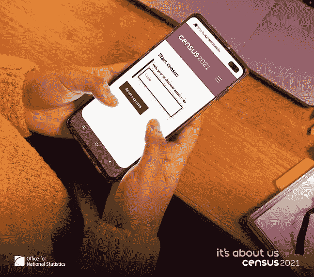
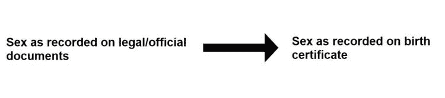
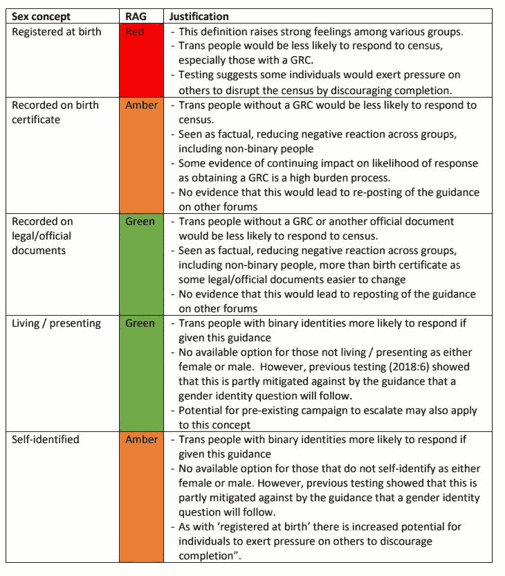
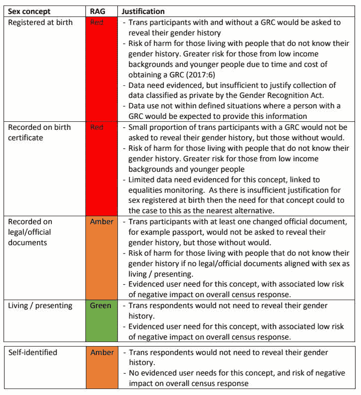
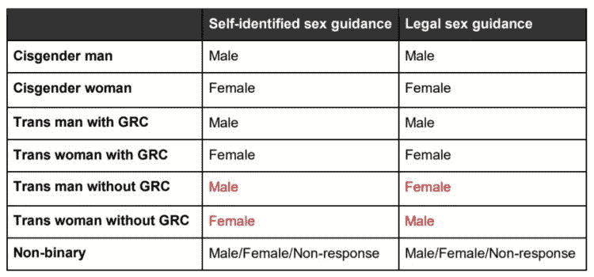

# 数据破坏:性别与英格兰和威尔士人口普查

> 原文：<https://medium.com/mlearning-ai/data-vandalism-sex-and-the-english-and-welsh-census-ac089a01a889?source=collection_archive---------8----------------------->

近几个月来，在英国，试图将跨性别者从数据收集活动中抹去的努力愈演愈烈，英格兰和威尔士人口普查中性别问题指南的最后一分钟改变只是破坏数据的最新例子。

2021 年 2 月 12 日，英国国家统计局(ONS)发布了[关于如何回答“你的性别是什么？”这个问题的新指南](https://www.ons.gov.uk/census/censustransformationprogramme/questiondevelopment/genderidentity/census2021finalguidanceforthequestionwhatisyoursex)在 2021 年英格兰和威尔士人口普查中。新的指南解释说:“如果你正在考虑如何回答，使用你的法律文件中记录的性别，如出生证明、性别认可证明或护照”。

除了公布修订后的指导意见，英国国家统计局还公布了一份 32 页的报告，介绍了用于指导其决策的方法和证据。在这份文件中，国家统计局描述了它如何考虑人口普查可以收集数据的五个性的概念:

*   出生时登记的性别
*   出生证明上记录的性别
*   法律/官方文件中记录的性别
*   性作为生活/呈现
*   自我认同的性

对于每一个概念，国家统计局然后评估这是否会(I)最大限度地提高人口普查的回应，以及(ii)确保任何感知的隐私侵犯是合理的。

国家统计局得出的结论是，与“法律/官方文件中记录的性别”一致的指导是 2022 年人口普查的最佳选择，尽管“生活/陈述中的性别”这一概念实际上对人口普查的负面影响较小(该报告未能解释为什么选择“法律/官方文件中记录的性别”而不是“生活/陈述中的性别”)。

跳到 2021 年 3 月，在运动组织“公平对待女性”向英国国家统计局提起诉讼后，一项临时裁决迫使英国国家统计局从指南中删除了“比如”和“或护照”等词，因此受访者被建议根据其出生或性别承认证明上记录的性别回答。国家统计局选择不为自己的立场辩护，因此临时裁决得以维持。

# 红色、琥珀色和绿色

因此，在实践中，法院案例将英格兰和威尔士人口普查中询问的概念从“法律/官方文件上记录的性别”改为“出生证上记录的性别”。

有益的是，国家统计局已经在他们 32 页的方法和证据说明中评估了收集这两个概念数据的差异，使用了红黄绿(RAG)交通灯系统。

就最大化人口普查答复而言，“法律/官方文件上记录的性别”为绿色(没有证据表明在个人层面或社会层面对所有群体的总体答复或性问题答复有负面影响)，而“出生证明上记录的性别”为琥珀色(有证据表明在个人层面或社会层面对社会子集的总体答复或性问题答复有负面影响)。

在确保任何感知的隐私侵犯都是合理的方面，“法律/官方文件上记录的性别”为琥珀色(数据需要不足以证明数据收集的合理性，否则跨性别受访者将被迫透露其性别历史)，而“出生证明上记录的性别”为红色(数据需要不足以证明数据收集的合理性，跨性别受访者将被迫透露其性别历史)。

使用国家统计局设计的交通灯系统，我们可以看到本月的法庭案件如何在两个方面对人口普查中的性别数据收集产生了负面影响(分别从绿色变为琥珀色和琥珀色变为红色)。

# 监管跨性别者如何回答人口普查

提交高等法院的案件并不是为了改变 cis 被告(性别认同与出生时指定的性别相匹配的人，[估计约占人口的 99%](https://assets.publishing.service.gov.uk/government/uploads/system/uploads/attachment_data/file/721704/LGBT-survey-research-report.pdf))回答性别问题的方式，如下表所示。相反，该案件的目的是监督没有性别认可证书(GRC)的跨性别受访者如何回答人口普查。

Table describing how different groups of respondents are expected to answer sex questions that ask about ‘self-identified sex’ versus ‘legal sex’.

# 给研究人员敲响了警钟

这场灾难必须为从事身份特征定量数据收集、分析和使用的研究人员敲响警钟。以及对统计和研究机构进行的循证决策与众筹法律挑战之间的关系提出了更广泛的问题，众筹法律挑战可能会很快取消几个月甚至几年的详细研究。

意识到这些问题后，定量数据、调查和/或大型数据集方面的科学专家写了一封[公开信，声明人口普查中的活性别自我报告不会对高质量数据的收集构成威胁](https://docs.google.com/document/d/1yLGGAUW0mrRWWDkau041lluwx-O27rZHmQmbRZ72uH4/edit?usp=sharing)。此前，2019 年 9 月，研究人员、学者、从业者和数据用户致信苏格兰议会，表示[跨性别者应继续根据他们的生活方式回答人口普查中的性别问题](https://kevinguyan.com/2019/09/22/letter-against-changes-to-the-sex-question-in-scotlands-2021-census/)。

本月的法庭案件引发的数据破坏不一定是关于改变指导如何必然扰乱计数，而是关于对像英国国家统计局这样的组织的信任和信心，以获取关于性别、性和性行为的数据，这些数据是包容性的，反映了人们的日常生活。

**没有人检查任何人是如何回答人口普查的，国家统计局仍然清楚，人口普查指南只针对那些在回答问题时需要帮助的人。因此，本月的法院裁决和对性指导的修改不会改变选择参与人口普查的跨性别者对性问题的回答。然而，这一决定的光学效应以及旨在监管跨性别者如何参与数据收集活动的进一步运动的可能性，可能会对获取个人性别、性和性行为的重要数据的努力产生负面影响。**

*原载于 2021 年 3 月 19 日 http://kevinguyan.com***。**