# Python 中 Coursera 的数据可视化和数据分析

> 原文：<https://medium.com/mlearning-ai/data-visualization-and-data-analysis-of-coursera-in-python-3f5c356a574d?source=collection_archive---------2----------------------->

## Coursera 上的顶级大学、最高评级的课程、Coursera 上不同课程的注册学生人数、Coursera 上的学生偏好以及更多分析


Data Analysis and Visualization Of Coursera

数据科学家们，你们好！

在上一篇数据分析文章中，我们处理了迪士尼+数据。很有趣。在本文中，我们将对 Coursera 数据集进行一些分析。我从 Kaggle 得到的数据更老一些(直到 2020 年)。但这是值得的。所以，我们开始数据分析和可视化吧，别忘了喝杯咖啡。

# Coursera

[Coursera](https://www.coursera.org/) 是一个在线学习平台。Coursera 与大学和其他组织合作，提供各种科目的在线课程、认证和学位。

到**下载数据集**的链接在本文末尾。

你可以在 **Jupyter Notebook** 、 **Google Colab** 或者任何其他首选编辑器中编写 Python 代码。我会推荐你 Google Colab，因为我用的比较多。

## 代码和分析

*   **导入库**

```
#for mathematical computationimport numpy as np
import pandas as pd
import scipy.stats as stats#for data visualizationimport seaborn as sns
import matplotlib.pyplot as plt
import plotly
import plotly.express as px
from matplotlib.pyplot import figure% matplotlib inline
```

*   **让我们加载数据，先睹为快**

```
df = pd.read_csv("/content/coursera_data.csv", encoding='latin-1')
df.head()
```

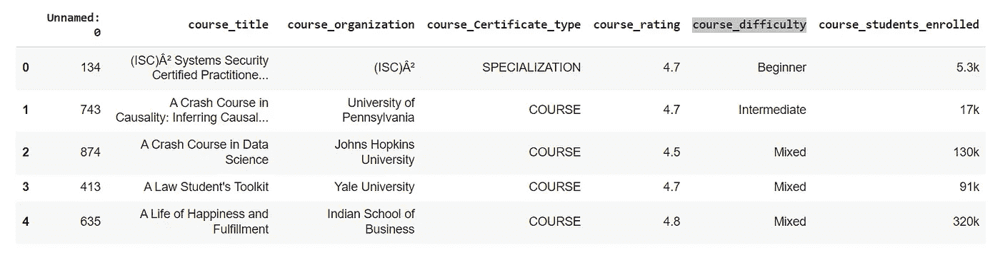

Data Analysis and Project For Beginners

我们有课程名称、提供课程的组织名称、课程认证类型、课程评级、课程难度和注册课程的学生人数。

*   **收集更多的数据信息**

```
df.info()
df.describe()
```

检查每一列中的空值。幸运的是，我们的数据集中没有空值。
之后，用每个列的类型属性获得更多关于我们数据集的信息。

*   **数据修改**

在“学生注册的课程”部分，我们有对象类型数据，但我们想要的数据类型是整数类型。所以我们来修改一下数据。

```
df['course_students_enrolled']=df['course_students_enrolled'].str.replace('k', '*1000')
df['course_students_enrolled']=df['course_students_enrolled'].str.replace('m', '*1000000')
df['course_students_enrolled'] = df['course_students_enrolled'].map(lambda x: eval(x))df.head()
```

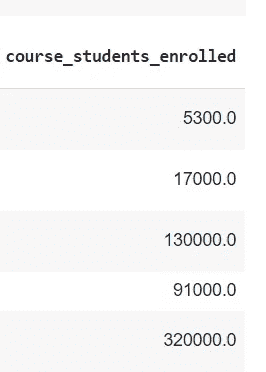

Coursera data analysis and visualization

现在我们有了最后一列的整数数据类型。让我们绘制一个热图来分析各列之间的关系。

*   **热图**

```
f,ax = plt.subplots(figsize=(14,10))
sns.heatmap(df.corr(), annot=True, fmt=".2f", ax=ax)
plt.show()
```

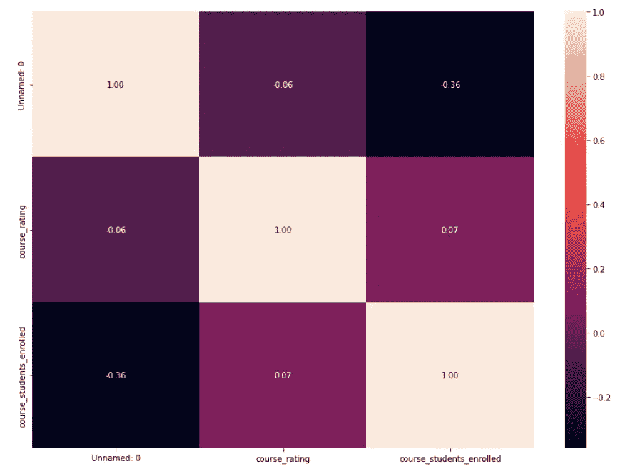

Coursera data analysis and visualization

我们没有多少整数类型的数据。这就是为什么热图没有多大意义。

*   **课程认证类型**

```
fig = px.pie(df, names='course_Certificate_type')
fig.show()
```

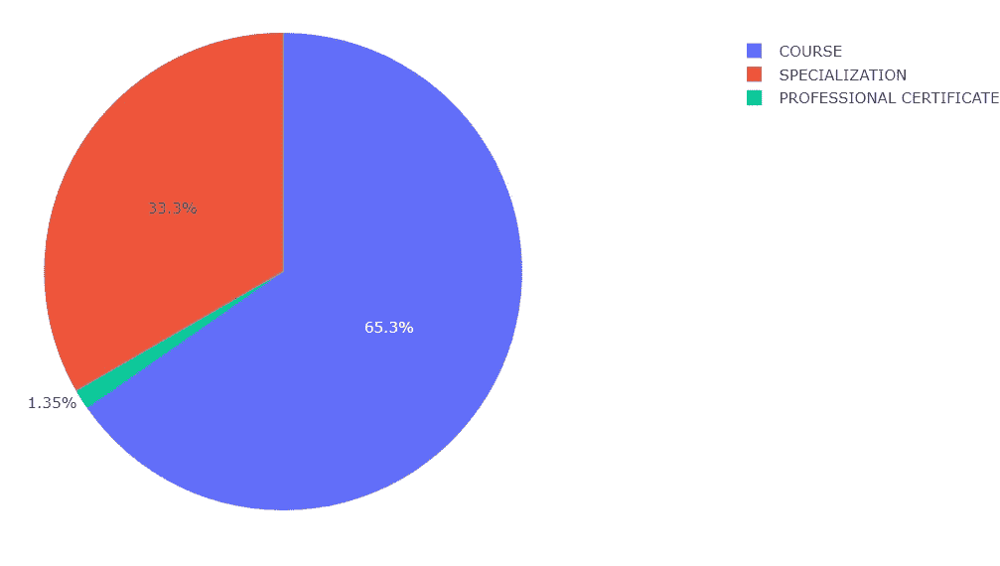

Coursera data analysis and visualization

Coursera 上只有 1.35%有专业认证的课程。Coursera 全是专业化和正常化的课程。它包含了总体积的 98%以上。

*   **Coursera 上难度等级的课程**

```
fig2 = px.pie(df, names='course_difficulty')
fig2.show()
```

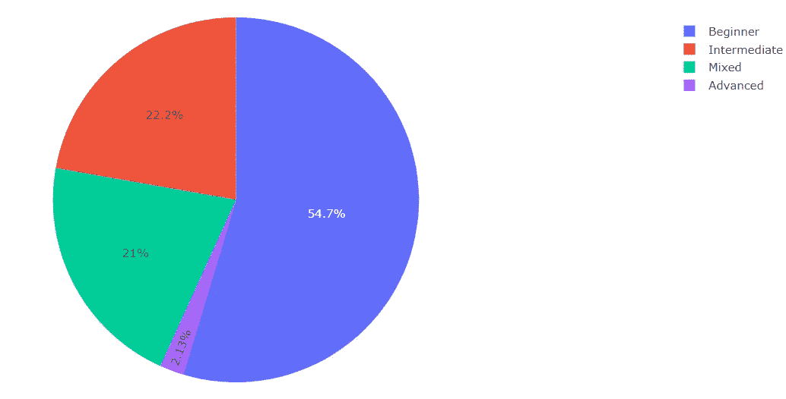

Coursera data analysis and visualization

Coursera 上几乎 55%的课程都是初级水平。只有 2.13%的课程是高级课程。所以，如果你想在初级阶段开始学习新的东西，那么 Coursera 为你提供了广泛的课程种类。

*   **评级良好的球场范围**

```
fig3 = px.pie(df, names='course_rating')
fig3.show()
```

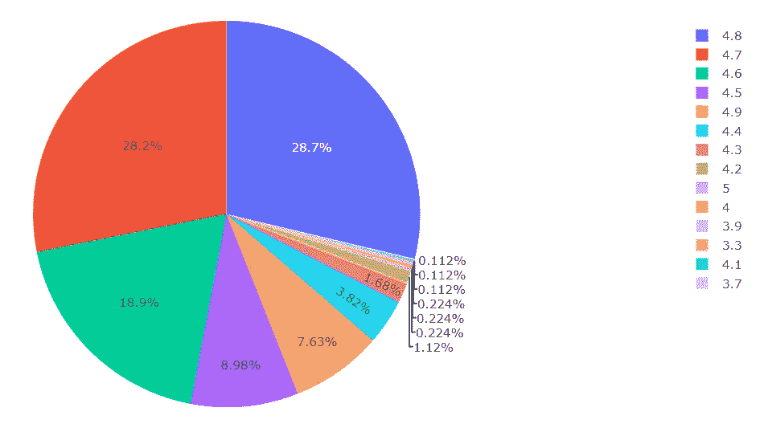

Coursera data analysis and visualization

在 5 分制中，没有一门课程的评分低于 3 分。从学习的角度来看，这是一个好现象。Coursera 上全是优质的内容课程。超过 75%的课程平均得分为 4.6 分(满分为 5 分)。

*   **基于课程评级的学生注册**

```
fig4 = px.scatter(df, x="course_rating", y="course_students_enrolled")fig4.show()
```

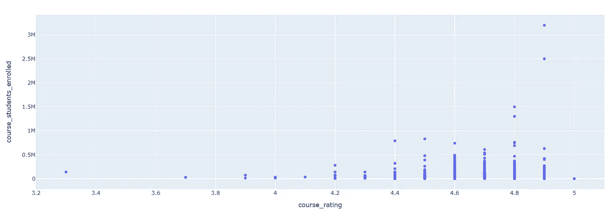

Coursera data analysis and visualization

如果你设定 100 万的注册人数作为标志，那么你可以看到学生们更喜欢评分超过 4.8 分的课程。所以，如果你打算放弃 Coursera 上的课程，那么确保你的视频包含高质量的内容。

*   **课程认证类型为**的课程学员注册与课程评级之间的关系

```
fig5 = px.scatter(df, x="course_rating", y="course_students_enrolled", color="course_Certificate_type", hover_data=['course_Certificate_type'], size='course_students_enrolled')fig5.show()
```

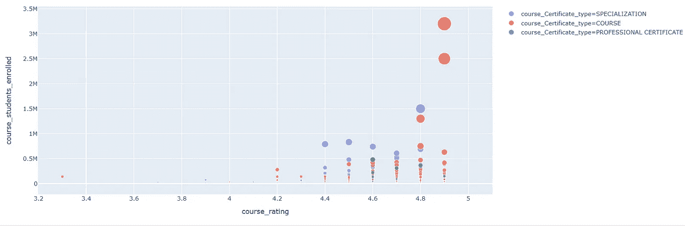

Coursera data analysis and visualization

当你移动你的光标到任何一个泡泡上，它就会显示你的细节。例如，将光标移至评分为 4.8 的蓝色圆圈。现在，您可以对此进行分析，因为有 150 万名学生注册了评级为 4.8 的专业化课程。

*   **配对图**

如果您有兴趣绘制一个配对图来确定关系，那么您可以这样做:

```
sns.pairplot(df)
```

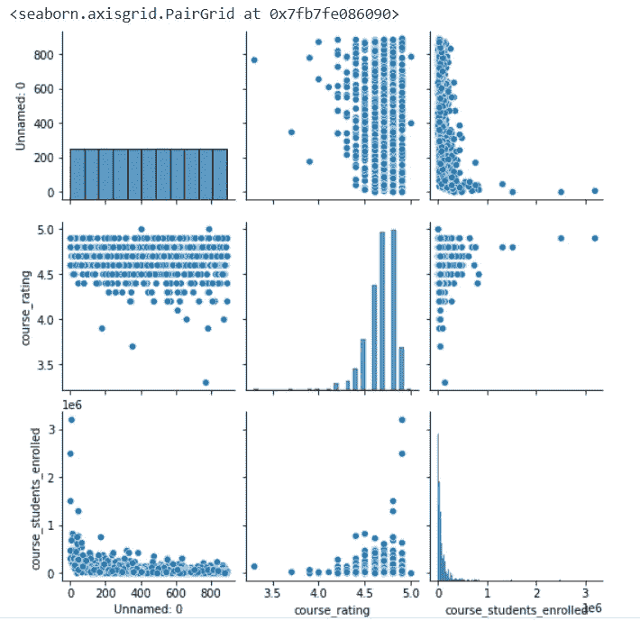

Coursera data analysis and visualization

*   **课程等级和课程难度**

```
fig7 = px.bar(df, x='course_rating', color='course_difficulty')
fig7.show()
```

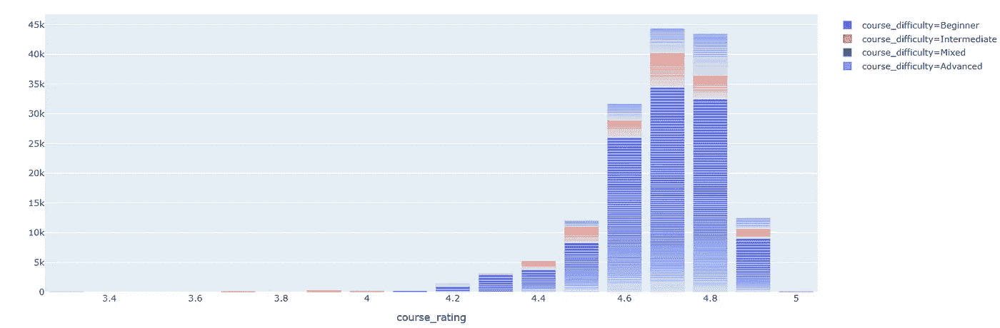

Coursera data analysis and visualization

*   **学生根据难度级别注册课程**

```
total_En_St = df.groupby('course_difficulty').sum().sort_values('course_students_enrolled', ascending=False)total_En_St = total_En_St.reset_index()px.bar(x='course_difficulty', y ="course_students_enrolled", data_frame=total_En_St)
```

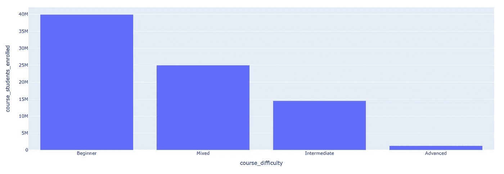

Coursera data analysis and visualization

超过 3900 万学生注册了 Coursera 的初级课程

近 2500 万学生参加了混合难度课程

大约 1.2 名学生在 Coursera 上达到了高级水平。

*   **Coursera 上排名前 15 的大学入学人数**

```
top_univ = df.groupby('course_organization').sum().sort_values('course_students_enrolled', ascending=False).head(15)top_univ = top_univ.reset_index()px.bar(x='course_organization', y ="course_students_enrolled", data_frame=top_univ)
```

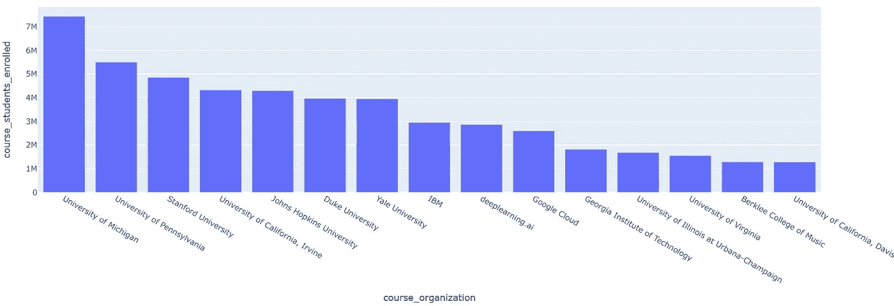

Coursera data analysis and visualization

密歇根大学在学生入学排行榜上名列前茅。745 万学生通过 Coursera 入读密歇根大学。

我最喜欢的是 deeplearning.ai，它有丰富的课程内容。

*   **根据课程注册的学生**

```
top_course = df.groupby('course_title').sum().sort_values('course_students_enrolled', ascending=False).head(15)top_course = top_course.reset_index()px.bar(x='course_title', y ="course_students_enrolled", data_frame=top_course)
```

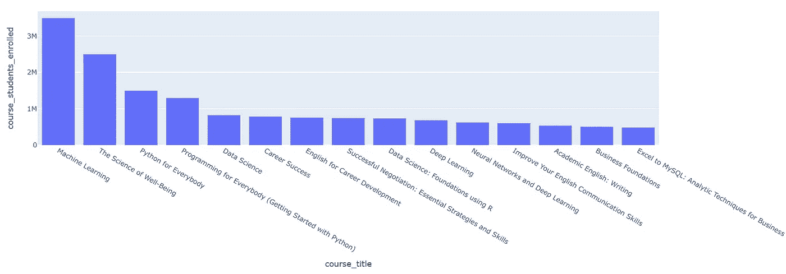

Coursera data analysis and visualization

这些是 Coursera 上大多数学生最喜欢的 15 门课程。机器学习课程有近 350 万学生注册。第二受欢迎的课程是幸福科学。

好了，这篇文章就到这里。

如果这篇文章对你来说很有启发性，一定要关注并分享给你的极客社区。

## 代码的 Google Colab 链接在这里是。

## 您可以从这个[链接](https://ninza7.blogspot.com/2021/11/marvel-vs-dc-dataset-for-data-analysis.html)下载数据集

# 更多数据科学项目

[**迪士尼+使用 Python 的数据分析**](https://python.plainenglish.io/data-analysis-of-disney-in-python-b2f66c9be332)

[**漫威 vs DC 数据分析用 Python**](/mlearning-ai/marvel-vs-dc-data-analysis-in-python-e561cac72358)

[**顶级网络数据泄露事件(2004–2021):数据分析与可视化**](/mlearning-ai/top-cyber-data-breaches-2004-2021-data-analysis-and-visualization-db61318148f)

[**中型文章数据可视化与分析使用 Python**](/mlearning-ai/medium-articles-data-visualization-and-analysis-using-python-730a538207ab)

[**使用 Python 的 Spotify 数据可视化和分析**](/geekculture/spotify-data-visualization-and-analysis-using-python-4af81c5531a7)

[**IPL 数据分析(2008–2020)使用 Python**](/nerd-for-tech/ipl-data-analysis-2008-2020-using-python-c031d3e1ae0c)

[**用 Jupyter 笔记本进行 Zomato 数据分析**](/nerd-for-tech/zomato-data-analysis-with-jupyter-notebook-6116ea03bd9d)

[**不同国家二氧化碳排放数据分析及可视化**](https://ninza7.medium.com/data-analysis-and-visualization-of-co2-emission-by-different-countries-7d9cadec50a3)

你好，我是 Rohit Kumar Thakur。我对 ***自由职业*** *持开放态度。我构建了* ***react 原生项目*** *和目前正在开发的****Python Django****。请随时通过(****)freelance.rohit7@gmail.com****)*联系我

[](/mlearning-ai/mlearning-ai-submission-suggestions-b51e2b130bfb) [## Mlearning.ai 提交建议

### 如何成为 Mlearning.ai 上的作家

medium.com](/mlearning-ai/mlearning-ai-submission-suggestions-b51e2b130bfb)