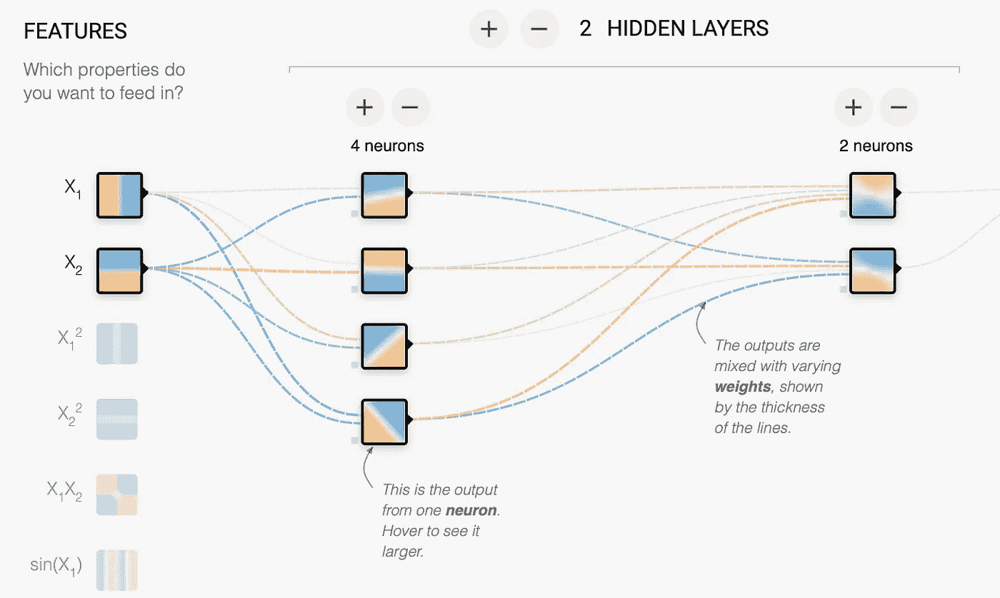
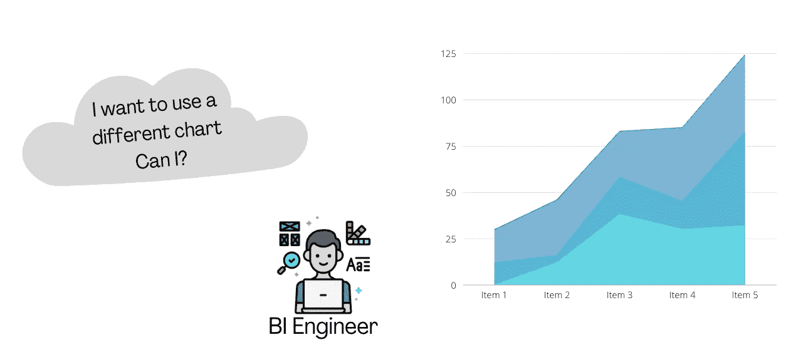
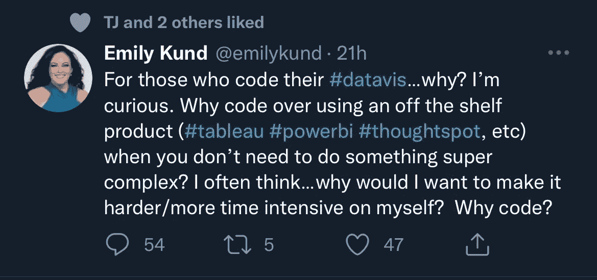
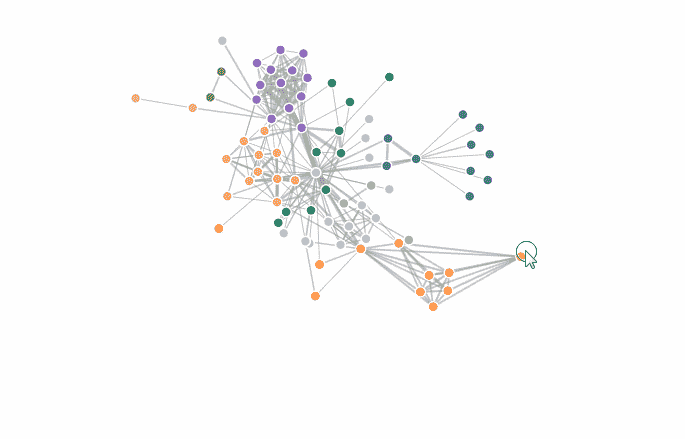
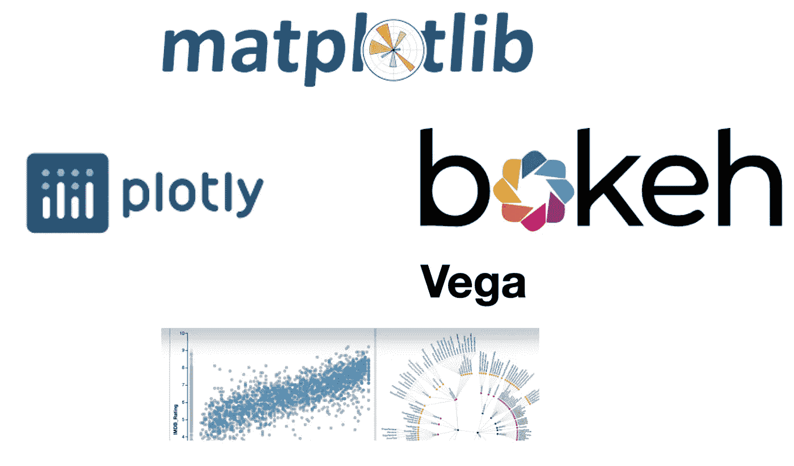
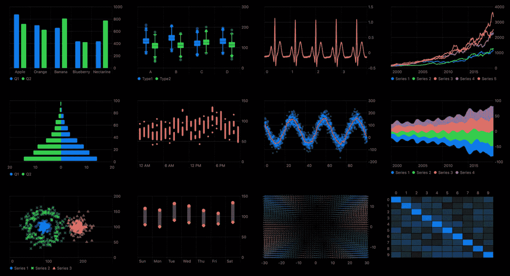

# 数据可视化——工具还是代码？

> 原文：<https://medium.com/mlearning-ai/data-visualization-tools-or-code-cc588cd2e4e?source=collection_archive---------4----------------------->

在当今以数据为中心的世界中，有效的数据可视化对任何组织都至关重要。从数据中获取复杂模式并使用视觉隐喻解释它们的能力为数据可视化提供了新的方向。事实上，这是你今天使用的每个 BI 平台最重要的方面，比如 *Tableau、Qlik 和 Power BI* 。

[A Line chart in Tableau](https://www.tableau.com/data-insights/reference-library/visual-analytics/charts/line-charts)

甚至在机器学习领域，可视化已经被用来解释模型(XAI)、跟踪实验、改进模型等。通过*权重&偏差和张量流*等工具。这些工具将可视化与一系列分析工作流紧密集成，使您能够开发仪表板&报告，以呈现给业务利益相关方。

TensorFlow playground — play with a Neural Network

现在，这些利用可视化的 BI 和 ML 产品的主要目标是加速特定数据消费者角色(数据分析师、科学家)的分析工作流，并使其易于呈现。这里的**关键**术语是:

*   加速—更快的分析时间
*   易于展示—自助式控制面板

对于实例，开发基于一些业务逻辑的仪表板(在提取-转换-加载之后)。因此，对*制图*方面的关注就少了一些。我什么意思？🤔嗯，这意味着可视化*定制*能力受限于我们所掌握的工具。我们将需要依赖作为产品的一部分而提供的图表来展示我们的分析。但是，在某些情况下，您可能希望使用现成的图表。

Can I do more?

这也与最近引发我兴趣的一条推文有关。现在，*艾米丽*有一个非常合理的问题&在这条推文中也有一些提示。我个人在使用 BI(data viz part)的最初几天里，也经常思考同样的问题。

Tweet by Emily Kund

我们在上面的讨论中已经回答了这个问题的一部分。现成的产品，如 Tableau 或 Power BI，给了我灵活性和易用性，只需拖放一个图表，添加一些数据，并以仪表板的形式呈现出来📊— Done ⚡️然而，如果我想在一个完全不同的图表中可视化地表示数据(更多的变量，直观的 UI 体验，等等。)，我可能需要对它进行编码。这就是可视化库发挥作用的地方。让我们从编程语言的角度来谈几个—

## 用于可视化的 JavaScript:

基于 JavaScript 的库已经看到了从零开始构建*可视化解决方案的巨大势头。有什么原因吗？嗯，JS 本身没有任何内在的可视化能力。然而，SVG & DOM 操作函数等图像格式允许我们绘制形状(线条、矩形、圆形)、添加文本等。在浏览器中。考虑下面这个使用 **D3.js** 实现的力定向图——最流行的 js 可视化框架之一。*

A force-directed graph developed using D3.js

D3.js 是开发高质量、交互式可视化的有效框架。最重要的是，它允许你将你的数据与 SVG、HTML 和 CSS 绑定在一起，在你的浏览器中产生动态和交互式的可视化效果。现在，回到 BI 世界，好消息是 Qlik 或 Tableau 等工具允许您将使用 D3.js 构建的任何(大部分)可视化集成到他们的平台中，这确实给了我们一个优势🚀—我们不再局限于在平台中本地提供图表。

其他 JS 库— Plotly.js、Highcharts、AnyChart 等。

## 用于可视化的 Python:

使用 Python 开发可视化是相当新的，但正在兴起。有几个原因。首先，学习曲线📈！Python 作为一种编程语言非常容易理解，因为它的语法非常简单。这样就好学了。其次，它广泛用于数据科学工作流中，当然可视化是该过程的一部分。诸如探索性数据分析(EDA)之类的任务通常使用基于 Python 的包来完成，并且具有在相同环境中的灵活性(与 Python 一样)增加了价值并加速了工作，而不是跳到另一个环境。那么，有哪些常用的基于 Python 的库呢？

Python-based libraries

请记住，基于 Python 的可视化库本质上是 D3.js 等 JS-libs 的包装器。这意味着它仍然必须在内部呈现所需的 HTML、JS 和 CSS 文件。关于定制，其中一些库允许你摆弄核心的视觉元素。例如改变条形图中矩形的大小或实现不同的调色板。因此，这实际上取决于特定库中的抽象级别。

**总结一下**——Python 库通常用于重点不是定制或开发全新的可视化，而是帮助分析过程，如 EDA、ML 模型调试等。

## 还有哪些可视化的编程语言？

除了 JavaScript 和 Python，Julia 还开发了一些用于数据可视化的包。Julia 在数据科学和科学计算领域有很多应用，所以有一些库专门用于数据的简单实现是有意义的。有人提到— plots.jl、牛虻. jl、VegaLit.jl 等。

在其他新闻中，苹果昨天在 WWDC 2022 发布了一个全新的可视化库，名为 Swift Charts，从而为 Swift(和 SwiftUI)程序员带来可视化功能。这将有助于带来你今天在 Apple Watch(睡眠追踪器，健身)，iPhone & Mac(屏幕时间)等基于苹果的产品上获得的同样的可视化体验。

Apple — Swift Charts

为了结束我们的讨论，让我们回到问题— **工具还是代码？**

Tableau 和 Power BI 等工具使我们能够轻松构建具有拖放功能的自助式仪表盘，最终有助于加快分析工作流程。然而，如果我们的重点是从头开始构建*视觉隐喻，我们将需要以我们想要的方式对它们进行编程。这对于可视化研究等领域尤其理想——我们将在下一篇文章中讨论。*

让我知道你的想法。

~迪潘卡尔

 [## Mlearning.ai 提交建议

### 如何成为 Mlearning.ai 上的作家

medium.com](/mlearning-ai/mlearning-ai-submission-suggestions-b51e2b130bfb)