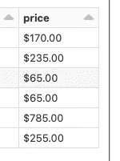
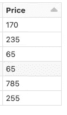
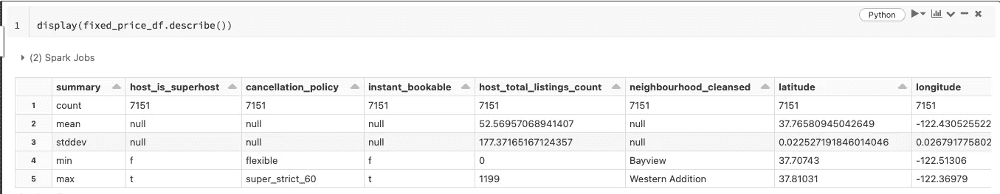
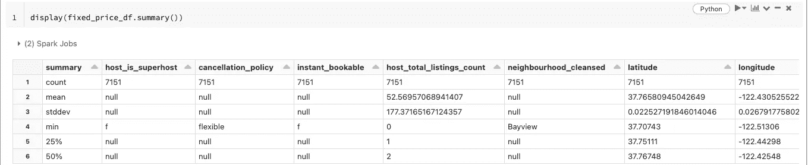
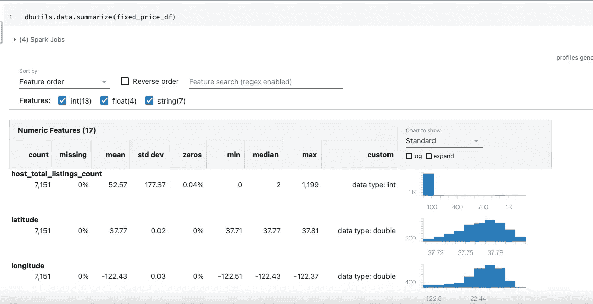

# 在数据砖中使用 Pyspark 进行数据辩论

> 原文：<https://medium.com/mlearning-ai/data-wrangling-using-pyspark-in-data-bricks-75cf25bfb4ef?source=collection_archive---------6----------------------->

Photo by [Claudio Schwarz](https://unsplash.com/@purzlbaum?utm_source=medium&utm_medium=referral) on [Unsplash](https://unsplash.com?utm_source=medium&utm_medium=referral)

嘿伙计们，

Databricks **为您的所有数据**提供了一个统一、开放的平台。它为数据科学家、数据工程师和数据分析师提供了一个简单的协作环境，让他们能够运行交互式的预定数据分析工作负载。你可以得到你自己的一块馅饼来做实验。它让你能够用少数几种编程语言进行分析。

在这篇文章中，我将带您完成一个使用 pyspark 在数据块上清理数据的简单练习，所以让我们深入研究一下。

首先，我们需要一个数据砖环境，社区版是一个很好的起点。点击这里，查看我关于如何建立自己的社区版[的帖子。](/mlearning-ai/how-to-use-data-bricks-community-edition-9b899a2c0f40)

让我们从导入库开始。

让我们检查形状(数据集的行数和列数)

数据集很大，为了保持实验简单，我们删除一些列。

select()方法有助于只选择列表中指定的列，此外，由于 pyspark 数据帧是不可变的，所以在进行任何类型的转换时，我们都必须定义一个新的数据帧。另外，Cache()方法提供了一种优化机制，我们在其中存储 Spark 数据帧的中间计算，以便可以在后续操作中重用它。

快速浏览一下数据帧，我们看到 price 列前面有“$”值，也将这些列的数据类型更改为“double”。

*Screenshot for Price Column*

在这里，我们将使用 withColumn()方法来修改现有的 price 列，首先使用 translate 函数，该函数通过已经给定的 replace 字符串来翻译与列中给定的匹配字符串匹配的任何字符。

Price Column post transformation

分析数据时的下一个动作是汇总统计数据，现在可以通过 3 种方式来完成..

1.  描述:计数、平均值、标准差、最小值、最大值

Sample output for Describe Method

2.汇总:描述+四分位数间距(IQR)

Sample Output for Summary Method

3.dbutils . data . summary:这将生成表格格式的结果和分布。

Sample output for dbutils.data.summarize

这三个命令的语法如下:

敬请关注更多此类内容！下一集再见！！快乐学习！

 [## Mlearning.ai 提交建议

### 如何成为 Mlearning.ai 上的作家

medium.com](/mlearning-ai/mlearning-ai-submission-suggestions-b51e2b130bfb)