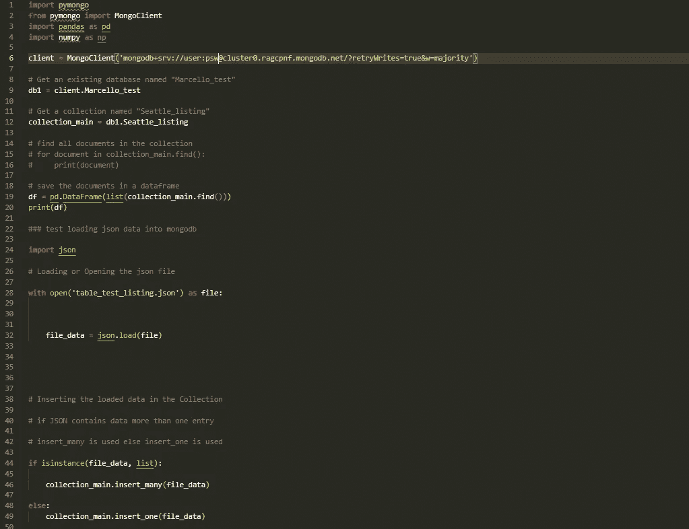

# 数据科学家的数据库？使用 MongoDB 和 Pandas 的简单快捷的解决方案(第 1 部分)

> 原文：<https://medium.com/mlearning-ai/database-for-datascientists-easy-and-quick-solution-with-mongodb-and-pandas-part-1-670eed45855d?source=collection_archive---------2----------------------->

Photo by [imgix](https://unsplash.com/@imgix?utm_source=medium&utm_medium=referral) on [Unsplash](https://unsplash.com?utm_source=medium&utm_medium=referral)

## **简介**

数据库是存储和组织数据的好方法。它们也是与其他人分享数据的好方法。数据库可以用于许多不同的目的，例如存储关于客户、产品或员工的信息。

**MongoDB** 是世界上最流行的数据库平台之一。这是一个易于使用的开源数据库，可以从任何地方访问。MongoDB 比 CSV 文件有很多优势，因为它比 CSV 文件更容易使用，也更安全。

与他人共享数据也更容易，因为数据存储在数据库中。MongoDB 也是为数据科学项目存储数据的一种很好的方式，因为它易于使用，并且可以从世界上的任何地方访问。

## **什么是 MongoDB？**

MongoDB 是一个面向文档的数据库，它将数据存储在类似 JSON 的文档中。它是一个 NoSQL 数据库，这意味着它不使用 SQL 来查询和更新数据。MongoDB 使用 JavaScript 对象符号(JSON)来存储和检索数据。

MongoDB 是由 DoubleClick 的开发人员创建的，他们正在寻找一个可扩展的高性能系统来支持他们的广告服务平台。

## **NoSQL:超越 SQL 数据类型**

NoSQL 数据库也被称为“不仅是 SQL”。它们不限于 SQL，可以用于各种各样的数据类型。NoSQL 数据库将数据存储在文档和 JSON 中，这使得它们比关系数据库更加灵活。

NoSQL 数据库分为四种类型:键值存储、文档存储、列族存储和图形数据库。键值存储和文档存储是四种类型的 NoSQL 数据库中最受欢迎的。

键值存储在键值对中存储数据，而文档存储在类似 JSON 的文档中存储数据。列族存储将数据存储在列中，而图数据库将数据存储在节点和边中。

对于习惯使用 SQL 数据库的人来说，NoSQL 数据库中有一些不同的术语。在 **SQL 数据库**中，表称为集合，行称为文档，列称为字段。**在 NoSQL 数据库**中，表称为集合，行称为文档，列称为字段。

## **关系数据库(SQL)和 NoSQL 数据库的区别**

NoSQL 数据库不限于特定类型的数据。它们可以存储任何类型的数据，从结构化数据到非结构化数据。它们在模式和存储数据的方式方面更加灵活。SQL 数据库仅限于结构化数据，并且在开始存储内容之前需要一个预定义的模式。NoSQL 数据库在可伸缩性方面也提供了更大的灵活性，因为它们可以通过添加新节点来进行水平扩展。

NoSQL 数据库已经存在了一段时间，但是随着传统 SQL 数据库系统无法处理的大数据集的出现，它们才开始流行起来。NoSQL 数据库在可伸缩性方面也更加灵活，因为它们可以通过添加新节点来进行水平扩展。

## **数据科学家使用 MongoDB 的优势**

数据科学最重要的方面之一是存储和检索数据的能力。

MongoDB 是一个面向文档的数据库，它被设计为具有灵活性和可伸缩性。数据科学家可以使用它来存储和检索数据。MongoDB 最重要的优势之一是它在同一个数据库中存储不同类型数据的灵活性。

这允许在需要时更有效地检索信息。MongoDB 还有一个内置的索引系统，可以很容易地搜索特定的数据。

## **猫鼬和熊猫**

在下面的截屏中，我将展示一些关于如何使用 MongoDB 和 Pandas 来存储和检索数据的快速而肮脏的例子。我们将使用 MongoDB 的免费层作为例子(免费层提供直到 512kb 的数据存储)。你可以在这里找到免费等级的链接:【https://www.mongodb.com/cloud/atlas】T4。

首先，我们需要安装 MongoDB 和熊猫。我们可以使用以下命令安装 MongoDB 和 Pandas:

**pip 安装 pymongo pip 安装熊猫。**

一旦我们安装了 MongoDB 和 Pandas，我们就可以将这些库导入到我们的 Python 脚本中:

**进口 pymongo 进口熊猫当 pd**

然后，我们可以使用以下命令连接到 MongoDB 数据库:

**连接= pymongo。连接()**

然后，我们可以使用以下命令创建一个新集合:

**收集=连接[“测试”]**

然后，我们可以使用以下命令将文档插入到集合中:

**collection . insert({ ' name ':' John '，' age': 25})**

然后，我们可以使用以下命令将文档插入到带有属性的集合中:

**collection . insert({ ' name ':' John '，' age': 25，' job': 'Programmer'})**

**看下面 MongoDB 和熊猫的数据角力截图:**

Photo by author

## MongoDb 和 Python web framework

值得一提的是，使用 Mongo 和 Python 框架(如 Flask、Django 或 Streamlit)来部署 webapp 是多么容易。不需要使用数据库服务器，使用 Mongo Atlas 即可。

在本文的第 2 部分，我们将看到一个集成 MongoDB、Pandas 和 Streamlit 来部署 webapp 的例子。

敬请期待！！

# 作者:

我写关于数据科学、python 编码项目和数据驱动营销的文章。我还为数据新手或数据入门者提供数据和业务指导。

你可以在[媒体](/@Marcello_Dichiera)和[推特](https://twitter.com/ItalyMarcello)上关注我，或者访问我的[网站](https://marcello-personal-website.netlify.app/)和 [Github 页面](https://github.com/marcello-calabrese)。

 [## Mlearning.ai 提交建议

### 如何成为 Mlearning.ai 上的作家

medium.com](/mlearning-ai/mlearning-ai-submission-suggestions-b51e2b130bfb)