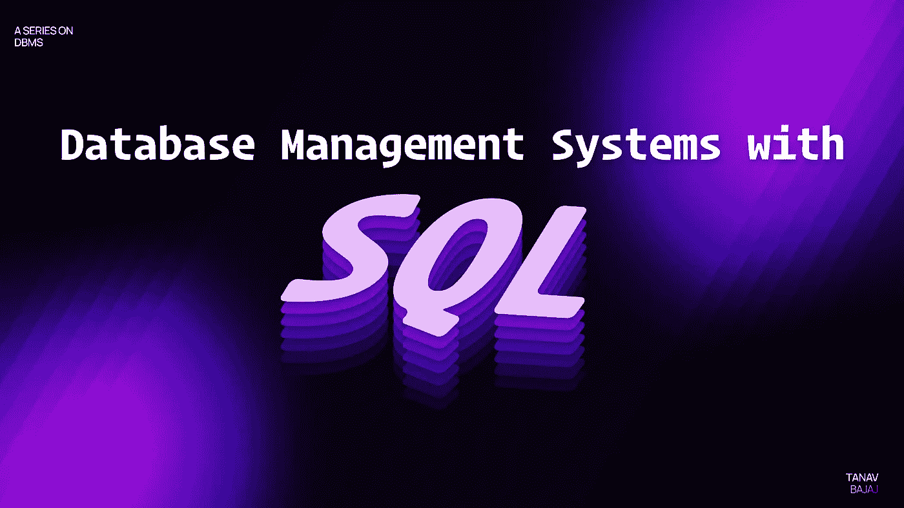
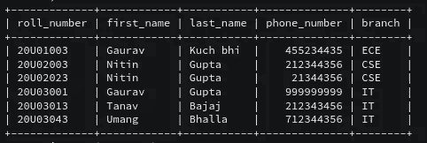
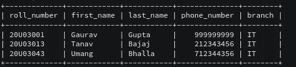
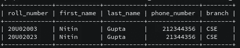

# 基于 SQL 的数据库管理系统

> 原文：<https://medium.com/mlearning-ai/database-management-system-with-sql-4109cbef79f9?source=collection_archive---------6----------------------->



Image- [Umang Bhalla](https://twitter.com/umgbhalla)

在本文中，读者们，我将带你们开始数据库管理系统(DBMS)之旅。最后，我将教你如何使用 SQL 查询创建一个简单的数据库。

# 为什么是 DBMS？

自从数字时代开始，就存在对数据和良好存储数据的需求。现在，我们可以在笔记本电脑上以文件和文件夹的形式存储这些数据，但在处理大量数据时，这是不可能的。

因此，我们需要 DBMS 将数据存储在数据仓库或服务器中，并能够在需要时随时检索数据，而不必连接到物理存储设备。

我们将 DBMS 用于:

*   创建数据库。
*   从数据库中检索信息。
*   更新数据库。
*   管理数据库。

初级水平的这项工作是使用 SQL 之类的语言完成的。在使用 SQL 之前，我们必须知道 SQL 中的命令类型。

# DDL vs DQL vs DML

这些 SQL 命令主要分为以下几类:

1.  数据定义语言
2.  DQL—数据查询语言
3.  DML —数据操作语言

DDL 命令是用来定义一个数据库的命令。

在 SQL 中，它们是:

1.  CREATE:这用于“创建”新的数据库或对象(如表或视图)。
2.  DROP:这是 SQL 的 delete 命令，用于删除以前创建的数据库或对象。
3.  ALTER:这用于改变数据库的结构
4.  TRUNCATE:用于从表中删除所有记录，包括删除为记录分配的所有空间。
5.  重命名:这用于重命名数据库中的对象，甚至是数据库本身。

**DQL 命令用于从数据库中获取数据并显示给用户。**

最常用的 **DQL** 命令是**选择**，用于从数据库中检索数据。

**DML 命令用于更改数据库中的数据。**

DML SQL 命令包括:

1.  插入:将数据放入表格
2.  更新:更新现有值
3.  删除:删除数据库中的记录。

*注意 DELETE 和 TRUNCATE 的相似性，所以基本上 TRUNCATE 就是删除一切。*

# 键

不，这里我不是指你的车钥匙或房子钥匙。

DBMS 中使用的键用于唯一地标识数据库中的记录，并在数据库中的表之间创建关系。

## 钥匙类型:

1.  主关键字
2.  候选关键字
3.  备用关键字
4.  外键

## 主键:

用于唯一标识数据库表的一部分。

这有几个条件。

1.  主键永远不能为空
2.  主键的所有值必须不同。

永远不会有一个以上的主键，但是我们可以使用一个以上的列作为主键。

举个例子，我会拿我大学的数据库。

假设我将学生的名字作为主键。那将会是一个大问题，因为我一个班里就有 5 个学生叫 Gaurav。

现在我们可以取 2 列**名和姓**。这个**部分解决了**问题，但是有一个例外情况。在我的批次中有 2 名学生名为 Nitin Gupta，他们都是 CSE 分支。

因此，我们可以不使用这些值中的任何一个作为主键，而只使用**的卷号，因为它是以这样一种方式产生的，即它是唯一的，每个学生都有一个。**

## 候选关键字

所有不是主键的列(属性)都是候选键。

因此，在大学数据库中，如果卷号是主键值，如名、姓、分支等成为候选键。

## 备用关键字

唯一且满足主键条件但不用作主键的键。

因为只有一个主键，所以符合描述的其他主键就成为备用键。

同样，在大学数据库中，如果**卷号是主键**，那么像**电话号码或电子邮件这样的东西就变成了备用键。**

## 是时候编写一些 SQL 代码了:

为此，让我们以我在上面的例子中使用的数据库为例。

因此，在我的`college`数据库中，我们需要一个我的批次表，即具有不同值的`batch24`。

所以首先，我们需要确保学院数据库不存在，并使用命令删除预先存在的数据库(如果有的话)

`DROP DATABASE IF EXISTS college;`

接下来，我们使用以下内容创建数据库:

`CREATE DATABASE college;`

现在我们需要进入我们使用的学院数据库:

`USE college;`

现在是创建表格的时候了:

```
CREATE TABLE batch24 (roll_number VARCHAR(8) PRIMARY KEY , first_name VARCHAR(100) , last_name VARCHAR(100) , phone_number INT , branch VARCHAR(3) );
```

这就创建了一个名为`batch24`的表，其中包含列 roll_number、first_name、last_name、phone_number 和 branch。

VARCHAR 和 INT 指定给定值的数据类型。

现在让我们将一些值放入表中:

```
INSERT INTO batch24 (roll_number, first_name,last_name,phone_number,branch) VALUES (‘20U03001’, ‘Gaurav’, ‘Gupta’,999999999,’IT’),(‘20U02003’,’Nitin’ , ‘Gupta’, 212344356,’CSE’),(‘20U02023’,’Nitin’ , ‘Gupta’, 21344356,’CSE’),(‘20U01003’,’Gaurav’ , ‘Kuch bhi ‘, 455234435,’ECE’),(‘20U03043’,’Umang’ , ‘Bhalla’, 712344356,’IT’),(‘20U03013’,’Tanav’ , ‘Bajaj’, 212343456,’IT’);
```

这在`batch24`表中插入了值。这里，第一个`()`显示了值将被插入的顺序，其余的括号是按预定顺序的值。

包含一个表和几个值的数据库已经准备好了。

如果你和我一起尝试这些命令，你的命令行可能会很空

这里我们可以使用 select 语句来查看数据库中的所有内容。

`SELECT * FROM batch24;`



“*”在这里表示全部。所以上面的语句可以理解为从 batch24 表中选择所有的值。

我们也可以使用 WHERE 命令将其过滤掉。

`SELECT * FROM batch24 WHERE branch=’IT’;`



这显示了属于 IT 分支的所有学生。

还记得我告诉过你两个学生有相同的名字，并且被主键(roll_number)和备用键(phone_number)分开的情况吗

```
SELECT * FROM batch24 WHERE first_name=’Nitin’ AND last_name=’Gupta’;
```

我们可以使用这个命令来查看这种情况。



## 敬请关注更多此类文章

[](/mlearning-ai/mlearning-ai-submission-suggestions-b51e2b130bfb) [## Mlearning.ai 提交建议

### 如何成为 Mlearning.ai 上的作家

medium.com](/mlearning-ai/mlearning-ai-submission-suggestions-b51e2b130bfb) 

🟠在 MLearning.ai 成为 [**作家**](/mlearning-ai/mlearning-ai-submission-suggestions-b51e2b130bfb)