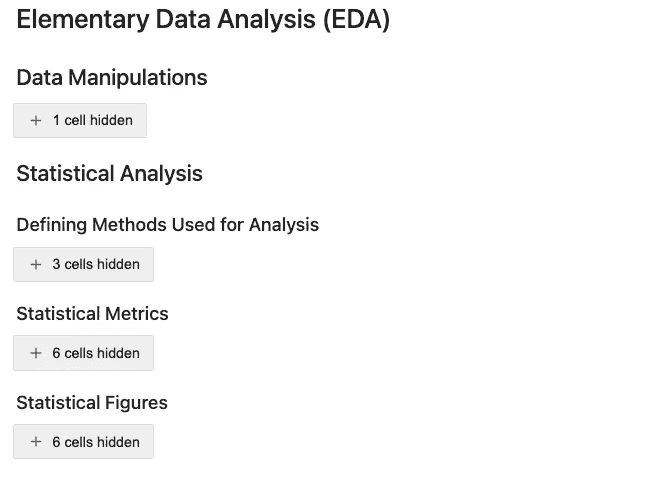

# 数据面板满足 Jupyter

> 原文：<https://medium.com/mlearning-ai/datapane-meet-jupyter-a160ba612fed?source=collection_archive---------7----------------------->

## 为什么以及如何将您的 Jupyter 笔记本与 Datapane 集成。

**如果你和 Jupyter 一起工作，发现自己在和非技术利益相关者分享信息，请阅读此文**。

# 为什么

如果你和我一样，对一遍又一遍地复制、粘贴或发送数据感到沮丧或浪费时间。csv 文件和无穷无尽的 Google 表单为了向非技术团队成员传达您的分析结果，Datapane 是为您准备的。

Datapane 允许您共享一个 html 链接，您可以在其中将您的分析布局为一个报告。**最好的事情是**你的数据面板报告将总是最新的。一旦您启动了 Datapane 报告，更新您的笔记本中所做的更改就像重新执行您的代码一样简单。在那一刻，任何拥有你的 html 链接的人都可以刷新并看到你的改变……**再也没有截图了！**

Datapane 不仅可以节省您的时间，还可以让您与您的 [Plotly](https://plotly.com) 、 [Bokeh](https://docs.bokeh.org/en/latest/) 或其他令人惊叹的数据可视化库进行交互。我的团队成员绝对喜欢这一点，我可以向你保证，他们享受的互动让他们能够更好地吸收和理解数据。

**Datapane 是一个非常棒的工具，可以用来启动一个可共享的、交互式的基于 html 的报告，并且可以在你的 Jupyter 笔记本中轻松设置。**

# 怎么做

下面是一个用[数据面板](https://datapane.com)设置 [Jupyter 笔记本](https://jupyter.org)的简单例子。这篇文章旨在快速介绍和总结如何发布你的第一个数据面板报告。欲了解更多细节和更深入的教程，请访问[数据面板文档页面。](https://docs.datapane.com/)

**第一步:报告分区**
**分区你的笔记本是很好的组织工具。我不会详细介绍如何设置 Jupyter 笔记本，但我会提到一些我用来有效维护和提交高质量报告的策略。**

我用 markdown 在笔记本上创建标题和副标题。这允许我最大化和最小化我的笔记本的部分，减少我花在滚动上的时间，并且让我有条理。下面是一个例子，说明我是如何把我的笔记本分成几部分的。这些部分将与步骤 2 中我的数据面板代码中使用的部分相同。

您可以看到有一个主标题、三个子标题和三个内容标题。

**步骤 2:启动你的数据面板报告** 假设我们要启动一个报告，它将包括我上面列出的部分。我已经对代码进行了注释，因此您可以看到哪些命令适用于所使用的每个元素类型。您还可以找到我是如何用列和文本块格式化报告的。Datapane 非常广泛，有很多方法可以实现您的愿望，但是下面的代码将会给您一个很好的开始。您可以随意复制它，并用您自己的分析替换文本和图形名称。

# **结论**

这篇文章的目的是给你一些使用 Datapane 的好理由，并提供一个使用 Datapane 主要特性的快速例子。如果您精通 python，您将会看到这些代码是如何转换成功能报告的。如果没有，请尽快回来查看，因为我会提供帖子的链接，在帖子中我会更深入地研究每个功能，并提供一步一步的解决方案。同时，如果有任何问题，请随时联系我们。

注意，在执行代码之前，您仍然需要使用 pip 或 conda 安装 Datapane，就像您使用的任何新库一样。你可以在[这里](https://pypi.org/project/datapane/)找到相关信息。

感谢您阅读我的帖子，我希望您现在看到了 Datapane 的好处，并考虑在您的下一个项目中使用它。

 [## Mlearning.ai 提交建议

### 如何成为 Mlearning.ai 上的作家

medium.com](/mlearning-ai/mlearning-ai-submission-suggestions-b51e2b130bfb)