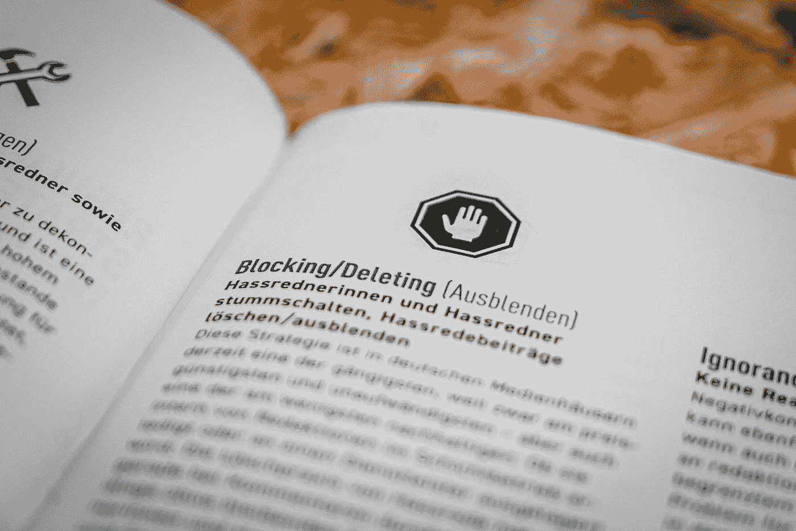

# 用于构建基于 ML 的仇恨言论检测模型的数据集

> 原文：<https://medium.com/mlearning-ai/datasets-to-build-hate-speech-detection-ml-based-models-edadaa5f2149?source=collection_archive---------4----------------------->

Photo by [Mika Baumeister](https://unsplash.com/@mbaumi?utm_source=medium&utm_medium=referral) on [Unsplash](https://unsplash.com?utm_source=medium&utm_medium=referral)

社交媒体用户数量的增加有好有坏。网上仇恨言论是一个突出的问题，特别是由于用户享有自由和匿名，以及社交网络平台缺乏有效的监管。这个问题不仅影响虐待受害者，也影响社交媒体平台、政府和社会，影响几个…