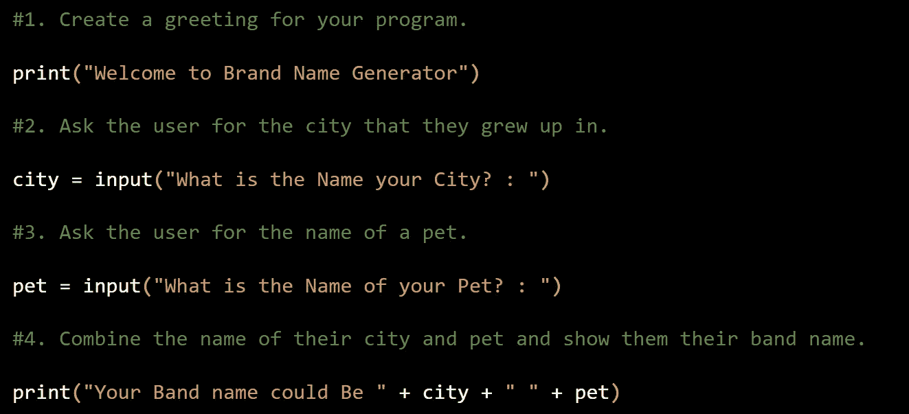

# # 100 日代码的第 1 天

> 原文：<https://medium.com/mlearning-ai/day-1-of-100daysofcode-198f4594afe4?source=collection_archive---------9----------------------->

> “对于我们在做之前必须学习的东西，我们通过做来学习。”
> ― **亚里斯多德，** [**《尼各马科伦理学》**](https://www.goodreads.com/work/quotes/2919427)

这个由 Angela Yu 教授的课程对我来说是一个更新 python 技能的完美开端，我已经轻松地完成了第一天的课程，因为我早些时候做过一些编码工作，并且对它有些熟悉。

谁是余安琪？

她是一名 iOS 和 Web 开发人员。安吉拉是 App Brewery 的创始人兼首席技术官。

感谢夏洛特·弗拉扎。

我是在 YouTube 上的一段视频中看到这个课程的，视频的作者是计算精神病学一年级博士生夏洛特·弗拉扎。

现在跳到今天的项目，根据我们提供的输入，编写一个程序来生成一个基本的品牌名称。

**项目 1-创建品牌名称生成器**

**#1。为您的程序创建问候语。**

印刷(“欢迎使用品牌名称生成器”)

**#2。询问用户他们成长的城市。**

city = input("你的城市叫什么名字？: ")

**#3。向用户询问宠物的名字。**

pet = input("你的宠物叫什么名字？: ")

**#4。将他们的城市名和宠物名结合起来，给他们看他们的乐队名。**

print("您的乐队名称可以是"+ city + " " + pet ")

Google Colab Image

在此找到课程[。](https://click.linksynergy.com/deeplink?id=MPpArUILeTw&mid=39197&murl=https%3A%2F%2Fwww.udemy.com%2Fshare%2F103IHM3%40QgJ7B01dsq3YjpM6A979ZU578vFEDJqE1-Kue5xcdQSmuWG92oD1kWG4itwRF1RVbQ%3D%3D%2F)

> 免责声明:上面分享的链接是一个附属链接，一旦你注册了这个课程，我就会收到一点佣金。

关注我[**LinkedIn**](https://www.linkedin.com/in/soham-sharma/)[**GitHub**](https://github.com/soham2710)[**ka ggle**](https://www.kaggle.com/sohamnsharma)**获取更多此类文章和帖子。**

** [## Mlearning.ai 提交建议

### 如何成为 Mlearning.ai 上的作家

medium.com](/mlearning-ai/mlearning-ai-submission-suggestions-b51e2b130bfb)**