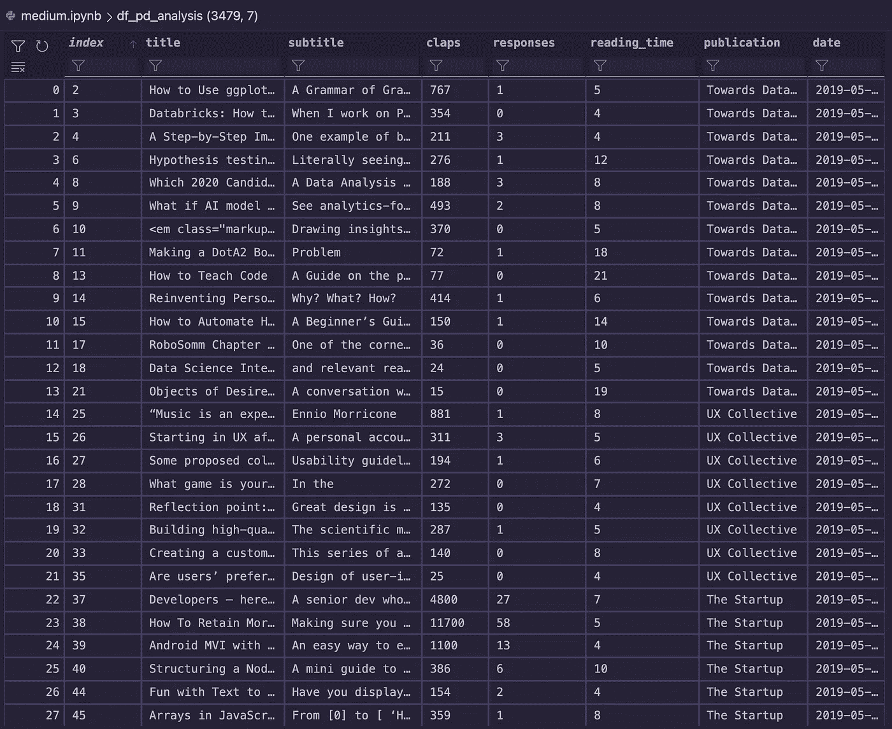

# 第 3/50 天—使用 Jupyter 笔记本进行中等标题分析

> 原文：<https://medium.com/mlearning-ai/day-3-50-medium-title-analysis-with-jupyter-notebooks-74d71b067fe3?source=collection_archive---------4----------------------->

## 确定我们在哪里，我们想去哪里。

本文从下面显示的一组数据开始，并以这些数据的子集结束，这些数据着眼于标题/副标题情感与掌声、回应和阅读次数的对比。

上面的图像显示了我们的 df_pd