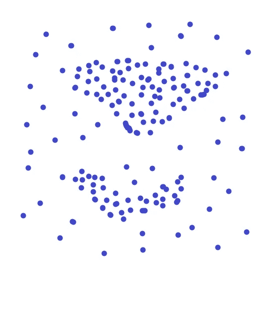
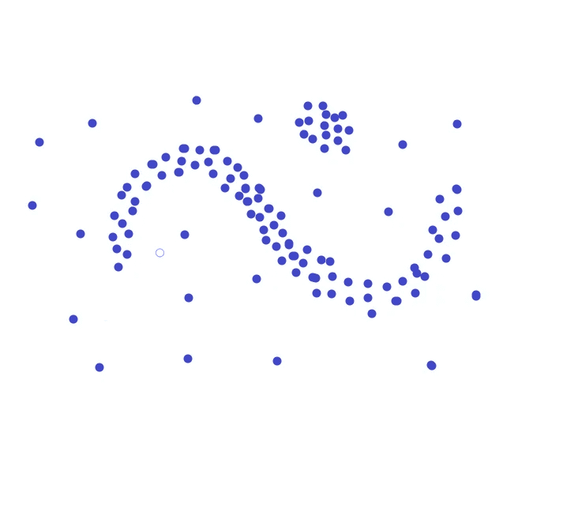
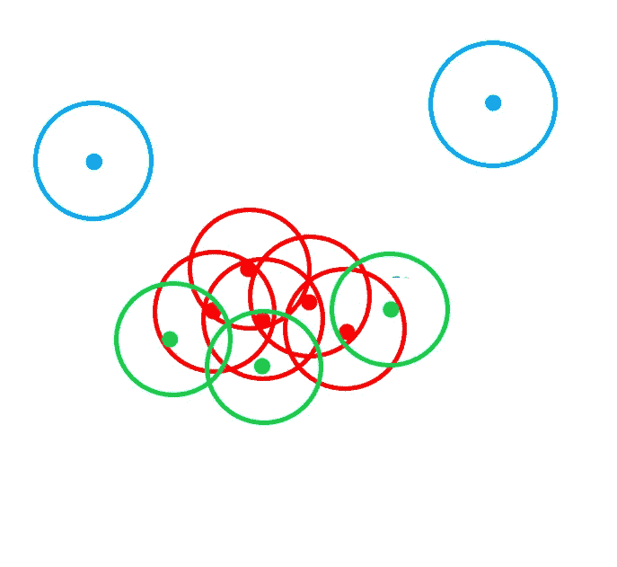
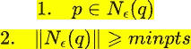

# DBSCAN 很容易解释

> 原文：<https://medium.com/mlearning-ai/dbscan-easily-explained-9f47aa2e1df6?source=collection_archive---------4----------------------->

Photo by [Ed van duijn](https://unsplash.com/@eddyvanduijn?utm_source=unsplash&utm_medium=referral&utm_content=creditCopyText) on [Unsplash](https://unsplash.com/s/photos/cluster?utm_source=unsplash&utm_medium=referral&utm_content=creditCopyText)

## 介绍

聚类分析是一种无监督的机器学习方法，它将数据点分组为称为聚类的几个组，使得相同聚类中的数据点彼此非常相似，而不同聚类中的数据点彼此不同。

两种最流行的聚类算法是“k 均值聚类”和“层次聚类”。也许在这篇文章中，我们将讨论一种不同类型的聚类算法。

## **数据库扫描**

DBSCAN 代表对有噪声的应用进行基于密度的空间聚类。由 Martin Easter 在 1996 年提出的 DBSCAN 是一种基于密度的聚类算法，它基于这样的假设工作，即簇是由较低密度区域分隔的空间中的密集区域。

因此，基本上它测量整个空间的密度，然后将密集分组的数据点分配到单个簇中。DBSCAN 的最佳特性是对异常值具有鲁棒性。这意味着它可以识别数据中的异常值并相应地工作。稍后会有更多关于这个的报道。

## **需要另一种聚类算法**

在开始之前，让我们先修改一下前面提到的两个算法。

**K-means 算法**

k 均值算法是一种划分算法。在这种方法中，我们首先构建数据库 D 的一个分区

n 个物体组成一组 k 个集群。k 是该算法的输入参数。如何选择 k 值是另一篇文章的主题。因此，在初始划分 D 之后，它使用迭代控制策略来优化目标函数。每个集群由集群的重心来表示。它采用了两步程序。首先，确定 k 个代表最小化优化函数。其次，将每个对象分配到其代表最接近所考虑的对象的聚类中。

**层次聚类**

层次聚类创建数据的层次分解，层次分解用树状图表示。树形图是一棵树，它迭代地将 D 分成更小子集，直到每个子集只包含一个对象。它有两种方法。凝聚法和分裂法。它不需要 k 作为输入。然而，需要定义终止条件。

好了，现在我们知道了 k 是什么意思，聚类和层次聚类是什么，我们现在可以进一步讨论为什么我们需要另一个聚类算法。

k 均值和层次聚类都不能创建任意形状的聚类。它们不能基于变化的密度来构建聚类。

传统算法的另一个问题是，它们确保每个观察值都是任何聚类的一部分，即使该点离质心非常远。数据点的微小变化可能会影响聚类结果。

DBSCAN 的另一个优点是您不必预先指定集群的数量。所以没有领域知识在这里不是问题。

K 均值和层次聚类都是多次计算数据点之间和聚类中心之间的距离，而在 DBSCAN 中只计算一次。

现在我们知道了为什么我们需要另一种聚类算法，让我们深入研究算法的工作原理。

## **DBS can 如何工作**

当查看图 1 2 和图 3 中的样本点集时，我们可以很容易地检测出点的聚类和不属于任何聚类的噪声点。

figure 1

figure 2

figure 3

我们可以识别聚类，因为在每个聚类内，我们有一个典型的点密度，该密度高于聚类外的密度。此外，噪声区域内的密度比簇内的密度低得多。

现在让我们形式化我们最初的“**簇**和“**噪声**”的概念。

该算法可以应用于 2D、3D 或任何更高维度的空间。

因此，关键的思想是，对于一个簇中的每个点，给定半径的邻域必须包含最小数量的点。邻域的形状由两点 p 和 q 之间的距离函数决定。例如，当在 2D 空间中使用欧几里得距离时，它将是圆形，在 3D 空间中它将是球形。

***ε* 邻域**:点 p 的 *ε* 邻域用 N *ε* (p)表示，定义为

现在基于 *ε* 邻域 DBSCAN 将数据库 D 中的每个点分成三类。

**核心点:**如果 p 的 *ε* 邻域至少包含数据库的一个极小点，则称点 p 为核心点。最小点是一个超参数，我们将在文章的后面部分解释。

**边界点:**如果 q 的 *ε* 邻域包含至少一个但小于最小个数的点，则称点 q 为边界点。

**噪声:**若 r 的 *ε* 邻域不包含点，则称 r 为噪声。看下图直观理解。

蓝色的点是噪音。红色点是核心点，绿色点是边界。这里取最小值 3。

该算法从数据集中的随机数据点开始。然后，如果在邻域内存在最小数量的点，则它认为所有点都是同一聚类的一部分。通过递归地重复每个相邻点的邻域计算来扩展聚类。

## **可达性和连通性**

在继续之前，你需要理解两个重要的概念。可达性表明一个数据点是否可以从另一个数据点直接或间接访问。连通性表明两个数据点是否属于同一个聚类。就可达性和连通性而言，DBSCAN 中的两点可以称为:

1.直接密度可达

2.密度可达的

3.密度相关的

让我们详细说明一下。

**直接密度可达**:点 p 是从点 q wrt 直接密度可达的。 *ε* ， *minpts* 如果

显然，直接密度可达性对于成对核心点是对称的，但是当涉及一个核心点和一个边界点时则不是。

密度可达:点 p 是从点 q wrt 密度可达的。 *ε* 和 *minpts* 如果存在一个点链 p_1，p_2，…，p_n .其中 p_1 = p，p_n =q 使得 p_i+1 是从 p_i 直接密度可达的。

这种关系是传递的，但不是对称的。在核心点的情况下，密度-可达性是对称的。

**密度连通:**点 p 与点 q wrt 是密度连通的。 *ε* 和 m *输入*如果有一点 o 使得 p 和 q 都是从 o wrt 密度可达的。 *ε* 和 *minpts* 。

借助这些术语，我们可以定义集群。

Def。(聚类):设 D 是点的数据库，关于 *ε* 和 *minpts* 的聚类 C 是满足以下条件的 D 的非空子集

1.  ∀ p 和 q:如果 p ∈ C 和 q 是从 p wrt 密度可达的。 *ε* 和 *minpts* 然后 q ∈ C。

2.∀ p，q ∈ C : p 与 q wrt 密度相关。 *ε* 和 *minpts* 。

## **算法的参数**

DBSCAN 有两个参数。 *ε* 和 *minpts* 。该算法对这两个参数非常敏感。这些参数中的微小变化都会极大地改变分析结果。

1.  ***ε* :** 指定邻居的距离。如果两点之间的距离小于或等于 *ε* ，则认为这两点是相邻的。如果选择的ε值太小，那么将创建更多的聚类，并且更多的数据点将被视为噪声。反之，如果选择得太大，那么各种小集群将合并成一个大集群，我们将丢失细节。

***Minpts* :** 定义一个聚类的最小数据点数。根据经验，最小 *minpts* 可以从数据集中的维数 D 中导出，因为 *minpts* ≥ D + 1。低值 *minpts* = 1 是没有意义的，因为这样的话每个点本身就已经是一个集群了。在 *minpts* ≤ 2 的情况下，结果将与具有单链路度量的分层聚类相同，在高度ε处切割树状图。因此， *minpts* 必须至少选择 3 个。但是，对于有噪声的数据集，较大的值通常更好，并且会产生更重要的聚类。根据经验，可以使用 *minpts* = 2 dim，但对于非常大的数据、噪声数据或包含许多重复数据的数据，可能需要选择更大的值。

这都是为了这篇文章。我希望你们喜欢读这篇文章。

请在评论区提出你的想法。

跟着我去其他地方

[Github](https://github.com/shubhendu-ghosh-DS) ， [linkedin](https://www.linkedin.com/in/shubhendu-ghosh-423092205/) ， [twitter](https://twitter.com/shubhendubro)

谢谢你

 [## Mlearning.ai 提交建议

### 如何成为 Mlearning.ai 上的作家

medium.com](/mlearning-ai/mlearning-ai-submission-suggestions-b51e2b130bfb)