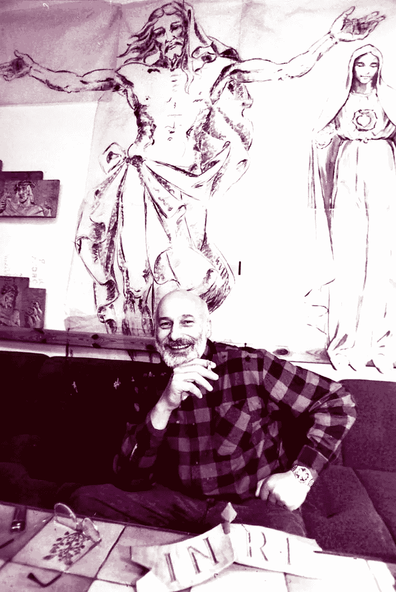

# 亲爱的儿子…

> 原文：<https://medium.com/mlearning-ai/dear-son-ce35c3a5401a?source=collection_archive---------2----------------------->

## [AI](https://towardsdatascience.com/datasculpting-af39f677f4f3) 能创造不朽的艺术吗？

[Siegfried Gross](https://www.instagram.com/gross_bildhauer/)

“我正在给你写信，文字对我来说似乎是向你传达我的经历、想法和计划的最佳媒介。自从我离开以来，八百天已经过去了。我想和大家分享一下我这段时间的经历。

> 2019 年，我启动了项目 [myFATHERintheCloud.ai](http://myFATHERintheCloud.ai) 。这个项目是献给我的父亲齐格弗里德·格罗斯，他曾为……