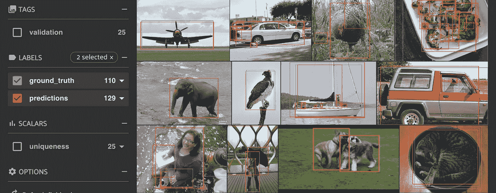

# 调试深度学习模型

> 原文：<https://medium.com/mlearning-ai/debugging-deep-learning-models-18d125915507?source=collection_archive---------4----------------------->

Photo by [Chris Ried](https://unsplash.com/@cdr6934?utm_source=medium&utm_medium=referral) on [Unsplash](https://unsplash.com?utm_source=medium&utm_medium=referral)

机器学习模型调试不同于传统调试，在传统调试中，我们可以简单地在某些检查点检查输出，如果有任何错误，过程将崩溃。

深度学习模型可能非常庞大，有时调试甚至知道有问题都很困难。我希望本指南能帮助您发现模型的问题。

## 如何调试

1.  **查资料:🔍**

因为我们将使用一些数据来训练或测试模型，所以检查数据总是一个好主意。在这里，我们可以创建一个笔记本，并加载一些数据示例来检查注释是否正确。例如，在对象检测数据集中，我们可以通过在一些随机图像中绘制边界框来检查边界框是否正确。[第五十一条](https://github.com/voxel51/fiftyone)是一个非常好的数据可视化工具。

Dataset visualization with FiftyOne

2.**小数据下模型过度拟合:📈**

现在，一旦我们确定了数据，要检查模型是否有效，最好是在数据集的一小部分中对模型进行过度填充。这不会确认模型是正确的，如果过度它发生了，但如果过度它没有发生，那么模型有问题。

3.**虚拟数据测试💎**

如果我们确定模型有问题，请从培训代码中删除模型代码。创建一个随机数据样本，并通过模型传递，检查

*   如果结果在具有相同输入的运行中是一致的。
*   如果结果不一致，请检查中间层的结果。这可以通过 [pdb](https://docs.python.org/3/library/pdb.html) 库轻松完成。在`forward`功能中做任何事情之前使用`pdb.set_trace()`，您可以检查中间结果。

**4 .✨常见培训问题**

有时，错误的准确性并不意味着模型有问题。很少有事情能有所帮助

*   【失正 中，降低学习率。这可能是因为爆炸梯度。
*   如果损失为`0`，则可能是因为梯度消失。
*   最好检查损耗与历元图。根据损失曲线更新超参数。
*   对批量使用适当的学习率。
*   如果多 GPU 训练有问题，尝试在单个 GPU 上进行训练，以检查是否是多 GPU 训练有问题或模型代码有问题。

**5。记录和跟踪实验📃**

深度学习模型训练可能需要时间。最好跟踪实验和数据集。有时可能是因为某些超参数，模型精度不起作用。追踪器可以帮助我们很容易地获得这种洞察力，因为我们可以在一个地方检查结果。

*   对于实验跟踪，我个人比较喜欢 [MLflow](https://github.com/mlflow/mlflow) 和 [Tensorboard](https://github.com/tensorflow/tensorboard) 。有许多其他工具(查看参考资料部分)可用于此目的，也可以随意尝试。
*   如果我们大量更改数据集，数据集跟踪就变得很重要。跟踪数据集有助于检出旧版本，并比较和计算不同版本的准确性。对于数据集跟踪，我通常使用 [DVC](https://github.com/iterative/dvc) 。
*   给训练一些时间。对于一个模型来说，至少需要一两天的时间来处理大量的数据是很常见的。尝试为大的时期进行训练，并检查实验跟踪器中的验证准确性，以检查是否过度拟合。

**6。使用基线模型⭐️**

*   从一个没有错误并且之前已经测试过的库中的基线模型开始是一个好的实践。
*   这将给出数据集的基线精度。
*   任何精度较低的新的复杂模型都需要调试，但是如果精度较高，问题可能出在(小的或类似的)数据集上，并且模型可能已经达到其最佳性能。
*   以数据为中心的方法现在越来越受欢迎，从数据集的角度来看，人们可以尝试添加更多的数据或尝试提高现有数据集的质量。
*   为了提高数据集的质量，可以修复错误的注释，使它们保持一致，等等(查看参考资料部分了解更多信息)。

**7。查看模型设计☁️**

*   如果我们正在实施一个新的体系结构，并对旧的体系结构进行一些更改，我们必须确保数据按照我们的计划通过网络传输。
*   我们可以想象任何带有 Netron 的网络。它支持许多格式的模型架构，比如 ONNX、TensorFlow Lite、Caffe、Keras、Darknet 等等。

Model architecture in Netron

*   检查损失函数输入，并确保它以预期的格式获得预测向量和地面真实向量的输入。

## 生产调试🏃

*   在部署之后和之前计算模型的性能是一个很好的实践。
*   这是必要的，因为有时部署环境可能不会像开发环境那样给出精确的结果。
*   这种差异对于边缘部署来说可能非常显著，性能变化可能会让您大吃一惊。
*   一旦部署了模型，使用一些模型监控工具可能是一个好主意，如果有数据漂移或概念漂移，该工具将标记出来。
*   监控很重要，因为它可以帮助您轻松地确定问题。
*   例如，假设我们已经部署了一个模型，它给出了 98%的准确率。但是 7 个月后，它的准确率下降到了 60%。这可能是因为数据的变化。假设之前我们只获得白天的数据，由于该解决方案运行良好，用户决定也使用夜间数据。因为该模型不是用夜间数据训练的，所以它的准确性降低了。这是数据漂移的一个例子。

一般来说，我们可以尽量少用样板代码。这可以通过使用一个框架来完成，而不是从头开始实现一切。例如，你可以使用 [PyTorch Lightning](https://www.pytorchlightning.ai/) 或者使用 [Hydra](https://hydra.cc/) 来配置系统，而不是在 PyTorch 中实现所有东西。

希望这篇文章对你有帮助。在 [LinkedIn](https://www.linkedin.com/in/mandalsouvik/) 上对我进行任何深度学习或计算机视觉讨论。

## 相关资源

*   [与 Andrew 就 MLOps 的对话:从以模型为中心到以数据为中心的人工智能](https://www.youtube.com/watch?v=06-AZXmwHjo)
*   [简化机器学习工作流程的工具](https://mlops.toys/)。

 [## Mlearning.ai 提交建议

### 如何成为 Mlearning.ai 上的作家

medium.com](/mlearning-ai/mlearning-ai-submission-suggestions-b51e2b130bfb)