# 预测机器学习损耗的决策树

> 原文：<https://medium.com/mlearning-ai/decision-tree-to-predict-attrition-of-machine-learning-6bc43c70ee0c?source=collection_archive---------4----------------------->

决策树算法属于监督学习算法家族。与其他监督学习算法不同，决策树算法可用于解决**回归和分类问题**听起来也很有趣对吧

使用决策树的目的是创建一个训练模型，通过**学习从训练数据中推断出的简单决策规则**来预测目标变量的类别或值。

当使用决策树来预测记录的类别标签时，我们从树根开始。比较根属性和记录属性的值。我们跟随对应于该值的分支，并根据比较结果转到下一个节点。下面给出了一个例子

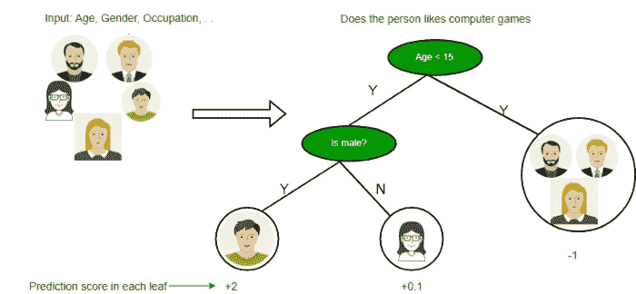

# 决策树的类型

根据目标变量，决策树分为两种类型。

1.  **分类变量决策树:**这是算法有分类目标变量的地方。例如，假设你被要求预测一家公司的三个成功类别之一:*低*、*中*或*高。*特征可以包括资产、*负债*、*债务*和*利润、*等。决策树将从这些特征中学习，在将每个数据点通过每个节点后，它将在三个分类目标*低*、*中*或*高*之一的叶节点处结束。
2.  **连续变量决策树:**在这种情况下，输入决策树的特征(如房屋质量)将用于预测连续输出(如房屋价格)。

1.  **根节点:**代表整个群体
2.  分裂:分裂的过程
3.  **决策节点:**当一个子节点分裂成更多的子节点时
4.  **叶(终端节点):**节点不分裂称为叶或终端节点。
5.  **剪枝:**当我们删除一个决策节点的子节点时，这个过程叫做剪枝。你可以说分裂的相反过程。
6.  **分支/子树:**整个树的一部分

# 决策树是如何工作的？

为了决定是否将一个节点分成两个或更多的子节点，决策树采用了多种方法。随着子节点的形成，生成的子节点的同质性提高。换句话说，节点的纯度随着目标变量的上升而提高。

所以百万美元问题是如何找到根节点的值

## 属性选择度量

如果数据集由 n 个属性组成，那么决定将哪个属性放在树的根或不同级别作为内部节点是很复杂的，仅仅随机选择任何节点作为根不能解决问题。如果我们遵循随机的方法，它可能会给我们带来准确性低的坏结果。

为了解决这个属性选择问题，研究人员研究并设计了一些解决方案。

他们建议:

**熵**，
，**信息增益，**
**基尼指数，**
**增益比率，**
**方差减少**
**卡方**

# 熵

熵是随机变量不确定性的度量，它描述了任意样本集合的不纯性。熵越高，信息量越大。

那么如果我们有多重属性呢

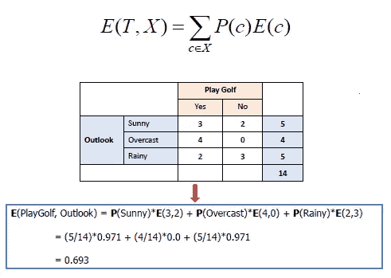

# 基尼指数

*   基尼指数是一种衡量随机选择的元素被错误识别的频率的指标。
*   这意味着基尼系数越低的属性越好。

那么它是如何计算的呢

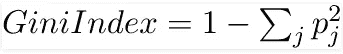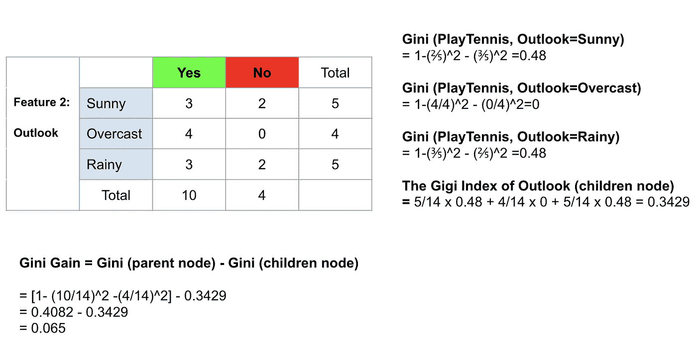

不仅如此，还有一些人会上传一个新的博客，里面有更多的细节。所以你可以学习

现在让我们看看它是如何在编码中完成的

首先获取数据集

[https://drive . Google . com/file/d/1 jrxlhfnudt 6 QM 5 _ gthexmcvodhqi 0 GS/view？usp =共享](https://drive.google.com/file/d/1jRXlhfnuThD6QM5_GTheXmcVODHqI0Gs/view?usp=sharing)

现在为 python 笔记本导入 google drive

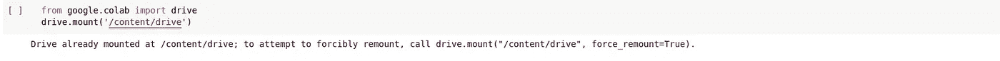

## 然后

导入所有重要的库

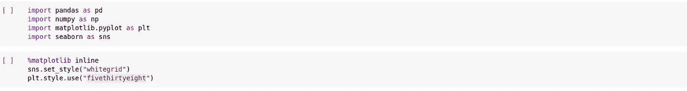

## 然后

使用 pandas 从 csv 中读取所有数据

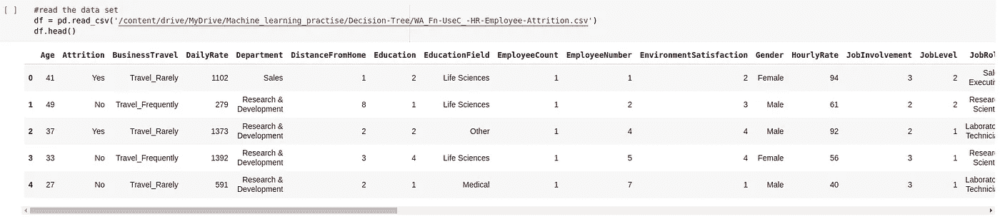

更多地探索数据集以获得清晰的理解

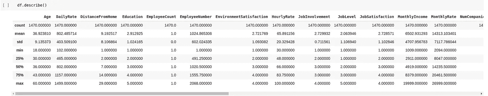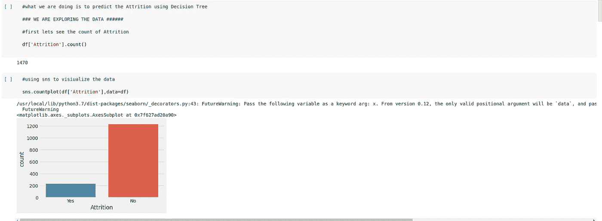

## 然后

现在，我们应该从数据框中删除不需要的列，这样在我的例子中，我可以删除“雇员计数”、“雇员人数”、“超过 18”、“标准小时数”

。这将不同于我们使用的数据集和场景

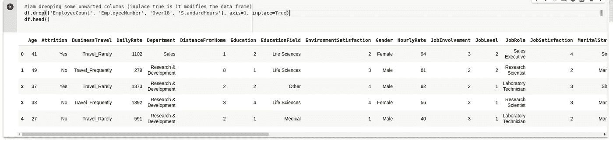

轴是 1，因为我们的目标是列，并且将就地修改数据帧

## 然后

只取对象类型列，因为它应该是运行机器学习模型的值

所以现在我们将检查类型并在数组中追加所有的列

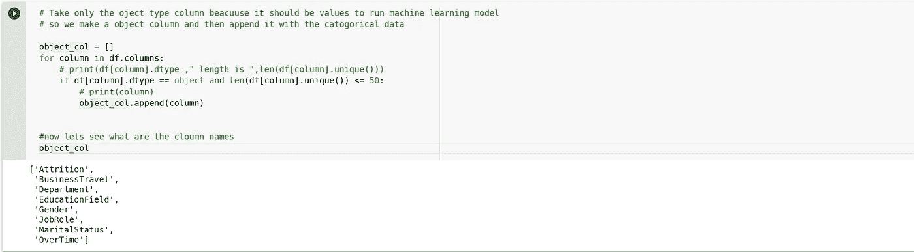

现在我们可以看到损耗也不是一个整数，所以现在我们把它改为 1 和 0

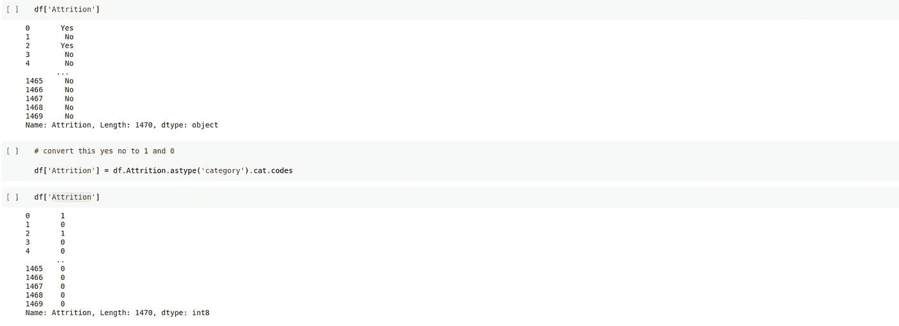

## 然后

现在让我们做下一步的数据处理，将分类数据转换成模型拟合的虚拟数据

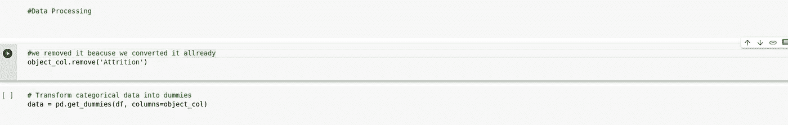

现在我们可以看到所有的值都是 int 和转换

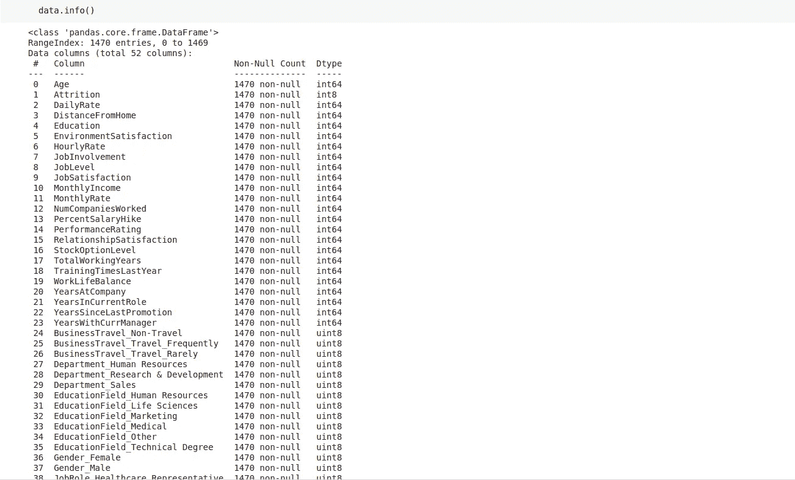

## 然后

对 object_col 中的标签进行编码

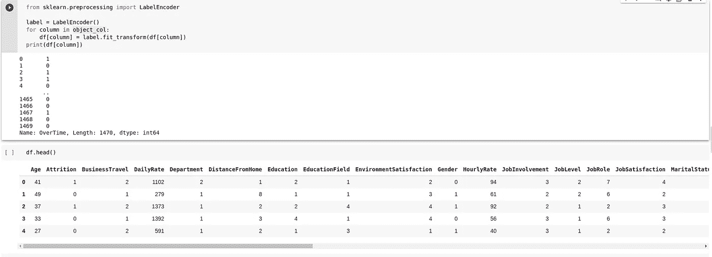

## 然后

分割训练和测试数据

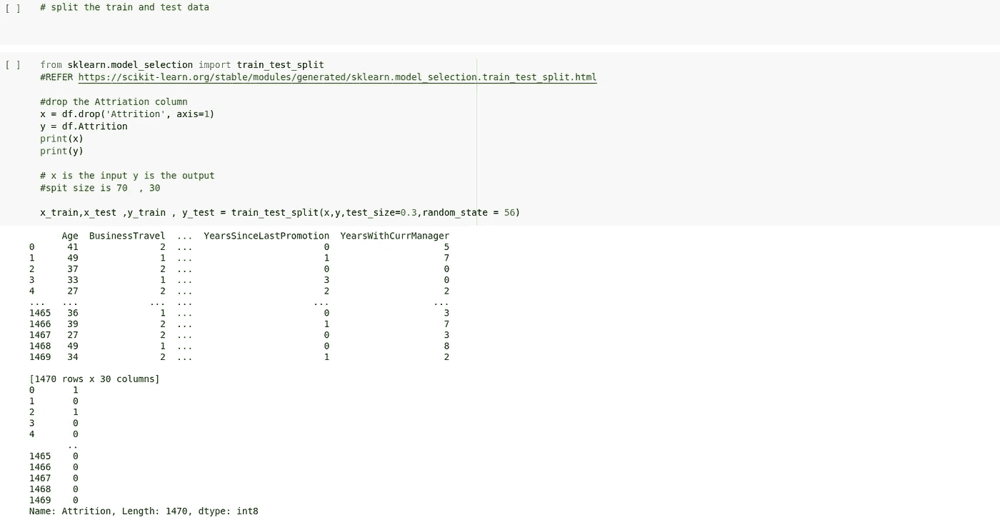

## 然后

创建一个函数来评估模型的准确性和混淆矩阵我也会在混淆矩阵上写博客

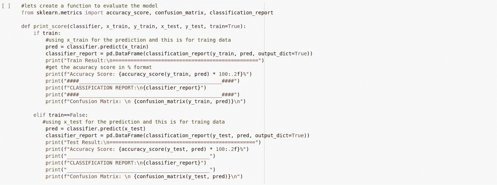

## 然后

现在让我们使用 Scikit-learn 创建决策树分类器

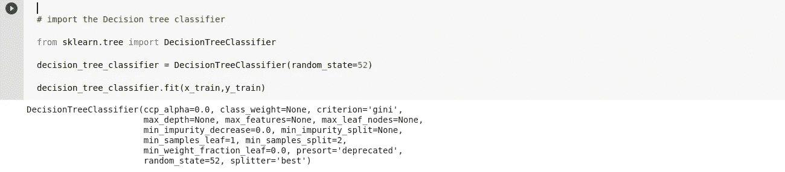

## 然后

现在让我们看看模型的表现

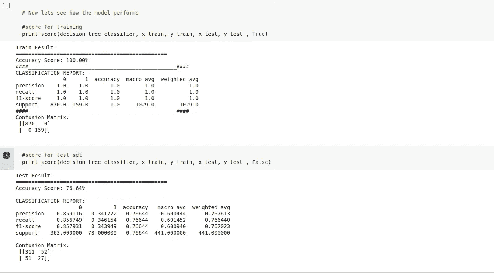

## 然后

让我们试着预测结果

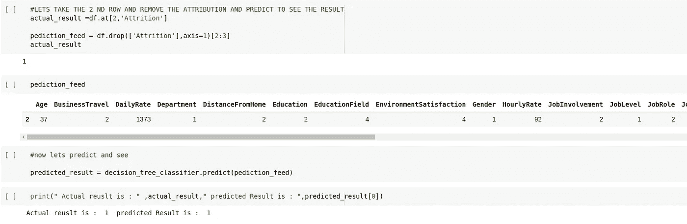

哇，我们答对了

## 然后

让我们试着想象一下决策树

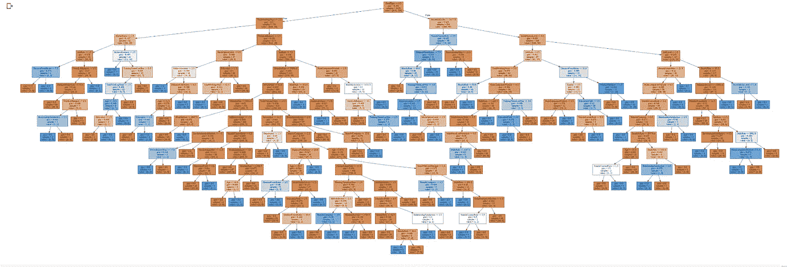

如果我们放大，可以看到我们使用了基尼指数

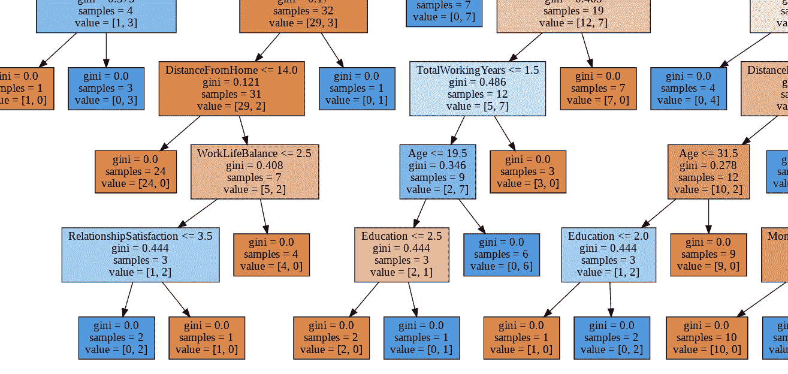

赶紧我们已经完成了决策树分类器与相关的巨大数据集

下面的 Github 链接:

YouTube 视频

# 优点和缺点

## 优势

与其他算法相比，决策树在处理数据时花费的时间非常少。可以跳过一些预处理步骤，如数据的标准化、转换和缩放。

数据集中缺少值，模型的性能不会受到影响。

决策树模型直观，易于向技术团队和利益相关者解释，并且可以跨多个组织实现。

## 不足之处

在决策树中，数据的微小变化会导致决策树结构的巨大变化，从而导致不稳定。

训练时间急剧增加，与数据集的大小成比例。在某些情况下，与其他传统算法相比，计算可能会变得复杂。

[https://tenor.com/view/stay-happy-milk-and-mocha-bear-good-vibes-confetti-cheering-gif-17687639](https://tenor.com/view/stay-happy-milk-and-mocha-bear-good-vibes-confetti-cheering-gif-17687639)

希望这个教程对你有帮助。如果我们遗漏了什么，请通过评论让我们知道。😇

❤️❤️❤️❤️❤️❤️❤️Thanks 代表 reading❤️❤️❤️❤️❤️❤️❤️❤️