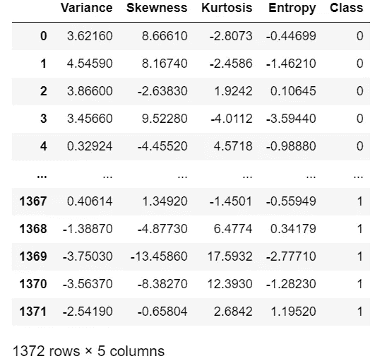
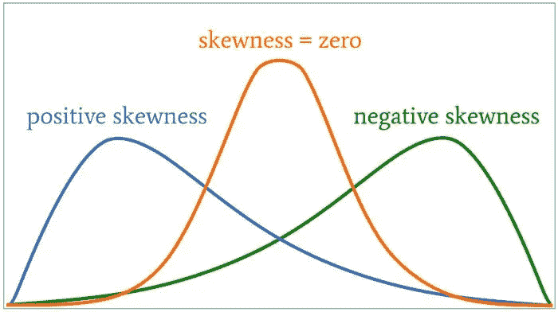
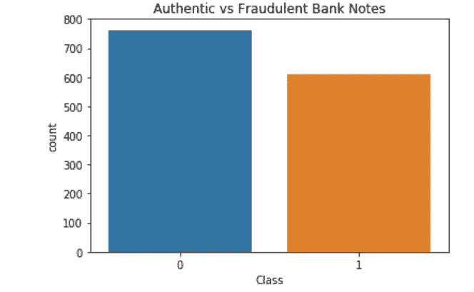
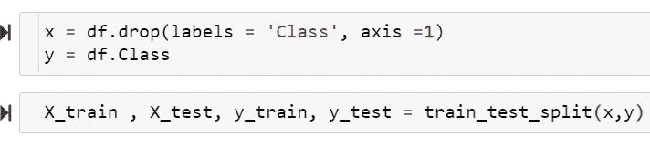
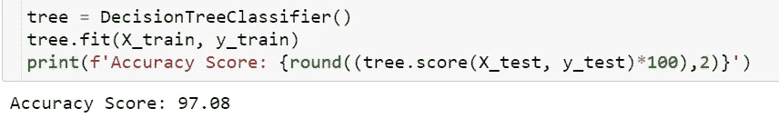

# 用 Python 实现决策树

> 原文：<https://medium.com/mlearning-ai/decision-trees-and-random-forest-a13d428c728a?source=collection_archive---------3----------------------->

作者 Zachary Galante——Bryant 大学数据科学专业的大四学生

Photo by [Peter Fogden](https://unsplash.com/@petefogden?utm_source=medium&utm_medium=referral) on [Unsplash](https://unsplash.com?utm_source=medium&utm_medium=referral)

在机器学习中，一种非常流行的算法是决策树分类器。在本文中，钞票数据集将用于说明这个模型的功能。

**决策树**

决策树是一种基本的机器学习算法，可用于分类问题。从高层次来看，决策树从树的顶部的一个基本语句开始，然后根据该语句是真还是假，它将沿着不同的路径向下移动到下一个条件。这将持续整个模型的持续时间。

下图显示了一个基本的决策树。这个特殊的树显示了一个特定的候选人是否会接受录用的决策过程。在第一个语句中，它显示报价在 50，000 美元到 80，000 美元之间，这将决定树的其余部分的路径。如果候选人拒绝了基于基本工资的待遇，则该树结束，决定已经做出，但是如果工资可以接受，则该树继续。随着不同类型的分类问题的出现，这个基本结构会变得更加复杂。

现在，利用对决策树工作原理的基本理解，现在可以用 Python 实现决策树了。加州大学欧文分校的钞票数据集(参考文献中有链接)将用于预测钞票图像是真实的还是伪造的。

**数据字典/描述**

如下所示，数据集由 1，372 条记录组成，每条记录包含 5 个要素:

**特色**

在该数据集中，基于影像的 400 x 400 像素值的数值创建要素。

方差:这是数据围绕平均值变化多少的统计度量。

偏斜度:这是指数据的视觉分布。如果数据显示为更靠近轴的任一侧，那么数据可以被描述为“向左或向右倾斜”。下图进一步显示了这一点。

峰度:数据分布的另一种度量。这种方法指的是数据的尾部，以及它们与正态分布尾部的差异程度。

熵:模型随机性的度量。

Class:数据的类标签， **0** 为**真**钞票， **1** 为**假**钞票。

为了更深入地了解目标变量“Class ”,创建了以下图形来可视化值的分布。

现在对数据集有了基本的了解，就可以创建模型了。目标变量“class”将被赋给变量“y”。而另外 4 个特征将被分配给变量‘x’。

然后，数据被分为测试集和训练集，默认情况下，75%为训练集，25%为测试集:

现在，模型可以使用这些数据进行训练和测试。在下面给出的第一行代码中，DecisionTreeClassifier 被赋给了变量“tree”。然后将其与训练数据进行拟合，并根据测试数据进行评分。这导致 97%的准确率，表明决策树是对数据运行的正确模型。

**结论**

由于这是一个预测二元目标变量的基本数据集，它显示了 97%准确率的良好结果。现在已经了解了决策树是如何工作的，还可以使用进一步的模型，如随机森林，这将在下一篇文章中介绍。

**参考文献**

 [## 变异系数、方差和标准偏差| 365 数据科学

### 有许多方法可以量化可变性，然而，这里我们将集中讨论最常见的方法:方差，标准…

365datascience.com](https://365datascience.com/tutorials/statistics-tutorials/coefficient-variation-variance-standard-deviation/)  [## 机器学习决策树分类算法-Java point

### 决策树是一种监督学习技术，可用于分类和回归问题，但…

www.javatpoint.com](https://www.javatpoint.com/machine-learning-decision-tree-classification-algorithm)  [## 理解参数检验、偏度和峰度-技术文章

### 欢迎来到我们的电气工程统计系列。到目前为止，我们已经复习了统计分析和…

www.allaboutcircuits.com](https://www.allaboutcircuits.com/technical-articles/understanding-the-normal-distribution-parametric-tests-skewness-and-kurtosis/) 

[https://archive . ics . UCI . edu/ml/datasets/钞票+认证](https://archive.ics.uci.edu/ml/datasets/banknote+authentication)