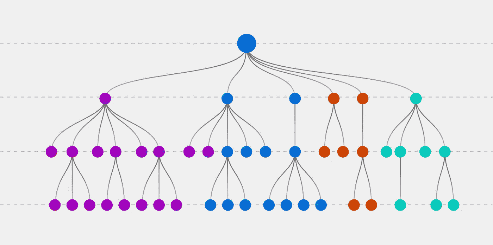

# 诊断树:从 0 到 XGBoost & LightGBM

> 原文：<https://medium.com/mlearning-ai/decision-trees-from-0-to-xgboost-lightgbm-a5f6827dfa23?source=collection_archive---------1----------------------->

决策树，梯度增强，XGBoost，LightGBM。

[Source](https://www.google.com/search?q=decision+trees&sxsrf=ALiCzsa6uUmlZhIGy0hr8aBhvrW82LbJMw:1653124858631&source=lnms&tbm=isch&sa=X&ved=2ahUKEwjU897_ofD3AhVmhf0HHdh-CzwQ_AUoAXoECAIQAw&biw=1920&bih=933&dpr=1#imgrc=wKGneV3PaeRS8M)

作为一名机器学习工程师，直到现在我只在使用深度学习模型的系统上使用图像。在过去的几个月里，我有机会处理一些表格数据。我开始通过在 Kaggle 上查看不同的解决方案来学习。令我惊讶的是，几乎所有的解决方案都是基于基于决策树的模型，更准确地说是基于…